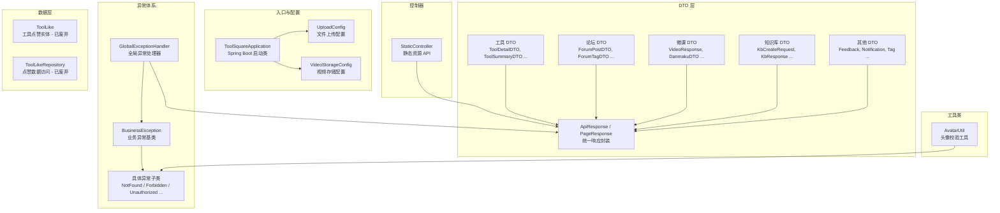
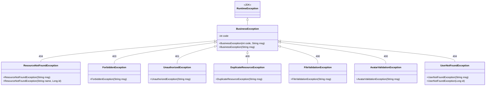
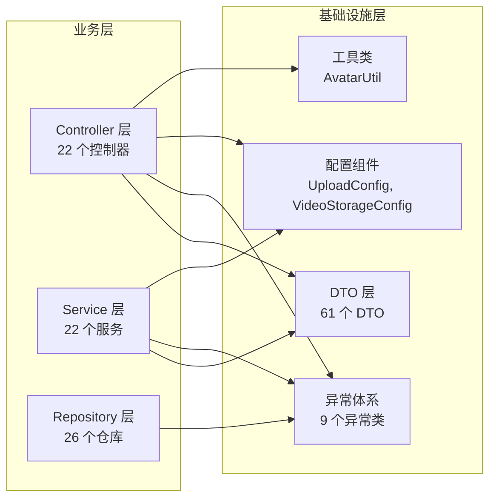

## 后端/基础设施

本模块涵盖 CodingHub 后端应用的基础设施层，包括应用启动入口、文件存储配置、统一 API 响应封装、全局异常处理体系、跨领域数据传输对象（DTO）以及工具类。这些组件构成了整个后端系统的底层骨架，为各业务模块（工具、论坛、微课、知识库、留言反馈、通知、标签等）提供公共支撑能力。

---

### 架构总览



---

### 1. 应用入口

| 类名 | 文件路径 | 职责 |
|------|---------|------|
| `ToolSquareApplication` | `ToolSquareApplication.java` | Spring Boot 应用启动类，使用 `@SpringBootApplication` 注解，通过 `SpringApplication.run()` 引导整个后端服务启动 |

---

### 2. 配置组件

#### 2.1 [UploadConfig](../backend/src/main/java/com/iaihub/toolbox/config/UploadConfig.java) -- 文件上传配置

- **注解**: `@Configuration` + `@ConfigurationProperties(prefix = "app.upload")`
- **职责**: 集中管理文件上传相关参数，在 `@PostConstruct` 阶段自动创建所需目录

| 属性 | 默认值 | 说明 |
|------|--------|------|
| `baseDir` | `~/aifiles` | 上传文件根目录，未配置时自动取用户主目录 |
| `maxFileSize` | `50MB` | 单文件最大尺寸 |
| `maxRequestSize` | `200MB` | 单次请求最大尺寸 |
| `allowedExtensions` | 空列表 | 工具附件扩展名白名单（空时不校验） |
| `avatarSubdir` | `avatars` | 头像子目录名 |
| `avatarMaxFileSize` | `2MB` | 头像文件最大尺寸 |
| `avatarAllowedExtensions` | `jpg, jpeg, png, webp, gif` | 头像允许的扩展名 |

**初始化逻辑**: 启动时检查并创建 `baseDir` 目录和头像子目录，若创建失败则抛出 `RuntimeException` 阻止启动。

#### 2.2 [VideoStorageConfig](../backend/src/main/java/com/iaihub/toolbox/config/VideoStorageConfig.java) -- 视频存储配置

- **注解**: `@Configuration`
- **职责**: 管理视频文件的存储路径

| 属性 | 默认值 | 说明 |
|------|--------|------|
| `uploadBaseDir` | `~/aifiles` | 上传根目录（复用 `app.upload.base-dir`） |
| `videoStoragePath` | `{baseDir}/uploads/videos` | 视频文件实际存储路径 |

**初始化逻辑**: 启动时自动创建视频存储目录。

---

### 3. 控制器

#### [StaticController](../backend/src/main/java/com/iaihub/toolbox/controller/StaticController.java) -- 静态资源接口

- **路径前缀**: `/api/v1`
- **职责**: 提供项目 README 的 HTTP 访问接口

| 方法 | 端点 | 说明 |
|------|------|------|
| `getReadme()` | `GET /api/v1/readme` | 返回 Markdown 格式的 README 内容，优先读取 classpath 资源，回退到文件系统 |

---

### 4. 统一响应封装

#### 4.1 [ApiResponse](../backend/src/main/java/com/iaihub/toolbox/dto/ApiResponse.java)\<T\> -- 通用 API 响应

所有 API 接口的标准返回包装，使用 `@JsonInclude(NON_NULL)` 忽略空字段。

```json
{
  "code": 200,
  "message": "success",
  "data": { ... }
}
```

| 静态工厂方法 | HTTP 状态码 | 用途 |
|-------------|-----------|------|
| `success(T data)` | 200 | 通用成功响应 |
| `success(String msg, T data)` | 200 | 带自定义消息的成功响应 |
| `created(T data)` | 201 | 资源创建成功 |
| `created(String msg, T data)` | 201 | 带自定义消息的创建成功响应 |
| `error(int code, String msg)` | 自定义 | 错误响应 |

#### 4.2 [PageResponse](../backend/src/main/java/com/iaihub/toolbox/dto/PageResponse.java)\<T\> -- 分页响应

标准分页返回结构，包含以下字段：

| 字段 | 类型 | 说明 |
|------|------|------|
| `content` | `List<T>` | 当前页数据列表 |
| `totalElements` | `long` | 总记录数 |
| `totalPages` | `int` | 总页数 |
| `page` | `int` | 当前页码 |
| `size` | `int` | 每页大小 |

---

### 5. 数据传输对象（DTO）

DTO 层按业务领域组织，覆盖系统所有领域模块。按代码风格可分为两类：使用 Lombok `@Data` + `@Builder` 的传统类，以及 Java `record` 类型。

#### 5.1 工具模块 DTO

| DTO | 类型 | 关键字段 | 用途 |
|-----|------|---------|------|
| `ToolDetailDTO` | `@Data` | id, name, version, description, content, score, tags, 上传者信息, 统计数据 | 工具详情页展示 |
| `ToolSummaryDTO` | `@Data` | id, name, version, description, score, pinned, tags, 统计数据 | 工具列表摘要 |
| `ToolFileDTO` | `@Data` | id, toolId, originalName, storedPath, fileSize, contentType | 工具附件信息 |
| `ToolSearchResult` | POJO | id, name, description, category, version, tags | 工具搜索结果 |
| `ToolRankDto` | POJO | id, category, toolName, score | 工具排行榜数据 |
| `UpdateToolRequest` | `@Data` | name, categoryId, content, description, version, tagIds | 工具更新请求，含 `@Pattern` 版本号校验 |

**校验规则**:
- 工具名称：1-100 字符，仅允许字母、数字、中文、下划线、连字符
- 版本号：语义化版本格式 `x.y.z`（可选 `-预发布` 后缀）
- 介绍内容：最大 5000 字符
- 简短描述：最大 200 字符

#### 5.2 论坛模块 DTO

| DTO | 类型 | 关键字段 | 用途 |
|-----|------|---------|------|
| `ForumPostDTO` | `record` | id, title, content, 作者信息, 分类, 统计数据, score, pinned, visibility, tags | 帖子详情 |
| `ForumPostCreateRequest` | `record` | title, content, categoryId, tagIds, visibility | 创建帖子请求 |
| `ForumCommentCreateRequest` | `record` | content, parentId, authorName | 创建评论请求（支持嵌套回复） |
| `ForumLikeRequest` | `record` | postId, commentId | 点赞请求（二选一，含互斥校验） |
| `ForumTagDTO` | `record` | id, name, postCount, isSystem | 论坛标签信息 |
| `PostSearchResult` | POJO | id, title, summary, authorName, createdAt | 帖子搜索结果 |

**[ForumLikeRequest](../backend/src/main/java/com/iaihub/toolbox/dto/forum/ForumLikeRequest.java) 互斥校验**: `postId` 和 `commentId` 必须且只能提供一个，否则抛出 `IllegalArgumentException`。

#### 5.3 微课模块 DTO

| DTO | 类型 | 关键字段 | 用途 |
|-----|------|---------|------|
| `VideoResponse` | `@Data` | id, title, description, coverUrl, duration, 统计数据, userLiked, userFavorited, danmakuEnabled, tags | 视频详情（含用户互动状态） |
| `VideoListItem` | `@Data` | id, title, coverUrl, duration, 统计数据, 上传者信息, score, pinned, tags | 视频列表项 |
| `VideoUploadRequest` | `@Data` | title, description | 视频上传请求 |
| `VideoUpdateRequest` | `@Data` | title, description, tagIds, danmakuEnabled | 视频更新请求 |
| `VideoCommentRequest` | `@Data` | content | 视频评论请求 |
| `VideoCommentResponse` | `@Data` | id, content, userId, userNickname, userAvatarUrl, createdAt | 视频评论响应 |
| `DanmakuDTO` | `@Data` | id, userId, username, nickname, content, timeSeconds, color, danmakuType | 弹幕数据 |
| `SendDanmakuRequest` | `@Data` | content, timeSeconds, color, danmakuType | 发送弹幕请求 |
| `VideoRankDto` | POJO | id, videoTitle, viewCount, likeCount | 视频排行榜数据 |

**校验规则**: 视频标题 200 字符上限，弹幕内容 200 字符上限。

#### 5.4 知识库模块 DTO

| DTO | 类型 | 关键字段 | 用途 |
|-----|------|---------|------|
| `KbCreateRequest` | `@Data` | name, description, chunkMode, chunkSize, chunkOverlap, rerank | 创建知识库（含 RAG 分片配置） |
| `KbUpdateRequest` | `@Data` | name, description | 更新知识库基本信息 |
| `KbConfigRequest` | `@Data` | chunkMode, chunkSize, chunkOverlap, rerank, description | 修改知识库 RAG 配置 |
| `KbResponse` | `@Data` | id, name, description, ownerId, ragCollection, ragBaseUrl, documentsUrl | 知识库详情响应 |
| `KbSearchRequest` | `@Data` | query, topK(默认5), rerank, expandContext(默认1) | 语义搜索请求 |
| `KbSearchResultResponse` | `@Data` | text, source, score, chunkIndex | 语义搜索结果 |

#### 5.5 其他模块 DTO

| DTO | 类型 | 关键字段 | 用途 |
|-----|------|---------|------|
| `FeedbackCreateRequest` | `record` | content, nickname, contact, category | 创建留言反馈 |
| `FeedbackDTO` | `record` | id, content, nickname, contact, category, createdAt, adminReply, repliedAt | 留言详情（含管理员回复） |
| `FeedbackReplyRequest` | `record` | adminReply | 管理员回复留言 |
| `NotificationDTO` | `@Data` | id, type, targetType, targetId, message, actorId, actorName, isRead, createdAt | 通知消息 |
| `CreateTagRequest` | `@Data` | name, type | 创建标签请求 |
| `TagDTO` | `record` | id, name, tagType, usageCount | 统一标签信息（TOOL/FORUM/VIDEO） |
| `UpdateProfileRequest` | `@Data` | nickname, bio | 更新用户资料 |
| `UserStatusUpdateRequest` | `@Data` | status | 用户状态变更（管理用） |

---

### 6. 异常处理体系

系统采用分层异常设计，以 `BusinessException` 为基类，`GlobalExceptionHandler` 统一拦截并转换为标准 `ApiResponse` 格式。



#### 异常码映射表

| 异常类 | HTTP 状态码 | 典型场景 |
|--------|-----------|---------|
| `BusinessException` | 400（默认）/ 自定义 | 通用业务逻辑错误 |
| `ResourceNotFoundException` | 404 | 工具、帖子、视频等资源不存在 |
| `UserNotFoundException` | 404 | 用户不存在 |
| `ForbiddenException` | 403 | 非 owner 且非 admin 操作他人资源 |
| `UnauthorizedException` | 401 | 未认证或 token 过期 |
| `DuplicateResourceException` | 409 | 资源重复（如重复点赞、重复标签） |
| `FileValidationException` | 400 | 文件上传校验失败（大小、类型） |
| `AvatarValidationException` | 400 | 头像文件校验失败 |

#### [GlobalExceptionHandler](../backend/src/main/java/com/iaihub/toolbox/exception/GlobalExceptionHandler.java) -- 全局异常处理器

使用 `@RestControllerAdvice` 注解，拦截所有异常并转换为 `ApiResponse` 格式：

| 处理方法 | 拦截异常类型 | HTTP 状态码 | 说明 |
|---------|------------|-----------|------|
| `handleBusinessException` | `BusinessException` | 异常自带 code | 业务异常，记录 WARN 级别日志 |
| `handleValidationException` | `MethodArgumentNotValidException` | 400 | 参数校验失败，聚合所有字段错误信息 |
| `handleForbidden` | `ForbiddenException` | 403 | 权限不足 |
| `handleIllegalArgument` | `IllegalArgumentException` | 400 | 非法参数 |
| `handleGenericException` | `Exception`（兜底） | 500 | 未预期异常，记录 ERROR 级别日志，对外隐藏细节 |

---

### 7. 数据模型与持久层

#### [ToolLike](../backend/src/main/java/com/iaihub/toolbox/model/ToolLike.java) -- 工具点赞实体（已废弃）

- **状态**: `@Deprecated`，映射到 `tool_like_deprecated` 表
- **唯一约束**: `(tool_id, user_id)` 联合唯一
- **字段**: id, toolId, userId, createdAt（`@PrePersist` 自动填充）
- **说明**: 该实体已被统一的互动机制替代，保留仅为向后兼容

#### [ToolLikeRepository](../backend/src/main/java/com/iaihub/toolbox/repository/ToolLikeRepository.java)（已废弃）

继承 `JpaRepository<ToolLike, Long>`，提供方法：

| 方法 | 说明 |
|------|------|
| `existsByToolIdAndUserId(Long, Long)` | 判断用户是否已点赞某工具 |
| `findByToolIdAndUserId(Long, Long)` | 查找用户的点赞记录 |
| `deleteByToolIdAndUserId(Long, Long)` | 取消点赞 |

---

### 8. 工具类

#### [AvatarUtil](../backend/src/main/java/com/iaihub/toolbox/util/AvatarUtil.java) -- 头像校验工具

提供头像上传相关的静态校验方法，禁止实例化（`private` 构造器）。

| 方法 | 说明 |
|------|------|
| `validateAndGetExtension(MultipartFile)` | 校验文件非空、扩展名白名单（jpg/jpeg/png/webp/gif）、MIME 类型匹配，拒绝危险格式（svg/html/htm/xml/js），返回扩展名 |
| `validatePathSafe(String userIdStr)` | 校验用户 ID 为纯数字，防止路径穿越攻击 |
| `normalizeExt(String ext)` | 扩展名标准化（`jpeg` -> `jpg`），null 默认返回 `jpg` |
| `extractExtension(String filename)` | 从文件名提取扩展名（私有方法） |

**安全设计**:
- 白名单机制：仅允许 `jpg, jpeg, png, webp, gif`
- 黑名单拦截：阻止 `svg, html, htm, xml, js` 等可执行/可嵌入格式
- MIME 类型二次校验：防止扩展名伪装
- 路径安全：用户 ID 仅允许纯数字，防止路径穿越

---

### 9. 依赖关系



**依赖规则**:
- DTO 层仅被 Controller 和 Service 层引用，不依赖其他层
- 异常类被所有层使用
- 配置类被 Service 和 Controller 引用
- 工具类被 Controller 和 Service 使用
- 基础设施层不依赖业务层（单向依赖）

---

### 10. 关键设计模式

| 模式 | 应用位置 | 说明 |
|------|---------|------|
| 统一响应包装 | `ApiResponse<T>` | 所有 API 返回统一 JSON 结构 |
| 全局异常拦截 | `GlobalExceptionHandler` | `@RestControllerAdvice` 集中处理异常 |
| 异常继承体系 | `BusinessException` 子类 | HTTP 状态码与业务语义绑定 |
| 参数校验 | DTO `@Valid` 注解 | `@NotBlank`, `@Size`, `@Pattern` 声明式校验 |
| Java Record | 论坛/反馈/标签 DTO | 不可变数据传输，减少样板代码 |
| Lombok Builder | 工具/视频/知识库 DTO | 灵活的对象构造 |
| 配置属性绑定 | `UploadConfig` | `@ConfigurationProperties` 类型安全配置 |
| 防御式编程 | `AvatarUtil` | 白名单 + 黑名单 + MIME 校验 + 路径安全 |
