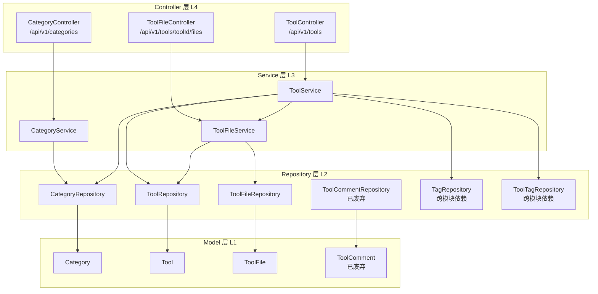
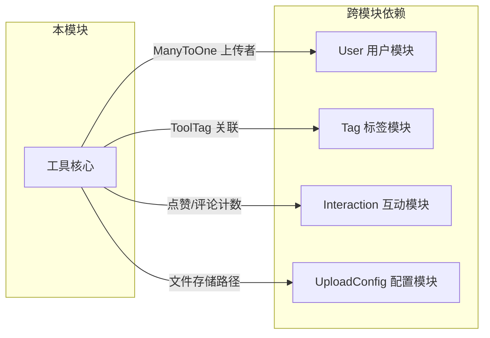
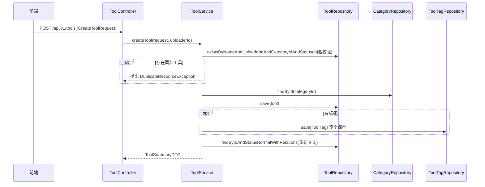
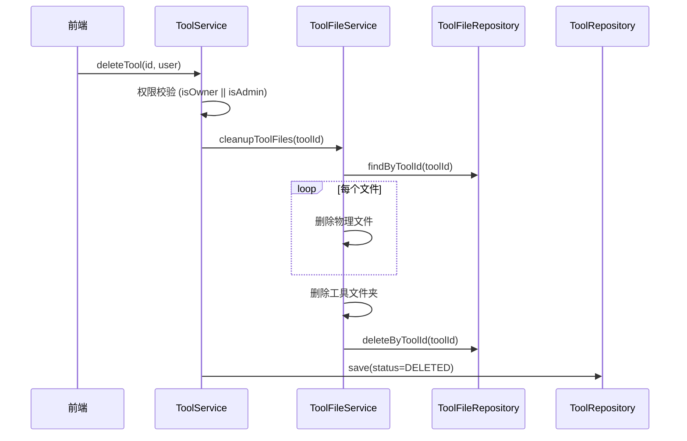

## 后端/工具核心

本模块是 CodingHub 平台的核心业务模块，负责 AI 工具的完整生命周期管理，包括工具的创建、查询、更新、删除，工具分类管理，以及工具附件文件的上传、下载和清理功能。模块遵循 Spring Boot 标准四层架构（Controller -> Service -> Repository -> Model），实现了软删除、热度评分、置顶排序、权限校验、同名查重等关键业务逻辑。

---

### 架构概览



### 依赖关系



---

### 关键组件职责

#### 1. Controller 层

| 控制器 | 路由前缀 | 职责 |
|--------|----------|------|
| **[CategoryController](../backend/src/main/java/com/iaihub/toolbox/controller/CategoryController.java)** | `/api/v1/categories` | 提供工具分类列表查询接口 |
| **[ToolController](../backend/src/main/java/com/iaihub/toolbox/controller/ToolController.java)** | `/api/v1/tools` | 工具 CRUD、分页查询、热度排行、置顶/取消置顶 |
| **[ToolFileController](../backend/src/main/java/com/iaihub/toolbox/controller/ToolFileController.java)** | `/api/v1/tools/{toolId}/files` | 工具附件的上传、列表、删除、下载 |

**权限控制要点：**
- 置顶/取消置顶操作需要 `ADMIN` 或 `SUPER_ADMIN` 角色（`@PreAuthorize`）
- 创建/更新/删除操作通过 `@AuthenticationPrincipal` 获取当前用户
- 文件下载为公开接口，无需认证

#### 2. Service 层

| 服务类 | 核心职责 |
|--------|---------|
| **[CategoryService](../backend/src/main/java/com/iaihub/toolbox/service/CategoryService.java)** | 查询所有分类并按 `sortOrder` 排序；将数据库中 "API" 名称映射为 "插件" 展示 |
| **[ToolService](../backend/src/main/java/com/iaihub/toolbox/service/ToolService.java)** | 工具全生命周期管理：创建（同名查重）、更新（权限+查重）、软删除（级联清理文件）、分页查询（三种排序）、热度 Top5、浏览量计数、我的工具列表 |
| **[ToolFileService](../backend/src/main/java/com/iaihub/toolbox/service/ToolFileService.java)** | 文件上传（校验+去重覆盖）、文件列表、文件下载（流式）、文件删除（物理+数据库）、工具删除时的全量文件清理 |

#### 3. Repository 层

| 仓库 | 关键查询方法 |
|------|------------|
| **[CategoryRepository](../backend/src/main/java/com/iaihub/toolbox/repository/CategoryRepository.java)** | `findAllByOrderBySortOrderAsc()` — 按排序号获取所有分类 |
| **[ToolRepository](../backend/src/main/java/com/iaihub/toolbox/repository/ToolRepository.java)** | 多条件分页查询（按时间/名称/热度）、同名校验、热度 Top5、置顶操作、MCP 搜索接口 |
| **[ToolFileRepository](../backend/src/main/java/com/iaihub/toolbox/repository/ToolFileRepository.java)** | 按工具 ID 查文件、按状态过滤、同名文件查找、按工具 ID 批量删除 |
| **[ToolCommentRepository](../backend/src/main/java/com/iaihub/toolbox/repository/ToolCommentRepository.java)** | 已废弃（`@Deprecated`），评论功能已迁移至统一互动模块 |

---

### 核心数据结构

#### [Tool](../backend/src/main/java/com/iaihub/toolbox/model/Tool.java)（工具实体）

| 字段 | 类型 | 说明 |
|------|------|------|
| `id` | Long | 主键，自增 |
| `name` | String(100) | 工具名称 |
| `category` | [Category](../backend/src/main/java/com/iaihub/toolbox/model/Category.java) | 所属分类（ManyToOne LAZY） |
| `content` | TEXT | 详细介绍（Markdown） |
| `description` | String(200) | 简短描述 |
| `version` | String(50) | 版本号，默认 "1.0.0" |
| `uploader` | [User](../backend/src/main/java/com/iaihub/toolbox/model/User.java) | 上传者（ManyToOne LAZY） |
| `status` | [Status](../backend/src/main/java/com/iaihub/toolbox/model/Tool.java) 枚举 | `NORMAL` / `DELETED`（软删除） |
| `viewCount` | Integer | 浏览次数，默认 0 |
| `likeCount` | Integer | 点赞数，默认 0 |
| `commentCount` | Integer | 评论数，默认 0 |
| `score` | BigDecimal | 热度评分，自动计算 |
| `pinned` | Boolean | 是否置顶，默认 false |
| `createdAt` | LocalDateTime | 创建时间（不可更新） |
| `updatedAt` | LocalDateTime | 更新时间 |

**索引设计：**
- `idx_tool_category(category_id, status)` — 分类筛选
- `idx_tool_uploader(uploader_id, status)` — 上传者筛选
- `idx_tool_name_status(name, status)` — 名称搜索
- `idx_tool_version(version)` — 版本查询
- `uk_tool_uploader_name_category(uploader_id, name, category_id, status)` — 唯一约束，同一用户同分类下不可同名

#### [ToolFile](../backend/src/main/java/com/iaihub/toolbox/model/ToolFile.java)（工具附件）

| 字段 | 类型 | 说明 |
|------|------|------|
| `id` | Long | 主键 |
| `toolId` | Long | 所属工具 ID |
| `originalName` | String(255) | 原始文件名 |
| `storedPath` | String(512) | 存储路径（唯一） |
| `fileSize` | Long | 文件大小（字节） |
| `contentType` | String(100) | MIME 类型 |
| `status` | [Status](../backend/src/main/java/com/iaihub/toolbox/model/Tool.java) 枚举 | `NORMAL` / `DELETED` |
| `createdAt` | LocalDateTime | 上传时间 |

#### [Category](../backend/src/main/java/com/iaihub/toolbox/model/Category.java)（工具分类）

| 字段 | 类型 | 说明 |
|------|------|------|
| `id` | Long | 主键 |
| `name` | String(50) | 分类名（唯一） |
| `icon` | String(255) | 图标标识 |
| `sortOrder` | Integer | 排序号，默认 0 |
| `createdAt` | LocalDateTime | 创建时间 |

---

### 热度评分算法

工具的热度评分（`score`）由 `Tool.updateScore()` 方法自动计算，每次浏览、点赞、评论变化时触发：

```
score = viewCount * 1 + likeCount * 3 + commentCount * 5
```

| 行为 | 权重 | 说明 |
|------|------|------|
| 浏览 | x1 | 基础热度 |
| 点赞 | x3 | 用户认可 |
| 评论 | x5 | 深度互动 |

排序规则：先按 `pinned DESC`（置顶优先），再按 `score DESC`（热度降序）。

---

### API 端点一览

#### 分类管理

| 方法 | 路径 | 说明 | 认证 |
|------|------|------|------|
| GET | `/api/v1/categories` | 获取所有分类（按 sortOrder 排序） | 否 |

#### 工具 CRUD

| 方法 | 路径 | 说明 | 认证 |
|------|------|------|------|
| GET | `/api/v1/tools` | 分页查询工具列表 | 否 |
| GET | `/api/v1/tools/{id}` | 获取工具详情 | 否 |
| POST | `/api/v1/tools` | 创建工具 | 是 |
| PUT | `/api/v1/tools/{id}` | 更新工具 | 是（所有者或管理员） |
| DELETE | `/api/v1/tools/{id}` | 删除工具（软删除） | 是（所有者或管理员） |
| POST | `/api/v1/tools/{id}/pin` | 置顶工具 | 是（ADMIN/SUPER_ADMIN） |
| DELETE | `/api/v1/tools/{id}/pin` | 取消置顶 | 是（ADMIN/SUPER_ADMIN） |
| GET | `/api/v1/tools/hot-top5` | 获取热度 Top5 工具 ID | 否 |

**查询参数（GET /api/v1/tools）：**

| 参数 | 类型 | 默认值 | 说明 |
|------|------|--------|------|
| `categoryId` | Long | - | 按分类过滤 |
| `keyword` | String | - | 按名称模糊搜索 |
| `sortBy` | String | `"hot"` | 排序方式：`hot`（热度）/ `latest`（最新）/ `name`（名称） |
| `page` | int | 0 | 页码（从 0 开始） |
| `size` | int | 12 | 每页大小（上限 100） |

#### 工具文件管理

| 方法 | 路径 | 说明 | 认证 |
|------|------|------|------|
| POST | `/api/v1/tools/{toolId}/files` | 上传文件（multipart） | 是（所有者） |
| GET | `/api/v1/tools/{toolId}/files` | 获取文件列表 | 否 |
| DELETE | `/api/v1/tools/{toolId}/files/{fileId}` | 删除单个文件 | 是（所有者） |
| GET | `/api/v1/tools/{toolId}/files/{fileId}/download` | 下载文件（流式） | 否 |

---

### 关键业务逻辑

#### 1. 工具创建流程



#### 2. 工具删除流程（软删除 + 文件级联清理）



#### 3. 文件上传去重机制

上传文件时，如果工具目录下已存在同名文件（status=NORMAL），系统会：
1. 先删除旧的物理文件
2. 删除旧的数据库记录（释放唯一约束）
3. 执行 `flush()` 确保约束释放
4. 写入新文件并创建新记录

#### 4. 文件校验规则

| 规则 | 限制 |
|------|------|
| 单文件大小上限 | 50 MB |
| 单次请求总大小上限 | 200 MB |
| 文件名 | 不可为空，使用 `StringUtils.cleanPath` 清理路径 |
| 文件扩展名 | 默认不限制；仅当 `uploadConfig.allowedExtensions` 配置非空时校验 |

---

### DTO 对象

| DTO | 用途 | 关键字段 |
|-----|------|---------|
| **[CreateToolRequest](../backend/src/main/java/com/iaihub/toolbox/dto/CreateToolRequest.java)** | 创建工具请求 | name, categoryId, content, description, version, tagIds |
| **[CategoryDTO](../backend/src/main/java/com/iaihub/toolbox/dto/CategoryDTO.java)** | 分类响应 | id, name, icon, sortOrder |
| **[FileUploadResponse](../backend/src/main/java/com/iaihub/toolbox/dto/FileUploadResponse.java)** | 文件上传响应 | toolId, files(List), readmeSaved |
| **[FileListResponse](../backend/src/main/java/com/iaihub/toolbox/dto/FileListResponse.java)** | 文件列表响应 | toolId, folderPath, files(List), readmeExists |
| **[ToolCommentDto](../backend/src/main/java/com/iaihub/toolbox/dto/ToolCommentDto.java)** | 评论 DTO（已废弃） | id, content, username, createdAt |
| **[ForumCategoryDTO](../backend/src/main/java/com/iaihub/toolbox/dto/forum/ForumCategoryDTO.java)** | 论坛分类 DTO（跨模块引用） | id, name, description, sortOrder, postCount |

**[CreateToolRequest](../backend/src/main/java/com/iaihub/toolbox/dto/CreateToolRequest.java) 校验规则：**
- `name`: 非空，1-100 字符，只允许字母、数字、中文、下划线和连字符
- `categoryId`: 非空
- `content`: 非空，最大 5000 字符
- `description`: 最大 200 字符
- `version`: 非空，格式 `x.y.z` 或 `x.y.z-suffix`
- `tagIds`: 可选，标签 ID 列表

---

### 与其他模块的关系

| 依赖模块 | 关系 | 说明 |
|---------|------|------|
| **用户模块 ([User](../backend/src/main/java/com/iaihub/toolbox/model/User.java))** | `Tool.uploader` -> `User` | 工具必须关联上传者，通过 `UserRepository` 查询 |
| **标签模块 ([Tag](../backend/src/main/java/com/iaihub/toolbox/model/tag/Tag.java)/[ToolTag](../backend/src/main/java/com/iaihub/toolbox/model/tag/ToolTag.java))** | `ToolTag(toolId, tagId)` | 创建/更新工具时管理标签关联和使用计数 |
| **配置模块 ([UploadConfig](../backend/src/main/java/com/iaihub/toolbox/config/UploadConfig.java))** | `ToolFileService` 依赖 | 提供文件存储基础路径和允许的扩展名配置 |
| **MCP 模块** | `ToolRepository` 提供查询方法 | `findTop10ByStatusAndNameContainingIgnoreCase`、`findTop10ByStatusOrderByCreatedAtDesc`、`countByStatus` 供 MCP 工具调用 |
| **统一互动模块** | 评论功能已迁移 | `ToolComment` 和 `ToolCommentRepository` 标记为 `@Deprecated`，评论已迁移至统一互动模块 |
| **概览模块** | 热度排行数据 | `getHotTop5` 为概览页提供热门工具 ID 列表 |

---

### 注意事项

1. **[ToolComment](../backend/src/main/java/com/iaihub/toolbox/model/ToolComment.java) 已废弃**：`ToolComment` 实体和 `ToolCommentRepository` 均标记了 `@Deprecated`，映射到 `tool_comment_deprecated` 表，评论功能已迁移至统一互动模块。
2. **[CategoryService](../backend/src/main/java/com/iaihub/toolbox/service/CategoryService.java) 的名称映射**：`toDTO` 方法中将数据库中 "API" 分类名映射为 "插件"，属于展示层适配逻辑。
3. **软删除一致性**：工具删除时会级联调用 `ToolFileService.cleanupToolFiles()` 物理删除所有附件文件和文件夹，但数据库记录采用 `status=DELETED` 软删除。
4. **Lazy Loading 处理**：`toSummaryDTO` 和 `toDetailDTO` 方法中使用 `Hibernate.initialize()` 显式初始化 LAZY 关联的 [Category](../backend/src/main/java/com/iaihub/toolbox/model/Category.java) 和 [User](../backend/src/main/java/com/iaihub/toolbox/model/User.java)，避免 LazyInitializationException。
5. **文件唯一约束**：`ToolFile.storedPath` 有唯一约束，上传同名文件时必须先删除旧记录并 flush，否则会违反约束。
