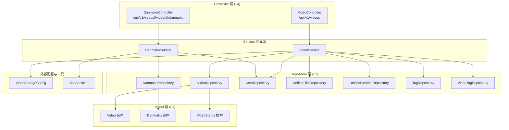
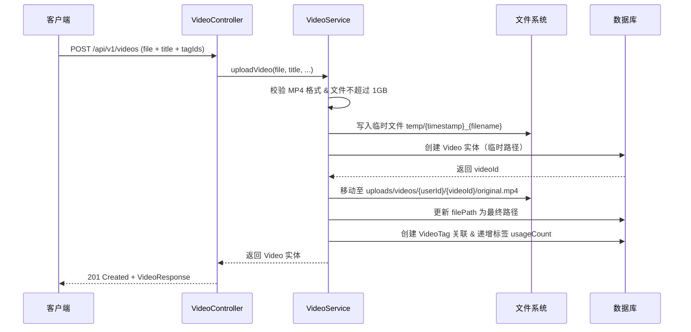
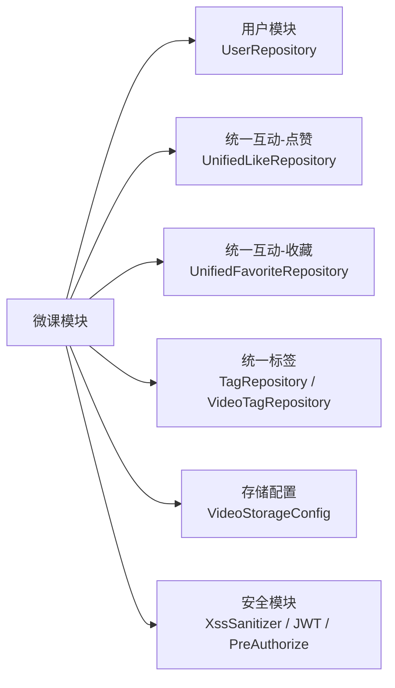

## 后端/微课

微课模块是 CodingHub 平台的视频分享与管理子系统，提供视频上传、流式播放、弹幕互动、封面管理、热度排行等完整功能。该模块采用 Spring Boot 标准四层架构（Controller -> Service -> Repository -> Model），支持 HTTP Range 断点续传的视频流播放，并集成了统一标签、点赞、收藏等跨模块互动能力。

---

### 架构概览



---

### 组件清单与职责

| 层级 | 组件 | 文件路径 | 职责 |
|------|------|---------|------|
| Controller | `VideoController` | `controller/video/VideoController.java` | 视频 REST API 入口，处理上传、列表、详情、更新、删除、流播放、封面、置顶等请求 |
| Controller | `DanmakuController` | `controller/video/DanmakuController.java` | 弹幕 REST API 入口，处理弹幕查询与发送 |
| Service | `VideoService` | `service/video/VideoService.java` | 视频核心业务逻辑，包含文件存储、热度计算、DTO 转换、权限校验 |
| Service | `DanmakuService` | `service/video/DanmakuService.java` | 弹幕业务逻辑，包含 XSS 过滤、DTO 转换 |
| Repository | `VideoRepository` | `repository/video/VideoRepository.java` | 视频数据访问，提供多维度排序查询、置顶操作 |
| Repository | `DanmakuRepository` | `repository/video/DanmakuRepository.java` | 弹幕数据访问，支持关联查询用户信息 |
| Model | `Video` | `model/video/Video.java` | 视频实体，含热度评分自动计算 |
| Model | `Danmaku` | `model/video/Danmaku.java` | 弹幕实体，关联用户，支持多种弹幕类型 |
| Model | `VideoStatus` | `model/video/VideoStatus.java` | 视频状态枚举：`NORMAL`、`DELETED` |

---

### 核心数据模型

#### Video 实体

| 字段 | 类型 | 说明 |
|------|------|------|
| `id` | `Long` | 主键，自增 |
| `title` | `String(200)` | 视频标题 |
| `description` | `TEXT` | 视频描述 |
| `filePath` | `String(500)` | 文件相对路径，格式 `uploads/videos/{userId}/{videoId}/original.mp4` |
| `fileName` | `String(255)` | 原始文件名 |
| `fileSize` | `Long` | 文件大小（字节） |
| `duration` | `Integer` | 视频时长（秒），默认 0 |
| `coverUrl` | `String(500)` | 封面图片 API 路径 |
| `uploaderId` | `Long` | 上传者用户 ID |
| `status` | `VideoStatus` | 状态枚举，默认 `NORMAL`，支持软删除 `DELETED` |
| `viewCount` | `Integer` | 播放次数，默认 0 |
| `likeCount` | `Integer` | 点赞次数，默认 0 |
| `commentCount` | `Integer` | 评论次数，默认 0 |
| `score` | `BigDecimal` | 热度评分，自动计算 |
| `pinned` | `Boolean` | 是否置顶，默认 `false` |
| `danmakuEnabled` | `Boolean` | 是否启用弹幕，默认 `true` |
| `createdAt` | `LocalDateTime` | 创建时间（`@PrePersist` 自动填充） |
| `updatedAt` | `LocalDateTime` | 更新时间（`@PreUpdate` 自动填充） |

数据库索引：
- `idx_video_uploader`：`(uploader_id, status)` -- 按上传者查询优化
- `idx_video_status_created`：`(status, created_at DESC)` -- 按时间排序优化

#### Danmaku 实体

| 字段 | 类型 | 说明 |
|------|------|------|
| `id` | `Long` | 主键，自增 |
| `videoId` | `Long` | 所属视频 ID |
| `user` | `User` (ManyToOne LAZY) | 发送者，延迟加载 |
| `content` | `String(200)` | 弹幕内容（经 XSS 过滤） |
| `timeSeconds` | `Double` | 弹幕出现时间点（秒），默认 0.0 |
| `color` | `String(10)` | 弹幕颜色，默认 `#FFFFFF` |
| `danmakuType` | `String(10)` | 弹幕类型：`SCROLL`（滚动）、`TOP`（顶部）、`BOTTOM`（底部） |
| `createdAt` | `LocalDateTime` | 创建时间（`@PrePersist` 自动填充） |

数据库索引：
- `idx_danmaku_video`：`(video_id)` -- 按视频查询弹幕优化

#### VideoStatus 枚举

- `NORMAL` -- 正常状态，所有查询默认过滤条件
- `DELETED` -- 已软删除，不再出现在任何查询结果中

---

### 热度评分算法

Video 实体内置热度评分算法，每次播放、点赞、评论变化时自动重新计算：

```
score = viewCount * 1 + likeCount * 3 + commentCount * 5
```

| 行为 | 权重 | 说明 |
|------|------|------|
| 播放 | x1 | 基础热度 |
| 点赞 | x3 | 互动质量信号 |
| 评论 | x5 | 深度互动，权重最高 |

评分用于默认排序（`hot` 模式），排序优先级为：**置顶（pinned DESC）> 评分（score DESC）**。

实体层通过 `updateScore()` 方法封装计算逻辑，`incrementViewCount()`、`incrementLikeCount()`、`decrementLikeCount()`、`incrementCommentCount()` 方法在修改计数后自动触发评分重算。

---

### API 端点

#### 视频管理

| 方法 | 路径 | 认证 | 权限 | 说明 |
|------|------|------|------|------|
| `POST` | `/api/v1/videos` | 需要 | 登录用户 | 上传视频（仅 MP4，不超过 1GB），支持关联标签 |
| `GET` | `/api/v1/videos` | 不需要 | -- | 获取视频列表，支持 `sortBy=hot\|latest`，分页 |
| `GET` | `/api/v1/videos/{id}` | 可选 | -- | 获取视频详情，自动增加播放量，返回用户点赞/收藏状态 |
| `PUT` | `/api/v1/videos/{id}` | 需要 | 作者或管理员 | 更新视频标题、描述、弹幕开关、标签 |
| `DELETE` | `/api/v1/videos/{id}` | 需要 | 作者或管理员 | 软删除视频（设置 `status=DELETED`） |
| `GET` | `/api/v1/videos/my` | 需要 | 登录用户 | 获取当前用户上传的视频列表 |
| `GET` | `/api/v1/videos/hot-top5` | 不需要 | -- | 获取热度评分前 5 的视频 ID 列表 |

#### 视频流与封面

| 方法 | 路径 | 认证 | 说明 |
|------|------|------|------|
| `GET` | `/api/v1/videos/{id}/stream` | 不需要 | 视频流播放，支持 HTTP Range 请求（每次最多 1MB） |
| `POST` | `/api/v1/videos/{id}/cover` | 需要 | 上传封面图片（仅 JPEG/PNG，不超过 5MB） |
| `GET` | `/api/v1/videos/{id}/cover-image` | 不需要 | 获取封面图片，缓存 24 小时 |

#### 置顶管理

| 方法 | 路径 | 认证 | 权限 | 说明 |
|------|------|------|------|------|
| `POST` | `/api/v1/videos/{id}/pin` | 需要 | ADMIN / SUPER_ADMIN | 置顶视频 |
| `DELETE` | `/api/v1/videos/{id}/pin` | 需要 | ADMIN / SUPER_ADMIN | 取消置顶 |

#### 弹幕

| 方法 | 路径 | 认证 | 说明 |
|------|------|------|------|
| `GET` | `/api/v1/videos/{videoId}/danmaku` | 不需要 | 获取视频的全部弹幕，按时间点升序排列 |
| `POST` | `/api/v1/videos/{videoId}/danmaku` | 需要 | 发送弹幕，内容经 XSS 过滤 |

---

### 关键业务流程

#### 视频上传流程



#### 视频流播放（HTTP Range）

Controller 层直接使用 `RandomAccessFile` 实现 HTTP Range 协议，进行精确 seek：

1. 解析 `Range: bytes=start-end` 请求头
2. 每次响应最多返回 1MB 数据（`rangeEnd = min(rangeStart + 1MB - 1, fileLength - 1)`）
3. 返回 `206 Partial Content` + `Content-Range` 响应头
4. 无 Range 头时返回完整文件（`200 OK`）
5. 支持 `416 Range Not Satisfiable` 错误处理
6. 设置 `Cache-Control: no-cache, no-store, must-revalidate` 禁止缓存

#### 视频更新与标签替换

更新视频时支持标签整体替换：先删除旧标签关联并递减各标签的 `usageCount`，再创建新标签关联并递增 `usageCount`。

---

### 模块间依赖关系



| 依赖模块 | 用途 |
|---------|------|
| `UserRepository` | 查询上传者信息（用户名、昵称、头像） |
| `UnifiedLikeRepository` | 查询用户对视频的点赞状态（targetType=`VIDEO`） |
| `UnifiedFavoriteRepository` | 查询用户对视频的收藏状态（targetType=`VIDEO`） |
| `TagRepository` / `VideoTagRepository` | 视频标签的关联管理（创建、替换、删除），维护标签使用计数 |
| `VideoStorageConfig` | 视频文件存储路径配置（uploadBaseDir、videoStoragePath） |
| `XssSanitizer` | 弹幕内容 XSS 防护 |

---

### 文件存储结构

```
{uploadBaseDir}/
  uploads/
    videos/
      {userId}/
        {videoId}/
          original.mp4        # 视频文件
    covers/
      {videoId}.jpg|.png      # 封面图片
  {videoStoragePath}/
    temp/                      # 上传过程中的临时目录
      {timestamp}_{filename}   # 临时文件
```

| 文件类型 | 存储路径 | 命名规则 | 大小限制 |
|---------|---------|---------|---------|
| 视频文件 | `{uploadBaseDir}/uploads/videos/{userId}/{videoId}/` | `original.mp4` | 不超过 1GB |
| 封面图片 | `{uploadBaseDir}/uploads/covers/` | `{videoId}.jpg` 或 `{videoId}.png` | 不超过 5MB |
| 临时文件 | `{videoStoragePath}/temp/` | `{timestamp}_{originalFilename}` | -- |

---

### 设计决策与约束

1. **两阶段上传**：视频文件先写入临时目录，数据库记录创建后再移动到最终路径，避免 NOT NULL 约束与文件路径不一致问题
2. **软删除策略**：所有查询均过滤 `status = NORMAL`，删除操作仅修改状态标记，不物理删除数据和文件
3. **权限控制**：更新/删除操作遵循 `isOwner || isAdmin` 规则；置顶操作通过 `@PreAuthorize` 限制为 `ADMIN` / `SUPER_ADMIN`
4. **HTTP Range 流式播放**：直接在 Controller 层使用 `RandomAccessFile` 实现，而非依赖 Spring 的 `Resource` 抽象，以获得更精确的 seek 控制
5. **热度评分**：采用加权公式在实体层封装计算，每次互动数据变化自动重新计算
6. **XSS 防护**：弹幕内容通过 `XssSanitizer.sanitize()` 过滤
7. **分页限制**：列表查询的 `size` 参数上限为 100（`Math.min(size, 100)`），防止单次请求过大
8. **播放计数**：每次获取视频详情自动递增播放量并更新热度评分
9. **封面缓存**：封面图片响应设置 `Cache-Control: public, max-age=86400`（24 小时缓存）
10. **详情公开访问**：视频详情接口允许未认证用户访问，`currentUser` 参数可为 null
