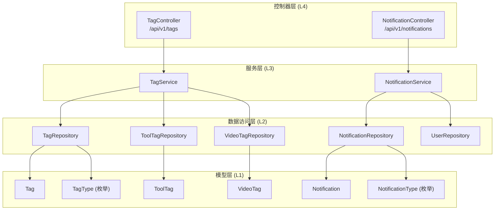
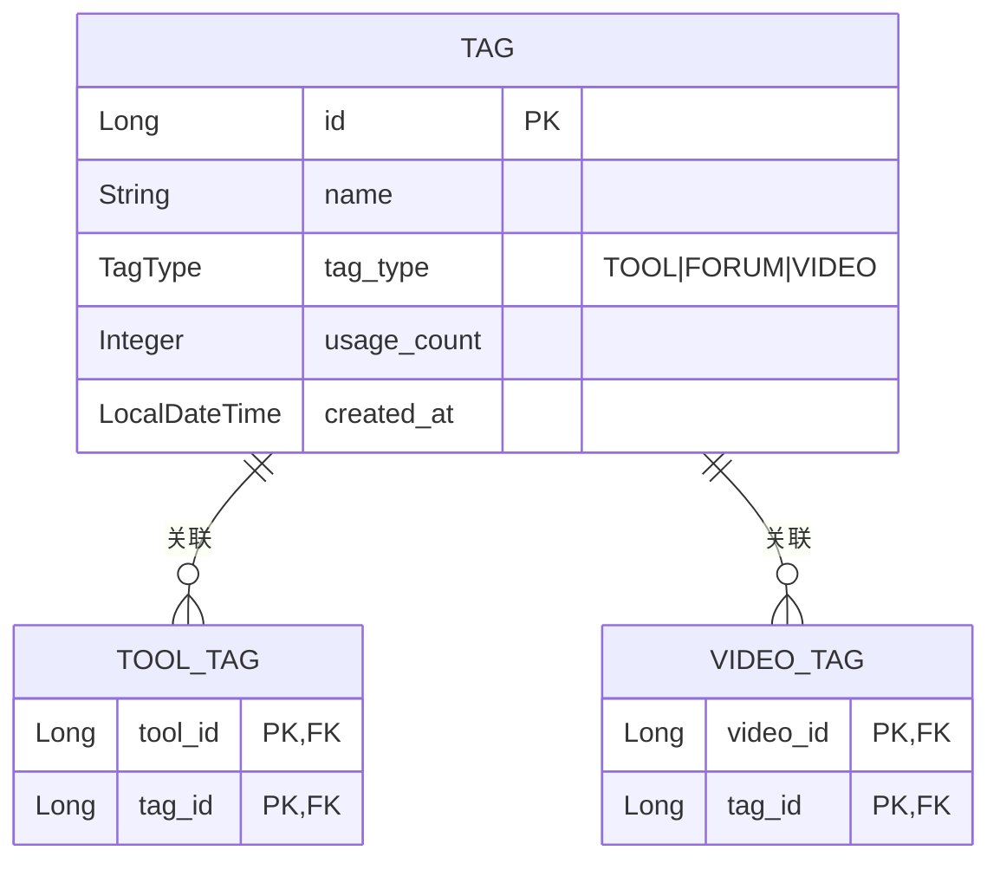
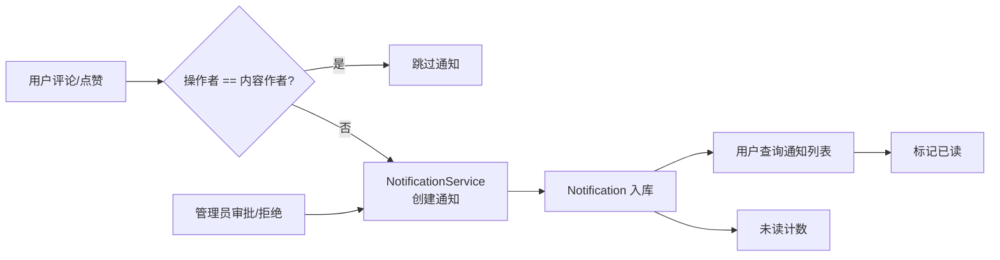
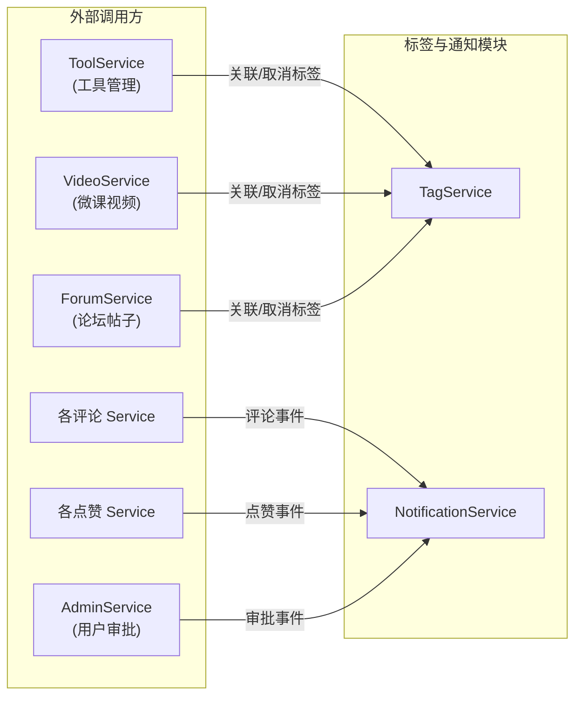

## 后端 / 标签与通知

本模块涵盖 CodingHub 后端的两大基础能力：**统一标签系统**和**站内通知系统**。标签模块为工具（[Tool](../backend/src/main/java/com/iaihub/toolbox/model/Tool.java)）、论坛帖子（Forum Post）和微课视频（[Video](../backend/src/main/java/com/iaihub/toolbox/model/video/Video.java)）提供统一的分类与检索能力；通知模块则在用户互动（评论、点赞、管理审批）发生时自动生成站内通知，支持未读计数、单条/批量标记已读等常见功能。两个模块均遵循标准的 Controller - Service - Repository - Model 四层架构，代码简洁、职责清晰。

---

### 整体架构

---

### 一、标签子系统

#### 1.1 设计概述

标签系统采用**统一标签 + 多对多关联表**的设计模式。所有标签存储在 `tag` 表中，通过 `TagType` 枚举区分所属领域（TOOL / FORUM / VIDEO）。标签与具体资源的关联关系分别存储在 `tool_tag` 和 `video_tag` 两张中间表中，使用复合主键（`@IdClass`）实现轻量级映射。

#### 1.2 核心组件

| 组件 | 路径 | 职责 |
|------|------|------|
| `Tag` | `model/tag/Tag.java` | 标签实体，包含名称、类型、使用计数；内置 `incrementUsage()` / `decrementUsage()` 方法保证计数不低于 0 |
| `TagType` | `model/tag/TagType.java` | 枚举：`TOOL`、`FORUM`、`VIDEO`，标识标签所属领域 |
| `ToolTag` | `model/tag/ToolTag.java` | 工具-标签关联实体，复合主键 `(toolId, tagId)` |
| `VideoTag` | `model/tag/VideoTag.java` | 视频-标签关联实体，复合主键 `(videoId, tagId)` |
| `TagRepository` | `repository/tag/TagRepository.java` | 标签数据访问，支持按类型查询、按名称+类型查找、按使用量排行 |
| `ToolTagRepository` | `repository/tag/ToolTagRepository.java` | 工具-标签关联的 CRUD，支持按 toolId 查询/删除 |
| `VideoTagRepository` | `repository/tag/VideoTagRepository.java` | 视频-标签关联的 CRUD，支持按 videoId 查询/删除 |
| `TagService` | `service/tag/TagService.java` | 标签业务逻辑：创建、查询、获取或创建、使用计数增减 |
| `TagController` | `controller/tag/TagController.java` | REST API 入口，提供标签查询和创建接口 |

#### 1.3 关键数据结构

**[Tag](../backend/src/main/java/com/iaihub/toolbox/model/tag/Tag.java) 实体**

| 字段 | 类型 | 说明 |
|------|------|------|
| `id` | `Long` | 自增主键 |
| `name` | `String(50)` | 标签名称 |
| `tagType` | `TagType` | 标签类型枚举（TOOL/FORUM/VIDEO） |
| `usageCount` | `Integer` | 使用次数，默认 0，不会低于 0 |
| `createdAt` | `LocalDateTime` | 创建时间，由 `@PrePersist` 自动填充 |

唯一约束：`(name, tag_type)` 组合唯一索引 `uk_name_type`。

**[TagDTO](../backend/src/main/java/com/iaihub/toolbox/dto/tag/TagDTO.java)**（数据传输对象）

通过 `TagService.toDTO()` 转换，包含 `id`、`name`、`type`（字符串形式）、`usageCount` 四个字段。

#### 1.4 API 接口

| 方法 | 路径 | 说明 | 参数 |
|------|------|------|------|
| `GET` | `/api/v1/tags` | 按类型获取全部标签 | `type`（默认 TOOL） |
| `GET` | `/api/v1/tags/hot` | 获取热门标签（按使用量降序） | `type`（默认 TOOL），`limit`（默认 20，上限 100） |
| `POST` | `/api/v1/tags` | 创建标签（已存在则直接返回） | `CreateTagRequest { name, type }` |

#### 1.5 核心业务逻辑

- **创建标签 (`createTag`)**：采用 "查找或创建" 模式——先按 `name + tagType` 查找，若已存在直接返回 DTO，否则创建新标签并持久化。
- **获取或创建 (`getOrCreateTag`)**：内部方法，供其他 Service 在关联标签时调用，确保标签存在。
- **热门标签 (`getHotTags`)**：按 `usageCount` 降序排列，支持分页限制返回数量，`limit` 参数上限被 `Math.min(limit, 100)` 强制封顶。
- **使用计数管理**：`incrementUsage()` 和 `decrementUsage()` 在标签被关联/取消关联时调用，`decrementUsage()` 内置下限保护（不小于 0）。

---

### 二、通知子系统

#### 2.1 设计概述

通知系统实现了站内消息的完整生命周期：由用户互动事件（评论、点赞）或管理操作（审批/拒绝）触发创建，存储到数据库，用户可查询通知列表、查看未读计数、标记单条或全部已读。系统在设计上避免了自我通知——当操作者即内容所有者时跳过通知创建。

#### 2.2 核心组件

| 组件 | 路径 | 职责 |
|------|------|------|
| `Notification` | `model/notification/Notification.java` | 通知实体，包含接收者、类型、目标、消息内容、触发者信息、已读状态 |
| `NotificationType` | `model/notification/NotificationType.java` | 枚举：`COMMENT_REPLY`、`LIKE`、`ADMIN_APPROVED`、`ADMIN_REJECTED` |
| `NotificationRepository` | `repository/notification/NotificationRepository.java` | 通知数据访问，支持分页查询、未读计数、批量标记已读 |
| `NotificationService` | `service/notification/NotificationService.java` | 通知业务逻辑：查询、已读标记、三种通知创建方法 |
| `NotificationController` | `controller/notification/NotificationController.java` | REST API 入口，提供通知列表、未读计数、标记已读接口 |

#### 2.3 关键数据结构

**[Notification](../backend/src/main/java/com/iaihub/toolbox/model/notification/Notification.java) 实体**

| 字段 | 类型 | 说明 |
|------|------|------|
| `id` | `Long` | 自增主键 |
| `user` | `User` (`@ManyToOne LAZY`) | 通知接收者 |
| `type` | `NotificationType` | 通知类型枚举 |
| `targetType` | `String(30)` | 目标资源类型：TOOL / FORUM_POST / VIDEO / USER |
| `targetId` | `Long` | 目标资源 ID |
| `message` | `String(500)` | 通知消息文本 |
| `actorId` | `Long` | 触发者用户 ID |
| `actorName` | `String(100)` | 触发者用户名 |
| `isRead` | `Boolean` | 已读状态，默认 `false` |
| `createdAt` | `LocalDateTime` | 创建时间，由 `@PrePersist` 自动填充 |

数据库索引：`idx_notification_user`（`user_id`）和 `idx_notification_read`（`is_read`），优化按用户查询和未读筛选性能。

**[NotificationDTO](../backend/src/main/java/com/iaihub/toolbox/dto/notification/NotificationDTO.java)**（数据传输对象）

通过 `NotificationService.toDTO()` 转换，包含 `id`、`type`（字符串）、`targetType`、`targetId`、`message`、`actorId`、`actorName`、`isRead`、`createdAt`。

#### 2.4 API 接口

| 方法 | 路径 | 说明 | 认证 |
|------|------|------|------|
| `GET` | `/api/v1/notifications` | 分页获取当前用户通知列表 | 需要 JWT |
| `GET` | `/api/v1/notifications/unread-count` | 获取当前用户未读通知数量 | 需要 JWT |
| `PUT` | `/api/v1/notifications/{id}/read` | 标记单条通知为已读 | 需要 JWT |
| `PUT` | `/api/v1/notifications/read-all` | 标记当前用户全部通知为已读 | 需要 JWT |

**GET /api/v1/notifications** 参数：

| 参数 | 类型 | 默认值 | 说明 |
|------|------|--------|------|
| `page` | `int` | `0` | 页码（从 0 开始） |
| `size` | `int` | `20` | 每页条数 |

返回结构：`ApiResponse<PageResponse<NotificationDTO>>`，包含 `content`、`totalElements`、`totalPages`、`page`、`size`。

#### 2.5 核心业务逻辑

- **通知创建——评论通知 (`createCommentNotification`)**：由评论服务调用，传入内容所有者 ID、目标类型/ID、操作者信息以及评论预览文本。预览文本被 `truncate()` 方法截断至 80 字符。若操作者即内容作者则跳过。
- **通知创建——点赞通知 (`createLikeNotification`)**：由点赞服务调用，结构与评论通知类似，消息文本为 "{actorName} 赞了你的内容"。同样跳过自我点赞。
- **通知创建——管理通知 (`createAdminNotification`)**：由管理服务调用，类型为 `ADMIN_APPROVED` 或 `ADMIN_REJECTED`，消息为固定的审批通过/拒绝文案。
- **标记已读 (`markAsRead`)**：验证通知所有权——若通知接收者与当前用户不匹配，抛出 `ForbiddenException`。
- **批量标记已读 (`markAllAsRead`)**：通过 JPQL `UPDATE` 语句一次性将用户所有未读通知标记为已读，性能优于逐条更新。
- **未读计数 (`getUnreadCount`)**：通过 JPQL `COUNT` 查询实现，用于前端通知铃铛的角标显示。

---

### 三、模块间依赖关系

**标签模块被以下模块依赖**：
- **工具模块**：通过 `ToolTagRepository` 管理工具与标签的关联关系，创建/删除工具时同步更新标签使用计数。
- **微课模块**：通过 `VideoTagRepository` 管理视频与标签的关联关系。
- **论坛模块**：论坛标签（`TagType.FORUM`）的创建与使用。

**通知模块被以下模块调用**：
- **评论服务**（工具评论、论坛评论、视频评论）：调用 `createCommentNotification()`。
- **点赞服务**（工具点赞、论坛点赞、视频点赞）：调用 `createLikeNotification()`。
- **管理服务**：用户审批通过/拒绝时调用 `createAdminNotification()`。

---

### 四、设计要点与注意事项

1. **自我通知过滤**：所有创建通知的方法均首先检查 `targetOwnerId.equals(actorId)`，若为同一用户则直接返回，避免产生无意义的自我通知。
2. **标签幂等创建**：`createTag()` 和 `getOrCreateTag()` 均采用 "查找或创建" 模式，配合数据库唯一约束 `(name, tag_type)` 保证标签不重复。
3. **使用计数安全**：`decrementUsage()` 内置 `usageCount > 0` 的下限检查，防止计数变为负数。
4. **热门标签封顶**：`getHotTags()` 通过 `Math.min(limit, 100)` 强制限制最大返回数量，防止客户端传入过大数值导致性能问题。
5. **通知所有权校验**：`markAsRead()` 方法在标记前验证通知归属，非接收者操作时抛出 `ForbiddenException`，防止越权。
6. **批量已读优化**：`markAllAsRead()` 使用 `@Modifying` + JPQL UPDATE 语句，在数据库层面批量更新，避免逐条加载和保存的 N+1 性能问题。
7. **懒加载策略**：`Notification.user` 使用 `FetchType.LAZY`，避免查询通知时不必要的 [User](../backend/src/main/java/com/iaihub/toolbox/model/User.java) 表连接。
8. **消息文本截断**：评论通知中的预览文本通过 `truncate()` 方法限制为 80 字符，防止过长内容影响通知展示。
