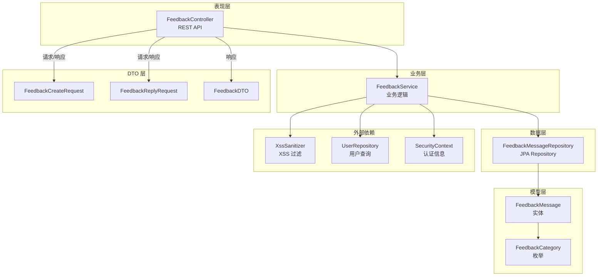
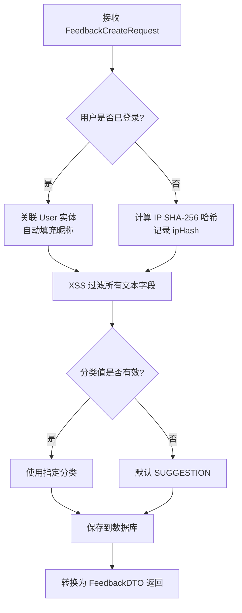

## 后端 / 留言反馈

留言反馈模块是 CodingHub 平台的用户意见收集与管理系统。它允许已登录用户和匿名用户提交留言反馈（建议、Bug 报告、表扬等），管理员可以查看留言并进行回复或删除。模块采用经典的 Spring Boot 三层架构（Controller → Service → Repository），支持分类筛选、分页查询、软删除以及 XSS 防护。

---

### 架构概览



---

### 组件清单

| 层级 | 组件 | 文件路径 | 职责 |
|------|------|----------|------|
| Controller | `FeedbackController` | `controller/feedback/FeedbackController.java` | 暴露 REST API 端点，接收请求并委派给 Service |
| Service | `FeedbackService` | `service/feedback/FeedbackService.java` | 核心业务逻辑：提交、列表、回复、删除 |
| Repository | `FeedbackMessageRepository` | `repository/feedback/FeedbackMessageRepository.java` | 数据访问层，基于 Spring Data JPA |
| Entity | `FeedbackMessage` | `model/feedback/FeedbackMessage.java` | 留言消息实体，映射 `feedback_message` 表 |
| Enum | `FeedbackCategory` | `model/feedback/FeedbackCategory.java` | 留言分类枚举 |
| Enum | `FeedbackMessage.Status` | `model/feedback/FeedbackMessage.java` | 消息状态枚举（NORMAL / DELETED） |
| DTO | `FeedbackDTO` | `dto/feedback/FeedbackDTO.java` | 留言输出数据传输对象 |
| DTO | `FeedbackCreateRequest` | `dto/feedback/FeedbackCreateRequest.java` | 创建留言请求体 |
| DTO | `FeedbackReplyRequest` | `dto/feedback/FeedbackReplyRequest.java` | 管理员回复请求体 |

---

### 数据模型

#### [FeedbackMessage](../backend/src/main/java/com/iaihub/toolbox/model/feedback/FeedbackMessage.java) 实体

留言消息是模块的核心实体，映射数据库 `feedback_message` 表。

| 字段 | 类型 | 说明 |
|------|------|------|
| `id` | `Long` | 主键，自增 |
| `content` | `TEXT` | 留言内容（不可为空） |
| `nickname` | `String(50)` | 留言者昵称（匿名时可自定义） |
| `contact` | `String(100)` | 联系方式（可选） |
| `category` | `FeedbackCategory` | 留言分类，默认 `SUGGESTION` |
| `user` | `User` (ManyToOne LAZY) | 关联用户（已登录时） |
| `ipHash` | `String(64)` | 匿名用户 IP 的 SHA-256 哈希 |
| `status` | `Status` | 消息状态：`NORMAL` / `DELETED` |
| `adminReply` | `TEXT` | 管理员回复内容 |
| `repliedBy` | `User` (ManyToOne LAZY) | 回复管理员 |
| `repliedAt` | `LocalDateTime` | 回复时间 |
| `createdAt` | `LocalDateTime` | 创建时间（不可更新） |
| `updatedAt` | `LocalDateTime` | 更新时间 |

**数据库索引：**

| 索引名 | 列 | 用途 |
|--------|-----|------|
| `idx_feedback_status_created` | `status, created_at DESC` | 按状态 + 时间排序查询 |
| `idx_feedback_category_status` | `category, status, created_at DESC` | 按分类 + 状态 + 时间排序查询 |

**生命周期回调：**

- `@PrePersist (onCreate)`：自动设置 `createdAt`、`updatedAt`，确保 `status` 和 `category` 有默认值
- `@PreUpdate (onUpdate)`：自动更新 `updatedAt`

#### [FeedbackCategory](../backend/src/main/java/com/iaihub/toolbox/model/feedback/FeedbackCategory.java) 枚举

```
SUGGESTION   — 功能建议
BUG_REPORT   — Bug 报告
PRAISE       — 表扬/好评
OTHER        — 其他
```

#### [Status](../backend/src/main/java/com/iaihub/toolbox/model/Tool.java) 枚举（内部枚举）

```
NORMAL   — 正常显示
DELETED  — 软删除（不物理删除记录）
```

---

### DTO 定义

#### [FeedbackCreateRequest](../backend/src/main/java/com/iaihub/toolbox/dto/feedback/FeedbackCreateRequest.java)

创建留言的请求体，使用 Java Record 定义。

| 字段 | 校验 | 说明 |
|------|------|------|
| `content` | `@NotBlank` | 留言内容（必填） |
| `nickname` | 无 | 昵称（可选，已登录用户自动填充） |
| `contact` | 无 | 联系方式（可选） |
| `category` | 无 | 分类字符串（可选，默认 `SUGGESTION`） |

#### [FeedbackReplyRequest](../backend/src/main/java/com/iaihub/toolbox/dto/feedback/FeedbackReplyRequest.java)

管理员回复留言的请求体。

| 字段 | 校验 | 说明 |
|------|------|------|
| `adminReply` | `@NotBlank` | 回复内容（必填） |

#### [FeedbackDTO](../backend/src/main/java/com/iaihub/toolbox/dto/feedback/FeedbackDTO.java)

留言输出数据传输对象，包含以下字段：`id`、`content`、`nickname`、`contact`、`category`、`createdAt`、`adminReply`、`repliedAt`。

> 注意：DTO 不暴露 `userId`、`ipHash`、`status`、`repliedBy` 等内部字段，保护用户隐私。

---

### API 端点

基础路径：`/api/v1/feedback`

| 方法 | 路径 | 权限 | 说明 |
|------|------|------|------|
| `GET` | `/api/v1/feedback` | 公开 | 分页查询留言列表，支持按分类筛选 |
| `POST` | `/api/v1/feedback` | 公开 | 提交新留言（支持匿名和已登录用户） |
| `PUT` | `/api/v1/feedback/{id}/reply` | `ADMIN` / `SUPER_ADMIN` | 管理员回复指定留言 |
| `DELETE` | `/api/v1/feedback/{id}` | `ADMIN` / `SUPER_ADMIN` | 软删除指定留言 |

#### GET /api/v1/feedback — 查询留言列表

**请求参数：**

| 参数 | 类型 | 默认值 | 说明 |
|------|------|--------|------|
| `category` | `String` | 无（可选） | 分类过滤，值为枚举名称（SUGGESTION / BUG_REPORT / PRAISE / OTHER） |
| `page` | `int` | `0` | 页码（从 0 开始） |
| `size` | `int` | `20` | 每页数量 |

**响应：** `ApiResponse<PageResponse<FeedbackDTO>>`，包含分页信息和留言列表。

**特殊行为：** 仅返回 `status=NORMAL` 的留言；如果传入无效的 `category` 值，返回空列表而非报错。

#### POST /api/v1/feedback — 提交留言

**请求体：** `FeedbackCreateRequest`（JSON）

**响应：** `ApiResponse<FeedbackDTO>`，HTTP 状态码 201（CREATED）。

**特殊行为：**
- 所有文本字段经过 `XssSanitizer.sanitize()` 过滤
- 已登录用户自动关联 `user` 实体，昵称自动从用户信息获取
- 匿名用户记录 IP 地址的 SHA-256 哈希值（`ipHash`），支持 `X-Forwarded-For` 代理头
- 无效的分类值自动回退为 `SUGGESTION`

#### PUT /api/v1/feedback/{id}/reply — 管理员回复

**请求体：** `FeedbackReplyRequest`（JSON）

**响应：** `ApiResponse<FeedbackDTO>`

**权限控制：** 通过 `@PreAuthorize("hasAnyRole('ADMIN', 'SUPER_ADMIN')")` 限制，回复内容经 XSS 过滤。

#### DELETE /api/v1/feedback/{id} — 删除留言

**响应：** `ApiResponse<Void>`，返回成功消息。

**权限控制：** 通过 `@PreAuthorize("hasAnyRole('ADMIN', 'SUPER_ADMIN')")` 限制。执行软删除（将 `status` 设为 `DELETED`），不物理删除数据库记录。

---

### 核心业务逻辑

#### 提交留言 (submit)



#### 查询留言 (list)

支持按分类筛选的分页查询。仅返回 `NORMAL` 状态的留言，按创建时间降序排列。无效分类值返回空页而非异常。

#### 管理员回复 (reply)

查找指定留言（必须为 `NORMAL` 状态），设置回复内容、回复管理员和回复时间。回复内容经 XSS 过滤。

#### 删除留言 (delete)

查找指定留言（必须为 `NORMAL` 状态），将状态设为 `DELETED`。采用软删除策略，保留数据库记录。

---

### Repository 查询方法

`FeedbackMessageRepository` 继承 `JpaRepository<FeedbackMessage, Long>`，提供以下自定义查询：

| 方法 | 说明 |
|------|------|
| `findByStatusOrderByCreatedAtDesc(Status, Pageable)` | 按状态分页查询，按创建时间降序 |
| `findByCategoryAndStatusOrderByCreatedAtDesc(FeedbackCategory, Status, Pageable)` | 按分类 + 状态分页查询 |
| `existsByIdAndStatus(Long, Status)` | 检查指定 ID 和状态的记录是否存在 |
| `findByIdAndStatusNormal(Long)` | 使用 JPQL 查询指定 ID 且状态为 NORMAL 的记录 |

---

### 安全机制

1. **XSS 防护**：所有用户输入（`content`、`nickname`、`contact`、`adminReply`）均通过 `XssSanitizer.sanitize()` 过滤，防止跨站脚本攻击。

2. **权限控制**：回复和删除操作通过 `@PreAuthorize` 注解限制为 `ADMIN` 和 `SUPER_ADMIN` 角色。

3. **隐私保护**：
   - 匿名用户仅存储 IP 的 SHA-256 哈希值，不保存明文 IP
   - IP 获取支持 `X-Forwarded-For` 代理头，取第一个 IP 地址
   - DTO 不暴露 `user`、`ipHash`、`status` 等敏感字段

4. **软删除**：删除操作仅修改状态标记，不物理删除数据，确保数据可追溯。

---

### 外部依赖

| 依赖 | 来源 | 用途 |
|------|------|------|
| `UserRepository` | `repository/UserRepository.java` | Service 注入（当前代码中注入但未直接使用，通过 SecurityContext 获取用户） |
| `XssSanitizer` | `util/XssSanitizer.java` | 文本内容 XSS 过滤 |
| `User` | `model/User.java` | 用户实体关联 |
| `ResourceNotFoundException` | `exception/ResourceNotFoundException.java` | 留言不存在时抛出异常 |
| `ApiResponse` | 通用响应包装 | 统一 API 响应格式 |
| `PageResponse` | 通用分页响应 | 统一分页响应格式 |
| `SecurityContextHolder` | Spring Security | 获取当前认证用户信息 |

---

### 设计要点

1. **匿名留言支持**：模块同时支持已登录用户和匿名用户提交留言。已登录用户自动关联账户信息，匿名用户通过 IP 哈希进行标识追踪。

2. **容错处理**：无效的分类枚举值不会导致异常——提交时回退到默认分类 `SUGGESTION`，查询时返回空列表。

3. **性能优化**：`user` 和 `repliedBy` 关联采用 `FetchType.LAZY` 延迟加载；数据库建立了针对常用查询模式的复合索引。

4. **生命周期管理**：通过 JPA `@PrePersist` 和 `@PreUpdate` 回调自动维护时间戳字段，减少业务代码冗余。
