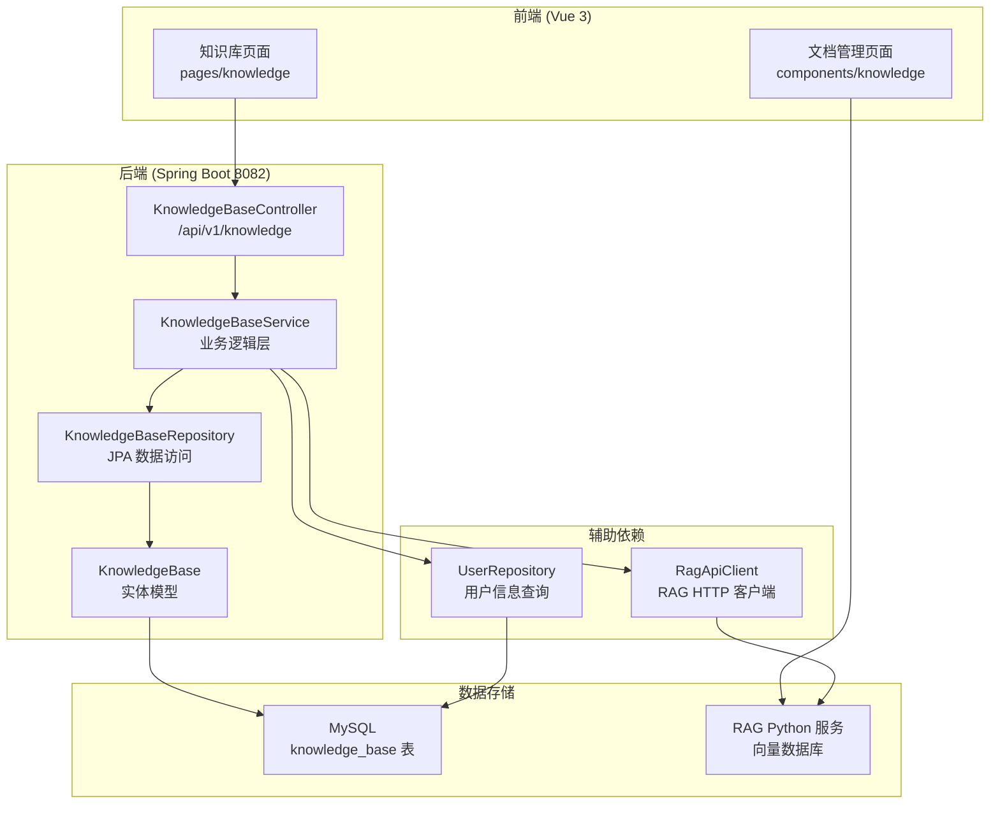
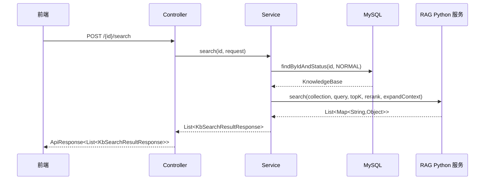
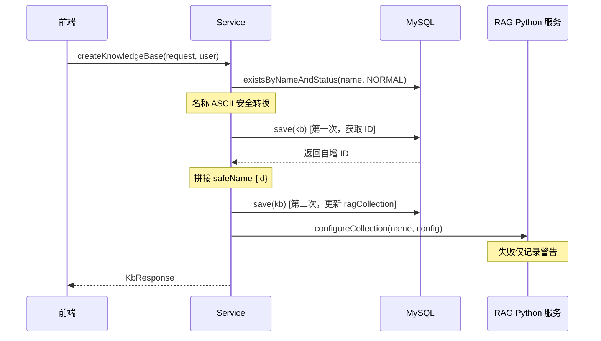

## 后端/知识库

知识库模块是 CodingHub 平台中用于管理 RAG（检索增强生成）知识库的核心后端模块。它提供了知识库的完整生命周期管理，包括创建、查询、更新、删除以及基于语义的搜索功能。该模块作为 Java 后端与 Python RAG 微服务之间的桥梁层，将 MySQL 中的元数据管理与向量数据库中的文档检索解耦，实现了"元数据在 MySQL、文档内容在 RAG 服务"的混合存储架构。

---

### 架构概览



### 分层结构

模块严格遵循项目的四层架构规范：

| 层级 | 组件 | 文件 | 职责 |
|------|------|------|------|
| **L4 - 控制层** | `KnowledgeBaseController` | `controller/kb/` | REST API 端点，参数校验，响应封装 |
| **L3 - 服务层** | `KnowledgeBaseService` | `service/kb/` | 业务逻辑，权限检查，RAG 集成 |
| **L2 - 数据层** | `KnowledgeBaseRepository` | `repository/kb/` | JPA 数据访问，Spring Data 派生查询 |
| **L1 - 模型层** | `KnowledgeBase`, `KbStatus` | `model/kb/` | 实体定义，状态枚举 |

---

### 核心组件详解

#### 1. [KnowledgeBaseController](../backend/src/main/java/com/iaihub/toolbox/controller/kb/KnowledgeBaseController.java)（控制层）

REST 控制器，映射基础路径 `/api/v1/knowledge`，提供知识库的全部 API 端点。

- 使用 `@RequiredArgsConstructor` 进行构造器注入，依赖 `KnowledgeBaseService`
- 所有写操作通过 `@AuthenticationPrincipal User` 获取当前认证用户
- 统一使用 `ApiResponse<T>` 包装响应体，分页结果使用 `PageResponse<T>`
- 创建操作返回 HTTP 201 状态码

#### 2. [KnowledgeBaseService](../backend/src/main/java/com/iaihub/toolbox/service/kb/KnowledgeBaseService.java)（服务层）

核心业务逻辑类，协调 MySQL 数据操作与 RAG 服务调用。主要依赖：

| 依赖 | 用途 |
|------|------|
| `KnowledgeBaseRepository` | 知识库实体的 CRUD 操作 |
| `UserRepository` | 查询知识库拥有者的昵称信息 |
| `RagApiClient` | 与 RAG Python 微服务通信的 HTTP 客户端 |
| `ragPublicUrl` | RAG 服务的公开 URL（配置项 `app.rag.public-url`） |

**关键业务逻辑：**

- **创建知识库**：采用两次保存策略——先保存获取自增 ID，再拼接 `{safeName}-{id}` 作为 RAG 集合名称，保证唯一性。集合名称会进行 ASCII 安全转换（去除中文和特殊字符），因为底层向量引擎（zvec）不支持非 ASCII 名称
- **RAG 配置容错**：创建和更新时调用 RAG 配置接口，但失败仅记录警告日志而不阻断主流程，体现"元数据优先、RAG 配置可补偿"的设计哲学
- **软删除**：删除操作将 `status` 标记为 `DELETED`，同时尽力（best effort）删除 RAG 集合
- **权限模型**：`checkOwnerOrAdmin` 方法实现 `isOwner || isAdmin` 的权限判断，支持 `ADMIN` 和 `SUPER_ADMIN` 两种管理角色
- **分页大小限制**：`Math.min(size, 100)` 将单页最大记录数限制为 100

#### 3. [KnowledgeBaseRepository](../backend/src/main/java/com/iaihub/toolbox/repository/kb/KnowledgeBaseRepository.java)（数据层）

继承 `JpaRepository<KnowledgeBase, Long>` 的 Spring Data JPA 接口，提供以下查询方法：

| 方法 | 用途 |
|------|------|
| `findByStatusOrderByCreatedAtDesc` | 按创建时间倒序列出指定状态的知识库（分页） |
| `findByStatusOrderByHot` | 按热度排序列出知识库（当前实现等同按时间排序，预留扩展点） |
| `findByOwnerIdAndStatusOrderByCreatedAtDesc` | 按拥有者筛选其知识库列表 |
| `findByIdAndStatus` | 按 ID 和状态查找单个知识库（用于软删除过滤） |
| `findByNameAndStatus` | 按名称和状态查找（名称唯一性校验） |
| `existsByNameAndStatus` | 检查指定名称的知识库是否已存在 |

所有查询都包含 `status` 条件，确保已删除的知识库不会被查出。

#### 4. [KnowledgeBase](../backend/src/main/java/com/iaihub/toolbox/model/kb/KnowledgeBase.java)（实体模型）

映射到 `knowledge_base` 数据库表的 JPA 实体，使用 Lombok 的 `@Data`、`@Builder`、`@NoArgsConstructor`、`@AllArgsConstructor` 注解。

**数据库索引：**

| 索引名 | 列 | 用途 |
|--------|------|------|
| `idx_kb_owner_status` | `owner_id, status` | 按用户查询其知识库列表 |
| `idx_kb_status_created` | `status, created_at DESC` | 按时间排序的全局列表 |
| `idx_kb_name_status` | `name, status` | 名称唯一性检查 |

**生命周期回调：**

- `@PrePersist onCreate()`：自动设置 `createdAt` 和 `updatedAt`，默认 `status` 为 `NORMAL`
- `@PreUpdate onUpdate()`：自动更新 `updatedAt` 时间戳

#### 5. [KbStatus](../backend/src/main/java/com/iaihub/toolbox/model/kb/KbStatus.java)（状态枚举）

```java
public enum KbStatus {
    NORMAL,   // 正常状态
    DELETED   // 已删除（软删除）
}
```

---

### 数据结构

#### [KnowledgeBase](../backend/src/main/java/com/iaihub/toolbox/model/kb/KnowledgeBase.java) 实体字段

| 字段 | 类型 | 约束 | 说明 |
|------|------|------|------|
| `id` | `Long` | PK, 自增 | 主键 |
| `name` | `String` | 非空, 长度 100 | 知识库名称 |
| `description` | `String` | 长度 500 | 知识库描述 |
| `ownerId` | `Long` | 非空 | 创建者用户 ID |
| `ragCollection` | `String` | 非空, 长度 100 | RAG 集合标识（ASCII 安全） |
| `status` | `KbStatus` | 非空, 默认 NORMAL | 状态（NORMAL/DELETED） |
| `createdAt` | `LocalDateTime` | 非空, 不可更新 | 创建时间 |
| `updatedAt` | `LocalDateTime` | 非空 | 最后更新时间 |

#### DTO 结构（推断自服务层调用）

**[KbCreateRequest](../backend/src/main/java/com/iaihub/toolbox/dto/kb/KbCreateRequest.java)** - 创建请求：

| 字段 | 类型 | 默认值 | 说明 |
|------|------|--------|------|
| `name` | `String` | 必填 | 知识库名称 |
| `description` | `String` | 可选 | 描述 |
| `chunkMode` | `String` | `"structural"` | 分块模式 |
| `chunkSize` | `Integer` | `800` | 分块大小（token 数） |
| `chunkOverlap` | `Integer` | `50` | 分块重叠 |
| `rerank` | `Boolean` | `true` | 是否启用重排序 |

**[KbUpdateRequest](../backend/src/main/java/com/iaihub/toolbox/dto/kb/KbUpdateRequest.java)** - 更新请求：

| 字段 | 类型 | 说明 |
|------|------|------|
| `name` | `String` | 新名称（可选） |
| `description` | `String` | 新描述（可选） |

**[KbResponse](../backend/src/main/java/com/iaihub/toolbox/dto/kb/KbResponse.java)** - 响应体：

| 字段 | 类型 | 说明 |
|------|------|------|
| `id` | `Long` | 知识库 ID |
| `name` | `String` | 名称 |
| `description` | `String` | 描述 |
| `ownerId` | `Long` | 拥有者 ID |
| `ownerNickname` | `String` | 拥有者昵称（从 [UserRepository](../backend/src/main/java/com/iaihub/toolbox/repository/UserRepository.java) 关联查询） |
| `ragCollection` | `String` | RAG 集合标识 |
| `ragBaseUrl` | `String` | RAG 服务基础 URL |
| `documentsUrl` | `String` | 文档管理 API 完整 URL |
| `createdAt` | `LocalDateTime` | 创建时间 |

**[KbSearchRequest](../backend/src/main/java/com/iaihub/toolbox/dto/kb/KbSearchRequest.java)** - 搜索请求：

| 字段 | 类型 | 默认值 | 说明 |
|------|------|--------|------|
| `query` | `String` | 必填 | 搜索查询文本 |
| `topK` | `Integer` | - | 返回结果数量 |
| `rerank` | `Boolean` | - | 是否启用重排序 |
| `expandContext` | `Integer` | `1` | 上下文扩展范围 |

**[KbSearchResultResponse](../backend/src/main/java/com/iaihub/toolbox/dto/kb/KbSearchResultResponse.java)** - 搜索结果：

| 字段 | 类型 | 说明 |
|------|------|------|
| `text` | `String` | 匹配的文本片段 |
| `source` | `String` | 来源文档标识 |
| `score` | `Double` | 相关性得分 |
| `chunkIndex` | `Integer` | 分块索引 |

---

### API 端点

所有端点基础路径：`/api/v1/knowledge`

| 方法 | 路径 | 认证 | 说明 |
|------|------|------|------|
| `GET` | `/` | 否 | 分页列出知识库，支持 `page`、`size`、`sortBy`（`latest`/`hot`）、`ownerId` 参数 |
| `GET` | `/{id}` | 否 | 获取单个知识库详情 |
| `POST` | `/` | 是 | 创建知识库，返回 201 |
| `PUT` | `/{id}` | 是 | 更新知识库（须为拥有者或管理员） |
| `DELETE` | `/{id}` | 是 | 软删除知识库（须为拥有者或管理员） |
| `POST` | `/{id}/search` | 否 | 在指定知识库中执行语义搜索 |

**搜索 API 详细流程：**



**创建 API 详细流程：**



---

### 与其他模块的依赖关系

| 依赖模块 | 依赖方式 | 说明 |
|----------|----------|------|
| **用户模块** | `UserRepository` | 查询知识库拥有者的昵称信息用于展示 |
| **认证模块** | `@AuthenticationPrincipal User` | 获取当前登录用户，用于权限判断 |
| **RAG Python 服务** | `RagApiClient` | 外部 HTTP 客户端，管理向量集合配置和执行语义搜索 |
| **通用基础设施** | `ApiResponse`, `PageResponse` | 统一 API 响应格式和分页封装 |
| **异常处理模块** | `ResourceNotFoundException`, `DuplicateResourceException`, `ForbiddenException` | 统一异常体系 |
| **文档管理子模块** | 通过 `documentsUrl` 关联 | 前端直接使用 RAG 服务 API 管理知识库中的文档（CRUD 操作不经过 Java 后端） |

---

### 设计要点与注意事项

1. **双写一致性**：创建知识库时需要同时写入 MySQL 和 RAG 服务，采用"MySQL 优先"策略——RAG 配置失败不阻断创建流程，后续可通过补偿机制修复

2. **RAG 集合命名规则**：集合名由知识库名称的 ASCII 安全版本 + 自增 ID 拼接而成（如 `my-kb-42`），确保唯一性同时兼容不支持非 ASCII 字符的向量引擎

3. **文档管理旁路设计**：文档的上传、解析、分块等操作由前端直接调用 RAG Python 服务的 API（通过 `documentsUrl`），Java 后端仅负责知识库元数据管理和搜索代理，降低了后端耦合度

4. **软删除策略**：删除操作仅将 `status` 改为 `DELETED`，不物理删除 MySQL 记录，但会尝试删除对应的 RAG 集合数据

5. **排序扩展点**：`findByStatusOrderByHot` 方法目前实现为按时间排序，预留了未来引入热度排序（如按文档数、搜索次数等）的扩展空间
