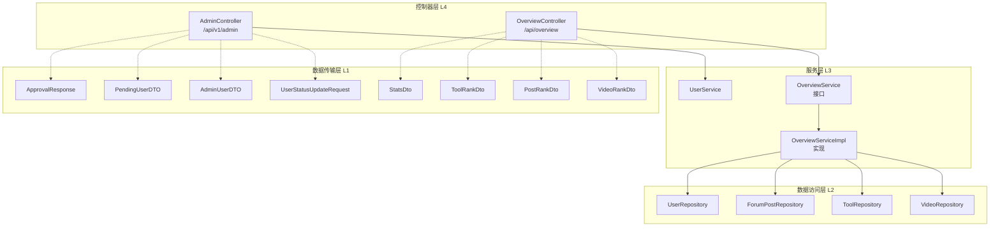
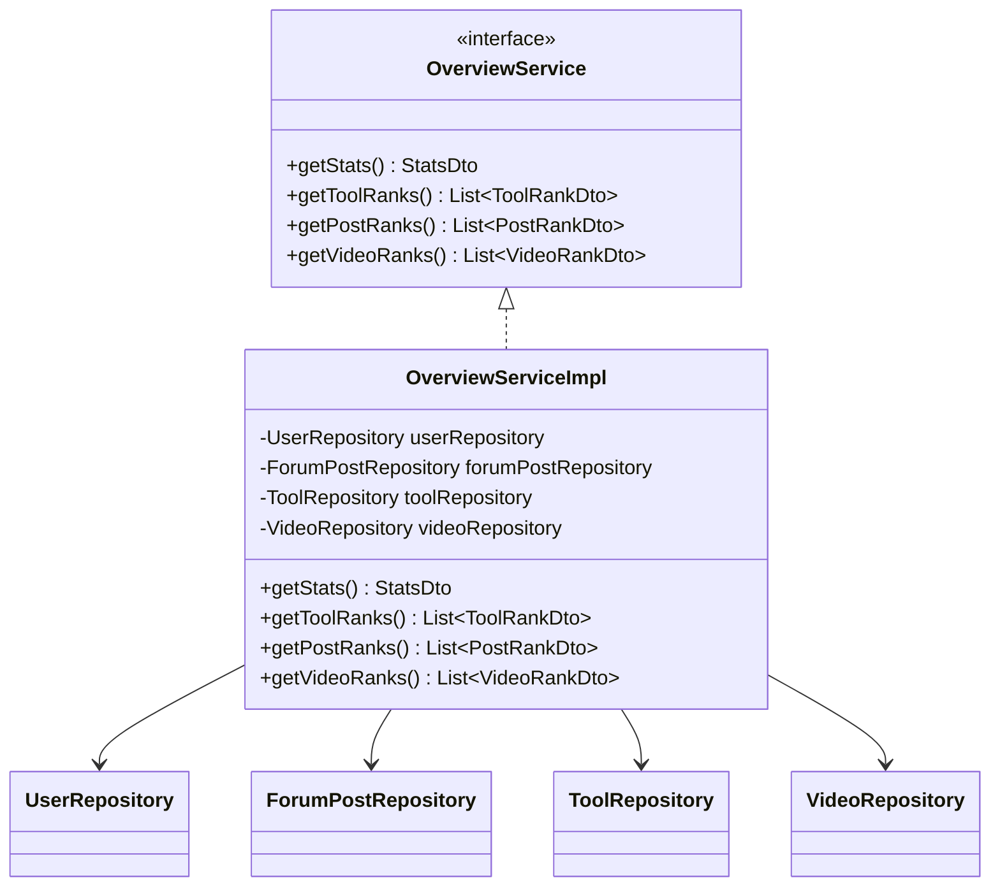
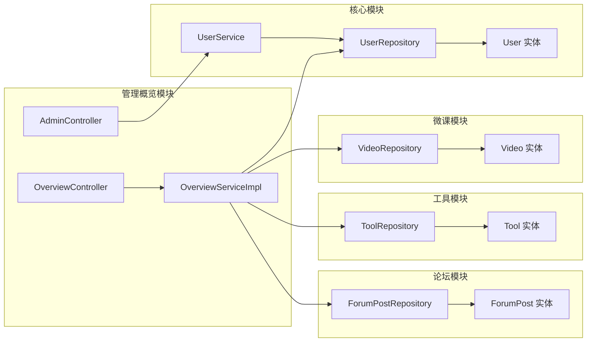

## 后端/管理概览

### 模块简介

管理概览模块是 CodingHub 平台的后台管理与数据统计中心，由两个核心控制器组成：**[AdminController](../backend/src/main/java/com/iaihub/toolbox/controller/AdminController.java)** 负责用户审批与账号管理，**[OverviewController](../backend/src/main/java/com/iaihub/toolbox/controller/OverviewController.java)** 负责平台整体数据的统计与排行榜展示。该模块为管理员提供用户生命周期管理能力（审批、封禁、删除），同时为前端概览页面提供用户数、工具数、帖子数、微课数等核心指标及各类排行榜数据。

### 架构概览

### 核心组件详解

#### 1. [AdminController](../backend/src/main/java/com/iaihub/toolbox/controller/AdminController.java) — 用户管理控制器

**路径**: `com.iaihub.toolbox.controller.AdminController`
**基路径**: `/api/v1/admin`
**依赖**: `UserService`

[AdminController](../backend/src/main/java/com/iaihub/toolbox/controller/AdminController.java) 是平台管理员进行用户生命周期管理的核心入口，提供用户审批、封禁、解封和删除等操作。所有接口统一使用 `ApiResponse<T>` 封装返回结果。

| 方法 | HTTP 映射 | 路径 | 说明 |
|------|-----------|------|------|
| `getPendingUsers` | GET | `/pending-users` | 获取待审批用户列表 |
| `approveUser` | POST | `/approve/{id}` | 审批通过指定用户 |
| `rejectUser` | POST | `/reject/{id}` | 拒绝指定用户的注册申请 |
| `getUsers` | GET | `/users` | 分页查询用户列表（支持角色、状态、关键词筛选） |
| `updateUserStatus` | PUT | `/users/{id}/status` | 更新用户状态（封禁/解禁） |
| `deleteUser` | DELETE | `/users/{id}` | 删除指定用户 |

**用户列表查询参数**：

| 参数 | 类型 | 默认值 | 说明 |
|------|------|--------|------|
| `page` | int | 0 | 页码（从 0 开始） |
| `size` | int | 10 | 每页条数 |
| `role` | String | 无 | 角色过滤（USER / ADMIN / SUPER_ADMIN） |
| `status` | String | 无 | 状态过滤（[AccountStatus](../backend/src/main/java/com/iaihub/toolbox/model/AccountStatus.java) 枚举值） |
| `keyword` | String | 无 | 关键词搜索 |

查询结果按 `createdAt` 降序排列，返回 Spring Data `Page<AdminUserDTO>` 分页对象。对于无效的角色或状态参数，控制器会静默忽略而不抛出异常，确保接口的健壮性。

**状态更新逻辑**：`updateUserStatus` 方法接收 `UserStatusUpdateRequest` 请求体，将字符串状态转为 `AccountStatus` 枚举。若目标状态为 `DISABLED` 则返回"已封禁"提示，否则返回"已解禁"提示。

#### 2. [OverviewController](../backend/src/main/java/com/iaihub/toolbox/controller/OverviewController.java) — 概览统计控制器

**路径**: `com.iaihub.toolbox.controller.OverviewController`
**基路径**: `/api/overview`
**依赖**: `OverviewService`

[OverviewController](../backend/src/main/java/com/iaihub/toolbox/controller/OverviewController.java) 为前端概览页面提供平台级统计数据和排行榜信息，所有接口均为只读 GET 请求。

| 方法 | HTTP 映射 | 路径 | 返回类型 | 说明 |
|------|-----------|------|----------|------|
| `getStats` | GET | `/stats` | `StatsDto` | 获取平台四大核心计数 |
| `getToolRanks` | GET | `/tool-ranks` | `List<ToolRankDto>` | 获取工具排行榜 Top 10 |
| `getPostRanks` | GET | `/post-ranks` | `List<PostRankDto>` | 获取帖子排行榜 Top 10 |
| `getVideoRanks` | GET | `/video-ranks` | `List<VideoRankDto>` | 获取微课排行榜 Top 10 |

#### 3. [OverviewService](../backend/src/main/java/com/iaihub/toolbox/service/OverviewService.java) / [OverviewServiceImpl](../backend/src/main/java/com/iaihub/toolbox/service/OverviewServiceImpl.java) — 概览业务逻辑

**接口**: `com.iaihub.toolbox.service.OverviewService`
**实现**: `com.iaihub.toolbox.service.OverviewServiceImpl`

[OverviewServiceImpl](../backend/src/main/java/com/iaihub/toolbox/service/OverviewServiceImpl.java) 聚合了四个 Repository 的数据，实现平台统计和排行榜逻辑：

**各方法的业务逻辑**：

- **`getStats()`**：分别调用四个 Repository 的 `count()` 方法，聚合用户总数、帖子总数、工具总数和微课总数。
- **`getToolRanks()`**：从 `ToolRepository` 获取全部工具，按 `score` 字段降序排序，取前 10 名，映射为 `ToolRankDto`（包含工具 ID、分类名称、工具名称、评分）。使用 `@Transactional(readOnly = true)` 注解优化只读事务。对 `score` 为 null 的记录以 `BigDecimal.ZERO` 兜底。
- **`getPostRanks()`**：从 `ForumPostRepository` 获取全部帖子，按 `score` 降序排序取 Top 10，映射为 `PostRankDto`（包含帖子 ID、分类、标题、评分）。当前分类字段固定返回空字符串，为后续扩展预留。
- **`getVideoRanks()`**：通过 `VideoRepository.findTop20ByStatusOrderByViewCountDesc(VideoStatus.NORMAL)` 查询状态为 NORMAL 的微课，按播放量降序取前 20 条后再截取前 10 条，映射为 `VideoRankDto`（包含 ID、标题、播放量、点赞数）。

### 数据结构

#### [ApprovalResponse](../backend/src/main/java/com/iaihub/toolbox/dto/ApprovalResponse.java) — 审批响应

| 字段 | 类型 | 说明 |
|------|------|------|
| `userId` | `Long` | 被审批的用户 ID |
| `status` | `String` | 审批后的状态 |
| `message` | `String` | 审批结果描述信息 |

使用 Lombok `@Data`、`@Builder`、`@NoArgsConstructor`、`@AllArgsConstructor` 注解，支持 Builder 模式构建。

#### [StatsDto](../backend/src/main/java/com/iaihub/toolbox/dto/StatsDto.java) — 平台统计

| 字段 | 类型 | 说明 |
|------|------|------|
| `userCount` | `Long` | 注册用户总数 |
| `postCount` | `Long` | 论坛帖子总数 |
| `toolCount` | `Long` | AI 工具总数 |
| `videoCount` | `Long` | 微课视频总数 |

#### [PostRankDto](../backend/src/main/java/com/iaihub/toolbox/dto/PostRankDto.java) — 帖子排行

| 字段 | 类型 | 说明 |
|------|------|------|
| `id` | `Long` | 帖子 ID |
| `category` | `String` | 帖子分类（当前为空字符串，预留扩展） |
| `postTitle` | `String` | 帖子标题 |
| `score` | `BigDecimal` | 综合评分 |

### API 端点汇总

#### 管理端接口（/api/v1/admin）

| 方法 | 端点 | 请求体 | 响应 | 说明 |
|------|------|--------|------|------|
| GET | `/api/v1/admin/pending-users` | - | `List<PendingUserDTO>` | 待审批用户列表 |
| POST | `/api/v1/admin/approve/{id}` | - | `ApprovalResponse` | 审批通过 |
| POST | `/api/v1/admin/reject/{id}` | - | `ApprovalResponse` | 审批拒绝 |
| GET | `/api/v1/admin/users` | - | `Page<AdminUserDTO>` | 分页用户列表 |
| PUT | `/api/v1/admin/users/{id}/status` | `UserStatusUpdateRequest` | `Void` | 更新用户状态 |
| DELETE | `/api/v1/admin/users/{id}` | - | `Void` | 删除用户 |

#### 概览接口（/api/overview）

| 方法 | 端点 | 响应 | 说明 |
|------|------|------|------|
| GET | `/api/overview/stats` | `StatsDto` | 平台统计数据 |
| GET | `/api/overview/tool-ranks` | `List<ToolRankDto>` | 工具排行 Top 10 |
| GET | `/api/overview/post-ranks` | `List<PostRankDto>` | 帖子排行 Top 10 |
| GET | `/api/overview/video-ranks` | `List<VideoRankDto>` | 微课排行 Top 10 |

### 模块依赖关系

本模块作为平台的"管理中枢"和"数据看板"，横向依赖用户、论坛、工具、微课四大业务模块的 Repository 层，但不直接操作实体模型，而是通过各模块提供的 Repository 接口获取数据，保持了良好的模块间解耦。[AdminController](../backend/src/main/java/com/iaihub/toolbox/controller/AdminController.java) 通过 [UserService](../backend/src/main/java/com/iaihub/toolbox/service/UserService.java) 间接操作用户数据，遵循了控制器不直接访问 Repository 的分层原则。
