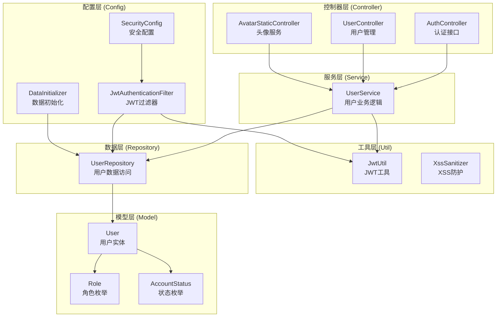
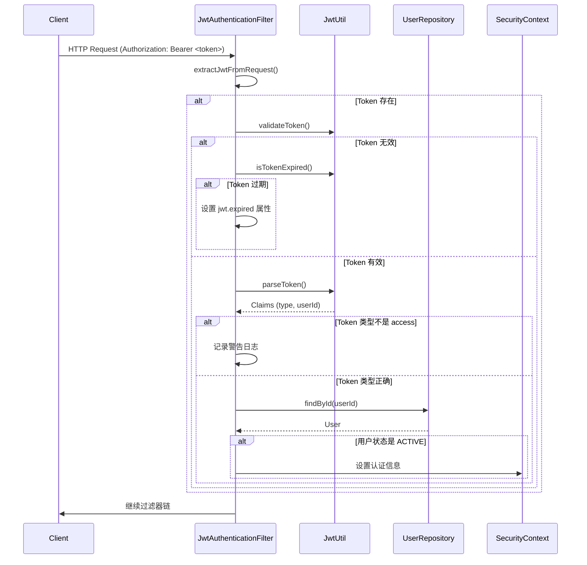
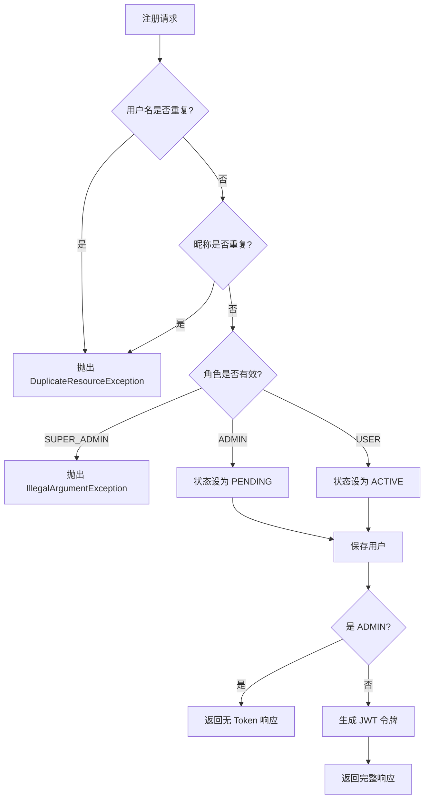

# 认证与安全

## 模块概述

认证与安全模块是 CodingHub 平台的核心基础设施，负责用户身份认证、权限管理、JWT 令牌处理以及系统安全防护。该模块实现了完整的用户生命周期管理，包括注册、登录、令牌刷新、个人资料管理以及管理员审批流程。

## 架构设计



## 核心组件

### 1. 安全配置 ([SecurityConfig](../backend/src/main/java/com/iaihub/toolbox/config/SecurityConfig.java))

**职责**: 配置 Spring Security 安全策略和过滤器链

**关键功能**:
- **无状态会话**: 禁用 CSRF，采用无状态会话管理 (`STATELESS`)
- **JWT 过滤器**: 在 `UsernamePasswordAuthenticationFilter` 之前注入 JWT 认证过滤器
- **CORS 配置**: 允许所有来源、所有方法、所有请求头，支持凭证传递
- **密码编码**: 使用 BCrypt 强哈希算法

**访问控制策略**:

| 访问级别 | 端点示例 | 说明 |
|---------|---------|------|
| 公开访问 | `/api/v1/auth/**` | 认证相关接口 |
| 公开访问 | `GET /api/v1/tools`, `GET /api/v1/videos` | 资源列表和详情 |
| 需要认证 | `/api/v1/users/**`, `/api/v1/tools/**` | 用户操作、资源创建修改 |
| 管理员 | `/api/v1/admin/**` | 需要 ADMIN 或 SUPER_ADMIN 角色 |
| 超级管理员 | `/api/v1/admin/approve/**` | 仅 SUPER_ADMIN 可访问 |

**异常处理**:
- Token 过期: 返回 `TOKEN_EXPIRED` 错误码
- 未认证: 返回 `TOKEN_REQUIRED` 错误码
- 统一返回 401 状态码和 JSON 格式错误信息

### 2. JWT 认证过滤器 ([JwtAuthenticationFilter](../backend/src/main/java/com/iaihub/toolbox/config/JwtAuthenticationFilter.java))

**职责**: 拦截 HTTP 请求，验证 JWT 令牌，设置安全上下文

**处理流程**:


**关键特性**:
- 仅接受 `access` 类型令牌
- 仅允许 `ACTIVE` 状态用户通过认证
- 区分令牌过期和无效令牌，便于前端处理
- 异常安全：捕获所有异常，不中断请求流程

### 3. JWT 工具类 ([JwtUtil](../backend/src/main/java/com/iaihub/toolbox/util/JwtUtil.java))

**职责**: JWT 令牌的生成、解析和验证

**令牌类型**:
| 类型 | 用途 | 过期时间 |
|-----|------|---------|
| access | API 访问认证 | 配置值 `app.jwt.access-token-expiration` |
| refresh | 刷新访问令牌 | 配置值 `app.jwt.refresh-token-expiration` |

**令牌结构**:
```json
{
  "sub": "用户ID",
  "email": "用户名",
  "type": "access|refresh",
  "iat": "签发时间",
  "exp": "过期时间"
}
```

**核心方法**:
- `generateAccessToken()`: 生成访问令牌
- `generateRefreshToken()`: 生成刷新令牌
- `validateToken()`: 验证令牌有效性
- `isTokenExpired()`: 判断令牌是否过期
- `isRefreshToken()`: 判断是否为刷新令牌
- `getUserIdFromToken()`: 从令牌提取用户ID

**安全配置**:
- 使用 HMAC-SHA 算法签名
- 密钥从配置 `app.jwt.secret` 读取
- 使用 JJWT 库 (io.jsonwebtoken)

### 4. 用户服务 ([UserService](../backend/src/main/java/com/iaihub/toolbox/service/UserService.java))

**职责**: 用户业务逻辑的核心实现

#### 4.1 用户注册

**流程**:


**验证规则**:
- 用户名: 4-20字符，仅字母、数字、下划线 (`^\w+$`)
- 昵称: 2-10字符，中文、字母、数字
- 密码: 至少6位
- 不允许注册 SUPER_ADMIN 角色

**审批机制**:
- USER 角色: 直接激活，返回令牌
- ADMIN 角色: 进入 PENDING 状态，等待 SUPER_ADMIN 审批

#### 4.2 用户登录

**流程**:
1. 验证用户名密码
2. 检查账户状态 (PENDING/REJECTED/DISABLED 拒绝登录)
3. 更新最后登录时间
4. 生成并返回双令牌 (access + refresh)

#### 4.3 令牌刷新

**流程**:
1. 验证 refresh token 有效性和类型
2. 提取用户ID，查询用户
3. 生成新的 access token
4. 返回新令牌

#### 4.4 头像管理

**上传流程**:
1. 校验文件格式和大小 (配置: `uploadConfig.avatarMaxFileSize`)
2. 创建头像目录 (`baseDir/avatarSubdir`)
3. 删除旧头像 (按 `userId.*` 模式匹配)
4. 保存新头像 (命名: `userId.ext`)
5. 更新用户 `avatarUrl` 字段
6. 返回带时间戳的 URL (防缓存)

**支持格式**: jpg, png, webp, gif, jpeg

#### 4.5 管理员功能

| 方法 | 功能 | 权限 |
|-----|------|------|
| `getPendingUsers()` | 获取待审批用户列表 | SUPER_ADMIN |
| `approveUser()` | 审批通过用户 | SUPER_ADMIN |
| `rejectUser()` | 拒绝用户申请 | SUPER_ADMIN |
| `getUsers()` | 分页查询用户 (支持过滤) | ADMIN/SUPER_ADMIN |
| `updateUserStatus()` | 更新用户状态 | SUPER_ADMIN |
| `deleteUser()` | 删除用户 | SUPER_ADMIN |

**保护机制**: 超级管理员不可被删除或禁用

### 5. 数据初始化器 ([DataInitializer](../backend/src/main/java/com/iaihub/toolbox/config/DataInitializer.java))

**职责**: 应用启动时自动创建超级管理员账户

**配置项**:
- `app.super-admin.username`: 默认 `admin`
- `app.super-admin.password`: 默认 `Cloud@1234`

**行为**:
- 检查用户是否已存在
- 若不存在，创建 SUPER_ADMIN 用户
- 若存在但角色不匹配，记录警告日志

### 6. XSS 防护 ([XssSanitizer](../backend/src/main/java/com/iaihub/toolbox/util/XssSanitizer.java))

**职责**: 防止跨站脚本攻击

**方法**:
- `sanitize()`: 转义 HTML 特殊字符，移除 `javascript:` 和事件处理器 (`onXXX=`)
- `sanitizePlainText()`: 纯文本转义，适用于非 Markdown 内容

**使用场景**: 用户输入内容在存储和展示前进行清理

## 数据模型

### [User](../backend/src/main/java/com/iaihub/toolbox/model/User.java) 实体

```java
@Entity
@Table(name = "user")
public class User {
    Long id;                    // 主键
    String username;            // 用户名 (唯一, 100字符)
    String nickname;            // 昵称 (唯一, 50字符)
    String password;            // 密码 (BCrypt 加密)
    String avatarUrl;           // 头像URL
    String bio;                 // 个人简介 (500字符)
    Role role;                  // 角色枚举
    AccountStatus status;       // 账户状态
    LocalDateTime createdAt;    // 创建时间
    LocalDateTime updatedAt;    // 更新时间
    LocalDateTime lastLoginAt;  // 最后登录时间
}
```

### 枚举类型

**[Role](../backend/src/main/java/com/iaihub/toolbox/model/Role.java) (角色)**:
- `USER`: 普通用户
- `ADMIN`: 管理员 (需审批)
- `SUPER_ADMIN`: 超级管理员 (系统初始化创建)

**[AccountStatus](../backend/src/main/java/com/iaihub/toolbox/model/AccountStatus.java) (账户状态)**:
- `ACTIVE`: 激活状态
- `PENDING`: 待审批
- `REJECTED`: 已拒绝
- `DISABLED`: 已禁用

## 数据传输对象 (DTO)

| DTO | 用途 | 关键字段 |
|-----|------|---------|
| `LoginRequest` | 登录请求 | username, password |
| `RegisterRequest` | 注册请求 | username, nickname, password, role |
| `LoginResponse` | 登录/注册响应 | accessToken, refreshToken, user |
| `RefreshResponse` | 令牌刷新响应 | accessToken |
| `UserDTO` | 当前用户信息 | 完整用户资料 |
| `PublicUserDTO` | 公开用户信息 | id, username, nickname, avatarUrl |
| `AdminUserDTO` | 管理后台用户信息 | 包含状态和角色 |
| `PendingUserDTO` | 待审批用户 | 基础信息 + 注册时间 |
| `ChangePasswordRequest` | 修改密码 | oldPassword, newPassword |
| `AvatarUploadResponse` | 头像上传响应 | avatarUrl, fileSize, uploadedAt |

## API 端点

### 认证接口 ([AuthController](../backend/src/main/java/com/iaihub/toolbox/controller/AuthController.java))

| 方法 | 端点 | 说明 | 认证 |
|-----|------|------|------|
| POST | `/api/v1/auth/register` | 用户注册 | 否 |
| POST | `/api/v1/auth/login` | 用户登录 | 否 |
| POST | `/api/v1/auth/refresh` | 刷新令牌 | Bearer Token |

### 用户管理接口 ([UserController](../backend/src/main/java/com/iaihub/toolbox/controller/UserController.java))

| 方法 | 端点 | 说明 | 认证 |
|-----|------|------|------|
| GET | `/api/v1/users/me` | 获取当前用户 | 是 |
| GET | `/api/v1/users/me/tools` | 获取我的工具列表 | 是 |
| POST | `/api/v1/users/me/avatar` | 上传头像 | 是 |
| DELETE | `/api/v1/users/me/avatar` | 删除头像 | 是 |
| PUT | `/api/v1/users/me/profile` | 更新个人资料 | 是 |
| PUT | `/api/v1/users/me/password` | 修改密码 | 是 |
| GET | `/api/v1/users/{id}` | 获取公开资料 | 否 |

### 头像静态资源 ([AvatarStaticController](../backend/src/main/java/com/iaihub/toolbox/controller/AvatarStaticController.java))

| 方法 | 端点 | 说明 | 认证 |
|-----|------|------|------|
| GET | `/api/v1/static/avatars/{userId}` | 获取用户头像 | 否 |

**头像访问特性**:
- 支持带扩展名访问: `/avatars/2.jpg`
- 支持无扩展名访问: `/avatars/2` (自动探测格式)
- 缓存控制: 1小时公共缓存
- 路径穿越防护

## 依赖关系

### 外部依赖
- **Spring Security**: 安全框架
- **JJWT (io.jsonwebtoken)**: JWT 令牌处理
- **Apache Commons Text**: HTML 转义 (XSS 防护)
- **BCrypt**: 密码哈希

### 内部依赖
- `UploadConfig`: 文件上传配置
- `AvatarUtil`: 头像工具类 (格式验证、扩展名处理)
- `ToolService`: 用户工具列表查询

### 配置项

```yaml
app:
  jwt:
    secret: <密钥字符串>
    access-token-expiration: <毫秒>  # 访问令牌有效期
    refresh-token-expiration: <毫秒> # 刷新令牌有效期
  super-admin:
    username: admin          # 超级管理员用户名
    password: Cloud@1234     # 超级管理员密码
  upload:
    base-dir: <上传根目录>
    avatar-subdir: avatars   # 头像子目录
    avatar-max-file-size: 2MB # 头像最大尺寸
```

## 安全机制

### 1. 认证机制
- **JWT 无状态认证**: 使用双令牌机制 (access + refresh)
- **令牌类型区分**: access 用于 API 访问，refresh 用于令牌续期
- **自动令牌过期检测**: 区分过期和无效令牌，便于前端处理

### 2. 授权机制
- **基于角色的访问控制 (RBAC)**: USER / ADMIN / SUPER_ADMIN
- **细粒度端点保护**: 按 HTTP 方法和路径模式配置权限
- **超级管理员保护**: 不可删除、不可禁用、不可通过 API 创建

### 3. 数据保护
- **密码加密**: BCrypt 强哈希，防止明文存储
- **XSS 防护**: 用户输入自动转义
- **路径穿越防护**: 头像访问时验证路径安全

### 4. 账户生命周期
- **注册审批**: ADMIN 角色需超级管理员审批
- **状态管理**: ACTIVE / PENDING / REJECTED / DISABLED
- **登录状态检查**: 非 ACTIVE 状态拒绝登录

## 最佳实践

1. **令牌管理**
   - 前端应同时保存 access 和 refresh token
   - access token 过期时使用 refresh token 刷新
   - refresh token 过期需重新登录

2. **错误处理**
   - 区分 `TOKEN_EXPIRED` 和 `TOKEN_REQUIRED` 错误
   - 令牌过期时自动刷新，无需用户干预

3. **头像上传**
   - 支持常见图片格式
   - 自动清理旧头像文件
   - URL 带时间戳防缓存

4. **管理员审批**
   - ADMIN 注册后进入 PENDING 状态
   - SUPER_ADMIN 通过审批接口激活账户
   - 拒绝后账户状态变为 REJECTED
