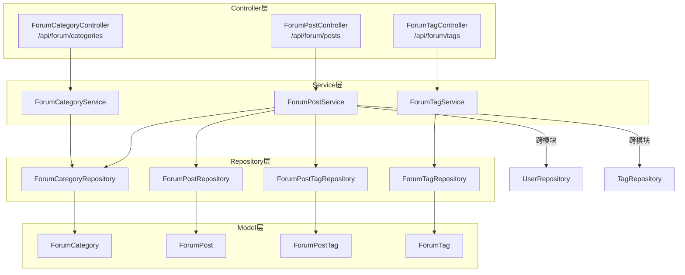
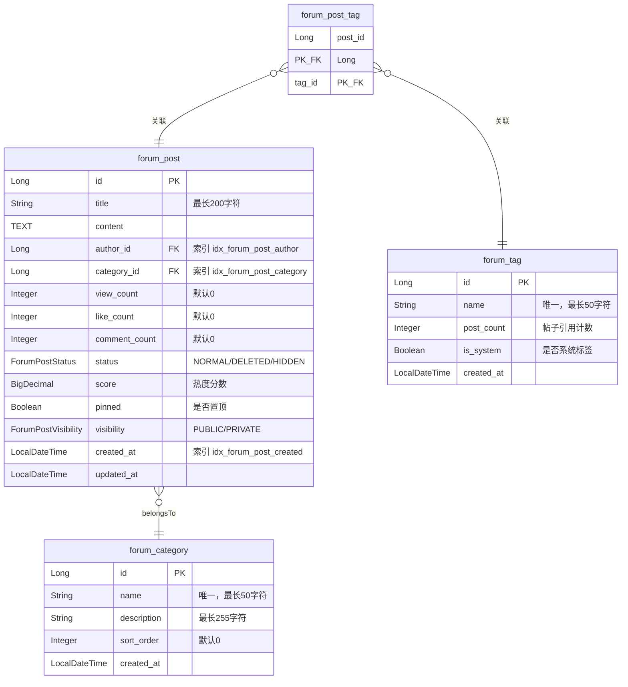

## 后端/论坛

论坛模块是 CodingHub 平台的核心社区功能之一，为用户提供帖子发布、分类浏览、标签管理等社区交流能力。该模块采用标准的 Spring Boot 四层架构（Controller - Service - Repository - Model），实现了帖子的完整生命周期管理，包括创建、编辑、删除、搜索、排序、置顶等功能，并支持公开/私有的可见性控制和基于角色的权限管理。

---

### 架构概览



---

### 核心组件职责

#### 1. Controller 层

| 控制器 | API 前缀 | 职责 |
|--------|----------|------|
| `ForumCategoryController` | `/api/forum/categories` | 提供论坛分类的查询接口 |
| `ForumPostController` | `/api/forum/posts` | 帖子的 CRUD、搜索、置顶/取消置顶、热门排行等 |
| `ForumTagController` | `/api/forum/tags` | 论坛标签的查询、热门标签、创建新标签 |

**[ForumPostController](../backend/src/main/java/com/iaihub/toolbox/controller/forum/ForumPostController.java)** 是功能最丰富的控制器，提供以下端点：

| HTTP 方法 | 路径 | 权限 | 说明 |
|-----------|------|------|------|
| `GET` | `/api/forum/posts` | 公开 | 获取帖子列表，支持按分类、关键词筛选，支持 `hot`/`latest` 排序 |
| `GET` | `/api/forum/posts/my` | 登录用户 | 获取当前用户的帖子列表 |
| `GET` | `/api/forum/posts/{id}` | 公开（私有帖子需登录） | 获取帖子详情，自动增加浏览量 |
| `POST` | `/api/forum/posts` | 登录用户 | 创建新帖子，支持设置可见性和标签 |
| `PUT` | `/api/forum/posts/{id}` | 作者或管理员 | 更新帖子内容、分类、可见性和标签 |
| `DELETE` | `/api/forum/posts/{id}` | 作者或管理员 | 软删除帖子（状态设为 DELETED） |
| `POST` | `/api/forum/posts/{id}/pin` | ADMIN / SUPER_ADMIN | 置顶帖子 |
| `DELETE` | `/api/forum/posts/{id}/pin` | ADMIN / SUPER_ADMIN | 取消置顶帖子 |
| `GET` | `/api/forum/posts/hot-top5` | 公开 | 获取热度前 5 的帖子 ID 列表 |

**[ForumCategoryController](../backend/src/main/java/com/iaihub/toolbox/controller/forum/ForumCategoryController.java)** 提供：

| HTTP 方法 | 路径 | 说明 |
|-----------|------|------|
| `GET` | `/api/forum/categories` | 获取所有分类，按 `sortOrder` 升序排列 |

**[ForumTagController](../backend/src/main/java/com/iaihub/toolbox/controller/forum/ForumTagController.java)** 提供：

| HTTP 方法 | 路径 | 说明 |
|-----------|------|------|
| `GET` | `/api/forum/tags` | 获取所有论坛标签 |
| `GET` | `/api/forum/tags/hot` | 获取热门标签 Top 10（按帖子引用数降序） |
| `POST` | `/api/forum/tags` | 创建新标签，需登录 |

---

#### 2. Service 层

**[ForumPostService](../backend/src/main/java/com/iaihub/toolbox/service/forum/ForumPostService.java)** 是核心业务服务，主要逻辑包括：

- **帖子列表查询**（`getPostList`）：根据 `sortBy` 参数选择排序策略：
  - `latest`：按创建时间倒序
  - `hot`（默认）：按 `pinned DESC, score DESC` 排序（置顶帖优先，再按热度分数排序）
  - 同时支持按分类 ID 和关键词进行过滤
  - 列表查询仅返回 `PUBLIC` 可见性的帖子

- **帖子详情**（`getPostById`）：
  - 私有帖子（`PRIVATE`）仅作者和管理员可查看，未登录用户抛 `ForbiddenException`
  - 每次访问自动递增 `viewCount` 并重新计算 `score`

- **创建帖子**（`createPost`）：
  - 支持设置可见性（`PUBLIC` / `PRIVATE`），默认为 `PUBLIC`
  - 自动创建帖子-标签关联（`ForumPostTag`），并递增标签的 `usageCount`

- **更新帖子**（`updatePost`）：
  - 权限检查：仅作者本人或管理员可操作
  - 标签替换策略：先删除旧关联并递减旧标签使用计数，再创建新关联并递增新标签使用计数

- **删除帖子**（`deletePost`）：采用软删除，将 `status` 设为 `DELETED`

- **DTO 转换**（`toDTO`）：聚合查询分类名称、作者信息（用户名/昵称）和标签列表，组装完整的 `ForumPostDTO`

**[ForumCategoryService](../backend/src/main/java/com/iaihub/toolbox/service/forum/ForumCategoryService.java)** 提供分类查询，将实体转为 DTO 时附加帖子计数（当前硬编码为 0）。

**[ForumTagService](../backend/src/main/java/com/iaihub/toolbox/service/forum/ForumTagService.java)** 提供标签管理和热门标签查询（Top 10），创建标签时检查名称唯一性，重复则抛 `DuplicateResourceException`。

---

#### 3. Repository 层

| Repository | 关键查询方法 | 说明 |
|------------|-------------|------|
| `ForumPostRepository` | `findByStatusAndVisibilityOrderByCreatedAtDesc` | 按时间倒序查询公开帖子 |
| | `findByStatusAndVisibilityOrderByHot` | 按热度排序（pinned DESC, score DESC） |
| | `findByCategoryIdAndStatusAndVisibility[OrderByHot]` | 按分类过滤 + 时间/热度排序 |
| | `searchByTitle[OrderByHot]` | 按标题关键词模糊搜索 |
| | `findByAuthorIdAndStatusOrderByCreatedAtDesc` | 查询用户自己的帖子（不限可见性） |
| | `findTop5ByStatusOrderByScoreDesc` | 热门 Top 5（仅公开帖子） |
| | `pinById` / `unpinById` | `@Modifying` 更新置顶状态 |
| `ForumPostTagRepository` | `findByPostId` / `deleteByPostId` | 帖子-标签关联的查询与删除 |
| `ForumTagRepository` | `findByName` / `findByNameContaining` | 精确/模糊搜索标签 |
| | `findTop10ByOrderByPostCountDesc` | 热门标签 Top 10 |
| `ForumCategoryRepository` | `findAllByOrderBySortOrderAsc` | 按排序号升序查询全部分类 |

---

### 数据模型



#### 枚举类型

| 枚举 | 值 | 说明 |
|------|----|------|
| `ForumPostStatus` | `NORMAL`, `DELETED`, `HIDDEN` | 帖子状态，支持软删除和隐藏 |
| `ForumPostVisibility` | `PUBLIC`, `PRIVATE` | 帖子可见性，`PRIVATE` 仅作者和管理员可见 |

#### 热度分数算法

帖子热度分数（`score`）由 `ForumPost.updateScore()` 方法计算：

```
score = viewCount × 1 + likeCount × 3 + commentCount × 5
```

权重设计：评论 > 点赞 > 浏览，体现深度互动对帖子热度的贡献更大。该分数在每次访问帖子详情时自动重新计算并持久化。

---

### 跨模块依赖

论坛模块与以下模块存在依赖关系：

| 依赖模块 | 使用方式 | 说明 |
|----------|----------|------|
| **用户模块** (`UserRepository`, `User`) | `ForumPostService` 注入 `UserRepository` | 获取帖子作者的用户名和昵称，通过 `@AuthenticationPrincipal` 获取当前登录用户 |
| **统一标签模块** (`TagRepository`, `Tag`) | `ForumPostService` 注入 `TagRepository` | 帖子关联标签时使用统一标签系统的 `Tag` 实体，调用 `incrementUsage` / `decrementUsage` 管理标签使用计数 |
| **通用异常模块** | `ResourceNotFoundException`, `ForbiddenException`, `DuplicateResourceException` | 资源不存在、权限不足、资源重复时抛出标准异常 |
| **安全模块** | `@PreAuthorize`, `@AuthenticationPrincipal` | 置顶操作需要 ADMIN/SUPER_ADMIN 角色，写操作需要登录 |

---

### DTO 数据结构

| DTO | 主要字段 | 说明 |
|-----|----------|------|
| `ForumPostDTO` | id, title, content, authorId, authorName, authorNickname, categoryId, categoryName, viewCount, likeCount, commentCount, createdAt, updatedAt, score, pinned, visibility, tags | 帖子完整信息，包含关联的分类名称、作者信息和标签列表 |
| `ForumPostCreateRequest` | title, content, categoryId, visibility, tagIds | 创建/更新帖子的请求体 |
| `ForumCategoryDTO` | id, name, description, sortOrder, postCount | 分类信息（postCount 当前硬编码为 0） |
| `ForumTagDTO` | id, name, postCount, isSystem | 标签信息 |
| `TagCreateRequest` | name, isSystem | 创建标签的请求体（record 类型） |

---

### 安全与权限设计

| 操作 | 权限要求 | 实现方式 |
|------|----------|----------|
| 浏览帖子列表/详情 | 公开（私有帖子需登录） | Service 层判断 `visibility` + 用户身份 |
| 创建帖子 | 登录用户 | `@AuthenticationPrincipal` 获取用户，null 则返回 401 |
| 编辑/删除帖子 | 作者本人 或 ADMIN/SUPER_ADMIN | Service 层 `isOwner \|\| isAdmin` 检查 |
| 置顶/取消置顶 | ADMIN 或 SUPER_ADMIN | `@PreAuthorize("hasAnyRole('ADMIN', 'SUPER_ADMIN')")` |
| 创建标签 | 登录用户 | `@AuthenticationPrincipal` |

---

### 关键设计决策

1. **软删除**：帖子删除仅将 `status` 设为 `DELETED`，数据保留在数据库中，所有查询均过滤 `status = NORMAL`。

2. **双排序策略**：帖子列表支持 `hot`（热度排序）和 `latest`（时间排序）两种模式。热度排序优先展示置顶帖（`pinned DESC`），再按分数排序（`score DESC`）。

3. **可见性控制**：帖子支持 `PUBLIC` 和 `PRIVATE` 两种可见性。列表查询仅展示公开帖子；私有帖子只能通过直接 URL 访问，且需通过权限检查。

4. **帖子-标签多对多**：通过 `ForumPostTag` 关联表实现，使用复合主键（`@IdClass`）。更新帖子标签时采用「先删后增」策略，同步维护统一标签系统的使用计数。

5. **热度分数实时计算**：每次访问帖子详情时自动递增浏览量并重新计算热度分数，确保排序数据的时效性。

6. **索引优化**：`forum_post` 表在 `author_id`、`category_id`、`created_at` 三个高频查询列上建立了数据库索引。
