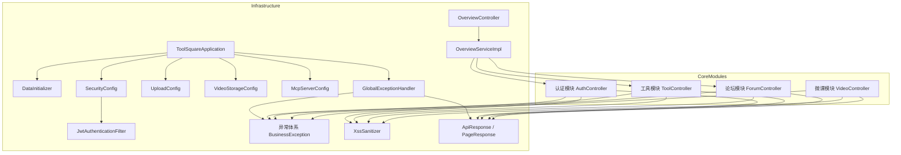
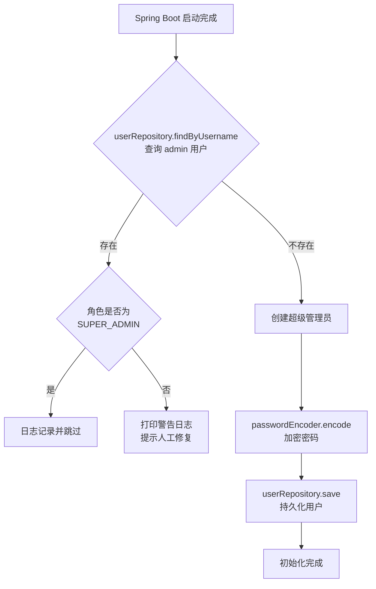
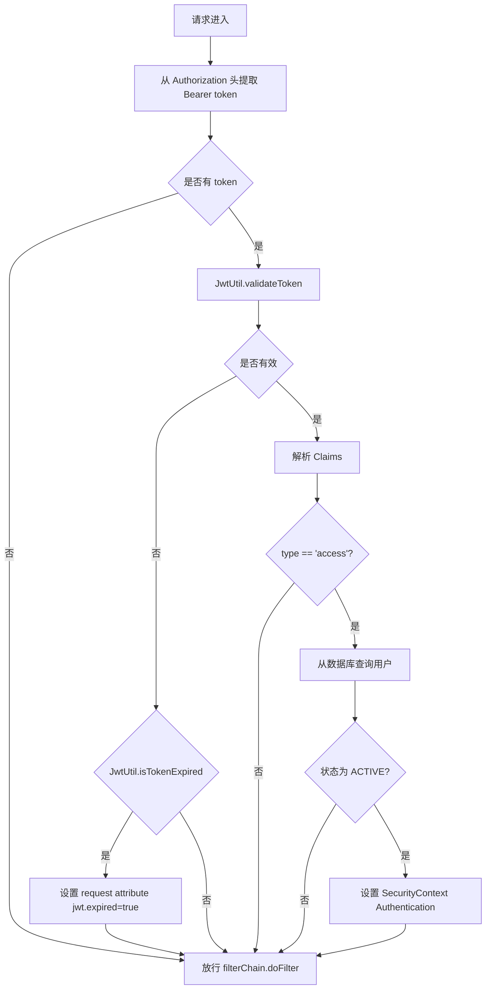
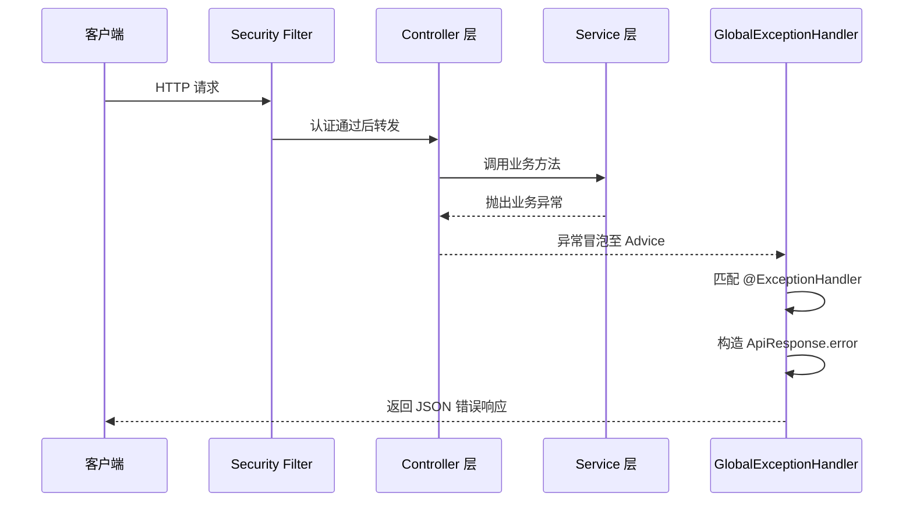
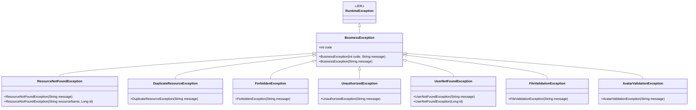
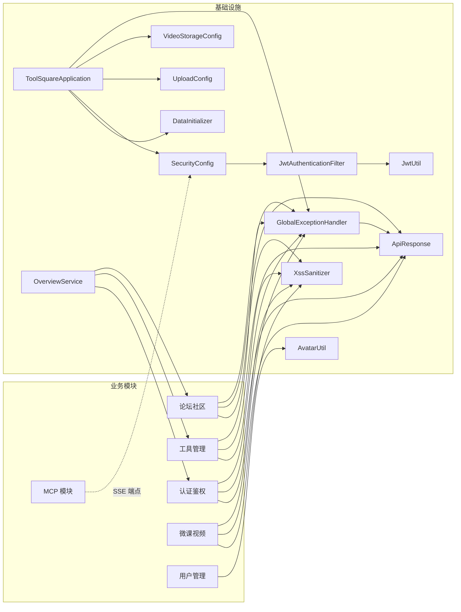

# 基础设施（Infrastructure）

> 本模块涵盖 CodingHub 项目的底层支撑能力：应用启动入口、数据初始化、安全配置（CORS、JWT、权限路由）、文件存储配置、全局异常处理、XSS 安全防护、统一响应封装，以及平台概览统计服务。

---

## 1. 模块总览



基础设施模块位于 `com.iaihub.toolbox` 包的 `config`、`exception`、`util`、`dto` 子包中，为所有业务模块提供横切关注点（cross-cutting concerns）。OverviewController 和 OverviewServiceImpl 虽然属于业务层，但其职责是聚合多模块统计数据，具有平台级视角，因此一并纳入本文档。

### 源文件清单

| 类别 | 文件路径 | 职责 |
|------|----------|------|
| 启动入口 | `ToolSquareApplication.java` | Spring Boot 应用主类 |
| 数据初始化 | `config/DataInitializer.java` | 种子数据：超级管理员账号 |
| 安全配置 | `config/SecurityConfig.java` | CORS、JWT Filter 注入、密码加密、路由权限 |
| JWT 过滤器 | `config/JwtAuthenticationFilter.java` | 从请求头提取并校验 JWT 令牌 |
| 上传配置 | `config/UploadConfig.java` | 文件上传目录与限制参数 |
| 视频存储 | `config/VideoStorageConfig.java` | 微课视频存储路径管理 |
| MCP 配置 | `config/McpServerConfig.java` | MCP 服务端连接参数 |
| 异常处理 | `exception/GlobalExceptionHandler.java` | 全局异常拦截与 HTTP 响应映射 |
| 异常基类 | `exception/BusinessException.java` | 业务异常根类 |
| 异常子类 | `exception/ResourceNotFoundException.java` 等 7 个 | 细分业务场景异常 |
| 安全工具 | `util/XssSanitizer.java` | XSS 输入过滤 |
| JWT 工具 | `util/JwtUtil.java` | 令牌生成、解析与校验 |
| 头像工具 | `util/AvatarUtil.java` | 头像上传安全校验 |
| 响应封装 | `dto/ApiResponse.java`、`dto/PageResponse.java` | 统一 API 响应结构 |
| 概览 API | `controller/OverviewController.java` | 统计与排行端点 |
| 概览服务 | `service/OverviewServiceImpl.java` | 跨模块聚合统计逻辑 |
| 概览 DTO | `dto/StatsDto.java`、`dto/ToolRankDto.java`、`dto/PostRankDto.java` | 统计数据传输对象 |

---

## 2. 应用启动入口：ToolSquareApplication

**文件**：`backend/src/main/java/com/iaihub/toolbox/ToolSquareApplication.java`

应用主类通过 `@SpringBootApplication` 组合注解启用组件扫描（自动扫描 `com.iaihub.toolbox` 所有子包）、自动配置（Security、JPA、Web MVC 等）和属性加载。应用默认监听 **8082** 端口，通过内嵌 Tomcat 启动。

---

## 3. 数据初始化：DataInitializer

**文件**：`backend/src/main/java/com/iaihub/toolbox/config/DataInitializer.java`

DataInitializer 实现 `CommandLineRunner` 接口，在 Spring Boot 容器启动完成后自动执行一次种子数据初始化。

### 3.1 初始化逻辑



### 3.2 超级管理员账号详情

| 属性 | 值 | 说明 |
|------|----|------|
| 用户名 | `admin` | 可通过 `app.super-admin.username` 配置覆盖 |
| 昵称 | `超级管理员` | 固定值 |
| 密码 | `Cloud@1234` | 可通过 `app.super-admin.password` 配置覆盖；存储时经 `PasswordEncoder` 加密 |
| 角色 | `SUPER_ADMIN` | 最高权限角色 |
| 状态 | `ACTIVE` | 账号激活状态，可直接登录 |

### 3.3 幂等性设计

DataInitializer 具有幂等性保护：

1. **用户已存在且角色正确**：记录 info 日志，跳过创建
2. **用户已存在但角色不匹配**：记录 warn 日志，提示人工介入修复，不会覆盖现有数据
3. **用户不存在**：创建新的超级管理员账号

> **注意**：当前版本仅初始化超级管理员账号，不再自动创建默认分类。工具分类和论坛分类需通过管理后台手动创建。

---

## 4. 安全配置

### 4.1 SecurityConfig

**文件**：`backend/src/main/java/com/iaihub/toolbox/config/SecurityConfig.java`

SecurityConfig 是项目的核心安全配置类，通过 `@Configuration` + `@EnableWebSecurity` 注解启用 Spring Security，定义了 CORS 策略、会话管理、路由权限矩阵和认证异常处理。

#### CORS 配置

| 配置项 | 值 |
|--------|------|
| 允许来源 | `*`（通配符模式） |
| 允许方法 | GET, POST, PUT, DELETE, OPTIONS |
| 允许头 | `*`（所有请求头） |
| 允许凭据 | `true` |
| 预检缓存 | 3600 秒 |

#### 会话与 CSRF

- **会话策略**：`STATELESS`（无状态），服务端不维护 Session，配合 JWT 令牌认证
- **CSRF**：已禁用（`csrf.disable()`），因为项目使用 JWT 而非 Cookie 认证，不存在 CSRF 攻击面

#### 路由权限矩阵

```mermaid
flowchart TD
    Request[HTTP 请求] --> Auth{路径匹配}
    Auth -->|"/api/v1/auth/**"| Public[permitAll]
    Auth -->|GET 工具/分类/视频列表| Public
    Auth -->|GET 文件下载/头像资源| Public
    Auth -->|"/mcp/**" 或 "/sse"| Public
    Auth -->|GET/POST 点赞评论| Public
    Auth -->|"DELETE 评论 / 收藏"| NeedAuth[authenticated]
    Auth -->|"/api/v1/admin/approve/**"| SuperAdmin[hasRole SUPER_ADMIN]
    Auth -->|"/api/v1/admin/**"| Admin[hasAnyRole ADMIN, SUPER_ADMIN]
    Auth -->|"工具/视频/用户 写操作"| NeedAuth
    Auth -->|其他| Public
```

| 路由模式 | HTTP 方法 | 权限级别 | 说明 |
|----------|-----------|----------|------|
| `/api/v1/auth/**` | 全部 | `permitAll` | 认证相关（登录/注册/刷新） |
| `/api/v1/tools`、`/api/v1/tools/{id}` | GET | `permitAll` | 工具列表和详情公开 |
| `/api/v1/tools/{id}/comments` | GET | `permitAll` | 工具评论公开 |
| `/api/v1/categories` | GET | `permitAll` | 分类列表公开 |
| `/api/v1/tools/{toolId}/files` | GET | `permitAll` | 文件列表公开 |
| `/api/v1/tools/{toolId}/files/{fileId}/download` | GET | `permitAll` | 文件下载公开 |
| `/api/v1/static/avatars/**` | GET | `permitAll` | 头像静态资源 |
| `/api/v1/users/{id}` | GET | `permitAll` | 用户公开信息 |
| `/mcp/**`、`/sse` | 全部 | `permitAll` | MCP 协议端点 |
| `/api/v1/videos`、`/api/v1/videos/{id}` | GET | `permitAll` | 视频列表和详情公开 |
| `/api/v1/videos/{id}/stream` | GET | `permitAll` | 视频流公开 |
| `/api/v1/videos/{id}/comments` | GET | `permitAll` | 视频评论公开 |
| `/api/v1/interactions/likes` | GET/POST | `permitAll` | 点赞（支持匿名） |
| `/api/v1/interactions/comments` | GET/POST | `permitAll` | 评论（支持匿名） |
| `/api/v1/interactions/comments/**` | DELETE | `authenticated` | 删除评论需认证 |
| `/api/v1/interactions/favorites/**` | 全部 | `authenticated` | 收藏需认证 |
| `/api/v1/admin/approve/**`、`reject/**` | 全部 | `SUPER_ADMIN` | 审批操作 |
| `/api/v1/admin/pending-users` | 全部 | `SUPER_ADMIN` | 待审批用户 |
| `/api/v1/admin/users/*/status` | 全部 | `SUPER_ADMIN` | 用户状态管理 |
| `DELETE /api/v1/admin/users/*` | DELETE | `SUPER_ADMIN` | 删除用户 |
| `/api/v1/admin/**` | 全部 | `ADMIN` / `SUPER_ADMIN` | 通用管理操作 |
| `/api/v1/tools/**`、`/api/v1/users/**` | 非 GET | `authenticated` | 写操作需认证 |

#### 认证异常处理

当请求未携带有效令牌时，`authenticationEntryPoint` 返回 JSON 格式的错误响应（HTTP 401）：

| 场景 | 响应体 |
|------|--------|
| 令牌过期 | `{"error":"TOKEN_EXPIRED","message":"Token has expired"}` |
| 缺少令牌 / 无效令牌 | `{"error":"TOKEN_REQUIRED","message":"Authentication required"}` |

区分逻辑依赖 `JwtAuthenticationFilter` 在请求属性中设置的 `jwt.expired` 标记。

#### Bean 定义

| Bean | 类型 | 说明 |
|------|------|------|
| `securityFilterChain` | `SecurityFilterChain` | 安全过滤器链，将 JWT Filter 注入到 `UsernamePasswordAuthenticationFilter` 之前 |
| `corsConfigurationSource` | `CorsConfigurationSource` | CORS 配置源，注册到 `/**` 路径 |
| `passwordEncoder` | `PasswordEncoder` | BCrypt 密码编码器，用于密码哈希与校验 |

### 4.2 JwtAuthenticationFilter

**文件**：`backend/src/main/java/com/iaihub/toolbox/config/JwtAuthenticationFilter.java`

JwtAuthenticationFilter 继承 `OncePerRequestFilter`，确保每次 HTTP 请求中仅执行一次认证逻辑。它被注入到 Spring Security 过滤器链中 `UsernamePasswordAuthenticationFilter` 之前的位置。

**依赖**：`JwtUtil`（令牌解析）、`UserRepository`（用户查询）

**处理流程**：



**关键设计要点**：

1. **令牌类型校验**：仅接受 `type` claim 为 `"access"` 的令牌，Refresh Token 不能用于 API 认证
2. **用户状态检查**：仅当用户状态为 `ACTIVE` 时才设置认证上下文，被禁用或待审批的用户即使持有有效令牌也无法访问
3. **权限映射**：将用户角色转换为 `ROLE_{role.name()}` 格式的 Spring Security Authority
4. **异常容忍**：认证过程中的任何异常均被捕获并记录日志，不会中断请求处理

---

## 5. 文件存储配置

### 5.1 UploadConfig

**文件**：`backend/src/main/java/com/iaihub/toolbox/config/UploadConfig.java`

UploadConfig 通过 `@ConfigurationProperties(prefix = "app.upload")` 绑定配置项，管理通用文件上传的目录和限制，并在 `@PostConstruct` 阶段自动创建必要的目录结构。

**配置项**：

| 配置键 | 默认值 | 说明 |
|--------|--------|------|
| `app.upload.base-dir` | `~/aifiles` | 上传根目录 |
| `app.upload.max-file-size` | `50MB` | 单文件最大大小 |
| `app.upload.max-request-size` | `200MB` | 单次请求最大大小 |
| `app.upload.allowed-extensions` | `[]`（不限制） | 工具附件允许的扩展名白名单 |
| `app.upload.avatar-subdir` | `avatars` | 头像子目录名 |
| `app.upload.avatar-max-file-size` | `2MB` | 头像文件最大大小 |
| `app.upload.avatar-allowed-extensions` | `jpg, jpeg, png, webp, gif` | 头像允许的格式 |

**初始化行为**（`@PostConstruct init()`）：

1. 若未配置 `base-dir`，默认使用 `~/aifiles`
2. 创建上传根目录（如不存在）
3. 创建头像子目录 `{base-dir}/avatars`（如不存在）
4. 任一目录创建失败时抛出 `RuntimeException` 终止启动

### 5.2 VideoStorageConfig

**文件**：`backend/src/main/java/com/iaihub/toolbox/config/VideoStorageConfig.java`

VideoStorageConfig 专用于微课视频的存储路径管理。

**存储路径规则**：`{base-dir}/uploads/videos`

**初始化行为**（`@PostConstruct init()`）：

1. 读取 `app.upload.base-dir` 配置，未配置时默认 `~/aifiles`
2. 拼接视频存储路径 `{base-dir}/uploads/videos`
3. 若目录不存在则自动创建；创建失败时抛出 `RuntimeException`

### 5.3 McpServerConfig

**文件**：`backend/src/main/java/com/iaihub/toolbox/config/McpServerConfig.java`

McpServerConfig 为 MCP（Model Context Protocol）服务端的配置类，通过 `@ConfigurationProperties(prefix = "mcp.server")` 绑定配置项，与主应用共享 8082 端口。

| 配置键 | 默认值 | 说明 |
|--------|--------|------|
| `mcp.server.port` | `8082` | MCP 服务端口 |
| `mcp.server.host` | `0.0.0.0` | 监听地址 |
| `mcp.server.enabled` | `true` | 是否启用 MCP 服务 |
| `mcp.server.max-connections` | `10` | 最大并发连接数 |
| `mcp.server.connection-timeout-ms` | `30000` | 连接超时时间（毫秒） |

### 5.4 目录结构总览

```
~/aifiles/                          # 上传根目录（app.upload.base-dir）
├── avatars/                        # 头像存储（UploadConfig 初始化）
└── uploads/
    └── videos/                     # 视频存储（VideoStorageConfig 初始化）
```

---

## 6. 全局异常处理：GlobalExceptionHandler

**文件**：`backend/src/main/java/com/iaihub/toolbox/exception/GlobalExceptionHandler.java`

GlobalExceptionHandler 使用 `@RestControllerAdvice` 注解，拦截所有 Controller 层抛出的异常，将其映射为统一的 `ApiResponse<Void>` JSON 响应。

### 6.1 异常处理映射表

| 异常类型 | HTTP 状态码 | 处理方式 |
|----------|-------------|----------|
| `BusinessException` 及其子类 | 异常自带 `code` 字段 | 返回 `ApiResponse.error(code, message)` |
| `MethodArgumentNotValidException` | 400 Bad Request | 提取所有 `FieldError` 的 `defaultMessage`，逗号拼接后返回 |
| `ForbiddenException` | 403 Forbidden | 返回 403 响应（优先级高于 BusinessException 处理器） |
| `IllegalArgumentException` | 400 Bad Request | 返回异常消息 |
| `Exception`（兜底） | 500 Internal Server Error | 记录 error 级别日志，返回通用错误信息 `"Internal server error"` |

### 6.2 请求处理流水线



### 6.3 处理器优先级

当多个 `@ExceptionHandler` 可同时匹配时，Spring MVC 按照**精确匹配优先**的原则选择处理器。例如 `ForbiddenException` 同时匹配 `ForbiddenException` 处理器和 `BusinessException` 处理器，Spring 会选择更精确的 `ForbiddenException` 处理器。

---

## 7. 异常层次结构

**文件目录**：`backend/src/main/java/com/iaihub/toolbox/exception/`



### 7.1 异常基类：BusinessException

`BusinessException` 继承自 `RuntimeException`，是所有业务异常的根类。核心字段：

- `code`（`int`）：HTTP 状态码，用于 `GlobalExceptionHandler` 构造响应状态

提供两个构造函数：

- `BusinessException(int code, String message)`：指定状态码和消息
- `BusinessException(String message)`：默认状态码 400

### 7.2 异常子类详解

| 异常类 | 默认 code | 使用场景 | 关联模块 |
|--------|-----------|----------|----------|
| `ResourceNotFoundException` | 404 | 根据 ID 查询工具、帖子、评论等资源不存在时抛出 | 工具模块、论坛模块、微课模块 |
| `UserNotFoundException` | 404 | 根据 ID 或用户名查询用户不存在时抛出 | 认证模块、用户模块 |
| `DuplicateResourceException` | 409 | 创建资源时出现唯一性约束冲突（如用户名重复） | 认证模块 |
| `ForbiddenException` | 403 | 当前用户无权执行操作（非 owner 且非 admin） | 工具模块、论坛模块、微课模块 |
| `UnauthorizedException` | 401 | JWT 令牌无效或过期，用户未认证 | 认证模块 |
| `FileValidationException` | 400 | 文件上传时类型、大小不符合要求 | 文件模块 |
| `AvatarValidationException` | 400 | 头像上传时格式或尺寸不符合要求 | 用户模块 |

> **交叉引用**：权限校验逻辑（`isOwner || isAdmin`）在 [认证鉴权](./认证鉴权.md) 模块的 Service 层实现；文件校验规则详见 [工具管理](./工具管理.md) 模块。

---

## 8. XSS 安全防护：XssSanitizer

**文件**：`backend/src/main/java/com/iaihub/toolbox/util/XssSanitizer.java`

XssSanitizer 是一个纯静态工具类，基于 Apache Commons Text 的 `StringEscapeUtils` 实现用户输入的 XSS 过滤。

### 8.1 核心方法

| 方法 | 签名 | 说明 |
|------|------|------|
| `sanitize` | `String sanitize(String input)` | 完整 XSS 清洗，适用于 Markdown 内容字段 |
| `sanitizePlainText` | `String sanitizePlainText(String input)` | 纯文本转义，适用于不需要 Markdown 解析的字段 |

### 8.2 sanitize 处理流程

1. **null 检查**：输入为 `null` 时直接返回 `null`
2. **HTML 实体转义**：调用 `StringEscapeUtils.escapeHtml4()` 将 `<`、`>`、`&`、`"` 等字符转义为 HTML 实体
3. **移除 `javascript:` 协议**：正则 `(?i)javascript:` 匹配并移除 JS 协议头
4. **移除事件属性**：正则 `(?i)on\w+\s*=` 匹配并移除 `onclick=`、`onerror=` 等事件绑定
5. **去除首尾空白**：`trim()` 清理多余空格

### 8.3 使用场景

所有接受用户输入的 Service 层方法在持久化前调用 `XssSanitizer.sanitize()` 对文本字段进行清洗，包括但不限于：

- 工具名称和描述（[工具管理](./工具管理.md)）
- 论坛帖子标题和内容（[论坛社区](./论坛社区.md)）
- 评论文本（[统一互动](./统一互动.md)）
- 用户昵称（[认证鉴权](./认证鉴权.md)）

---

## 9. 统一响应封装

### 9.1 ApiResponse\<T\>

**文件**：`backend/src/main/java/com/iaihub/toolbox/dto/ApiResponse.java`

ApiResponse 是全局统一的 API 响应包装类，使用泛型 `T` 承载任意业务数据。

**核心字段**：

| 字段 | 类型 | 说明 |
|------|------|------|
| `code` | `int` | 业务状态码，与 HTTP 状态码一致 |
| `message` | `String` | 状态描述信息 |
| `data` | `T` | 业务数据，`null` 时 JSON 序列化中省略（`@JsonInclude(NON_NULL)`） |

**静态工厂方法**：

| 方法 | 返回 code | 使用场景 |
|------|-----------|----------|
| `success(T data)` | 200 | 查询、更新操作成功 |
| `success(String message, T data)` | 200 | 查询成功，附带自定义消息 |
| `created(T data)` | 201 | 新建资源成功 |
| `created(String message, T data)` | 201 | 新建资源成功，附带自定义消息 |
| `error(int code, String message)` | 自定义 | 操作失败，由 GlobalExceptionHandler 调用 |

### 9.2 PageResponse\<T\>

**文件**：`backend/src/main/java/com/iaihub/toolbox/dto/PageResponse.java`

PageResponse 封装分页查询结果，与 Spring Data 的 `Page` 接口配合使用。

| 字段 | 类型 | 说明 |
|------|------|------|
| `content` | `List<T>` | 当前页数据列表 |
| `totalElements` | `long` | 总记录数 |
| `totalPages` | `int` | 总页数 |
| `page` | `int` | 当前页码（从 0 开始） |
| `size` | `int` | 每页大小 |

> **交叉引用**：分页查询在 [工具管理](./工具管理.md) 的工具列表接口和 [论坛社区](./论坛社区.md) 的帖子列表接口中广泛使用。

---

## 10. 平台概览服务

### 10.1 OverviewController

**文件**：`backend/src/main/java/com/iaihub/toolbox/controller/OverviewController.java`

OverviewController 提供平台级统计和排行榜接口，挂载在 `/api/overview` 路径下。

| HTTP 方法 | 路径 | 返回类型 | 说明 |
|-----------|------|----------|------|
| GET | `/api/overview/stats` | `StatsDto` | 平台总览统计（用户数、帖子数、工具数） |
| GET | `/api/overview/tool-ranks` | `List<ToolRankDto>` | 各分类下工具排行榜（Top 5） |
| GET | `/api/overview/post-ranks` | `List<PostRankDto>` | 各分类下帖子排行榜（Top 5） |

> **注意**：概览接口当前未使用 `ApiResponse` 包装，直接返回业务对象。这与项目中其他 Controller 的响应风格不同，前端直接消费原始数据结构。

### 10.2 OverviewServiceImpl

**文件**：`backend/src/main/java/com/iaihub/toolbox/service/OverviewServiceImpl.java`

OverviewServiceImpl 聚合多个 Repository 的数据，实现跨模块统计。

#### 依赖注入

| Repository | 来源模块 | 用途 |
|------------|----------|------|
| `UserRepository` | 用户模块 | 统计用户总数 |
| `ToolRepository` | 工具模块 | 查询工具列表，按 score 排序 |
| `CategoryRepository` | 工具模块 | 查询工具分类列表 |
| `ForumPostRepository` | 论坛模块 | 查询帖子列表，按 score 排序 |
| `ForumCategoryRepository` | 论坛模块 | 查询论坛分类列表 |

#### 统计逻辑（getStats）

直接调用各 Repository 的 `count()` 方法：

- `userCount` = `userRepository.count()`
- `postCount` = `forumPostRepository.count()`
- `toolCount` = `toolRepository.count()`

#### 工具排行逻辑（getToolRanks）

1. 查询所有工具分类（`categoryRepository.findAll()`）
2. 查询所有工具并按分类 ID 分组（`Collectors.groupingBy`）
3. 每个分类内按 `score` 降序排列，取前 5 名
4. 组装为 `ToolRankDto`（id、分类名、工具名、分数）

#### 帖子排行逻辑（getPostRanks）

逻辑与工具排行对称：

1. 查询所有论坛分类（`forumCategoryRepository.findAll()`）
2. 查询所有帖子并按 `categoryId` 分组
3. 每个分类内按 `score` 降序排列，取前 5 名
4. 组装为 `PostRankDto`（id、分类名、帖子标题、分数）

> **性能说明**：当前实现使用 `findAll()` 全量加载后在内存中分组排序，适合数据量较小的场景。数据量增长后建议改为数据库层面的分组聚合查询。

### 10.3 数据传输对象

| DTO | 字段 | 说明 |
|-----|------|------|
| `StatsDto` | `userCount`、`postCount`、`toolCount`（均为 `Long`） | 平台总览三指标 |
| `ToolRankDto` | `id`（Long）、`category`（String）、`toolName`（String）、`score`（BigDecimal） | 工具排行条目 |
| `PostRankDto` | `id`（Long）、`category`（String）、`postTitle`（String）、`score`（BigDecimal） | 帖子排行条目 |

### 10.4 前端对接

**文件**：`frontend/src/services/overview.ts`

前端通过 Axios 实例调用概览 API，baseURL 为 `/api`：

| 函数 | 请求路径 | 返回类型 |
|------|----------|----------|
| `fetchStats()` | `GET /overview/stats` | `Promise<StatsDto>` |
| `fetchToolRanks()` | `GET /overview/tool-ranks` | `Promise<ToolRankDto[]>` |
| `fetchPostRanks()` | `GET /overview/post-ranks` | `Promise<PostRankDto[]>` |

> **交叉引用**：前端 OverviewPage 页面组件消费上述服务，详见前端页面文档。

---

## 11. 工具类

### 11.1 JwtUtil

**文件**：`backend/src/main/java/com/iaihub/toolbox/util/JwtUtil.java`

JwtUtil 是 JWT 令牌的核心工具类，通过 `@Component` 注解注册为 Spring Bean，基于 JJWT 库实现令牌的生成、解析和校验。

**配置项**：

| 配置键 | 说明 |
|--------|------|
| `app.jwt.secret` | HMAC-SHA 签名密钥（通过 `Keys.hmacShaKeyFor` 构建） |
| `app.jwt.access-token-expiration` | Access Token 过期时间（毫秒） |
| `app.jwt.refresh-token-expiration` | Refresh Token 过期时间（毫秒） |

**核心方法**：

| 方法 | 签名 | 说明 |
|------|------|------|
| `generateAccessToken` | `String generateAccessToken(Long userId, String email)` | 生成 Access Token，`type` claim 为 `"access"` |
| `generateRefreshToken` | `String generateRefreshToken(Long userId, String email)` | 生成 Refresh Token，`type` claim 为 `"refresh"` |
| `getUserIdFromToken` | `Long getUserIdFromToken(String token)` | 从令牌中提取用户 ID（`subject` claim） |
| `parseToken` | `Claims parseToken(String token)` | 解析并返回 `Claims` 对象 |
| `validateToken` | `boolean validateToken(String token)` | 校验令牌是否有效（签名 + 过期） |
| `isTokenExpired` | `boolean isTokenExpired(String token)` | 专门检测令牌是否过期（捕获 `ExpiredJwtException`） |
| `isRefreshToken` | `boolean isRefreshToken(String token)` | 检查令牌是否为 Refresh Token |

**令牌结构**：

```json
{
  "sub": "<userId>",
  "email": "<email>",
  "type": "access | refresh",
  "iat": "<issuedAt>",
  "exp": "<expiration>"
}
```

### 11.2 AvatarUtil

**文件**：`backend/src/main/java/com/iaihub/toolbox/util/AvatarUtil.java`

AvatarUtil 是一个纯静态工具类，提供头像上传相关的安全校验方法，防止恶意文件上传和路径遍历攻击。

**校验规则**：

| 类别 | 允许值 | 拒绝值 |
|------|--------|--------|
| 扩展名 | `jpg`, `jpeg`, `png`, `webp`, `gif` | `svg`, `html`, `htm`, `xml`, `js`（危险扩展名）及其他未列入扩展名 |
| MIME 类型 | `image/jpeg`, `image/png`, `image/webp`, `image/gif` | 其他所有 MIME 类型 |

**核心方法**：

| 方法 | 签名 | 说明 |
|------|------|------|
| `validateAndGetExtension` | `String validateAndGetExtension(MultipartFile file)` | 校验上传文件：非空检查、扩展名白名单、危险扩展名黑名单、MIME 类型一致性校验，返回合法扩展名 |
| `validatePathSafe` | `void validatePathSafe(String userIdStr)` | 校验用户 ID 是否为纯数字，防止路径遍历攻击 |
| `normalizeExt` | `String normalizeExt(String ext)` | 扩展名标准化（`jpeg` → `jpg`，`null` → `jpg`） |

### 11.3 XssSanitizer

> 详见第 8 节「XSS 安全防护」。

---

## 12. 模块间关系总结



基础设施模块与业务模块的关系遵循**单向依赖**原则：业务模块依赖基础设施提供的异常处理、响应封装、安全配置和存储工具，基础设施不反向依赖业务模块。具体依赖关系：

| 基础设施组件 | 被依赖方 | 依赖说明 |
|--------------|----------|----------|
| `SecurityConfig` | 所有业务模块 | 定义的权限策略覆盖全部 API 端点 |
| `JwtUtil` | 认证模块 | 提供令牌生成与校验 |
| `PasswordEncoder` | 认证模块 | 用于密码哈希 |
| `UploadConfig` | 工具 CRUD | 提供附件存储路径 |
| `VideoStorageConfig` | 微课模块 | 提供视频存储路径 |
| `McpServerConfig` | MCP 模块 | 提供 MCP 服务端配置 |
| `XssSanitizer` | 工具、论坛、微课、认证 | 净化用户输入内容 |
| `AvatarUtil` | 用户模块 | 校验头像上传文件 |
| `GlobalExceptionHandler` | 所有业务模块 | 统一异常捕获与响应 |
| `ApiResponse` / `PageResponse` | 所有业务模块 | 统一响应封装 |
| `DataInitializer` | 用户模块 | 启动时写入默认管理员 |
| `OverviewServiceImpl` | 用户、工具、论坛 | 聚合统计和排行数据（唯一反向依赖） |
