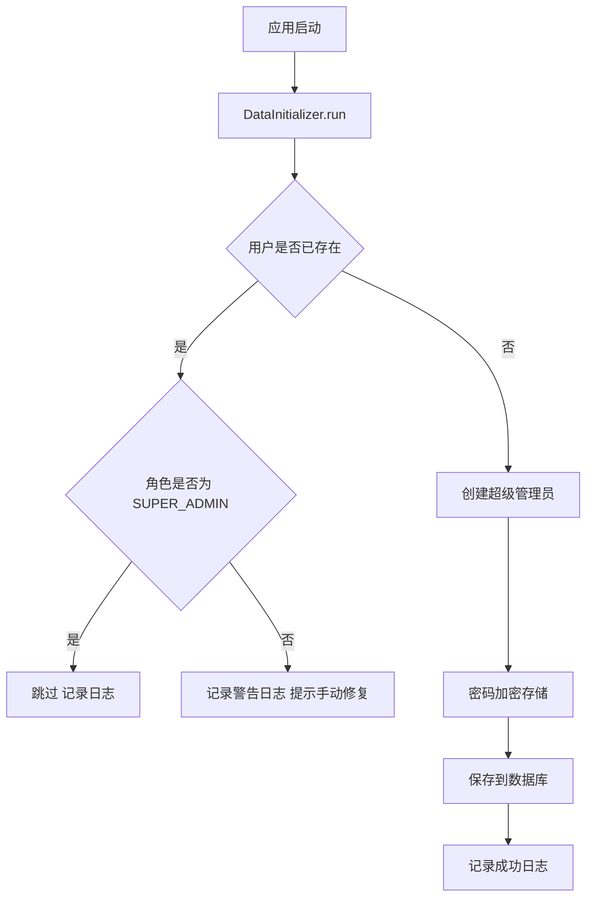
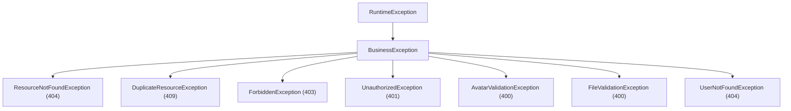
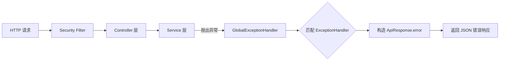
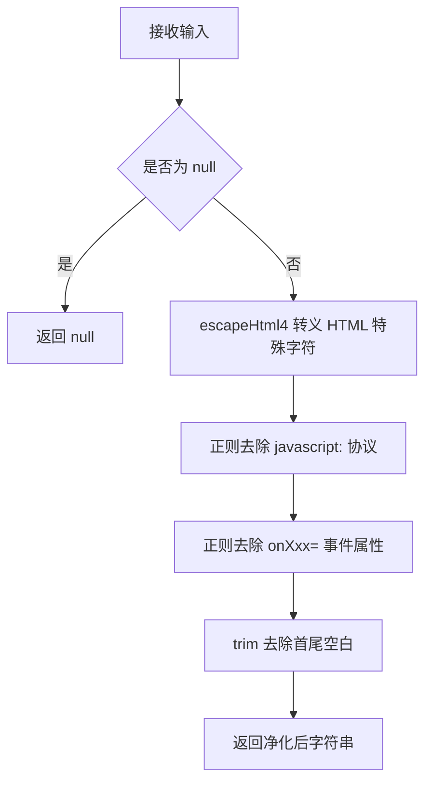

# 基础设施模块

## 1. 模块简介

基础设施模块是 CodingHub 项目的底层支撑层，为所有业务模块（核心工具、论坛、微课、管理后台）提供统一的运行环境与公共服务。该模块不涉及具体业务逻辑，而是专注于以下核心能力：

| 核心能力 | 说明 |
|---------|------|
| 应用启动与种子数据 | Spring Boot 入口、超级管理员自动初始化 |
| 全局异常处理 | 统一拦截 6 种异常类型，返回标准 JSON 错误响应 |
| XSS 防护 | 对用户输入进行 HTML 转义与脚本注入过滤 |
| 统一响应格式 | `ApiResponse` 和 `PageResponse` 标准化所有 API 输出 |
| 数据概览与排行 | 跨模块聚合统计（用户/工具/帖子/微课），Top 10 排行榜 |
| 数据库与运行配置 | MySQL 连接池、JPA、文件上传、JWT 参数等 |

### 涉及源文件清单

| 类别 | 文件 | 职责 |
|------|------|------|
| 入口 | `ToolSquareApplication.java` | Spring Boot 启动类 |
| 配置 | `DataInitializer.java` | 种子数据（超级管理员） |
| 配置 | `application.yml` | 运行参数 |
| 异常 | `GlobalExceptionHandler.java` | 全局异常拦截 |
| 异常 | `BusinessException.java` | 业务异常基类 |
| 异常 | `ResourceNotFoundException.java` | 资源未找到（404） |
| 异常 | `DuplicateResourceException.java` | 资源重复（409） |
| 异常 | `ForbiddenException.java` | 禁止访问（403） |
| 异常 | `UnauthorizedException.java` | 未授权（401） |
| 异常 | `AvatarValidationException.java` | 头像校验失败（400） |
| 异常 | `FileValidationException.java` | 文件校验失败（400） |
| 异常 | `UserNotFoundException.java` | 用户未找到（404） |
| 工具 | `XssSanitizer.java` | XSS 输入净化 |
| DTO | `ApiResponse.java` | 统一 API 响应 |
| DTO | `PageResponse.java` | 分页响应 |
| DTO | `StatsDto.java` | 统计数据传输 |
| DTO | `ToolRankDto.java` | 工具排行数据传输 |
| DTO | `PostRankDto.java` | 帖子排行数据传输 |
| DTO | `VideoRankDto.java` | 微课排行数据传输 |
| 控制器 | `OverviewController.java` | 概览 API |
| 服务 | `OverviewService.java` | 概览服务接口 |
| 服务 | `OverviewServiceImpl.java` | 概览服务实现 |
| 前端 | `services/overview.ts` | 前端概览 API 调用 |
| 前端 | `types/overview.ts` | 前端类型定义 |

---

## 2. 架构总览

```mermaid
graph TD
    subgraph Entry["应用入口"]
        A[ToolSquareApplication]
    end

    subgraph Config["配置层"]
        B[DataInitializer]
        C[application.yml]
    end

    subgraph ExceptionLayer["全局异常处理"]
        D[GlobalExceptionHandler]
        E[BusinessException]
        F[ResourceNotFoundException]
        G[DuplicateResourceException]
        H[ForbiddenException]
        I[UnauthorizedException]
        J[AvatarValidationException]
        K[FileValidationException]
        L[UserNotFoundException]
    end

    subgraph UtilLayer["工具层"]
        M[XssSanitizer]
    end

    subgraph DTOLayer["统一响应 DTO"]
        N[ApiResponse]
        O[PageResponse]
    end

    subgraph OverviewLayer["数据概览"]
        P[OverviewController]
        Q[OverviewServiceImpl]
        R[StatsDto]
        S[ToolRankDto]
        T[PostRankDto]
        U[VideoRankDto]
    end

    subgraph Repos["Repository 层"]
        V[UserRepository]
        W[ToolRepository]
        X[ForumPostRepository]
        Y[VideoRepository]
    end

    A --> B
    A --> C
    B --> V

    F --> E
    G --> E
    H --> E
    I --> E
    J --> E
    K --> E
    L --> E

    D --> E
    D --> H
    D --> N

    P --> Q
    Q --> V
    Q --> W
    Q --> X
    Q --> Y
    Q --> R
    Q --> S
    Q --> T
    Q --> U
```



上图展示了基础设施模块的内部结构与依赖关系。模块从 `ToolSquareApplication` 入口启动，通过 `DataInitializer` 初始化种子数据，通过 `GlobalExceptionHandler` 统一处理所有 Controller 层抛出的异常，通过 `XssSanitizer` 为业务层提供输入净化，通过 `ApiResponse`/`PageResponse` 标准化输出格式，通过 `OverviewServiceImpl` 跨模块聚合统计数据。

---

## 3. 应用启动与初始化

### 3.1 启动入口

`ToolSquareApplication` 是标准的 Spring Boot 启动类，使用 `@SpringBootApplication` 注解启用自动配置和组件扫描。应用监听端口 `8082`，绑定 `0.0.0.0`。

```java
@SpringBootApplication
public class ToolSquareApplication {
    public static void main(String[] args) {
        SpringApplication.run(ToolSquareApplication.class, args);
    }
}
```

启动类位于 `com.iaihub.toolbox` 包根路径，组件扫描自动覆盖所有子包：`config`、`controller`、`service`、`repository`、`model`、`dto`、`exception`、`util`、`mcp`。

### 3.2 种子数据初始化（DataInitializer）

`DataInitializer` 实现了 `CommandLineRunner` 接口，在应用启动时自动执行。其核心职责是确保数据库中存在一个超级管理员账户。

**初始化流程：**



**种子数据字段：**

| 字段 | 默认值 | 配置来源 |
|------|--------|----------|
| username | `admin` | `app.super-admin.username` |
| password | `Cloud@1234` | `app.super-admin.password`（加密后存储） |
| nickname | `超级管理员` | 硬编码 |
| role | `SUPER_ADMIN` | 硬编码 |
| status | `ACTIVE` | 硬编码 |

**安全特性：**

- 密码使用 `PasswordEncoder`（Spring Security BCrypt）加密存储
- 如果用户已存在但角色不匹配，仅记录警告日志，不会自动修改
- 支持通过配置文件或环境变量覆盖默认用户名/密码

**幂等性设计：**

1. **用户已存在且角色正确**：记录 `info` 日志，跳过创建
2. **用户已存在但角色不匹配**：记录 `warn` 日志，提示人工介入修复，不会覆盖现有数据
3. **用户不存在**：创建新的超级管理员账号

> **注意**：当前版本仅初始化超级管理员账号，不再自动创建默认分类。工具分类和论坛分类需通过管理后台手动创建。

---

## 4. 全局异常处理体系

### 4.1 异常继承关系



### 4.2 异常基类：BusinessException

`BusinessException` 继承自 `RuntimeException`，是所有业务异常的根类。核心字段：

- `code`（`int`）：HTTP 状态码，用于 `GlobalExceptionHandler` 构造响应状态

提供两个构造函数：

| 构造函数 | 说明 |
|----------|------|
| `BusinessException(int code, String message)` | 指定状态码和消息 |
| `BusinessException(String message)` | 默认状态码 400 |

### 4.3 异常类型详解

| 异常类 | HTTP 状态码 | 使用场景 | 关联模块 |
|--------|------------|---------|----------|
| `BusinessException` | 400（默认） | 通用业务逻辑错误 | 所有业务模块 |
| `ResourceNotFoundException` | 404 | 根据 ID 查询不到资源 | 工具、论坛、微课模块 |
| `UserNotFoundException` | 404 | 根据 ID 或用户名查询用户不存在 | 认证、用户模块 |
| `DuplicateResourceException` | 409 | 创建资源时名称/标识重复 | 认证模块 |
| `ForbiddenException` | 403 | 用户无权执行操作（非 owner 且非 admin） | 工具、论坛、微课模块 |
| `UnauthorizedException` | 401 | 未登录或 token 过期 | 认证模块 |
| `FileValidationException` | 400 | 附件文件格式/大小不合规 | 文件模块 |
| `AvatarValidationException` | 400 | 头像文件格式/大小不合规 | 用户模块 |

**ResourceNotFoundException 构造函数：**

| 构造函数 | 输出示例 |
|----------|----------|
| `new ResourceNotFoundException("Tool not found")` | `"Tool not found"` |
| `new ResourceNotFoundException("Tool", 42L)` | `"Tool not found with id: 42"` |

**UserNotFoundException 构造函数：**

| 构造函数 | 输出示例 |
|----------|----------|
| `new UserNotFoundException("User not found")` | `"User not found"` |
| `new UserNotFoundException(10L)` | `"User not found with id: 10"` |

### 4.4 GlobalExceptionHandler 处理策略

`GlobalExceptionHandler` 使用 `@RestControllerAdvice` 注解，对所有 Controller 的异常进行统一拦截。

**异常处理映射表：**

| 优先级 | 异常类型 | HTTP 状态码 | 响应内容 |
|--------|---------|------------|----------|
| 1 | `ForbiddenException` | 403 | `ApiResponse.error(403, message)` |
| 2 | `BusinessException` 及其子类 | 由异常的 `code` 字段决定 | `ApiResponse.error(code, message)` |
| 3 | `MethodArgumentNotValidException` | 400 | 拼接所有字段校验错误信息 |
| 4 | `IllegalArgumentException` | 400 | `ApiResponse.error(400, message)` |
| 5 | `Exception`（兜底处理器） | 500 | `ApiResponse.error(500, "Internal server error")` |

**日志策略：**

| 异常类型 | 日志级别 | 日志内容 |
|---------|---------|---------|
| `BusinessException` | `WARN` | code 和 message |
| `MethodArgumentNotValidException` | `WARN` | 校验错误详情 |
| `ForbiddenException` | 无额外日志 | - |
| `IllegalArgumentException` | 无额外日志 | - |
| `Exception`（兜底） | `ERROR` | 完整堆栈信息 |

**请求处理流水线：**



**响应示例：**

```json
{
  "code": 404,
  "message": "Tool not found with id: 42"
}
```

```json
{
  "code": 400,
  "message": "name: must not be blank, description: size must be between 1 and 500"
}
```

> **注意**：由于 `ForbiddenException` 同时继承自 `BusinessException`，Spring 会优先匹配最精确的 `@ExceptionHandler`，因此 `handleForbidden` 方法优先于 `handleBusinessException` 执行。

> **交叉引用**：权限校验逻辑（`isOwner || isAdmin`）在认证鉴权模块的 Service 层实现；文件校验规则详见工具管理模块。

---

## 5. XSS 防护

### 5.1 XssSanitizer 工具类

`XssSanitizer` 是一个纯静态工具类（私有构造函数，所有方法均为 `static`），基于 Apache Commons Text 的 `StringEscapeUtils.escapeHtml4()` 实现，提供两种净化模式。

### 5.2 两种模式对比

| 特性 | `sanitize()` | `sanitizePlainText()` |
|------|-------------|----------------------|
| HTML 转义 | `escapeHtml4` | `escapeHtml4` |
| 去除 `javascript:` 协议 | 是（正则 `(?i)javascript:`） | 否 |
| 去除 `on*=` 事件属性 | 是（正则 `(?i)on\w+\s*=`） | 否 |
| 首尾空白裁剪 | 是（`trim()`） | 否 |
| null 安全 | 返回 null | 返回 null |
| 适用场景 | Markdown 内容、工具描述等富文本 | 用户名、标题等纯文本字段 |

### 5.3 sanitize 处理流程



### 5.4 使用规范

所有业务模块在接收用户输入时，必须调用 `XssSanitizer` 进行净化：

| 业务模块 | 使用的方法 | 净化字段 |
|---------|-----------|---------|
| 工具模块（`ToolService`） | `sanitize()` | 工具名称、描述 |
| 论坛模块（`ForumPostService`） | `sanitize()` | 帖子标题、正文 |
| 微课模块（`VideoService`） | `sanitize()` | 视频标题、描述 |
| 用户模块（`UserService`） | `sanitizePlainText()` | 昵称等纯文本字段 |
| 评论/互动 | `sanitize()` | 评论内容 |

---

## 6. 统一响应格式

### 6.1 ApiResponse\<T\>

`ApiResponse<T>` 是所有 REST API 的统一响应包装器，使用 `@JsonInclude(JsonInclude.Include.NON_NULL)` 在序列化时自动忽略 null 字段（例如错误响应中的 `data` 字段）。

**字段说明：**

| 字段 | 类型 | 说明 |
|------|------|------|
| `code` | `int` | 业务状态码（200/201/400/403/404/409/500） |
| `message` | `String` | 操作结果描述 |
| `data` | `T` | 响应数据（泛型，错误时为 null 被忽略） |

**静态工厂方法：**

| 方法 | 用途 | code |
|------|------|------|
| `success(T data)` | 成功响应 | 200 |
| `success(String message, T data)` | 成功响应（自定义消息） | 200 |
| `created(T data)` | 资源创建成功 | 201 |
| `created(String message, T data)` | 资源创建成功（自定义消息） | 201 |
| `error(int code, String message)` | 错误响应 | 自定义 |

**成功响应示例：**

```json
{
  "code": 200,
  "message": "success",
  "data": {
    "id": 1,
    "name": "My Tool"
  }
}
```

**创建响应示例：**

```json
{
  "code": 201,
  "message": "success",
  "data": {
    "id": 42
  }
}
```

**错误响应示例：**

```json
{
  "code": 404,
  "message": "Tool not found with id: 42"
}
```

> 注意：错误响应中 `data` 字段为 null，由于 `@JsonInclude(NON_NULL)` 注解，JSON 序列化时自动省略。

### 6.2 PageResponse\<T\>

`PageResponse<T>` 是分页查询的标准响应格式，与 Spring Data 的 `Page` 对象配合使用。

**字段说明：**

| 字段 | 类型 | 说明 |
|------|------|------|
| `content` | `List<T>` | 当前页数据列表 |
| `totalElements` | `long` | 总记录数 |
| `totalPages` | `int` | 总页数 |
| `page` | `int` | 当前页码（从 0 开始） |
| `size` | `int` | 每页大小 |

**分页响应示例（外层由 ApiResponse 包装）：**

```json
{
  "code": 200,
  "message": "success",
  "data": {
    "content": [{"id": 1, "name": "Tool A"}, {"id": 2, "name": "Tool B"}],
    "totalElements": 128,
    "totalPages": 13,
    "page": 0,
    "size": 10
  }
}
```

> **交叉引用**：分页查询在工具管理的工具列表接口和论坛社区的帖子列表接口中广泛使用。

---

## 7. 数据概览与排行

### 7.1 API 接口

`OverviewController` 映射在 `/api/overview` 路径下，提供 4 个只读 GET 接口，所有接口**无需认证**。

| 接口 | 方法 | 路径 | 返回类型 | 说明 |
|------|------|------|---------|------|
| 全局统计 | GET | `/api/overview/stats` | `StatsDto` | 四类实体总数 |
| 工具排行 | GET | `/api/overview/tool-ranks` | `List<ToolRankDto>` | Top 10 工具 |
| 帖子排行 | GET | `/api/overview/post-ranks` | `List<PostRankDto>` | Top 10 帖子 |
| 微课排行 | GET | `/api/overview/video-ranks` | `List<VideoRankDto>` | Top 10 微课 |

> **注意**：概览接口当前未使用 `ApiResponse` 包装，直接返回业务对象。这与项目中其他 Controller 的响应风格不同，前端直接消费原始数据结构。

### 7.2 服务接口与实现

**OverviewService 接口定义：**

```java
public interface OverviewService {
    StatsDto getStats();
    List<ToolRankDto> getToolRanks();
    List<PostRankDto> getPostRanks();
    List<VideoRankDto> getVideoRanks();
}
```

`OverviewServiceImpl` 是唯一的实现类，注入以下 4 个 Repository：

| Repository | 来源模块 | 用途 |
|------------|----------|------|
| `UserRepository` | 用户模块 | 统计用户总数 |
| `ToolRepository` | 工具模块 | 查询工具列表，按 score 排序 |
| `ForumPostRepository` | 论坛模块 | 查询帖子列表，按 score 排序 |
| `VideoRepository` | 微课模块 | 查询视频列表，按播放量排序 |

### 7.3 全局统计（StatsDto）

`OverviewServiceImpl.getStats()` 分别从 4 个 Repository 获取 `count()`，聚合为 `StatsDto`：

| 字段 | 类型 | 数据来源 | 说明 |
|------|------|---------|------|
| `userCount` | `Long` | `UserRepository.count()` | 注册用户总数 |
| `postCount` | `Long` | `ForumPostRepository.count()` | 论坛帖子总数 |
| `toolCount` | `Long` | `ToolRepository.count()` | 工具总数 |
| `videoCount` | `Long` | `VideoRepository.count()` | 微课视频总数 |

### 7.4 排行榜算法

#### 工具排行榜（ToolRankDto）

| 字段 | 类型 | 来源 |
|------|------|------|
| `id` | `Long` | `tool.getId()` |
| `category` | `String` | `tool.getCategory().getName()`，category 为 null 时为空字符串 |
| `toolName` | `String` | `tool.getName()` |
| `score` | `BigDecimal` | `tool.getScore()`，null 时为 `BigDecimal.ZERO` |

**算法流程**：全量查询 Tool 表 -> 按 `score` 降序排序（null 视为 0） -> 取 Top 10

#### 帖子排行榜（PostRankDto）

| 字段 | 类型 | 来源 |
|------|------|------|
| `id` | `Long` | `post.getId()` |
| `category` | `String` | 当前硬编码为空字符串 |
| `postTitle` | `String` | `post.getTitle()` |
| `score` | `BigDecimal` | `post.getScore()`，null 时为 `BigDecimal.ZERO` |

**算法流程**：全量查询 ForumPost 表 -> 按 `score` 降序排序（null 视为 0） -> 取 Top 10

#### 微课排行榜（VideoRankDto）

| 字段 | 类型 | 来源 |
|------|------|------|
| `id` | `Long` | `video.getId()` |
| `videoTitle` | `String` | `video.getTitle()` |
| `viewCount` | `Integer` | `video.getViewCount()`，null 时为 0 |
| `likeCount` | `Integer` | `video.getLikeCount()`，null 时为 0 |

**算法流程**：数据库查询 `findTop20ByStatusOrderByViewCountDesc(NORMAL)` -> 内存中取 Top 10

**微课排行与其他排行的差异：**

| 对比维度 | 工具/帖子排行 | 微课排行 |
|---------|-------------|---------|
| 排序字段 | `score`（BigDecimal 综合评分） | `viewCount`（播放量） |
| 排序执行方 | 内存中 Java Stream 排序 | 数据库层 `ORDER BY` |
| 状态过滤 | 无（全量查询） | 仅 `status = NORMAL`，排除已删除/审核中 |
| 数据库查询 | `findAll()` | `findTop20ByStatusOrderByViewCountDesc` |

> **性能说明**：工具和帖子排行当前使用 `findAll()` 全量加载后在内存中排序，适合数据量较小的场景。数据量增长后建议改为数据库层面的 `LIMIT 10 ORDER BY score DESC` 查询。

### 7.5 前端对接

前端通过 `services/overview.ts` 封装了 4 个 API 调用函数，类型定义在 `types/overview.ts` 中。

| 前端函数 | 对应接口 | 返回类型 |
|---------|---------|----------|
| `fetchStats()` | `GET /api/overview/stats` | `Promise<StatsDto>` |
| `fetchToolRanks()` | `GET /api/overview/tool-ranks` | `Promise<ToolRankDto[]>` |
| `fetchPostRanks()` | `GET /api/overview/post-ranks` | `Promise<PostRankDto[]>` |
| `fetchVideoRanks()` | `GET /api/overview/video-ranks` | `Promise<VideoRankDto[]>` |

**前端类型定义（`types/overview.ts`）：**

```typescript
export interface StatsDto {
  userCount: number;
  postCount: number;
  toolCount: number;
  videoCount: number;
}

export interface ToolRankDto {
  id: number;
  category: string;
  toolName: string;
  score: number;
}

export interface PostRankDto {
  id: number;
  category: string;
  postTitle: string;
  score: number;
}

export interface VideoRankDto {
  id: number;
  videoTitle: string;
  viewCount: number;
  likeCount: number;
}
```

前端类型定义与后端 DTO 字段一一对应，使用 `axios` 实例（`baseURL: '/api'`）发起请求。

> **交叉引用**：前端 OverviewPage 页面组件消费上述服务，详见前端页面文档。

---

## 8. 数据库与运行配置

### 8.1 数据库连接

配置位于 `application.yml`，使用 HikariCP 连接池。

| 参数 | 值 | 说明 |
|------|-----|------|
| `url` | `jdbc:mysql://localhost:3306/ai_tool_square` | 数据库地址与库名 |
| `username` | `root` | 数据库用户 |
| `password` | `123456` | 数据库密码 |
| `driver-class-name` | `com.mysql.cj.jdbc.Driver` | MySQL 8.x 驱动 |
| `maximum-pool-size` | 10 | 连接池最大连接数 |
| `minimum-idle` | 5 | 最小空闲连接数 |
| `connection-timeout` | 30000 | 连接超时（毫秒） |

**URL 参数说明**：

| 参数 | 值 | 说明 |
|------|-----|------|
| `useUnicode` | `true` | 启用 Unicode |
| `characterEncoding` | `utf8` | 字符编码 |
| `serverTimezone` | `Asia/Shanghai` | 时区 |
| `allowPublicKeyRetrieval` | `true` | 允许公钥检索 |
| `useSSL` | `false` | 不使用 SSL（本地部署） |

### 8.2 JPA / Hibernate

| 参数 | 值 | 说明 |
|------|-----|------|
| `ddl-auto` | `update` | 自动更新表结构（开发模式） |
| `show-sql` | `false` | 不在控制台输出 SQL |
| `format_sql` | `true` | 格式化 SQL（配合 show-sql） |
| `open-in-view` | `false` | 禁用懒加载视图，避免 N+1 查询 |
| `dialect` | `MySQLDialect` | MySQL 方言 |

### 8.3 文件上传配置

| 参数 | 值 | 说明 |
|------|-----|------|
| `max-file-size` | 1GB | 单文件最大限制（Servlet 层） |
| `max-request-size` | 1GB | 单次请求最大限制（Servlet 层） |
| `file-size-threshold` | 2MB | 写入磁盘的阈值 |
| `app.upload.base-dir` | 环境变量 `AIHUB_FILE_BASE_DIR` 或空 | 文件存储根目录 |
| `app.upload.max-file-size` | 50MB | 应用层文件大小校验 |
| `app.upload.max-request-size` | 200MB | 应用层请求大小校验 |
| `app.upload.allowed-extensions` | `[]`（空，不限制） | 允许的文件扩展名，空表示不校验 |

### 8.4 JWT 认证参数

| 参数 | 值 | 说明 |
|------|-----|------|
| `secret` | `ai-tool-square-2026-iaihub-secret-key-min-256-bits-for-security` | 签名密钥（至少 256 位） |
| `access-token-expiration` | 900000（15 分钟） | 访问令牌有效期 |
| `refresh-token-expiration` | 604800000（7 天） | 刷新令牌有效期 |

### 8.5 超级管理员配置

| 参数 | 值 | 说明 |
|------|-----|------|
| `app.super-admin.username` | `admin` | 超级管理员用户名 |
| `app.super-admin.password` | `Cloud@1234` | 超级管理员初始密码 |

### 8.6 日志配置

| 参数 | 值 | 说明 |
|------|-----|------|
| `root` | `INFO` | 全局日志级别 |
| `com.iaihub.toolbox` | `DEBUG` | 应用包日志级别 |
| `org.springframework.security` | `WARN` | Spring Security 日志级别 |
| 格式 | `%d{yyyy-MM-dd HH:mm:ss} [%thread] %-5level %logger{36} - %msg%n` | 日志输出格式 |

### 8.7 其他配置

| 参数 | 值 | 说明 |
|------|-----|------|
| `server.port` | `8082` | 后端服务端口 |
| `server.address` | `0.0.0.0` | 监听地址（所有网卡） |
| `spring.main.allow-bean-definition-overriding` | `true` | 允许 Bean 定义覆盖 |

---

## 9. 与其他模块的交叉引用

基础设施模块被所有业务模块依赖，以下是关键的交叉引用关系：

| 业务模块 | 使用的基础设施服务 | 说明 |
|---------|-------------------|------|
| **核心工具模块** | `ApiResponse`, `PageResponse`, `XssSanitizer`, 异常体系 | 工具 CRUD 使用统一响应格式和异常处理 |
| **论坛模块** | `ApiResponse`, `PageResponse`, `XssSanitizer`, 异常体系 | 帖子创建/编辑使用 XSS 净化 |
| **微课模块** | `ApiResponse`, `PageResponse`, `XssSanitizer`, 异常体系 | 视频上传使用文件校验异常 |
| **管理模块** | `ApiResponse`, `DataInitializer` 创建的管理员账户 | 管理员审批流程依赖初始化账户 |
| **认证模块** | `UnauthorizedException`, `application.yml` JWT 配置 | JWT 令牌过期时间由此配置 |
| **MCP 模块** | `ApiResponse`, 异常体系 | MCP 工具调用使用统一错误格式 |
| **概览页面（前端）** | `overview.ts` 服务 + `types/overview.ts` 类型 | 前端 OverviewPage 消费排行数据 |

**依赖方向**：基础设施模块与业务模块之间遵循**单向依赖**原则 -- 业务模块依赖基础设施提供的异常处理、响应封装、安全配置和存储工具，基础设施不反向依赖业务模块。唯一例外是 `OverviewServiceImpl`，它聚合了用户、工具、论坛、微课四个模块的 Repository，属于平台级统计需求。
