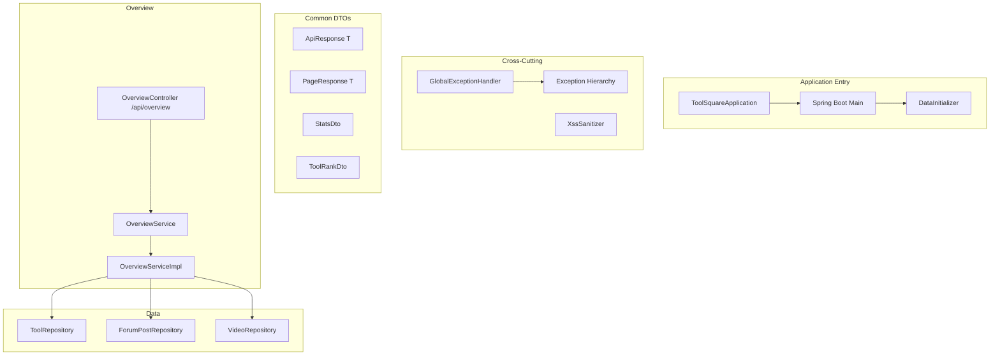
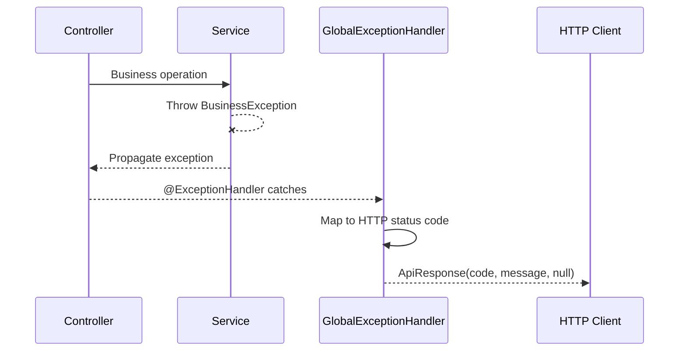

# 基础设施模块

## 模块概述

基础设施模块包含 CodingHub 后端的公共基础组件，包括应用入口、数据初始化、全局异常处理、通用 DTO、XSS 防护工具和平台概览统计服务。这些组件为所有业务模块提供底层支撑。

## 架构图

## 核心组件

### ToolSquareApplication — 应用入口

Spring Boot 主类，应用启动点。通过 `@SpringBootApplication` 注解引导整个应用。

### DataInitializer — 数据初始化

应用启动时执行的数据初始化逻辑：

- 创建默认分类（如果不存在）
- 创建默认论坛分类
- 初始化 SUPER_ADMIN 账户（如果不存在）

### GlobalExceptionHandler — 全局异常处理

`@ControllerAdvice` 统一异常处理，将业务异常转换为标准化 JSON 响应：

- `BusinessException` — 通用业务异常
- `ResourceNotFoundException` — 资源未找到（404）
- `DuplicateResourceException` — 重复资源（409）
- `ForbiddenException` — 禁止访问（403）
- `UnauthorizedException` — 未授权（401）
- `UserNotFoundException` — 用户未找到

### ApiResponse / PageResponse — 通用 DTO

- `ApiResponse<T>` — 统一响应包装：`{code, message, data}`
- `PageResponse<T>` — 分页响应：`{content, totalElements, totalPages, currentPage}`

### StatsDto / ToolRankDto / PostRankDto / VideoRankDto — 统计 DTO

平台概览统计数据传输对象：

- `StatsDto` — 平台总览（工具数、用户数、帖子数等）
- `ToolRankDto` — 工具排行榜
- `PostRankDto` — 帖子排行榜
- `VideoRankDto` — 视频排行榜

### XssSanitizer — XSS 防护工具

HTML 输入消毒工具，对用户生成内容进行 XSS 攻击防护：

- 转义危险 HTML 标签和属性
- 应用于帖子内容、评论内容、弹幕内容、反馈内容等所有用户输入

### OverviewController — 概览控制器

REST 端点 `/api/overview`：

- `GET /stats` — 平台统计概览
- `GET /tool-ranks` — 工具热度排行
- `GET /post-ranks` — 帖子热度排行
- `GET /video-ranks` — 视频热度排行

### OverviewService — 概览服务

聚合多个 Repository 的统计数据，提供平台概览信息。

## 前端集成

- **API 服务**：`frontend/src/services/overview.ts` — 统计和排行 API
- **类型定义**：`frontend/src/types/overview.ts` — StatsDto、ToolRankDto、PostRankDto
- **页面**：OverviewPage / HomePage — 展示平台统计和排行

## 异常处理流程

## 设计要点

- **统一异常处理**：所有业务异常通过 `GlobalExceptionHandler` 转换为标准化 JSON 响应
- **通用响应格式**：`ApiResponse<T>` 和 `PageResponse<T>` 确保 API 响应一致性
- **XSS 防护**：所有用户输入统一经过 `XssSanitizer` 消毒
- **数据初始化**：应用启动时自动创建默认数据，确保首次运行可用

## 交叉引用

- [认证与用户](认证与用户.md) — 用户相关的异常和安全
- [工具市场](工具市场.md) — 工具统计数据
- [论坛社区](论坛社区.md) — 帖子统计数据
- [微课视频](微课视频.md) — 视频统计数据