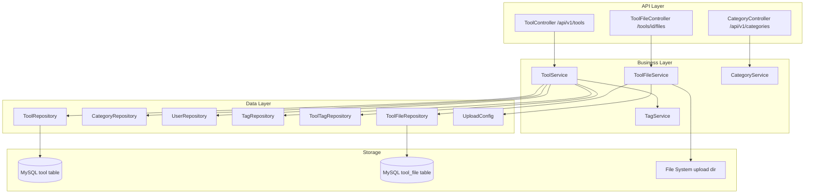
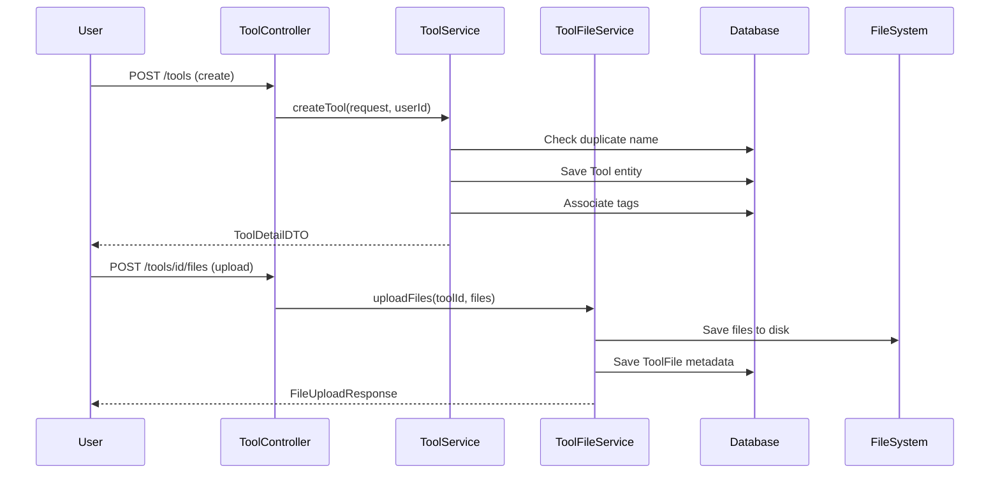

# 工具市场模块

## 模块概述

工具市场是 CodingHub 的核心功能模块，提供 AI 工具/插件的发布、发现、分类、文件管理和热度排行功能。用户可以上传工具及其附件文件，通过分类和标签进行组织，系统自动计算热度分数用于排序和推荐。

## 架构图

## 核心组件

### Tool — 工具实体

工具市场的核心实体，映射 `tool` 表。关键字段：

- `name` / `content`（TEXT）/ `description` / `version`（默认 "1.0.0"）
- `category`（ManyToOne LAZY）/ `uploader`（ManyToOne LAZY）
- `status`（NORMAL/DELETED 软删除）
- `viewCount` / `likeCount` / `commentCount` / `score`（BigDecimal）
- `pinned`（Boolean，管理员置顶）

**热度分数公式**：`score = viewCount * 1 + likeCount * 3 + commentCount * 5`

唯一约束：同一用户在同一分类下不可创建同名工具。

### ToolFile — 工具文件实体

工具附件的元数据，映射 `tool_file` 表。使用 `toolId` 作为普通 Long 外键（非 JPA 关联），实际文件存储在文件系统 `{baseDir}/{toolId}/` 目录下。

### Category — 分类实体

工具分类，字段包括 `name`（唯一）、`icon`、`sortOrder`。Service 层将 "API" 分类重命名为 "插件" 用于前端展示。

### ToolService — 工具服务

核心业务逻辑：

- **列表查询**：支持分类/关键词过滤，三种排序模式（hot/latest/name）
- **CRUD 操作**：创建时检查重名、更新/删除时验证所有权或管理员权限
- **标签管理**：创建/更新时关联标签，维护标签使用计数
- **热度排序**：按 `pinned DESC, score DESC` 排序
- **分数计算**：每次浏览/点赞/评论时自动重算

### ToolFileService — 文件服务

文件存储管理：

- **上传**：保存到 `{baseDir}/{toolId}/` 目录，同名文件替换
- **下载**：流式传输文件内容
- **删除**：物理文件 + 数据库记录同步删除
- **限制**：单文件 50MB，单次请求 200MB

### 前端集成

前端通过 `frontend/src/services/tool.ts` 和 `frontend/src/types/tool.ts` 与后端 API 交互，支持工具详情查看、点赞、评论等操作。

## 数据流

## 设计要点

- **软删除**：工具和文件使用 `Status` 枚举而非物理删除
- **混合存储**：元数据在数据库，二进制文件在文件系统
- **标签多对多**：通过 `ToolTag` 关联表，标签维护 `usageCount`
- **所有权模型**：修改/删除操作检查 `isOwner || isAdmin`

## 交叉引用

- [统一互动](统一互动.md) — 工具的点赞、评论、收藏
- [标签系统](标签系统.md) — 工具标签关联
- [MCP协议](MCP协议.md) — MCP 工具搜索和下载
- [认证与用户](认证与用户.md) — 用户认证和权限

<!-- crosslinks (auto-generated) -->
## Related Modules
- Depends on: [标签系统](标签系统.md), [认证与用户](认证与用户.md)
- Used by: [MCP协议](mcp协议.md), [认证与用户](认证与用户.md)
