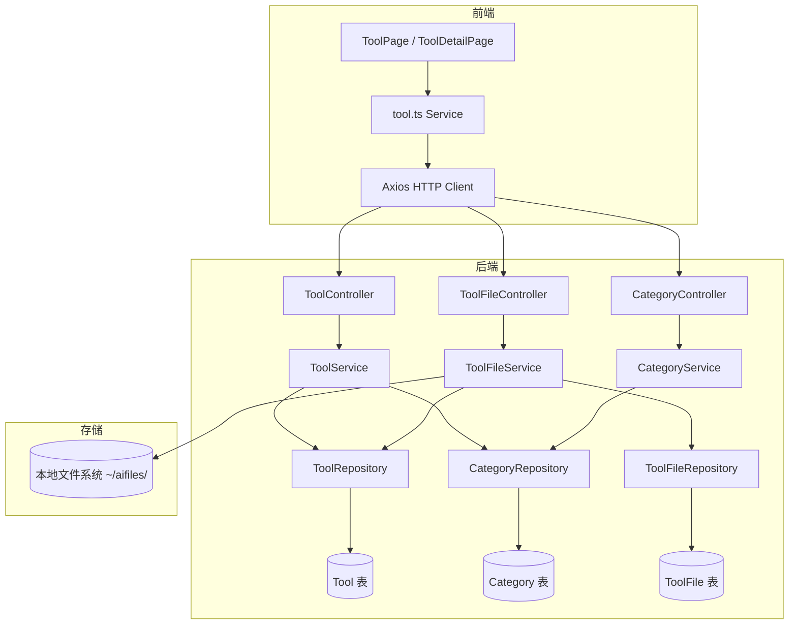
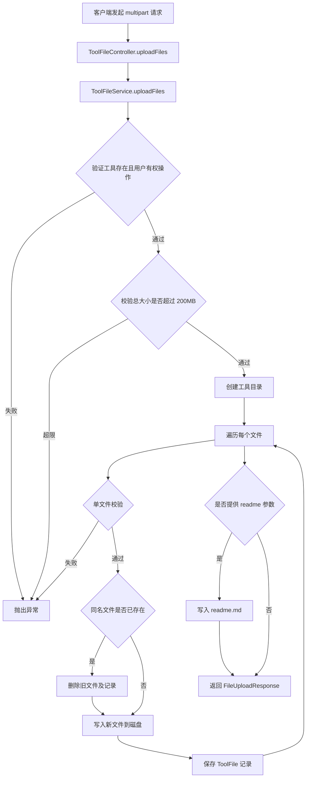
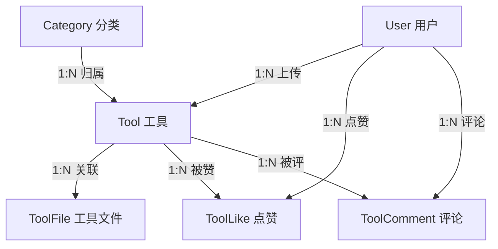

# 工具市场模块

## 1. 模块概述

工具市场是 CodingHub 平台的核心模块，为用户提供工具（AI 工具、脚本、插件等）的发布、浏览、搜索、文件管理与互动（点赞、评论）功能。该模块采用经典的 Spring Boot 三层架构，后端通过 RESTful API 对外暴露服务，前端基于 Vue 3 + TypeScript 构建交互界面。

**核心能力：**

- 工具的创建、查询、更新与软删除（CRUD）
- 工具附件的上传、下载与管理
- 工具分类的维护与展示
- 基于关键词和分类的搜索筛选
- 点赞与评论互动
- 文件安全校验与 XSS 防护

## 2. 架构总览



## 3. 核心组件说明

### 3.1 ToolController -- 工具 CRUD 控制器

**路径：** `com.iaihub.toolbox.controller.ToolController`
**API 前缀：** `/api/v1/tools`

`ToolController` 是工具市场的主入口控制器，负责处理工具的增删改查请求。所有写操作均需要 JWT 认证，读操作对外公开。

| 方法 | HTTP | 路径 | 说明 | 认证 |
|------|------|------|------|------|
| `getTools` | GET | `/api/v1/tools` | 分页查询工具列表，支持分类、关键词筛选与排序 | 否 |
| `getToolById` | GET | `/api/v1/tools/{id}` | 获取单个工具的详细信息 | 否 |
| `createTool` | POST | `/api/v1/tools` | 创建新工具 | 是 |
| `updateTool` | PUT | `/api/v1/tools/{id}` | 更新工具信息（仅所有者或管理员） | 是 |
| `deleteTool` | DELETE | `/api/v1/tools/{id}` | 软删除工具（仅所有者或管理员） | 是 |

### 3.2 ToolFileController -- 文件管理控制器

**路径：** `com.iaihub.toolbox.controller.ToolFileController`
**API 前缀：** `/api/v1/tools/{toolId}/files`

`ToolFileController` 管理工具关联的附件文件，支持多文件批量上传、单文件下载与文件删除。

| 方法 | HTTP | 路径 | 说明 | 认证 |
|------|------|------|------|------|
| `uploadFiles` | POST | `/api/v1/tools/{toolId}/files` | 批量上传文件（multipart/form-data） | 可选 |
| `getToolFiles` | GET | `/api/v1/tools/{toolId}/files` | 获取工具的文件列表 | 否 |
| `deleteToolFile` | DELETE | `/api/v1/tools/{toolId}/files/{fileId}` | 删除指定文件（仅所有者） | 是 |
| `downloadFile` | GET | `/api/v1/tools/{toolId}/files/{fileId}/download` | 下载文件（流式响应） | 否 |

### 3.3 CategoryController -- 分类控制器

**路径：** `com.iaihub.toolbox.controller.CategoryController`
**API 前缀：** `/api/v1/categories`

`CategoryController` 提供工具分类的只读查询接口。分类数据按 `sortOrder` 升序排列。

| 方法 | HTTP | 路径 | 说明 | 认证 |
|------|------|------|------|------|
| `getAllCategories` | GET | `/api/v1/categories` | 获取所有分类列表 | 否 |

> **注意：** `CategoryService` 内部会将名为 "API" 的分类显示名称替换为「插件」，这是一个展示层的映射逻辑，不影响数据库存储。

## 4. 工具 CRUD API 详解

### 4.1 查询工具列表

```
GET /api/v1/tools?categoryId={id}&keyword={kw}&sortBy={latest|name}&page=0&size=12
```

**请求参数：**

| 参数 | 类型 | 必填 | 默认值 | 说明 |
|------|------|------|--------|------|
| `categoryId` | Long | 否 | - | 按分类 ID 筛选 |
| `keyword` | String | 否 | - | 按工具名称模糊搜索 |
| `sortBy` | String | 否 | `latest` | 排序方式：`latest`（最新）或 `name`（名称） |
| `page` | int | 否 | `0` | 页码（从 0 开始） |
| `size` | int | 否 | `12` | 每页数量（上限 100） |

**响应结构（`ToolSummaryDTO`）：**

| 字段 | 类型 | 说明 |
|------|------|------|
| `id` | Long | 工具 ID |
| `name` | String | 工具名称 |
| `version` | String | 版本号 |
| `categoryName` | String | 分类名称 |
| `categoryIcon` | String | 分类图标 |
| `uploaderId` | Long | 上传者 ID |
| `uploaderUsername` | String | 上传者用户名 |
| `uploaderNickname` | String | 上传者昵称 |
| `createdAt` | LocalDateTime | 创建时间 |

### 4.2 获取工具详情

```
GET /api/v1/tools/{id}
```

**响应结构（`ToolDetailDTO`）** 在 `ToolSummaryDTO` 基础上增加：

| 字段 | 类型 | 说明 |
|------|------|------|
| `content` | String | 工具介绍（Markdown） |
| `updatedAt` | LocalDateTime | 最后更新时间 |
| `viewCount` | Integer | 浏览次数 |
| `likeCount` | Integer | 点赞数 |
| `commentCount` | Integer | 评论数 |
| `score` | BigDecimal | 综合评分 |

### 4.3 创建工具

```
POST /api/v1/tools
Content-Type: application/json
Authorization: Bearer <token>
```

**请求体（`CreateToolRequest`）：**

| 字段 | 校验规则 | 说明 |
|------|---------|------|
| `name` | 必填，1-100 字符，仅允许字母、数字、中文、下划线、连字符 | 工具名称 |
| `categoryId` | 必填 | 所属分类 ID |
| `content` | 必填，最大 5000 字符 | 工具介绍内容 |
| `version` | 必填，语义化版本格式（如 `1.0.0`） | 版本号 |

**业务规则：**

- 同一用户在同一分类下不能上传同名工具（抛出 `DuplicateResourceException`）
- 内容字段经过 `XssSanitizer.sanitize()` 处理，防止 XSS 攻击

### 4.4 更新工具

```
PUT /api/v1/tools/{id}
Authorization: Bearer <token>
```

**请求体（`UpdateToolRequest`）：** 所有字段均为可选，仅更新传入的字段。

**权限控制：**

- 仅工具所有者（`isOwner`）或管理员（`ADMIN` / `SUPER_ADMIN`）可以操作
- 修改名称或分类时，同样检查同名工具是否已存在

### 4.5 删除工具

```
DELETE /api/v1/tools/{id}
Authorization: Bearer <token>
```

**删除流程：**

1. 校验操作权限（`isOwner || isAdmin`）
2. 调用 `toolFileService.cleanupToolFiles()` 清理所有关联文件（物理文件 + 数据库记录）
3. 将工具状态设为 `DELETED`（软删除）

## 5. 文件上传与下载流程

### 5.1 上传流程



**上传限制：**

| 限制项 | 值 |
|--------|-----|
| 单文件大小上限 | 50 MB |
| 单次请求总大小上限 | 200 MB |
| 文件扩展名 | 默认无限制（可通过 `app.upload.allowed-extensions` 配置白名单） |
| 存储路径 | `~/aifiles/{toolId}/{originalName}` |

**同名文件替换：** 当上传的文件名与已有文件相同时，系统会先删除旧的物理文件和数据库记录，再写入新文件，实现无缝替换。

**README 支持：** 上传请求可通过 `readme` 参数附带 Markdown 格式的说明文本，系统会自动保存为 `readme.md` 文件。

### 5.2 下载流程

```
GET /api/v1/tools/{toolId}/files/{fileId}/download
```

下载接口返回流式响应（`InputStreamResource`），并设置以下 HTTP 头：

- `Content-Disposition: attachment; filename="原始文件名"`
- `Content-Type: 文件的 MIME 类型`（默认 `application/octet-stream`）
- `Content-Length: 文件大小`

### 5.3 文件清理

当工具被删除时，`ToolFileService.cleanupToolFiles()` 执行级联清理：

1. 遍历所有关联的 `ToolFile` 记录，逐一删除物理文件
2. 删除工具目录 `~/aifiles/{toolId}/`
3. 批量删除数据库中的 `ToolFile` 记录

## 6. 分类管理

分类（Category）是工具的归属维度，通过 `CategoryController` 提供只读查询。

**数据模型：**

| 字段 | 类型 | 说明 |
|------|------|------|
| `id` | Long | 分类 ID |
| `name` | String | 分类名称 |
| `icon` | String | 分类图标标识 |
| `sortOrder` | Integer | 排序权重（升序） |

**查询接口：**

```
GET /api/v1/categories
```

返回按 `sortOrder` 升序排列的分类列表。`CategoryService` 在返回数据前会将名为 "API" 的分类映射为「插件」。

## 7. 搜索和筛选功能

工具列表查询支持多维度的搜索与筛选，由 `ToolRepository` 中的自定义 JPQL 查询实现。

### 7.1 筛选条件

| 维度 | 实现方式 |
|------|----------|
| 分类筛选 | `WHERE t.category.id = :categoryId`，参数为 `NULL` 时跳过 |
| 关键词搜索 | `WHERE t.name LIKE %:keyword%`，基于工具名称的模糊匹配 |
| 状态过滤 | 固定条件 `t.status = 'NORMAL'`，自动排除软删除的工具 |

### 7.2 排序方式

| sortBy 值 | 排序规则 | 对应 Repository 方法 |
|-----------|---------|---------------------|
| `latest`（默认） | 按创建时间倒序 | `findByFilters` |
| `name` | 按工具名称升序 | `findByFiltersOrderByName` |

### 7.3 分页

使用 Spring Data 的 `Pageable` 机制，默认每页 12 条，最多 100 条。响应中包含 `totalElements`（总记录数）和 `totalPages`（总页数），方便前端实现分页组件。

### 7.4 我的工具

`ToolService.getMyTools()` 提供按上传者 ID 筛选的工具列表查询，用于用户的个人工具管理页面，同样支持分类、关键词和排序参数。

## 8. 数据模型关系



### 8.1 Tool 实体

| 字段 | 类型 | 说明 |
|------|------|------|
| `id` | Long | 主键 |
| `name` | String | 工具名称 |
| `version` | String | 版本号 |
| `content` | String | 工具介绍（经 XSS 过滤） |
| `status` | Enum | 状态：`NORMAL` / `DELETED` |
| `viewCount` | Integer | 浏览次数 |
| `likeCount` | Integer | 点赞计数（冗余字段） |
| `commentCount` | Integer | 评论计数（冗余字段） |
| `score` | BigDecimal | 综合评分 |
| `category` | ManyToOne | 所属分类 |
| `uploader` | ManyToOne | 上传者 |
| `createdAt` | LocalDateTime | 创建时间（自动填充） |
| `updatedAt` | LocalDateTime | 更新时间（自动填充） |

`Tool` 实体通过 `@PrePersist` 和 `@PreUpdate` 生命周期回调自动维护时间戳，并提供 `updateScore()`、`incrementViewCount()`、`incrementLikeCount()`、`decrementLikeCount()`、`incrementCommentCount()` 等业务方法。

### 8.2 ToolFile 实体

| 字段 | 类型 | 说明 |
|------|------|------|
| `id` | Long | 主键 |
| `toolId` | Long | 关联工具 ID |
| `originalName` | String | 原始文件名 |
| `storedPath` | String | 存储相对路径 |
| `fileSize` | Long | 文件大小（字节） |
| `contentType` | String | MIME 类型 |
| `status` | Enum | 状态：`NORMAL` / `DELETED` |
| `createdAt` | LocalDateTime | 创建时间 |

### 8.3 ToolLike 与 ToolComment

`ToolLike` 和 `ToolComment` 分别记录用户对工具的点赞和评论行为。两者的 Repository 均已标记为 `@Deprecated`，表明相关功能正在向新的实现迁移。

## 9. 配置说明

### 9.1 UploadConfig

上传配置通过 `@ConfigurationProperties(prefix = "app.upload")` 绑定 `application.yml` 中的配置项：

| 配置项 | 默认值 | 说明 |
|--------|--------|------|
| `app.upload.base-dir` | `~/aifiles` | 文件存储根目录 |
| `app.upload.max-file-size` | `50MB` | 单文件大小上限 |
| `app.upload.max-request-size` | `200MB` | 单次请求大小上限 |
| `app.upload.allowed-extensions` | 空（不限制） | 允许的扩展名白名单 |
| `app.upload.avatar-subdir` | `avatars` | 头像子目录 |
| `app.upload.avatar-max-file-size` | `2MB` | 头像大小上限 |
| `app.upload.avatar-allowed-extensions` | `jpg, jpeg, png, webp, gif` | 头像允许的扩展名 |

应用启动时，`UploadConfig.init()` 方法会自动创建存储目录和头像子目录。

### 9.2 StaticController

`StaticController` 提供 `/api/v1/readme` 端点，返回项目 README 文件的 Markdown 内容。优先读取 `classpath:static/README.md`，若不存在则尝试读取项目根目录的 README。

## 10. 前端集成

### 10.1 TypeScript 类型定义

前端通过 `types/index.ts` 和 `types/tool.ts` 定义与后端 DTO 对应的接口类型：

| 接口 | 对应后端 DTO | 用途 |
|------|-------------|------|
| `ToolSummary` | `ToolSummaryDTO` | 工具列表项 |
| `ToolDetail` / `ToolDetailDTO` | `ToolDetailDTO` | 工具详情页 |
| `CreateToolRequest` | `CreateToolRequest` | 创建工具表单 |
| `UpdateToolRequest` | `UpdateToolRequest` | 更新工具表单 |
| `ToolFile` | `ToolFileDTO` | 文件信息 |
| `Category` | `CategoryDTO` | 分类信息 |
| `FileUploadResponse` | `FileUploadResponse` | 上传响应 |
| `FileListResponse` | `FileListResponse` | 文件列表响应 |

### 10.2 Service 层 API 调用

`services/tool.ts` 封装了与工具相关的所有 HTTP 请求：

| 函数 | API 调用 | 说明 |
|------|---------|------|
| `getToolDetail(id)` | `GET /tools/{id}` | 获取工具详情 |
| `getTool(id)` | `GET /tools/{id}` | 获取工具详情（别名） |
| `likeTool(id)` | `POST /tools/{id}/like` | 点赞 |
| `unlikeTool(id)` | `DELETE /tools/{id}/like` | 取消点赞 |
| `getLikeStatus(id)` | `GET /tools/{id}/like-status` | 查询点赞状态 |
| `getComments(id)` | `GET /tools/{id}/comments` | 获取评论列表 |
| `addComment(id, content)` | `POST /tools/{id}/comments` | 发表评论 |

前端 `ToolDetailVO` 在 `ToolDetailDTO` 基础上扩展了 `isLiked` 字段，用于标记当前用户是否已点赞该工具。

## 11. 安全机制

| 安全措施 | 实现方式 |
|---------|----------|
| XSS 防护 | 工具内容通过 `XssSanitizer.sanitize()` 过滤后存储 |
| JWT 认证 | 写操作需要携带有效的 Bearer Token |
| 权限校验 | 更新/删除操作验证 `isOwner` 或管理员角色 |
| 文件校验 | 校验文件大小、文件名合法性、扩展名白名单 |
| 软删除 | 工具删除仅修改 `status = DELETED`，不直接删除数据库记录 |
| 重复检测 | 同一用户、同一分类下禁止上传同名工具 |
| 输入校验 | 使用 `@Valid` + JSR 303 注解进行请求参数校验 |

## 12. 异常处理

| 异常类型 | 触发场景 | HTTP 状态码 |
|---------|---------|------------|
| `ResourceNotFoundException` | 工具/文件/分类/用户不存在 | 404 |
| `ForbiddenException` | 无权操作他人工具 | 403 |
| `DuplicateResourceException` | 同分类下同名工具 | 409 |
| `FileValidationException` | 文件为空、超限、扩展名不合法 | 400 |
