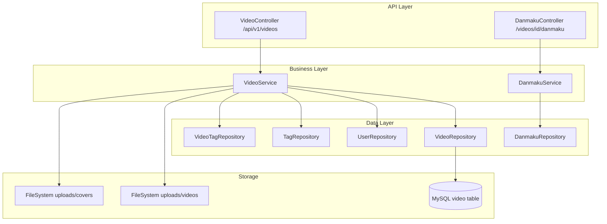
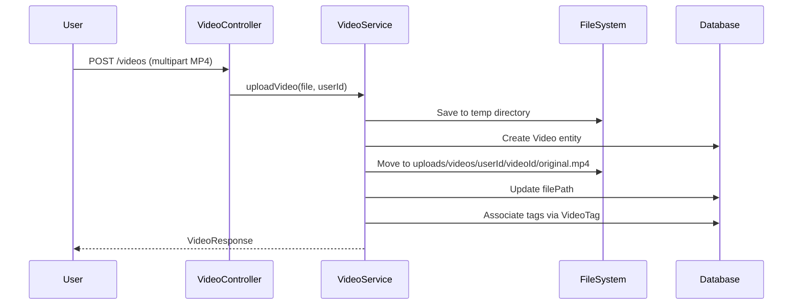

# 微课视频模块

## 模块概述

微课视频模块为 CodingHub 提供短视频教学内容的发布、流式播放、弹幕互动、封面管理和热度排行功能。支持 HTTP Range 流式播放、两阶段文件上传、弹幕实时展示，以及通过 [统一互动](统一互动.md) 实现的点赞/评论/收藏。

## 架构图

## 核心组件

### Video — 视频实体

映射 `video` 表的核心实体：

- `title` / `description` / `filePath` / `fileName` / `fileSize` / `duration`
- `coverUrl` / `uploaderId`
- `status`（NORMAL/DELETED 软删除）
- `viewCount` / `likeCount` / `commentCount` / `score`（BigDecimal）
- `pinned`（Boolean 管理员置顶）

**热度分数公式**：`score = viewCount * 1 + likeCount * 3 + commentCount * 5`

### VideoStatus — 状态枚举

视频生命周期：`NORMAL`（正常）、`DELETED`（已删除）

### VideoService — 视频服务

核心业务逻辑：

- **上传**：两阶段上传（先临时目录，获取 ID 后移动到 `uploads/videos/{userId}/{videoId}/original.mp4`）
- **列表查询**：支持 hot/latest 排序，按 `pinned DESC, score DESC`
- **详情查看**：自动增加浏览量并重算分数，检查用户点赞/收藏状态
- **HTTP Range 流式播放**：使用 `RandomAccessFile` 实现部分内容的 206 响应
- **封面管理**：上传/获取封面图片，存储在 `uploads/covers/`
- **CRUD**：所有权或管理员权限检查

### DanmakuService — 弹幕服务

弹幕（子弹评论）管理：

- **发送弹幕**：内容经 `XssSanitizer` 消毒，支持时间戳、颜色、弹幕类型
- **获取弹幕**：按视频 ID 查询所有弹幕

### Danmaku — 弹幕实体

字段包括 `videoId`、`user`（ManyToOne）、`content`、`timeSeconds`、`color`、`danmakuType`（SCROLL 等）。

## 前端集成

- **类型定义**：`frontend/src/types/video.ts` — VideoListItem、VideoDetail、VideoComment、VideoUploadRequest 等
- **API 服务**：`frontend/src/services/video.ts` — 视频上传/列表/详情/流式播放/点赞/收藏
- **组件**：VideoPlayer、DanmakuPlayer、VideoCard、VideoCoverPicker

## 视频上传流程

## 设计要点

- **两阶段上传**：先存临时目录，获取 DB ID 后移动到最终路径，解决文件路径依赖 ID 的问题
- **HTTP Range 流式播放**：支持视频拖动进度条，无需下载完整文件
- **弹幕 XSS 防护**：弹幕内容经 `XssSanitizer` 消毒
- **软删除**：视频使用 `VideoStatus.DELETED` 而非物理删除
- **热度分数**：与工具市场、论坛社区一致的分数公式

## 交叉引用

- [统一互动](统一互动.md) — 视频的点赞、评论、收藏
- [标签系统](标签系统.md) — 视频标签关联
- [认证与用户](认证与用户.md) — 用户认证和权限
- [基础设施](基础设施.md) — XSS 防护工具

<!-- crosslinks (auto-generated) -->
## Related Modules
- Depends on: [标签系统](标签系统.md), [统一互动](统一互动.md), [认证与用户](认证与用户.md)
