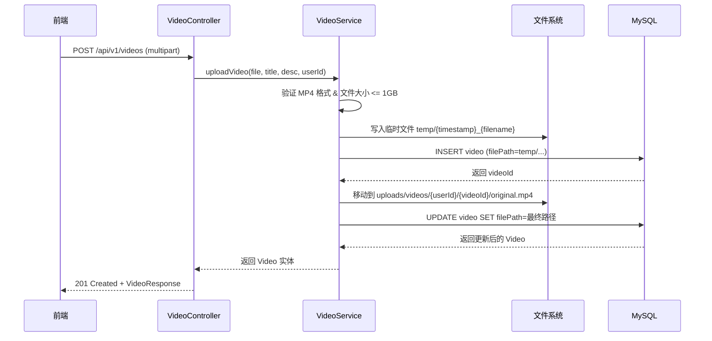
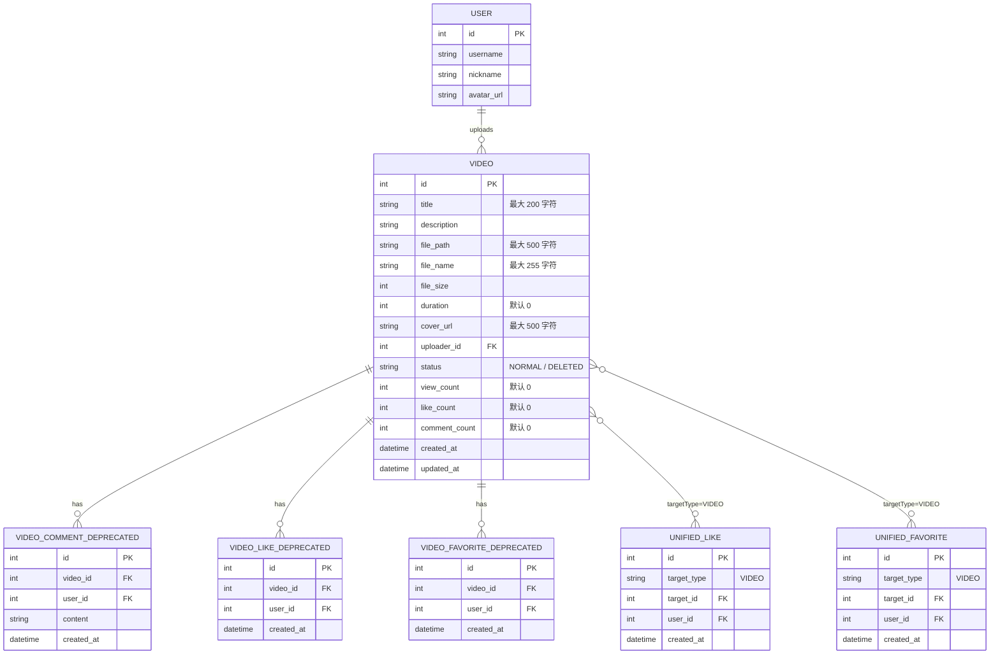

# 微课视频模块

## 1. 模块概述

微课视频模块是 CodingHub 平台的核心功能之一，为用户提供视频上传、在线播放、互动交流（评论、点赞、收藏）等完整的微课视频管理能力。该模块基于 Spring Boot 后端和 Vue 3 前端构建，支持 HTTP Range 流式播放、大文件分片上传（最大 1 GB）、软删除等企业级特性。

### 核心能力

| 能力 | 说明 |
|------|------|
| 视频上传 | 支持 MP4 格式，最大 1 GB，含上传进度回调 |
| 流式播放 | 基于 HTTP Range 协议，使用 `RandomAccessFile` 精确 seek，每次最多传输 1 MB |
| 视频管理 | 支持标题/描述编辑、软删除（`status = DELETED`）、我的视频列表 |
| 互动功能 | 点赞（toggle）、收藏（toggle）、评论（含 XSS 过滤） |
| 分页查询 | 所有列表接口均支持分页，单页最大 100 条 |

### 技术亮点

- **统一互动模型**：点赞与收藏已迁移至 `UnifiedLikeRepository` / `UnifiedFavoriteRepository`，通过 `targetType = "VIDEO"` 与其他模块共享底层表结构；旧的 `VideoLike`、`VideoFavorite`、`VideoComment` 实体及其 Service/Controller 已标记 `@Deprecated`
- **双阶段上传**：文件先写入临时目录 `temp/`，获取 `videoId` 后移动至最终路径 `uploads/videos/{userId}/{videoId}/original.mp4`
- **自动时间戳**：通过 JPA `@PrePersist` / `@PreUpdate` 生命周期回调自动维护 `createdAt` / `updatedAt`

## 2. 架构总览

```mermaid
graph TD
    subgraph 前端 Frontend
        VP[VideoListPage<br/>视频列表页]
        VD[VideoDetailPage<br/>视频详情页]
        VU[VideoUploadPage<br/>上传页]
        VE[VideoEditPage<br/>编辑页]
        MV[MyVideosPage<br/>我的视频]
        MF[MyVideoFavoritesPage<br/>我的收藏]
        VC[VideoCard<br/>视频卡片组件]
        VPL[VideoPlayer<br/>播放器组件]
        ULike[UnifiedLikeButton<br/>统一点赞]
        UFav[UnifiedFavoriteButton<br/>统一收藏]
        UCmt[UnifiedCommentSection<br/>统一评论区]
    end

    subgraph 服务层 Services
        VS[video.ts<br/>视频服务]
    end

    subgraph 后端 Backend
        VCtl[VideoController<br/>/api/v1/videos]
        VICtl[VideoInteractionController<br/>@Deprecated]
        VSvc[VideoService]
        VISvc[VideoInteractionService<br/>@Deprecated]
    end

    subgraph 数据访问 Repository
        VR[VideoRepository]
        ULR[UnifiedLikeRepository]
        UFR[UnifiedFavoriteRepository]
        VCR[VideoCommentRepository<br/>@Deprecated]
        VLR[VideoLikeRepository<br/>@Deprecated]
        VFR[VideoFavoriteRepository<br/>@Deprecated]
    end

    subgraph 数据存储 Storage
        DB[(MySQL<br/>video 表)]
        FS[(文件系统<br/>uploads/videos/)]
    end

    VP --> VC
    VD --> VPL
    VD --> ULike
    VD --> UFav
    VD --> UCmt
    VP --> VS
    VD --> VS
    VU --> VS
    VE --> VS
    MV --> VS
    MF --> VS

    VS --> VCtl
    VS --> VICtl
    VCtl --> VSvc
    VICtl --> VISvc
    VSvc --> VR
    VSvc --> ULR
    VSvc --> UFR
    VISvc --> VCR
    VISvc --> VLR
    VISvc --> VFR

    VR --> DB
    VCR --> DB
    VLR --> DB
    VFR --> DB
    ULR --> DB
    UFR --> DB
    VSvc --> FS
```

## 3. 视频上传与管理（VideoController）

`VideoController` 是微课视频模块的主控制器，映射路径为 `/api/v1/videos`，负责视频的 CRUD 和流式播放。

### 3.1 上传视频

- **接口**：`POST /api/v1/videos`
- **认证**：需要 JWT Token
- **请求格式**：`multipart/form-data`

**参数说明：**

| 参数 | 类型 | 必填 | 说明 |
|------|------|------|------|
| `file` | `MultipartFile` | 是 | MP4 视频文件，最大 1 GB |
| `title` | `String` | 是 | 视频标题，最大 200 字符 |
| `description` | `String` | 否 | 视频描述 |

**上传流程：**



**设计要点：**

1. **双阶段存储**：先写入临时目录获取 `videoId`，再移动至最终路径。解决了 `file_path` 字段 `NOT NULL` 约束与 `videoId` 依赖的矛盾
2. **文件命名**：`{timestamp}_{originalFilename}` 防止重名冲突
3. **最终路径规范**：`uploads/videos/{userId}/{videoId}/original.mp4`

### 3.2 获取视频列表

- **接口**：`GET /api/v1/videos`
- **认证**：无需认证

**参数说明：**

| 参数 | 类型 | 默认值 | 说明 |
|------|------|--------|------|
| `page` | `int` | `0` | 页码（从 0 开始） |
| `size` | `int` | `20` | 每页条数（最大 100） |

返回 `PageResponse<VideoListItem>`，按创建时间降序排列，仅返回 `status = NORMAL` 的视频。每条记录包含上传者用户名、昵称、头像等信息。

### 3.3 获取视频详情

- **接口**：`GET /api/v1/videos/{id}`
- **认证**：可选（未登录用户也可查看，但 `userLiked` / `userFavorited` 为 `false`）

每次访问详情页会自动调用 `video.incrementViewCount()` 增加观看次数。如果用户已登录，还会通过 `UnifiedLikeRepository` 和 `UnifiedFavoriteRepository` 查询用户的点赞和收藏状态。

### 3.4 更新视频信息

- **接口**：`PUT /api/v1/videos/{id}`
- **认证**：需要 JWT Token
- **权限**：`isOwner || isAdmin`（视频上传者或管理员）

**请求体**（JSON）：

```json
{
  "title": "新标题",
  "description": "新描述"
}
```

### 3.5 删除视频

- **接口**：`DELETE /api/v1/videos/{id}`
- **认证**：需要 JWT Token
- **权限**：`isOwner || isAdmin`

采用**软删除**策略，将 `status` 设置为 `VideoStatus.DELETED`，不删除磁盘文件。

### 3.6 获取我的视频

- **接口**：`GET /api/v1/videos/my`
- **认证**：需要 JWT Token

返回当前用户上传的视频列表，支持分页，按创建时间降序排列。

## 4. 视频播放与统计

### 4.1 HTTP Range 流式播放

视频播放通过 `GET /api/v1/videos/{id}/stream` 实现，支持 HTTP Range 协议，浏览器可自由拖拽进度条。

**核心实现逻辑：**

1. 设置 `Content-Type: video/mp4` 和 `Accept-Ranges: bytes`
2. 解析请求头中的 `Range: bytes=start-end`
3. 使用 `RandomAccessFile` 精确 seek 到 `rangeStart` 位置
4. 每次最多传输 1 MB 数据（`rangeEnd = rangeStart + 1MB - 1`）
5. 返回 `206 Partial Content` 状态码及 `Content-Range` 响应头

**响应头示例：**

```
HTTP/1.1 206 Partial Content
Content-Type: video/mp4
Accept-Ranges: bytes
Content-Range: bytes 0-1048575/52428800
Content-Length: 1048576
Cache-Control: no-cache, no-store, must-revalidate
```

**边界处理：**

- `rangeStart >= fileLength`：返回 `416 Requested Range Not Satisfiable`
- `rangeEnd >= fileLength`：自动截断为 `fileLength - 1`
- 无 `Range` 头：返回完整文件（`200 OK`）

### 4.2 统计数据

`Video` 实体维护三个计数字段：

| 字段 | 触发场景 | 实现方式 |
|------|----------|----------|
| `viewCount` | 每次获取视频详情 | `video.incrementViewCount()` |
| `likeCount` | 点赞/取消点赞 | `incrementLikeCount()` / `decrementLikeCount()` |
| `commentCount` | 添加评论 | `video.incrementCommentCount()` |

> **注意**：观看计数的增加没有防重机制，同一用户刷新详情页会重复计数。

## 5. 评论系统

评论功能通过 `VideoInteractionController`（已标记 `@Deprecated`）和 `VideoInteractionService` 实现。

### 5.1 添加评论

- **接口**：`POST /api/v1/videos/{id}/comments`
- **认证**：需要 JWT Token

**请求体：**

```json
{
  "content": "这是一条评论内容"
}
```

**处理流程：**

1. 验证评论内容非空
2. 通过 `XssSanitizer.sanitize()` 过滤 XSS 攻击
3. 创建 `VideoComment` 实体并保存
4. 调用 `video.incrementCommentCount()` 更新视频评论计数
5. 返回评论详情（含用户昵称、头像）

### 5.2 获取评论列表

- **接口**：`GET /api/v1/videos/{id}/comments`
- **认证**：无需认证
- **参数**：`page`（默认 0）、`size`（默认 20，最大 100）

返回 `PageResponse<VideoCommentResponse>`，按创建时间降序排列。每条评论附带用户昵称和头像 URL。

### 5.3 前端评论区集成

前端 `VideoDetailPage` 使用通用组件 `UnifiedCommentSection` 渲染评论列表和输入框，实现与其他模块（工具、论坛）的评论区复用。

## 6. 点赞与收藏

### 6.1 模型迁移

微课模块的点赞和收藏功能经历了一次架构迁移：

| 阶段 | 实体/表 | Repository | 状态 |
|------|---------|------------|------|
| 旧模型 | `VideoLike` / `video_like_deprecated` | `VideoLikeRepository` | `@Deprecated` |
| 旧模型 | `VideoFavorite` / `video_favorite_deprecated` | `VideoFavoriteRepository` | `@Deprecated` |
| 新模型 | 统一 `UnifiedLike` 表 | `UnifiedLikeRepository` | 当前使用 |
| 新模型 | 统一 `UnifiedFavorite` 表 | `UnifiedFavoriteRepository` | 当前使用 |

新模型通过 `targetType = "VIDEO"` + `targetId = videoId` 区分微课视频与其他内容类型（工具、帖子），实现跨模块的统一互动。

### 6.2 点赞（Toggle 模式）

- **接口**：`POST /api/v1/videos/{id}/like`
- **认证**：需要 JWT Token

采用 Toggle 设计——同一接口实现点赞和取消点赞：

```
首次调用 → 添加点赞记录，likeCount++
再次调用 → 删除点赞记录，likeCount--
```

返回 `VideoInteractionResponse`，包含 `liked`（当前状态）和 `likeCount`（最新计数）。

### 6.3 收藏（Toggle 模式）

- **接口**：`POST /api/v1/videos/{id}/favorite`
- **认证**：需要 JWT Token

与点赞类似，采用 Toggle 模式切换收藏状态。

### 6.4 我的收藏列表

- **接口**：`GET /api/v1/videos/my/favorites`
- **认证**：需要 JWT Token
- **参数**：`page`（默认 0）、`size`（默认 20）

返回当前用户收藏的视频列表（`PageResponse<VideoListItem>`），自动过滤已删除的视频。

### 6.5 前端集成

前端 `VideoDetailPage` 使用通用组件 `UnifiedLikeButton` 和 `UnifiedFavoriteButton`，通过 `targetType = "VIDEO"` 调用统一互动 API，实现与工具模块、论坛模块的组件复用。

## 7. 视频存储配置

`VideoStorageConfig` 是视频存储的配置类，负责初始化和提供视频文件存储路径。

### 7.1 配置参数

| 参数 | 来源 | 默认值 | 说明 |
|------|------|--------|------|
| `app.upload.base-dir` | `application.properties` | `~/aifiles` | 上传根目录 |

### 7.2 目录结构

```
{uploadBaseDir}/                 # 默认 ~/aifiles
└── uploads/
    └── videos/                  # 视频存储根目录
        ├── temp/                # 上传临时目录
        │   └── {timestamp}_{filename}
        └── {userId}/            # 按用户分组
            └── {videoId}/       # 按视频分组
                └── original.mp4 # 原始视频文件
```

### 7.3 初始化流程

`@PostConstruct init()` 方法在 Spring 容器启动时执行：

1. 检查 `app.upload.base-dir` 配置，未配置则使用 `~/aifiles`
2. 计算视频存储路径：`{uploadBaseDir}/uploads/videos`
3. 如果目录不存在，自动创建
4. 创建失败则抛出 `RuntimeException` 阻止应用启动

## 8. 数据模型关系



### 索引设计

`video` 表包含两个复合索引：

| 索引名 | 列 | 用途 |
|--------|------|------|
| `idx_video_uploader` | `uploader_id, status` | 加速「我的视频」查询 |
| `idx_video_status_created` | `status, created_at DESC` | 加速视频列表按时间排序 |

### 唯一约束

| 表 | 约束名 | 列 |
|------|---------|------|
| `video_like_deprecated` | `uk_video_like` | `(video_id, user_id)` |
| `video_favorite_deprecated` | `uk_video_favorite` | `(video_id, user_id)` |

## 9. API 端点汇总

### 9.1 视频管理（VideoController）

| 方法 | 路径 | 认证 | 说明 |
|------|------|------|------|
| `POST` | `/api/v1/videos` | 需要 | 上传视频（multipart/form-data） |
| `GET` | `/api/v1/videos` | 不需要 | 获取视频列表（分页） |
| `GET` | `/api/v1/videos/{id}` | 可选 | 获取视频详情（自动增加观看数） |
| `PUT` | `/api/v1/videos/{id}` | 需要 | 更新视频信息（owner/admin） |
| `DELETE` | `/api/v1/videos/{id}` | 需要 | 删除视频（软删除，owner/admin） |
| `GET` | `/api/v1/videos/{id}/stream` | 不需要 | 流式播放（HTTP Range） |
| `GET` | `/api/v1/videos/my` | 需要 | 获取我上传的视频（分页） |

### 9.2 互动功能（VideoInteractionController - @Deprecated）

| 方法 | 路径 | 认证 | 说明 |
|------|------|------|------|
| `POST` | `/api/v1/videos/{id}/like` | 需要 | 切换点赞状态 |
| `POST` | `/api/v1/videos/{id}/favorite` | 需要 | 切换收藏状态 |
| `GET` | `/api/v1/videos/{id}/comments` | 不需要 | 获取评论列表（分页） |
| `POST` | `/api/v1/videos/{id}/comments` | 需要 | 添加评论 |
| `GET` | `/api/v1/videos/my/favorites` | 需要 | 获取我的收藏列表（分页） |

### 9.3 DTO 规格

**VideoResponse**（详情响应）：

| 字段 | 类型 | 说明 |
|------|------|------|
| `id` | `Long` | 视频 ID |
| `title` | `String` | 标题 |
| `description` | `String` | 描述 |
| `coverUrl` | `String` | 封面 URL |
| `duration` | `Integer` | 时长（秒） |
| `fileSize` | `Long` | 文件大小（字节） |
| `viewCount` | `Integer` | 观看次数 |
| `likeCount` | `Integer` | 点赞数 |
| `commentCount` | `Integer` | 评论数 |
| `uploaderId` | `Long` | 上传者 ID |
| `uploaderName` | `String` | 上传者用户名 |
| `uploaderNickname` | `String` | 上传者昵称 |
| `uploaderAvatarUrl` | `String` | 上传者头像 |
| `userLiked` | `Boolean` | 当前用户是否已点赞 |
| `userFavorited` | `Boolean` | 当前用户是否已收藏 |
| `createdAt` | `LocalDateTime` | 创建时间 |
| `updatedAt` | `LocalDateTime` | 更新时间 |

**VideoListItem**（列表项）：

`VideoResponse` 的精简版，不含 `description`、`fileSize`、`userLiked`、`userFavorited`、`updatedAt`。

**VideoInteractionResponse**（互动响应）：

| 字段 | 类型 | 说明 |
|------|------|------|
| `liked` | `Boolean` | 当前点赞状态 |
| `favorited` | `Boolean` | 当前收藏状态 |
| `likeCount` | `Integer` | 最新点赞数 |
| `commentCount` | `Integer` | 最新评论数 |

## 10. 前端组件集成

### 10.1 页面结构

| 页面 | 路由 | 组件 | 说明 |
|------|------|------|------|
| 视频列表 | `/videos` | `VideoListPage.vue` | 展示所有视频，支持无限滚动加载 |
| 视频详情 | `/videos/:id` | `VideoDetailPage.vue` | 播放器 + 互动按钮 + 评论区 |
| 上传视频 | `/videos/upload` | `VideoUploadPage.vue` | 拖拽上传 + 进度条 |
| 编辑视频 | `/videos/:id/edit` | `VideoEditPage.vue` | 编辑标题和描述 |
| 我的视频 | `/videos/my-videos` | `MyVideosPage.vue` | 当前用户的视频列表 |
| 我的收藏 | `/videos/my-favorites` | `MyVideoFavoritesPage.vue` | 当前用户收藏的视频 |

### 10.2 核心组件

#### VideoCard

视频卡片组件，用于列表页的网格展示。支持以下 Props：

| Prop | 类型 | 默认值 | 说明 |
|------|------|--------|------|
| `video` | `VideoListItem` | - | 视频数据 |
| `editable` | `boolean` | `false` | 是否显示编辑按钮 |
| `deletable` | `boolean` | `false` | 是否显示删除按钮 |

功能特性：

- 展示封面图、标题、时长、播放量、点赞数、评论数
- 显示上传者头像和昵称
- 支持相对时间显示（如「3 天前」）
- 数值格式化（如 `1.2k`、`3.5M`）

#### VideoPlayer

视频播放器组件，封装 HTML5 `<video>` 标签。支持以下 Props：

| Prop | 类型 | 说明 |
|------|------|------|
| `src` | `string` | 视频流 URL |
| `title` | `string` | 视频标题 |

功能特性：

- 自动重试机制：最多 3 次重试，延迟递增（1s → 3s → 5s）
- 错误分类处理：区分网络异常、解码失败、格式不支持等错误
- 加载状态指示：显示加载动画和错误提示
- 组件销毁时自动清理定时器

### 10.3 前端服务层

`video.ts` 服务封装了所有视频相关的 API 调用：

| 方法 | HTTP 请求 | 说明 |
|------|-----------|------|
| `uploadVideo(file, title, desc?, onProgress?)` | `POST /videos` | 上传视频，超时 10 分钟，支持进度回调 |
| `getVideoList(page?, size?)` | `GET /videos` | 获取视频列表 |
| `getVideoDetail(id)` | `GET /videos/{id}` | 获取视频详情 |
| `getStreamUrl(id)` | - | 返回流播放 URL（非 API 调用） |
| `updateVideo(id, data)` | `PUT /videos/{id}` | 更新视频信息 |
| `deleteVideo(id)` | `DELETE /videos/{id}` | 删除视频 |
| `getMyVideos(page?, size?)` | `GET /videos/my` | 获取我的视频 |
| `toggleLike(id)` | `POST /videos/{id}/like` | 切换点赞状态 |
| `toggleFavorite(id)` | `POST /videos/{id}/favorite` | 切换收藏状态 |
| `getComments(id, page?, size?)` | `GET /videos/{id}/comments` | 获取评论列表 |
| `addComment(id, content)` | `POST /videos/{id}/comments` | 添加评论 |
| `getMyFavorites(page?, size?)` | `GET /videos/my/favorites` | 获取我的收藏 |

### 10.4 TypeScript 类型定义

前端在 `types/video.ts` 中定义了完整的类型系统，与后端 DTO 一一对应：

| 前端类型 | 对应后端 DTO | 说明 |
|----------|--------------|------|
| `VideoListItem` | `VideoListItem` | 列表项 |
| `VideoDetail` | `VideoResponse` | 详情（含 `userLiked` / `userFavorited`） |
| `VideoComment` | `VideoCommentResponse` | 评论 |
| `VideoUploadRequest` | `VideoUploadRequest` | 上传请求 |
| `VideoUpdateRequest` | `VideoUpdateRequest` | 更新请求 |
| `VideoInteractionResponse` | `VideoInteractionResponse` | 互动响应 |
| `VideoPageResponse` | `PageResponse<VideoListItem>` | 分页响应 |