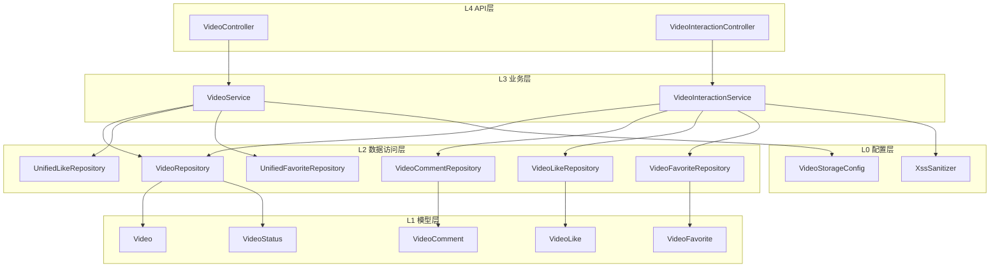
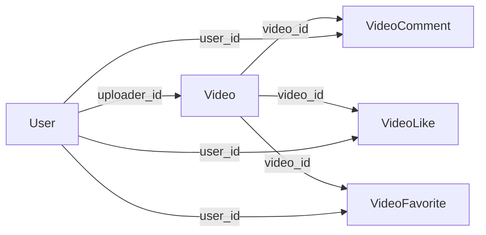
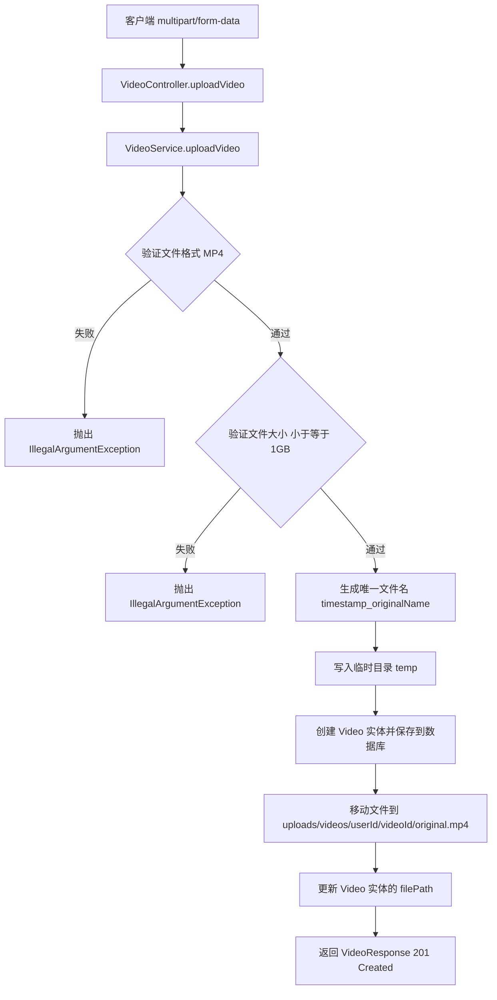
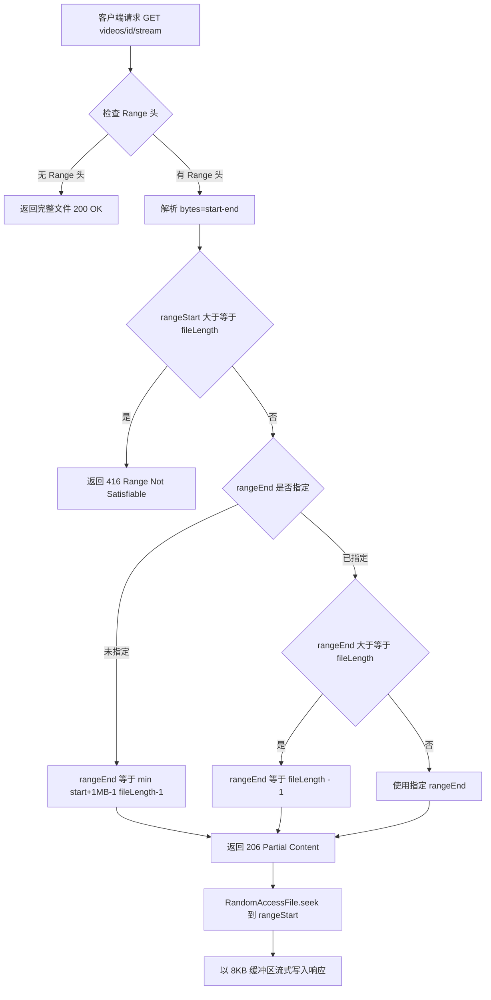

# 微课视频模块

## 1. 模块简介

微课视频模块是 CodingHub 平台的核心内容模块之一，提供视频上传、流式播放、信息管理和用户互动等完整功能。该模块围绕“视频”这一核心实体，构建了从上传到播放、从浏览到互动的完整用户体验闭环。

### 核心功能清单

| 功能 | 说明 | 接口前缀 |
|------|------|----------|
| 视频上传 | 支持 MP4 格式，最大 1GB，带进度条 | `POST /api/v1/videos` |
| 视频列表 | 分页展示所有正常状态视频 | `GET /api/v1/videos` |
| 视频详情 | 自动递增观看次数，返回点赞/收藏状态 | `GET /api/v1/videos/{id}` |
| 流式播放 | 支持 HTTP Range 请求，按需加载 | `GET /api/v1/videos/{id}/stream` |
| 视频管理 | 更新标题/描述，软删除 | `PUT/DELETE /api/v1/videos/{id}` |
| 我的视频 | 当前用户上传的视频列表 | `GET /api/v1/videos/my` |
| 点赞/收藏 | Toggle 模式切换状态（已标记 @Deprecated，迁移至统一互动） | `POST /api/v1/videos/{id}/like|favorite` |
| 评论 | 添加评论、分页获取评论列表 | `GET/POST /api/v1/videos/{id}/comments` |
| 我的收藏 | 当前用户收藏的视频列表 | `GET /api/v1/videos/my/favorites` |

## 2. 架构概览

### 2.1 分层架构



> **注意**：`VideoInteractionController` 和 `VideoInteractionService` 已标记为 `@Deprecated`，点赞/收藏功能正在向统一互动体系（`UnifiedLikeRepository` / `UnifiedFavoriteRepository`）迁移。`VideoService.getVideoDetail()` 已使用统一仓储查询用户点赞和收藏状态。

### 2.2 数据库实体关系



### 2.3 核心实体字段

**Video 实体**（表名：`video`）

| 字段 | 类型 | 约束 | 说明 |
|------|------|------|------|
| id | Long | PK, AUTO_INCREMENT | 主键 |
| title | String(200) | NOT NULL | 视频标题 |
| description | TEXT | 可空 | 视频描述 |
| filePath | String(500) | NOT NULL | 文件存储相对路径 |
| fileName | String(255) | NOT NULL | 原始文件名 |
| fileSize | Long | NOT NULL | 文件大小（字节） |
| duration | Integer | 默认 0 | 视频时长（秒） |
| coverUrl | String(500) | 可空 | 封面图 URL |
| uploaderId | Long | NOT NULL | 上传者用户 ID |
| status | VideoStatus | NOT NULL, 默认 NORMAL | 状态枚举（NORMAL/DELETED） |
| viewCount | Integer | 默认 0 | 观看次数 |
| likeCount | Integer | 默认 0 | 点赞数（冗余计数） |
| commentCount | Integer | 默认 0 | 评论数（冗余计数） |
| createdAt | LocalDateTime | NOT NULL, 不可更新 | 创建时间 |
| updatedAt | LocalDateTime | NOT NULL | 更新时间 |

**数据库索引**：
- `idx_video_uploader`：`(uploader_id, status)` — 加速“我的视频”查询
- `idx_video_status_created`：`(status, created_at DESC)` — 加速视频列表排序查询

**计数方法**：实体提供 `incrementViewCount()`、`incrementLikeCount()`、`decrementLikeCount()`、`incrementCommentCount()` 方法直接在内存中操作，避免循环内数据库请求。

## 3. 视频上传流程

视频上传采用**两阶段存储**策略：先写入临时目录获取数据库 ID，再移动到以 `{userId}/{videoId}` 组织的最终目录。



**关键设计要点**：

- **格式限制**：仅接受 `.mp4` 后缀文件
- **大小限制**：单文件不超过 1GB（`1073741824` 字节）
- **文件命名**：`{timestamp}_{originalFilename}` 避免冲突
- **存储路径**：`{uploadBaseDir}/uploads/videos/{userId}/{videoId}/original.mp4`
- **前端超时**：前端上传请求设置 10 分钟超时（`timeout: 600000`），并支持进度回调

## 4. 视频流式播放（HTTP Range 请求）

视频播放通过 `GET /api/v1/videos/{id}/stream` 接口实现，支持 HTTP Range 请求以提供边下边播和拖动进度条的能力。

### 4.1 处理流程



### 4.2 技术实现细节

| 项目 | 实现方式 |
|------|----------|
| 文件定位 | `RandomAccessFile.seek()` 精确跳转到起始字节 |
| 缓冲区 | 8KB（`byte[8192]`）逐块读取 |
| 单次默认大小 | 最多 1MB（当客户端未指定 rangeEnd） |
| Content-Type | `video/mp4` |
| Cache-Control | `no-cache, no-store, must-revalidate` |
| Accept-Ranges | `bytes` |

**响应头示例**（206 Partial Content）：
```
Content-Type: video/mp4
Accept-Ranges: bytes
Content-Range: bytes 0-1048575/52428800
Content-Length: 1048576
Cache-Control: no-cache, no-store, must-revalidate
```

### 4.3 前端播放

前端 `videoService.getStreamUrl(id)` 返回流地址字符串 `/api/v1/videos/{id}/stream`，供 HTML5 `<video>` 标签直接使用。浏览器原生支持 Range 请求的断点续传和拖动播放。

## 5. 视频互动功能

### 5.1 点赞（Toggle 模式）

- **接口**：`POST /api/v1/videos/{id}/like`
- **行为**：已点赞则取消（`decrementLikeCount`），未点赞则添加（`incrementLikeCount`）
- **唯一约束**：`uk_video_like (video_id, user_id)` 防止重复点赞
- **迁移状态**：`VideoLike` 实体映射到 `video_like_deprecated` 表，新逻辑使用 `UnifiedLikeRepository`（targetType = "VIDEO"）

### 5.2 收藏（Toggle 模式）

- **接口**：`POST /api/v1/videos/{id}/favorite`
- **行为**：已收藏则取消，未收藏则添加
- **唯一约束**：`uk_video_favorite (video_id, user_id)`
- **迁移状态**：`VideoFavorite` 实体映射到 `video_favorite_deprecated` 表，新逻辑使用 `UnifiedFavoriteRepository`（targetType = "VIDEO"）

### 5.3 评论

- **添加评论**：`POST /api/v1/videos/{id}/comments`
  - 内容经 `XssSanitizer.sanitize()` 过滤，防止 XSS 攻击
  - 自动递增视频实体的 `commentCount` 冗余计数
- **获取评论列表**：`GET /api/v1/videos/{id}/comments?page=0&size=20`
  - 按创建时间倒序分页返回
  - 每条评论附带用户昵称和头像 URL
- **数据库索引**：`idx_video_comment_video (video_id, created_at DESC)`

### 5.4 互动响应结构

`VideoInteractionResponse` 包含以下字段：

| 字段 | 类型 | 说明 |
|------|------|------|
| liked | boolean | 当前点赞状态 |
| favorited | boolean | 当前收藏状态 |
| likeCount | int | 最新点赞总数 |
| commentCount | int | 最新评论总数 |

## 6. 视频存储配置

### 6.1 VideoStorageConfig

| 配置项 | 来源 | 默认值 | 说明 |
|--------|------|--------|------|
| uploadBaseDir | `app.upload.base-dir` | `~/aifiles` | 上传文件根目录 |
| videoStoragePath | 自动计算 | `{uploadBaseDir}/uploads/videos` | 视频存储目录 |

### 6.2 初始化逻辑

1. 读取 `app.upload.base-dir` 配置，若为空则使用 `~/aifiles`
2. 计算视频存储路径：`{uploadBaseDir}/uploads/videos`
3. 若目录不存在，自动创建（`Files.createDirectories`）
4. 创建失败则抛出 `RuntimeException`，阻止应用启动

### 6.3 文件目录结构

```
{uploadBaseDir}/
└── uploads/
    └── videos/
        ├── temp/                          # 上传临时目录
        │   └── 1234567890_sample.mp4
        ├── {userId}/
        │   └── {videoId}/
        │       └── original.mp4           # 最终存储路径
        └── ...
```

## 7. 软删除机制

### 7.1 VideoStatus 枚举

```java
public enum VideoStatus {
    NORMAL,    // 正常状态
    DELETED    // 已删除状态
}
```

### 7.2 软删除规则

- **删除操作**：将 `status` 从 `NORMAL` 改为 `DELETED`，不物理删除数据库记录和磁盘文件
- **权限控制**：仅视频上传者（`isOwner`）或管理员（`ADMIN` / `SUPER_ADMIN`）可执行删除
- **查询过滤**：所有查询方法均通过 `findByIdAndStatus(id, VideoStatus.NORMAL)` 或 `findByStatusOrderByCreatedAtDesc(VideoStatus.NORMAL, ...)` 排除已删除视频
- **详情访问**：已删除视频返回 `ResourceNotFoundException`
- **流式播放**：已删除视频无法获取文件路径，返回 404

### 7.3 统一查询模式

仓储层的所有查询方法都内置了状态过滤：

| 方法 | 用途 |
|------|------|
| `findByStatusOrderByCreatedAtDesc(status, pageable)` | 视频列表分页 |
| `findByUploaderIdAndStatusOrderByCreatedAtDesc(uploaderId, status, pageable)` | 我的视频列表 |
| `findByIdAndStatus(id, status)` | 单条视频查询 |
| `findTop20ByStatusOrderByViewCountDesc(status)` | 热门视频排行 |

## 8. 前端服务层

### 8.1 类型定义（types/video.ts）

| 接口 | 用途 |
|------|------|
| `VideoListItem` | 视频列表项（卡片展示），含播放量、点赞数、上传者信息 |
| `VideoDetail` | 视频详情（含 userLiked / userFavorited 状态） |
| `VideoComment` | 评论项（含用户昵称和头像） |
| `VideoUpdateRequest` | 更新请求（title, description） |
| `VideoInteractionResponse` | 互动操作响应（liked, favorited, likeCount, commentCount） |
| `VideoPageResponse` | 分页列表响应（content, totalElements, totalPages, page, size） |

### 8.2 服务方法（services/video.ts）

`videoService` 对象封装了所有视频相关的 API 调用：

| 方法 | HTTP 方法 | 端点 | 说明 |
|------|-----------|------|------|
| `uploadVideo(file, title, desc?, onProgress?)` | POST | `/videos` | 上传视频，支持进度回调，超时 10 分钟 |
| `getVideoList(page, size)` | GET | `/videos` | 获取视频列表 |
| `getVideoDetail(id)` | GET | `/videos/{id}` | 获取视频详情 |
| `getStreamUrl(id)` | - | - | 返回流播放 URL 字符串 |
| `updateVideo(id, data)` | PUT | `/videos/{id}` | 更新视频信息 |
| `deleteVideo(id)` | DELETE | `/videos/{id}` | 软删除视频 |
| `getMyVideos(page, size)` | GET | `/videos/my` | 我的视频列表 |
| `toggleLike(id)` | POST | `/videos/{id}/like` | 切换点赞 |
| `toggleFavorite(id)` | POST | `/videos/{id}/favorite` | 切换收藏 |
| `getComments(id, page, size)` | GET | `/videos/{id}/comments` | 获取评论列表 |
| `addComment(id, content)` | POST | `/videos/{id}/comments` | 添加评论 |
| `getMyFavorites(page, size)` | GET | `/videos/my/favorites` | 我的收藏列表 |

### 8.3 前端上传进度

上传使用 Axios 的 `onUploadProgress` 事件追踪上传进度：

```typescript
onUploadProgress: (progressEvent: AxiosProgressEvent) => {
  if (progressEvent.total && onProgress) {
    const percent = Math.round((progressEvent.loaded * 100) / progressEvent.total)
    onProgress(percent)
  }
}
```

### 8.4 页面与组件

| 页面/组件 | 路径 | 说明 |
|-----------|------|------|
| `VideoListPage` | `pages/video/VideoListPage.vue` | 视频列表页，分页展示所有视频 |
| `VideoDetailPage` | `pages/video/VideoDetailPage.vue` | 视频详情页，含播放器和评论区 |
| `VideoUploadPage` | `pages/video/VideoUploadPage.vue` | 视频上传页，含进度条 |
| `MyVideosPage` | `pages/video/MyVideosPage.vue` | 我的视频管理页 |
| `VideoEditPage` | `pages/video/VideoEditPage.vue` | 视频编辑页（标题、描述） |
| `MyVideoFavoritesPage` | `pages/video/MyVideoFavoritesPage.vue` | 我收藏的视频列表 |
| `VideoCard` | `components/video/VideoCard.vue` | 视频卡片组件，用于列表展示 |
| `VideoPlayer` | `components/video/VideoPlayer.vue` | 视频播放器组件，支持流式播放 |

## 9. API 接口汇总

| HTTP 方法 | 路径 | 认证 | 说明 |
|-----------|------|------|------|
| POST | `/api/v1/videos` | 必须 | 上传视频（multipart/form-data） |
| GET | `/api/v1/videos` | 可选 | 获取视频列表（分页） |
| GET | `/api/v1/videos/{id}` | 可选 | 获取视频详情（自动增加观看次数） |
| GET | `/api/v1/videos/{id}/stream` | 无 | 流式播放视频 |
| PUT | `/api/v1/videos/{id}` | 必须 | 更新视频信息 |
| DELETE | `/api/v1/videos/{id}` | 必须 | 软删除视频 |
| GET | `/api/v1/videos/my` | 必须 | 获取我上传的视频 |
| POST | `/api/v1/videos/{id}/like` | 必须 | 切换点赞状态（@Deprecated） |
| POST | `/api/v1/videos/{id}/favorite` | 必须 | 切换收藏状态（@Deprecated） |
| GET | `/api/v1/videos/{id}/comments` | 可选 | 获取评论列表（分页） |
| POST | `/api/v1/videos/{id}/comments` | 必须 | 添加评论 |
| GET | `/api/v1/videos/my/favorites` | 必须 | 获取我的收藏列表 |

## 10. 交叉引用

- **[认证与用户](认证与用户.md)**：视频上传、更新、删除均依赖 JWT 认证和 `@AuthenticationPrincipal User` 获取当前用户；权限校验使用 `Role.ADMIN` / `Role.SUPER_ADMIN` 判断管理员身份；视频详情和列表项中包含上传者信息（用户名、昵称、头像），通过 `UserRepository` 查询
- **[统一互动](统一互动.md)**：`VideoService.getVideoDetail()` 已通过 `UnifiedLikeRepository` 和 `UnifiedFavoriteRepository` 查询用户的点赞/收藏状态（targetType = "VIDEO"）；旧的 `VideoInteractionController` / `VideoInteractionService` 及相关实体（`VideoLike`、`VideoFavorite`、`VideoComment`）均已标记 `@Deprecated`，数据库表名带 `_deprecated` 后缀，后续将完全迁移至统一互动体系
