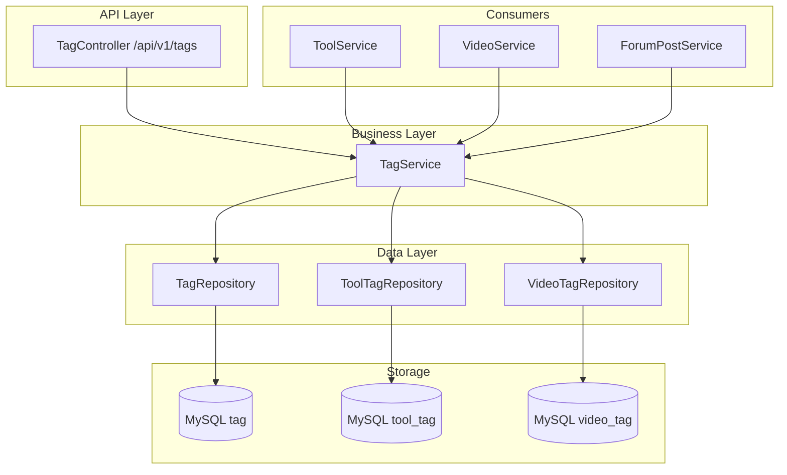
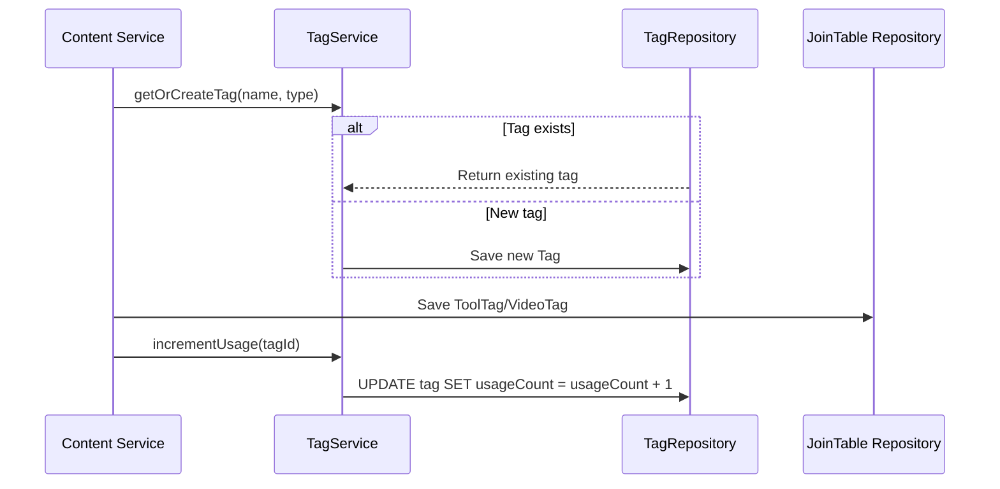

# 标签系统模块

## 模块概述

标签系统是 CodingHub 的跨内容类型标签基础设施，为工具、视频、论坛帖子提供统一的标签创建、关联、查询和热度排行能力。通过 `TagType` 枚举区分标签类型，单一 Tag 表服务多个内容域。

## 架构图

## 核心组件

### Tag — 标签实体

映射 `tag` 表：

- `name` / `tagType`（TagType 枚举）
- `usageCount`（使用计数，自动维护）
- 唯一约束：`(name, tag_type)`

### TagType — 标签类型枚举

区分标签所属内容域：`TOOL`、`VIDEO`、`FORUM` 等。

### ToolTag / VideoTag — 关联实体

多对多关联表：

- `ToolTag`：`toolId` + `tagId` 关联工具和标签
- `VideoTag`：`videoId` + `tagId` 关联视频和标签

### TagService — 标签服务

核心业务逻辑：

- `createTag()` — 查找或创建（幂等：名称+类型匹配则返回已有标签）
- `getOrCreateTag()` — 内部使用的查找或创建模式
- `incrementUsage()` / `decrementUsage()` — 内容关联/解除时维护使用计数
- `getHotTags()` — 按使用计数返回热门标签 Top N
- `getTagsByType()` — 按类型查询标签列表

### TagController — 标签控制器

REST 端点 `/api/v1/tags`：

- `GET /` — 按类型查询标签列表
- `GET /hot` — 热门标签
- `POST /` — 创建标签（幂等）

## 前端集成

- **组件**：`TagBadge`（展示单个标签）、`TagSelector`（标签选择器）
- **类型**：Tag 类型定义在 `frontend/src/types/index.ts`

## 标签关联流程

## 设计要点

- **幂等创建**：`findOrCreate` 模式，名称+类型匹配则返回已有标签
- **使用计数**：自动维护 `usageCount`，支撑热度排行
- **单一 Tag 表**：通过 `TagType` 枚举区分，避免每种内容类型单独建表
- **关联表分离**：`ToolTag` 和 `VideoTag` 分别管理不同内容类型的关联
- **计数同步**：内容更新时旧标签递减、新标签递增，确保计数准确

## 交叉引用

- [工具市场](工具市场.md) — 工具标签关联
- [微课视频](微课视频.md) — 视频标签关联
- [论坛社区](论坛社区.md) — 帖子标签关联

<!-- crosslinks (auto-generated) -->
## Related Modules
- Used by: [工具市场](工具市场.md), [微课视频](微课视频.md), [论坛社区](论坛社区.md)
