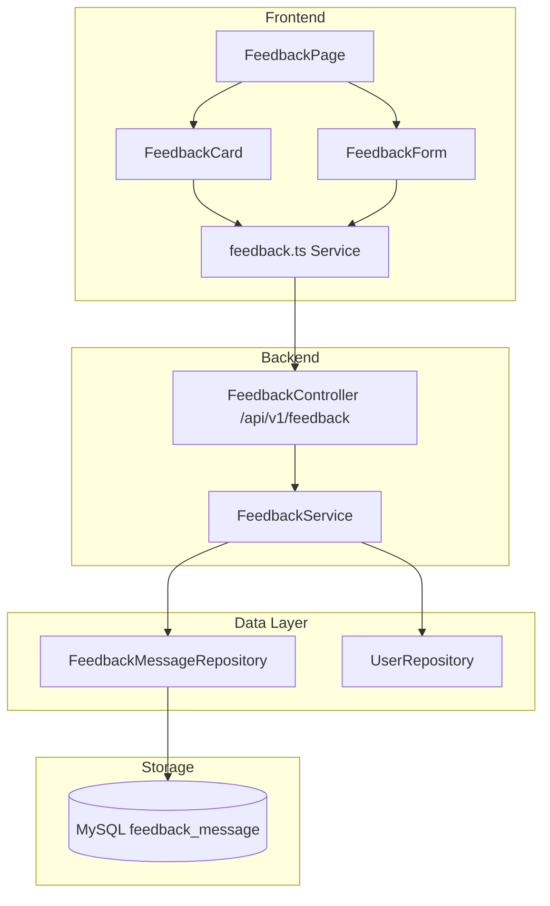
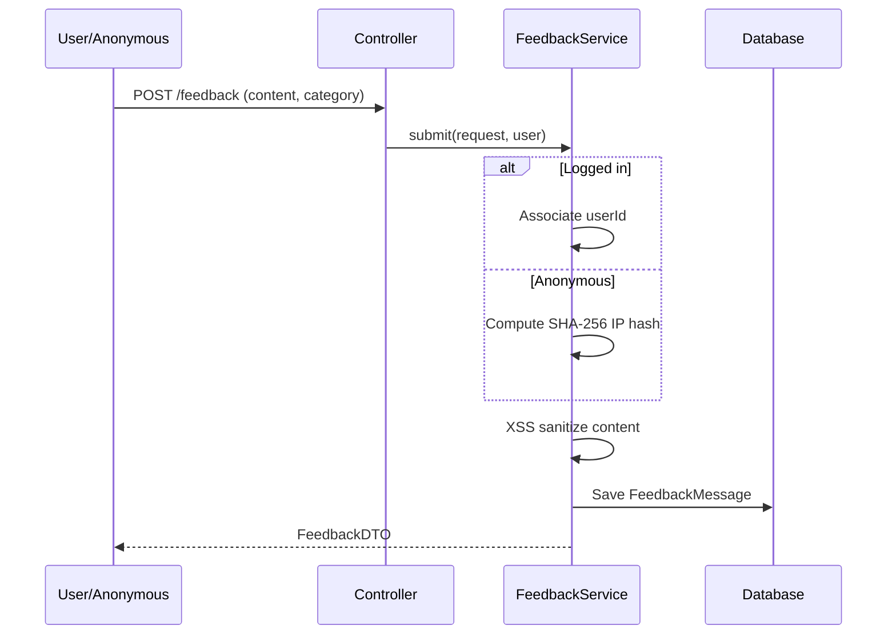

# 留言反馈模块

## 模块概述

留言反馈模块为 CodingHub 提供用户留言板功能，支持匿名和已登录用户提交反馈，管理员可以回复和删除留言。反馈按分类（建议、Bug、功能请求等）组织，内容经过 XSS 消毒处理。

## 架构图

## 核心组件

### FeedbackMessage — 留言实体

映射 `feedback_message` 表：

- `content`（TEXT）/ `nickname` / `contact`
- `category`（FeedbackCategory 枚举，默认 SUGGESTION）
- `user`（ManyToOne，可空 — 支持匿名）
- `ipHash`（SHA-256 IP 哈希 — 匿名用户标识）
- `status`（NORMAL/DELETED 软删除）
- `adminReply`（TEXT，管理员回复）
- `repliedBy`（ManyToOne User）/ `repliedAt`

### FeedbackCategory — 分类枚举

反馈分类类型，包括 SUGGESTION（建议）、BUG（缺陷报告）、FEATURE（功能请求）等。

### FeedbackService — 留言服务

核心业务逻辑：

- **提交**：双模式身份 — 已登录用户关联 `userId`，匿名用户记录 SHA-256 IP 哈希。内容经 XSS 消毒
- **回复**：管理员设置 `adminReply`、`repliedBy`、`repliedAt`
- **列表**：分页查询，支持分类过滤
- **删除**：管理员软删除

### FeedbackController — 留言控制器

REST 端点 `/api/v1/feedback`：

- `GET /` — 分页列表，可选分类过滤
- `POST /` — 提交反馈（支持匿名和登录用户）
- `PUT /{id}/reply` — 管理员回复（仅 ADMIN/SUPER_ADMIN）
- `DELETE /{id}` — 管理员删除（仅 ADMIN/SUPER_ADMIN）

## 前端集成

- **类型定义**：`frontend/src/types/feedback.ts` — FeedbackMessage、FeedbackCreateRequest、FeedbackReplyRequest、FeedbackPageResponse
- **API 服务**：`frontend/src/services/feedback.ts` — 留言 CRUD
- **组件**：FeedbackCard（展示留言和回复）、FeedbackForm（提交留言）
- **页面**：FeedbackPage

## 留言提交流程

## 设计要点

- **双模式身份**：已登录用户关联 `userId`，匿名用户通过 SHA-256 IP 哈希标识，与 [统一互动](统一互动.md) 的匿名点赞使用相同模式
- **XSS 防护**：所有用户输入经 `XssSanitizer.sanitize()` 消毒
- **分类安全回退**：无效分类值回退到 SUGGESTION
- **管理员专属操作**：回复和删除仅管理员可执行
- **软删除**：使用 `status = DELETED` 而非物理删除

## 交叉引用

- [认证与用户](认证与用户.md) — 用户身份和权限
- [基础设施](基础设施.md) — XSS 消毒工具

<!-- crosslinks (auto-generated) -->
## Related Modules
- Depends on: [认证与用户](认证与用户.md)
