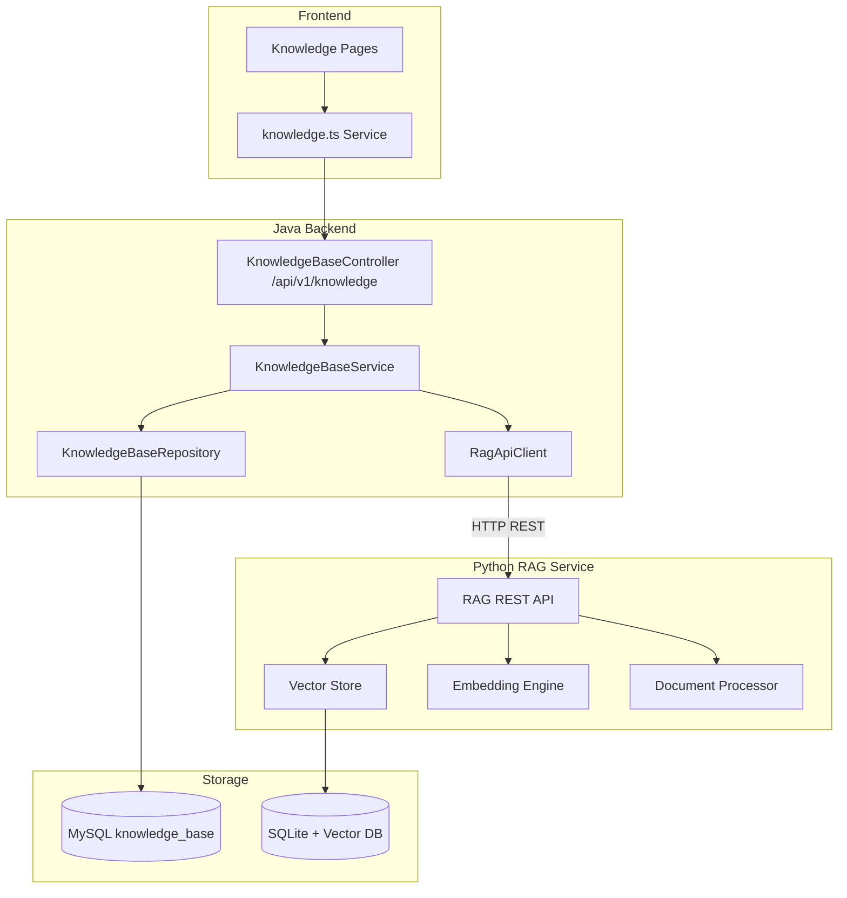
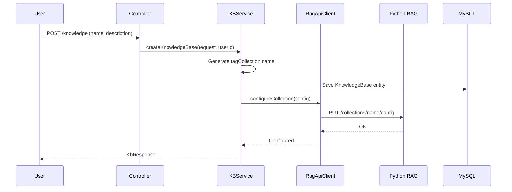

# 知识库模块

## 模块概述

知识库模块为 CodingHub 提供 RAG（检索增强生成）能力的用户侧接口，用户可以创建和管理个人知识库，上传文档，并通过语义搜索检索知识。Java 后端作为 BFF（Backend-for-Frontend）代理 [RAG服务](RAG服务.md)（Python），对前端隐藏底层向量化服务细节。

## 架构图

## 核心组件

### KnowledgeBase — 知识库实体

映射 `knowledge_base` 表：

- `name`（唯一，NORMAL 状态下）/ `description` / `ownerId`
- `ragCollection`（ASCII 安全的集合名，格式 `kb-{name}-{id}`）
- `status`（NORMAL/DELETED 软删除）

### KbStatus — 状态枚举

知识库生命周期：`NORMAL`（正常）、`DELETED`（已删除）

### KnowledgeBaseService — 知识库服务

核心业务逻辑：

- **创建**：生成 ASCII 安全的 `ragCollection` 名称，保存到 MySQL，然后调用 `RagApiClient.configureCollection()` 配置分块策略和重排参数
- **搜索**：代理到 `RagApiClient.search()`，支持 `topK`、`rerank`、`expandContext` 参数
- **删除**：MySQL 软删除 + 尽力删除 RAG 集合（RAG 删除失败不阻断主事务）
- **权限**：所有者或管理员检查

### RagApiClient — RAG API 客户端

Java `HttpClient` 封装，与 Python RAG 服务通信：

- `configureCollection()` — PUT 配置集合的分块模式和参数
- `search()` — POST 语义搜索
- `deleteCollection()` — DELETE 删除集合
- `getDocumentStatus()` — GET 查询文档处理状态
- Base URL 通过 `app.rag.base-url` 配置

### KnowledgeBaseController — 知识库控制器

REST 端点 `/api/v1/knowledge`：

- CRUD 操作：列表（分页，支持 hot/latest 排序和 ownerId 过滤）、详情、创建、更新、删除
- `POST /{id}/search` — 语义搜索代理到 RAG 服务
- `POST /{id}/documents` — 文档上传
- `GET /{id}/documents/status` — 文档处理状态

## 前端集成

- **类型定义**：`frontend/src/types/knowledge.ts` — KnowledgeBase、KbCreateRequest、KbSearchRequest、RagDocument 等
- **API 服务**：`frontend/src/services/knowledge.ts` — 知识库 CRUD、文档上传、语义搜索、配置管理
- **页面**：KnowledgeListPage、KnowledgeDetailPage、KnowledgeEditorPage
- **组件**：KnowledgeCard、DocumentList、DocumentUpload、ConfigPanel、KnowledgeSearch

## 知识库创建流程

## 设计要点

- **BFF 模式**：Java 后端代理 RAG REST API，对前端隐藏 Python 服务细节
- **容忍失败**：RAG 配置/删除失败仅记录日志，不阻断主事务
- **集合命名**：ASCII 安全 slug + DB ID 确保唯一性
- **软删除**：知识库使用 `KbStatus.DELETED` 而非物理删除
- **语义搜索**：通过 [RAG服务](RAG服务.md) 的向量化检索实现

## 交叉引用

- [RAG服务](RAG服务.md) — 底层向量化引擎和文档处理
- [MCP协议](MCP协议.md) — MCP 知识库工具（kb_list, kb_search 等）
- [认证与用户](认证与用户.md) — 用户认证和权限

<!-- crosslinks (auto-generated) -->
## Related Modules
- Used by: [MCP协议](mcp协议.md)
