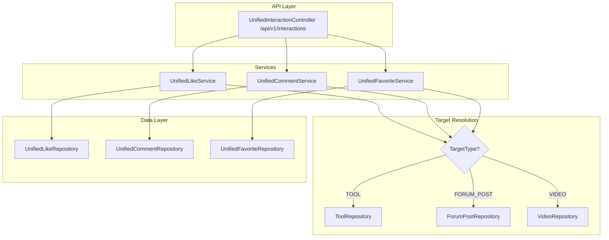
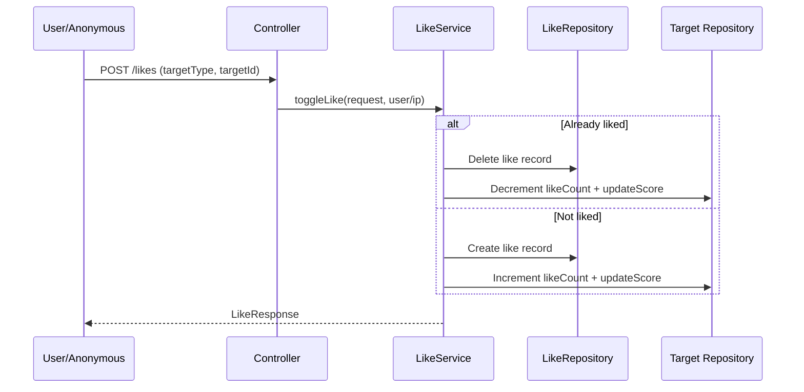

# 统一互动模块

## 模块概述

统一互动模块为 CodingHub 提供跨内容类型的点赞、评论、收藏功能，通过多态目标解析模式（`targetType + targetId`）为工具、论坛帖子、视频三种内容类型提供统一的互动 API。支持匿名点赞（IP 哈希）和嵌套评论回复。

## 架构图

## 核心组件

### TargetType — 目标类型枚举

定义可互动的内容类型：`TOOL`、`FORUM_POST`、`VIDEO`

### UnifiedLike — 统一点赞实体

多态点赞记录，支持双重唯一约束：

- 已登录用户：按 `userId + targetType + targetId` 唯一
- 匿名用户：按 `ipHash`（SHA-256）+ `targetType + targetId` 唯一

### UnifiedComment — 统一评论实体

支持嵌套回复的多态评论：

- `targetType` + `targetId` — 目标内容
- `parentId` — 直接父评论
- `rootId` — 顶级评论（线程根）
- 内容经 `XssSanitizer` 消毒

### UnifiedFavorite — 统一收藏实体

多态收藏记录，仅支持已登录用户（`userId + targetType + targetId` 唯一）。

### UnifiedLikeService — 点赞服务

- `toggleLike()` — 切换点赞状态（已赞则取消，未赞则添加），更新目标的 `likeCount` 并重算热度分数
- `getLikeStatus()` — 只读检查点赞状态和总数
- 支持匿名用户通过 IP 哈希点赞

### UnifiedCommentService — 评论服务

- `addComment()` — 添加评论，解析 `parentId`/`rootId` 实现嵌套回复，XSS 消毒，更新目标的 `commentCount`
- `getComments()` — 分页查询评论，按 `createdAt ASC` 排序
- `deleteComment()` — 所有者或管理员删除，递减目标的 `commentCount`

### UnifiedFavoriteService — 收藏服务

- `toggleFavorite()` — 切换收藏状态（仅登录用户）
- `getMyFavorites()` — 返回实际资源 DTO（ToolSummaryDTO、ForumPostSummaryDTO、VideoListItem）
- `getFavoriteStatus()` — 检查是否已收藏

## 前端集成

- **API 服务**：`frontend/src/services/interaction.ts` — 点赞/评论/收藏 API
- **Composables**：`frontend/src/composables/useInteraction.ts` — 互动逻辑组合式函数
- **权限检查**：`frontend/src/composables/useContentPermissions.ts` — 内容权限组合式函数

## 点赞流程

## 设计要点

- **多态目标解析**：`TargetType` 枚举 + switch 分发，避免每种内容类型单独实现互动端点
- **双向计数同步**：点赞/评论切换同时更新互动记录和目标实体的反规范化计数器及热度分数
- **匿名支持**：SHA-256 IP 哈希标识匿名用户，与 [留言反馈](留言反馈.md) 使用相同模式
- **嵌套评论**：`parentId` 指向直接父评论，`rootId` 指向线程根，支持多级回复树
- **收藏必须登录**：与点赞不同，收藏不支持匿名

## 交叉引用

- [工具市场](工具市场.md) — 工具互动目标
- [论坛社区](论坛社区.md) — 帖子互动目标
- [微课视频](微课视频.md) — 视频互动目标
- [认证与用户](认证与用户.md) — 用户认证和权限

<!-- crosslinks (auto-generated) -->
## Related Modules
- Used by: [微课视频](微课视频.md)
