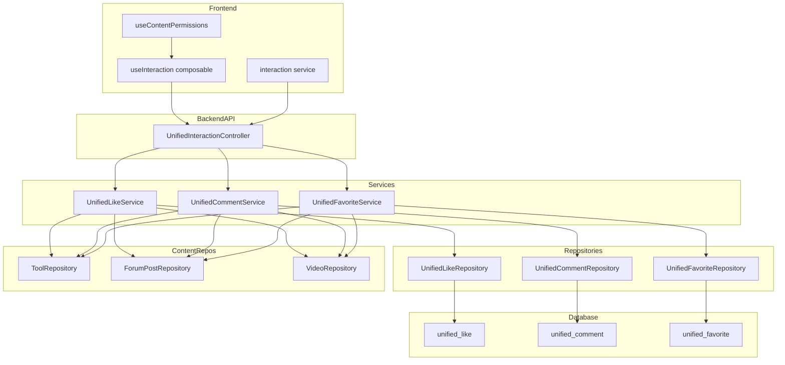
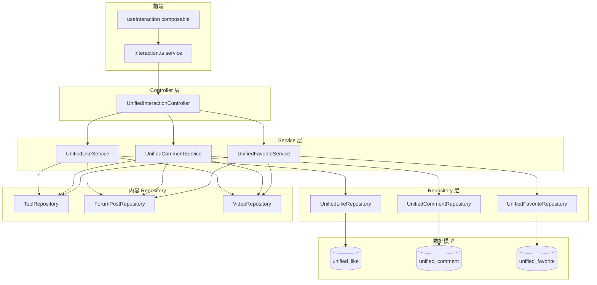
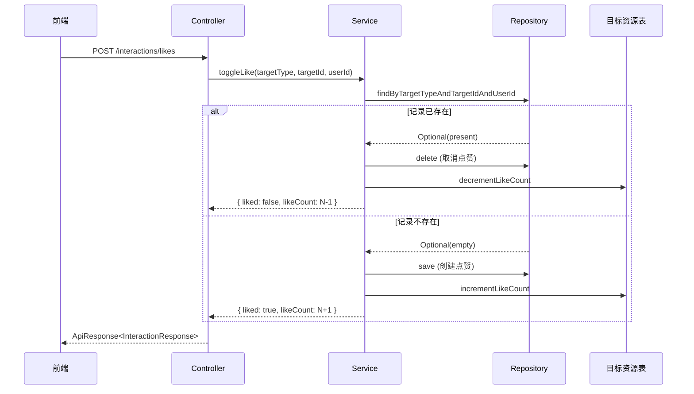
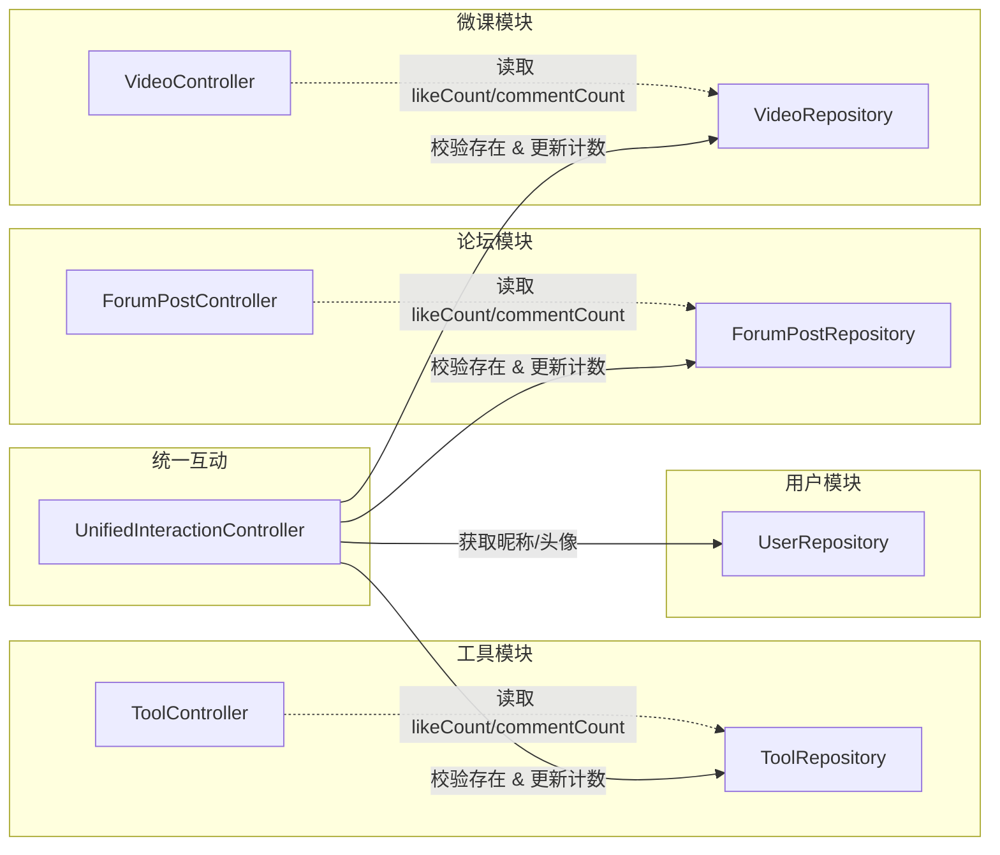

# 统一互动模块

## 1. 模块简介

统一互动模块是 CodingHub 平台的**跨内容类型互动基础设施**，为[工具市场](工具市场.md)、[论坛社区](论坛社区.md)、[微课视频](微课视频.md)三大内容模块提供统一的**点赞**、**评论**、**收藏**能力。该模块通过 `TargetType` 枚举实现多态设计，用一套 API、三张数据表替代了原先各模块独立的互动系统（`ToolLike`、`ToolComment`、`ForumLike`、`ForumComment`、`PostFavorite` 等），大幅降低了重复代码和维护成本。

### 核心功能一览

| 功能 | 支持登录用户 | 支持匿名用户 | 需要登录 |
|------|:----------:|:----------:|:-------:|
| 点赞 / 取消点赞 | ✅ | ✅（IP hash） | ❌ |
| 发表评论 | ✅ | ✅（提供 userName） | ❌ |
| 删除评论 | ✅（所有者或管理员） | ❌ | ✅ |
| 收藏 / 取消收藏 | ✅ | ❌ | ✅ |
| 查看我的收藏列表 | ✅ | ❌ | ✅ |

---

## 2. 架构概览


### API 路由总览

所有接口前缀：`/api/v1/interactions`

| HTTP 方法 | 路径 | 说明 | 认证 |
|-----------|------|------|------|
| `POST` | `/likes` | 切换点赞状态 | 可选 |
| `GET` | `/likes/status` | 查询点赞状态 | 可选 |
| `POST` | `/comments` | 发表评论（支持嵌套回复） | 可选 |
| `GET` | `/comments` | 分页获取评论列表 | 无需 |
| `DELETE` | `/comments/{id}` | 删除评论 | 必须（所有者/管理员） |
| `POST` | `/favorites` | 切换收藏状态 | 必须 |
| `GET` | `/favorites` | 获取当前用户收藏列表 | 必须 |
| `GET` | `/favorites/status` | 查询收藏状态 | 必须 |

---

## 3. TargetType 多态设计

统一互动模块通过引入 `targetType` 多态字段，将三套独立的互动逻辑合并为一套通用实现，遵循 **DRY（Don't Repeat Yourself）** 原则。

### 1.2 核心设计理念

- **多态目标**：通过 `TargetType` 枚举（`TOOL` / `FORUM_POST` / `VIDEO`）标识内容类型，用 `targetId` 指向具体资源。
- **统一 API**：所有互动操作收敛到 `/api/v1/interactions/*` 端点，前端无需为不同内容调用不同接口。
- **兼容匿名**：点赞和评论支持未登录用户（通过 IP 哈希标识），收藏功能强制登录。
- **Toggle 模式**：点赞和收藏采用「切换」语义——同一个请求既可以是创建也可以是取消，由当前状态决定。

---

## 2. 架构总览



---

## 3. 数据模型

### 3.1 TargetType 枚举

`TargetType` 是所有互动操作的目标类型标识，定义在 `com.iaihub.toolbox.model.TargetType` 中：

| 枚举值 | 含义 | 对应实体 |
|--------|------|----------|
| `TOOL` | 工具 | `Tool` |
| `FORUM_POST` | 论坛帖子 | `ForumPost` |
| `VIDEO` | 微课视频 | `Video` |

`TargetType.fromString()` 方法负责校验和解析，大小写不敏感，非法值抛出 `BusinessException(400)`。

### 3.2 UnifiedLike 实体

对应数据库表 `unified_like`，记录用户对内容的点赞行为。

| 字段 | 类型 | 说明 |
|------|------|------|
| `id` | `Long` | 主键，自增 |
| `target_type` | `String(20)` | 目标类型（TOOL / FORUM_POST / VIDEO） |
| `target_id` | `Long` | 目标资源 ID |
| `user_id` | `Long` | 已登录用户 ID（可空） |
| `ip_hash` | `String(64)` | 匿名用户 IP 的 SHA-256 哈希（可空） |
| `created_at` | `LocalDateTime` | 创建时间 |

**唯一约束：**

- `uk_like_user`：`(target_type, target_id, user_id)` — 同一用户不能重复点赞。
- `uk_like_anon`：`(target_type, target_id, ip_hash)` — 同一 IP 不能重复点赞。

**索引：** `idx_like_target` on `(target_type, target_id)`，加速按目标查询。

### 3.3 UnifiedComment 实体

对应数据库表 `unified_comment`，支持嵌套回复（两级结构：parent + root）。

| 字段 | 类型 | 说明 |
|------|------|------|
| `id` | `Long` | 主键，自增 |
| `target_type` | `String(20)` | 目标类型 |
| `target_id` | `Long` | 目标资源 ID |
| `user_id` | `Long` | 已登录用户 ID（可空） |
| `user_name` | `String(50)` | 匿名用户填写的昵称（可空） |
| `parent_id` | `Long` | 直接父评论 ID（顶层评论为 null） |
| `root_id` | `Long` | 根评论 ID（用于线程聚合，顶层评论为 null） |
| `content` | `TEXT` | 评论内容（经 XSS 过滤） |
| `like_count` | `Integer` | 评论自身的点赞数，默认 0 |
| `created_at` | `LocalDateTime` | 创建时间 |
| `updated_at` | `LocalDateTime` | 更新时间 |

**索引：**

- `idx_comment_target` on `(target_type, target_id, created_at)` — 按时间排序查询。
- `idx_comment_root` on `(root_id)` — 按根评论聚合回复。

### 3.4 UnifiedFavorite 实体

对应数据库表 `unified_favorite`，仅支持已登录用户。

| 字段 | 类型 | 说明 |
|------|------|------|
| `id` | `Long` | 主键，自增 |
| `target_type` | `String(20)` | 目标类型 |
| `target_id` | `Long` | 目标资源 ID |
| `user_id` | `Long` | 用户 ID（不可空） |
| `created_at` | `LocalDateTime` | 创建时间 |

**唯一约束：** `uk_fav` on `(user_id, target_type, target_id)` — 同一用户不能重复收藏同一目标。

**索引：** `idx_fav_user` on `(user_id, target_type)` — 加速用户收藏列表查询。

---

## 4. UnifiedInteractionController

`UnifiedInteractionController` 是统一互动的唯一 API 入口，挂载在 `/api/v1/interactions` 路径下，通过 `@RequiredArgsConstructor` 注入三个 Service。

### 4.1 认证与身份识别

Controller 内部通过 `getCurrentUser()` 私有方法从 `SecurityContextHolder` 获取当前用户：

- **已登录**：返回 `User` 对象，以 `userId` 标识身份。
- **未登录**：返回 `null`。点赞和评论场景下退化为匿名模式（使用 IP 哈希），收藏场景直接返回 401。

`computeIpHash()` 方法对客户端 IP 做 SHA-256 哈希，支持 `X-Forwarded-For` 代理头，确保隐私安全。

### 4.2 端点总览

| HTTP 方法 | 路径 | 说明 | 认证要求 |
|-----------|------|------|----------|
| `POST` | `/likes` | 切换点赞状态 | 可选（支持匿名） |
| `GET` | `/likes/status` | 查询点赞状态 | 可选 |
| `POST` | `/comments` | 发表评论 | 可选（支持匿名） |
| `GET` | `/comments` | 分页查询评论 | 无 |
| `DELETE` | `/comments/{id}` | 删除评论 | 必须（owner 或 admin） |
| `POST` | `/favorites` | 切换收藏状态 | 必须 |
| `GET` | `/favorites` | 查询我的收藏列表 | 必须 |
| `GET` | `/favorites/status` | 查询收藏状态 | 必须 |

---

## 5. Service 层详解

### 5.1 UnifiedLikeService

负责点赞的 Toggle 逻辑和状态查询。

**Toggle 流程：**

1. 解析 `targetType`，校验目标资源是否存在且状态为 `NORMAL`。
2. 根据用户身份分两条路径：
   - **已登录**：按 `(targetType, targetId, userId)` 查找现有记录。存在则删除（取消点赞），不存在则创建（点赞）。
   - **匿名**：按 `(targetType, targetId, ipHash)` 查找，逻辑同上。
3. 更新目标资源的 `likeCount` 字段（增量维护，非实时 count）。
4. 返回 `{ liked, likeCount }`。

**计数同步策略：** 点赞数同时存储在 `unified_like` 表（精确记录）和目标资源表的 `likeCount` 字段（冗余计数，避免 COUNT 查询）。Tool 和 Video 使用 `incrementLikeCount()` / `decrementLikeCount()` 方法，ForumPost 使用 setter 手动计算，并用 `Math.max(0, count - 1)` 防止负数。

### 5.2 UnifiedCommentService

负责评论的增删查，支持两级嵌套。

**发表评论流程：**

1. 校验 `content` 非空。
2. 解析 `targetType`，校验目标资源存在。
3. 对内容执行 `XssSanitizer.sanitize()` 过滤。
4. 如果提供了 `parentId`，查找父评论并解析 `rootId`（若父评论本身是回复，则取父评论的 `rootId`；否则 `rootId = parentId`）。
5. 已登录用户自动从 `UserRepository` 获取 `nickname` 和 `avatarUrl`，匿名用户使用请求中的 `userName`。
6. 保存评论并更新目标资源的 `commentCount`。

**删除权限：** `isOwner || isAdmin`，即评论作者本人或 ADMIN / SUPER_ADMIN 角色可删除。删除后同步递减目标资源的 `commentCount`，并触发 Tool / ForumPost 的 `updateScore()` 重新计算排序权重。

**分页查询：** 按 `createdAt` 升序排列，每页最大 100 条（`Math.min(size, 100)` 硬限制）。

### 5.3 UnifiedFavoriteService

负责收藏的 Toggle 逻辑、状态查询和收藏列表。

**Toggle 流程：**

1. 校验 `userId` 非空（强制登录）。
2. 解析 `targetType`，校验目标资源存在。
3. 按 `(userId, targetType, targetId)` 查找现有记录。存在则删除（取消收藏），不存在则创建（收藏）。
4. 返回 `{ favorited }`。

**收藏列表（getMyFavorites）：** 这是统一互动中唯一返回**实际资源 DTO** 而非互动记录本身的方法。根据 `targetType` 分发到不同的构建方法：

- `TOOL` → 返回 `PageResponse<ToolSummaryDTO>`
- `FORUM_POST` → 返回 `PageResponse<ForumPostSummaryDTO>`
- `VIDEO` → 返回 `PageResponse<VideoSummaryDTO>`

已删除的资源（status 非 NORMAL）会被过滤掉，不在列表中展示。

---

## 6. Toggle 模式详解

点赞和收藏均采用 **Toggle（切换）** 设计模式，客户端只需发送同一个 `POST` 请求，服务端根据当前状态自动判断是创建还是取消。



**优势：**

- 前端无需维护「当前是否已点赞」的状态来决定调用 create 还是 delete。
- 天然幂等——连续两次相同请求会回到原始状态。
- 减少 API 端点数量。

---

## 7. DTO 设计

### 7.1 InteractionRequest（请求体）

```java
public class InteractionRequest {
    @NotBlank  String targetType;   // 必填：TOOL / FORUM_POST / VIDEO
    @NotNull   Long targetId;       // 必填：目标资源 ID
    String content;                 // 评论专用
    Long parentId;                  // 评论专用：父评论 ID
    String userName;                // 匿名评论时的昵称
}
```

### 7.2 InteractionResponse（响应体）

使用 `@JsonInclude(NON_NULL)` 按需序列化，同一个 DTO 承载三种互动类型的响应：

| 场景 | 返回字段 |
|------|----------|
| 点赞 Toggle | `liked`, `likeCount` |
| 收藏 Toggle | `favorited` |
| 评论 | `id`, `targetType`, `targetId`, `userId`, `userName`, `userNickname`, `userAvatarUrl`, `parentId`, `rootId`, `content`, `commentLikeCount`, `createdAt` |

静态工厂方法 `likeToggle()` 和 `favoriteToggle()` 提供便捷的构造方式。

---

## 8. API 端点详细说明

### 8.1 POST /api/v1/interactions/likes

切换点赞状态。

**请求体：**
```json
{
  "targetType": "TOOL",
  "targetId": 42
}
```

**响应：**
```json
{
  "code": 200,
  "data": {
    "liked": true,
    "likeCount": 15
  }
}
```

### 8.2 GET /api/v1/interactions/likes/status

查询当前用户对指定资源的点赞状态。

**参数：** `targetType` (String), `targetId` (Long)

### 8.3 POST /api/v1/interactions/comments

发表评论或回复。

**请求体（顶层评论）：**
```json
{
  "targetType": "FORUM_POST",
  "targetId": 7,
  "content": "这个工具很实用！"
}
```

**请求体（嵌套回复）：**
```json
{
  "targetType": "FORUM_POST",
  "targetId": 7,
  "content": "同意楼上的观点",
  "parentId": 101
}
```

### 8.4 GET /api/v1/interactions/comments

分页查询指定资源下的评论列表。

**参数：** `targetType`, `targetId`, `page` (默认 0), `size` (默认 20，上限 100)

### 8.5 DELETE /api/v1/interactions/comments/{id}

删除指定评论。需要登录，且只有评论作者或管理员可操作。

### 8.6 POST /api/v1/interactions/favorites

切换收藏状态（需登录）。

### 8.7 GET /api/v1/interactions/favorites

查询当前用户的收藏列表（需登录），返回实际资源 DTO。

**参数：** `targetType`, `page` (默认 0), `size` (默认 10)

### 8.8 GET /api/v1/interactions/favorites/status

查询当前用户对指定资源的收藏状态（需登录）。

---

## 9. 前端集成

### 9.1 interaction.ts 服务层

定义了与后端对应的 TypeScript 类型：

```typescript
type TargetType = 'TOOL' | 'FORUM_POST' | 'VIDEO'

interface InteractionRequest {
  targetType: TargetType
  targetId: number
  content?: string
  parentId?: number
  userName?: string
}
```

以及 `LikeResponse`、`FavoriteResponse`、`CommentResponse`、`InteractionPageResponse<T>` 等响应类型。

### 9.2 useInteraction Composable

`useInteraction(targetType, targetId)` 是前端统一互动的核心 Hook，封装了所有状态管理和 API 调用：

```typescript
const {
  // 点赞
  liked, likeCount, likeLoading,
  loadLikeStatus, toggleLike,
  // 收藏
  favorited, favoriteLoading,
  loadFavoriteStatus, toggleFavorite,
  // 评论
  comments, commentsTotalElements, commentsTotalPages,
  commentsPage, commentsLoading, commentSubmitting,
  loadComments, addComment, deleteComment
} = useInteraction('TOOL', 42)
```

**特性：**

- 防重复点击：`likeLoading` / `favoriteLoading` 为 true 时忽略重复调用。
- 评论提交后自动重新加载当前页。
- 收藏加载失败静默忽略（未登录时不会报错）。

### 9.3 useContentPermissions Composable

`useContentPermissions(ownerId)` 提供内容编辑/删除权限判断：

- `canEdit` / `canDelete`：当前用户是内容作者或管理员时为 `true`。
- 用于在 UI 层控制编辑/删除按钮的显示。

---

## 10. 从旧系统迁移

### 10.1 旧表与新表对照

| 旧表 | 新表 | 迁移要点 |
|------|------|----------|
| `tool_like` | `unified_like` | `target_type = 'TOOL'`，`user_id` 映射，补充 `ip_hash` 列 |
| `forum_like` | `unified_like` | `target_type = 'FORUM_POST'` |
| `video_like` | `unified_like` | `target_type = 'VIDEO'` |
| `tool_comment` | `unified_comment` | 补充 `parent_id`、`root_id` 列 |
| `forum_comment` | `unified_comment` | 同上 |
| `video_comment` | `unified_comment` | 同上 |
| `post_favorite` | `unified_favorite` | `target_type = 'FORUM_POST'` |
| `video_favorite` | `unified_favorite` | `target_type = 'VIDEO'` |

### 10.2 迁移步骤建议

1. **创建新表**：运行 DDL 创建 `unified_like`、`unified_comment`、`unified_favorite` 三张表。
2. **数据迁移**：使用 SQL `INSERT ... SELECT` 将旧表数据导入新表，附加 `target_type` 字段。示例：
   ```sql
   INSERT INTO unified_like (target_type, target_id, user_id, created_at)
   SELECT 'TOOL', tool_id, user_id, created_at FROM tool_like;
   ```
3. **双写过渡**：在迁移期间，新旧接口并行写入，确保数据一致性。
4. **前端切换**：逐步将前端页面从旧 API 切换到 `/api/v1/interactions/*`。
5. **验证计数**：对比新旧表的数据量，确认 `likeCount` / `commentCount` 冗余字段正确。
6. **清理旧表**：确认无误后，删除旧表及对应的旧 Controller / Service / Repository 代码。

### 10.3 注意事项

- 旧表中的匿名点赞（无 `user_id`）需要在迁移时为 `ip_hash` 列填充占位值或从访问日志中恢复。
- 旧评论如果不支持嵌套回复，`parent_id` 和 `root_id` 统一设为 `NULL`。
- 迁移过程中需要暂停点赞/评论/收藏操作，或使用数据库锁确保一致性。

---

## 11. 与其他模块的关系



| 关联模块 | 关系说明 |
|----------|----------|
| **工具模块** | `UnifiedLikeService` / `UnifiedCommentService` 通过 `ToolRepository` 校验工具存在性并更新 `likeCount`、`commentCount`。删除评论时触发 `tool.updateScore()` 重算排序权重。 |
| **论坛模块** | 同上，通过 `ForumPostRepository` 操作。ForumPost 使用 setter 手动计算计数，并在删除评论时调用 `post.updateScore()`。 |
| **微课模块** | 同上，通过 `VideoRepository` 操作。Video 使用 `incrementLikeCount()` / `decrementLikeCount()` 方法。 |
| **用户模块** | `UnifiedCommentService` 和 `UnifiedFavoriteService` 通过 `UserRepository` 获取用户昵称和头像 URL。 |
| **安全模块** | Controller 从 `SecurityContextHolder` 获取认证信息，`computeIpHash()` 使用 SHA-256 对 IP 脱敏。 |
| **XSS 防护** | 评论内容经过 `XssSanitizer.sanitize()` 过滤后才入库。 |

---

## 12. 关键文件索引

| 文件 | 路径 |
|------|------|
| Controller | `backend/src/main/java/com/iaihub/toolbox/controller/UnifiedInteractionController.java` |
| UnifiedLikeService | `backend/src/main/java/com/iaihub/toolbox/service/UnifiedLikeService.java` |
| UnifiedCommentService | `backend/src/main/java/com/iaihub/toolbox/service/UnifiedCommentService.java` |
| UnifiedFavoriteService | `backend/src/main/java/com/iaihub/toolbox/service/UnifiedFavoriteService.java` |
| UnifiedLike | `backend/src/main/java/com/iaihub/toolbox/model/UnifiedLike.java` |
| UnifiedComment | `backend/src/main/java/com/iaihub/toolbox/model/UnifiedComment.java` |
| UnifiedFavorite | `backend/src/main/java/com/iaihub/toolbox/model/UnifiedFavorite.java` |
| TargetType | `backend/src/main/java/com/iaihub/toolbox/model/TargetType.java` |
| InteractionRequest | `backend/src/main/java/com/iaihub/toolbox/dto/InteractionRequest.java` |
| InteractionResponse | `backend/src/main/java/com/iaihub/toolbox/dto/InteractionResponse.java` |
| 前端 Service | `frontend/src/services/interaction.ts` |
| useInteraction | `frontend/src/composables/useInteraction.ts` |
| useContentPermissions | `frontend/src/composables/useContentPermissions.ts` |
