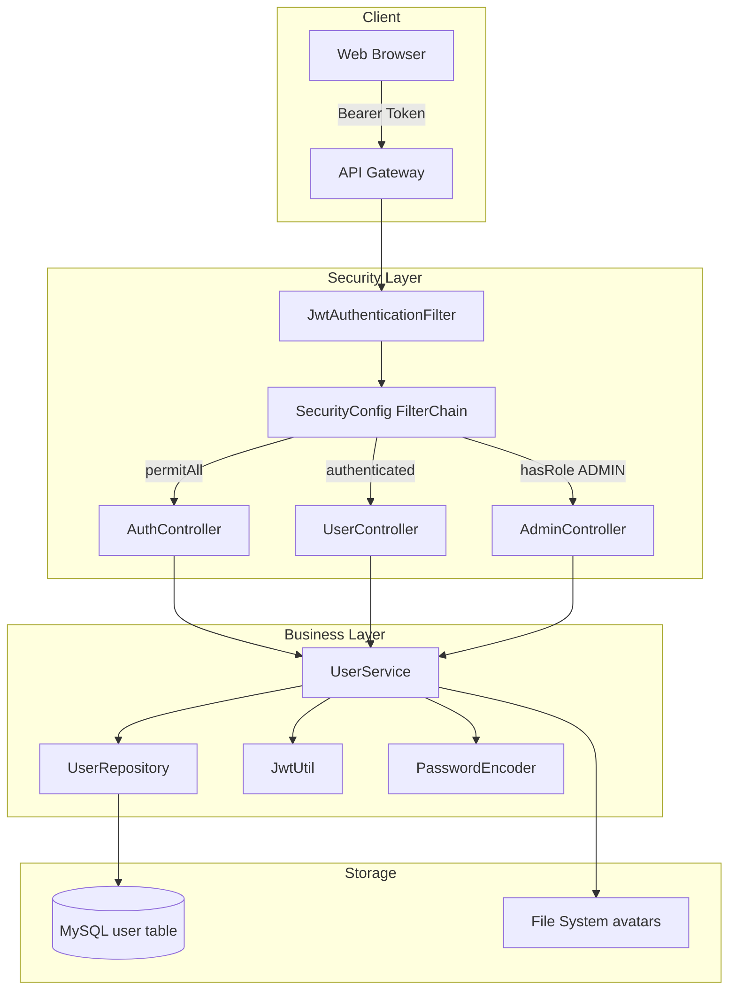
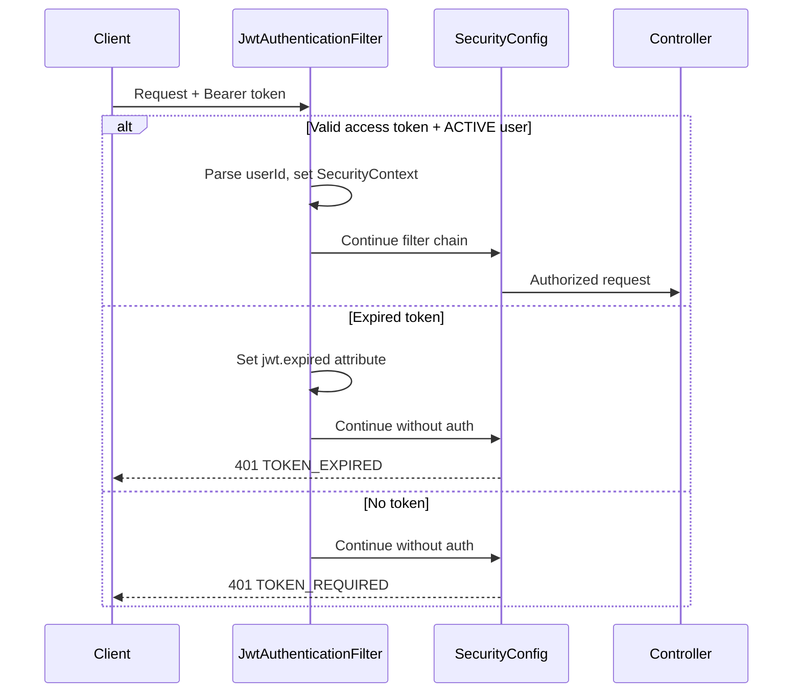
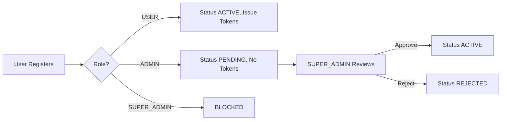

# 认证与用户模块

## 模块概述

认证与用户模块是 CodingHub 的安全基础，提供用户注册、登录、JWT 令牌管理、角色权限控制、用户资料管理和头像上传等功能。采用三级角色模型（USER / ADMIN / SUPER_ADMIN），结合 Spring Security + JWT 实现无状态认证与授权。

## 架构图

## 核心组件

### User — 用户实体

JPA 实体映射到 `` `user` `` 表（反引号转义保留字）。核心字段包括 `username`（唯一）、`password`（BCrypt 哈希）、`role`（Role 枚举）、`status`（AccountStatus 枚举）、`avatarUrl`、`bio`、`lastLoginAt`。

### Role — 角色枚举

三级角色层次：`USER`（默认）、`ADMIN`（需审批）、`SUPER_ADMIN`（最高权限，受保护）。

### AccountStatus — 账户状态枚举

生命周期状态：`ACTIVE`（活跃）、`PENDING`（待审批）、`REJECTED`（已拒绝）、`DISABLED`（已禁用）。仅 ACTIVE 状态的用户可通过 JWT 过滤器认证。

### JwtUtil — JWT 工具类

基于 JJWT 库实现无状态令牌管理：

- `generateAccessToken()` — 短期访问令牌（15分钟），`type: "access"`
- `generateRefreshToken()` — 长期刷新令牌（7天），`type: "refresh"`
- `validateToken()` / `parseToken()` — 验证和解析
- `isRefreshToken()` — 区分令牌类型，防止用刷新令牌代替访问令牌

### JwtAuthenticationFilter — JWT 认证过滤器

`OncePerRequestFilter` 实现，拦截每个 HTTP 请求：

1. 从 `Authorization: Bearer` 头提取 JWT
2. 验证令牌有效性和类型（仅接受 access token）
3. 区分过期和无效令牌（设置 `jwt.expired` 请求属性）
4. 仅认证 `ACTIVE` 状态的用户
5. 将 `Role` 映射为 `ROLE_<name>` Spring Security 权限

### SecurityConfig — 安全配置

核心 Spring Security 配置，定义：

- **无状态会话**：`SessionCreationPolicy.STATELESS`
- **URL 级授权**：公开端点 `permitAll()`、认证端点 `authenticated()`、管理员端点 `hasRole()`
- **CORS 策略**：允许所有来源，支持凭证
- **自定义认证入口点**：区分 `TOKEN_EXPIRED` 和 `TOKEN_REQUIRED` 错误

### UserService — 用户服务

核心业务逻辑，涵盖：

- **注册**：USER 角色立即发放令牌；ADMIN 角色进入 PENDING 状态等待审批；禁止自注册 SUPER_ADMIN
- **登录**：验证 BCrypt 密码 + 检查账户状态（PENDING/REJECTED/DISABLED 均拒绝）
- **令牌刷新**：仅发放新访问令牌，不轮换刷新令牌
- **资料管理**：更新昵称/简介（唯一性检查）、修改密码（验证旧密码）
- **头像管理**：上传/删除头像文件，URL 附带缓存破坏参数
- **管理操作**：审批/拒绝 ADMIN 注册、用户状态管理、用户列表；SUPER_ADMIN 账户受保护不可被操作

## 认证流程

## 注册审批流程

## 安全设计要点

- **纵深防御**：账户状态在登录时、JWT 过滤器中、管理操作时三层检查
- **无令牌吊销机制**：纯无状态 JWT，禁用用户需等令牌过期生效
- **SUPER_ADMIN 保护**：不可自注册、不可修改状态、不可删除
- **ADMIN 审批制**：任何人可注册 ADMIN，但需 SUPER_ADMIN 审批后方可使用

## 交叉引用

- [基础设施](基础设施.md) — 全局异常处理和通用响应格式
- [MCP协议](MCP协议.md) — MCP 工具的逐次认证模式

<!-- crosslinks (auto-generated) -->
## Related Modules
- Depends on: [工具市场](工具市场.md)
- Used by: [MCP协议](mcp协议.md), [工具市场](工具市场.md), [微课视频](微课视频.md), [留言反馈](留言反馈.md), [通知系统](通知系统.md)
