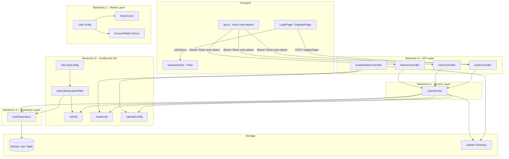
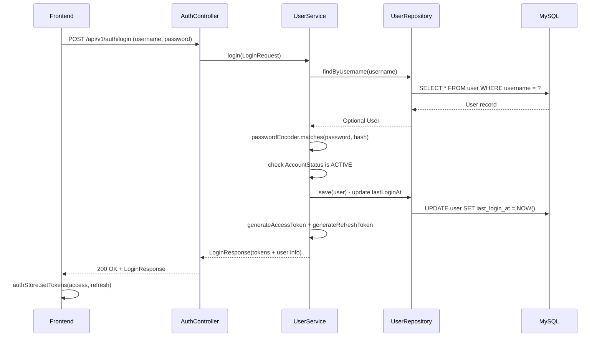
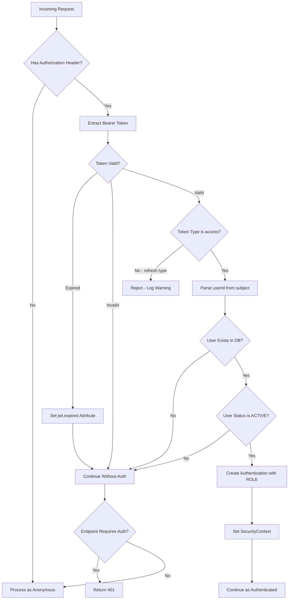
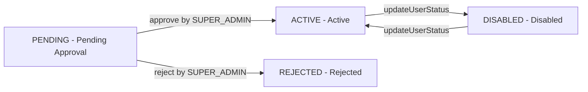
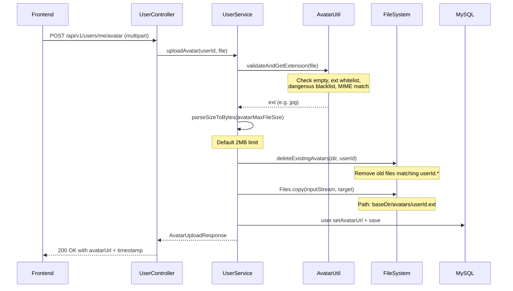

# 认证与用户模块

## 1. 模块简介

认证与用户模块是 CodingHub 平台的基础设施层，负责用户身份管理、访问控制和账号生命周期管理。该模块实现了基于 JWT 的无状态认证体系、三级角色权限模型、用户注册审批流程以及头像上传功能。

### 核心功能

| 功能 | 说明 |
|------|------|
| 用户注册 | 支持普通用户（直接激活）和管理员（需审批）两种注册模式 |
| 用户登录 | 用户名 + 密码认证，签发 JWT 双令牌（access + refresh） |
| 令牌刷新 | 通过 refresh token 无感续期 access token |
| 个人信息 | 查看当前用户资料，查看公开用户资料 |
| 头像管理 | 上传、查看、删除用户头像，支持 jpg/png/webp/gif 格式 |
| 用户审批 | 超级管理员审批管理员注册申请 |
| 用户管理 | 管理员查看用户列表、封禁/解禁、删除用户 |

## 2. 架构概览



## 3. JWT 认证流程

### 3.1 双令牌机制

系统采用 access token + refresh token 双令牌设计：

| 令牌类型 | 有效期 | 用途 |
|----------|--------|------|
| Access Token | 15 分钟 | 接口鉴权，携带在 `Authorization: Bearer <token>` 请求头中 |
| Refresh Token | 7 天 | 仅用于 `/api/v1/auth/refresh` 接口换取新的 access token |

令牌由 `JwtUtil` 生成，使用 HMAC-SHA 签名算法（JJWT 库），payload 结构如下：

```json
{
  "sub": "用户ID",
  "email": "用户名",
  "type": "access | refresh",
  "iat": "签发时间戳",
  "exp": "过期时间戳"
}
```

关键代码签名：

```java
// JwtUtil.java
public String generateAccessToken(Long userId, String email)
public String generateRefreshToken(Long userId, String email)
public Claims parseToken(String token)
public boolean validateToken(String token)
public boolean isTokenExpired(String token)
public boolean isRefreshToken(String token)
```

### 3.2 登录流程



### 3.3 请求鉴权链路

`JwtAuthenticationFilter` 继承 `OncePerRequestFilter`，在每次 HTTP 请求中执行：

1. 从 `Authorization` 请求头提取 `Bearer <token>`
2. 调用 `JwtUtil.validateToken()` 校验签名和有效期
3. 对过期令牌设置 `jwt.expired` 请求属性，供异常处理器返回精确错误码
4. 校验令牌类型必须为 `access`（拒绝 refresh 令牌用于 API 鉴权）
5. 从令牌 subject 解析 `userId`，查询数据库加载用户
6. 仅 `ACTIVE` 状态用户可通过认证，创建 `UsernamePasswordAuthenticationToken`
7. 角色转换为 Spring Security 权限：`ROLE_USER` / `ROLE_ADMIN` / `ROLE_SUPER_ADMIN`



### 3.4 前端令牌自动刷新

前端在 `api.ts` 的 Axios 响应拦截器中实现了完整的自动刷新机制：

```typescript
// api.ts 核心逻辑
let isRefreshing = false
let refreshSubscribers: Array<(success: boolean) => void> = []

// 当收到 401 响应时：
if (status === 401 && !originalRequest._retry) {
  // 如果已有请求在刷新中，当前请求进入等待队列
  if (isRefreshing) {
    return new Promise((resolve, reject) => {
      subscribeTokenRefresh((success) => {
        if (success) resolve(api(originalRequest))
        else reject(error)
      })
    })
  }
  // 第一个 401 触发刷新
  originalRequest._retry = true
  isRefreshing = true
  // 调用 POST /auth/refresh 换取新 access token
  // 成功后：重试原请求 + 通知队列中等待的请求
  // 失败后：logout + 重定向到登录页
}
```

刷新流程要点：

1. **401 检测**：任意 API 请求收到 401 时自动触发刷新
2. **并发控制**：多个请求同时触发 401 时，仅第一个执行刷新，其余进入等待队列
3. **自动重试**：刷新成功后，原请求和队列中的请求统一重试
4. **降级处理**：refresh token 也失效时，清除本地认证状态，重定向到登录页

## 4. 用户角色与权限

### 4.1 角色定义

```java
public enum Role {
    USER,         // 普通用户 - 注册即激活
    ADMIN,        // 管理员 - 注册后需审批
    SUPER_ADMIN   // 超级管理员 - 系统预设，不可通过注册创建
}
```

### 4.2 权限矩阵

| 操作 | 匿名 | USER | ADMIN | SUPER_ADMIN |
|------|------|------|-------|-------------|
| 浏览工具列表/详情 | 可用 | 可用 | 可用 | 可用 |
| 注册/登录 | 可用 | - | - | - |
| 查看用户公开资料 | 可用 | 可用 | 可用 | 可用 |
| 创建/编辑工具 | - | 可用 | 可用 | 可用 |
| 上传/删除头像 | - | 可用 | 可用 | 可用 |
| 发布视频/帖子 | - | 可用 | 可用 | 可用 |
| 查看用户管理列表 | - | - | 可用 | 可用 |
| 审批管理员注册 | - | - | - | 可用 |
| 封禁/解禁用户 | - | - | - | 可用 |
| 删除用户 | - | - | - | 可用 |

### 4.3 SecurityConfig 路由鉴权规则

```java
// SecurityConfig.java - 权限规则摘要

// 公开端点 - 无需认证
.requestMatchers("/api/v1/auth/**").permitAll()
.requestMatchers(HttpMethod.GET, "/api/v1/tools").permitAll()
.requestMatchers(HttpMethod.GET, "/api/v1/static/avatars/**").permitAll()
.requestMatchers(HttpMethod.GET, "/api/v1/users/{id}").permitAll()
.requestMatchers("/mcp/**").permitAll()

// 超级管理员专属
.requestMatchers("/api/v1/admin/approve/**").hasRole("SUPER_ADMIN")
.requestMatchers("/api/v1/admin/reject/**").hasRole("SUPER_ADMIN")
.requestMatchers("/api/v1/admin/pending-users").hasRole("SUPER_ADMIN")
.requestMatchers("/api/v1/admin/users/*/status").hasRole("SUPER_ADMIN")

// 管理员 + 超级管理员
.requestMatchers("/api/v1/admin/**").hasAnyRole("ADMIN", "SUPER_ADMIN")

// 需要认证（任何已登录用户）
.requestMatchers("/api/v1/tools/**").authenticated()
.requestMatchers("/api/v1/users/**").authenticated()
.requestMatchers("/api/v1/videos/**").authenticated()
```

### 4.4 超级管理员保护机制

系统在多处对 `SUPER_ADMIN` 角色实施特殊保护：

- 注册接口禁止选择 `SUPER_ADMIN` 角色（`throw new IllegalArgumentException`）
- `updateUserStatus()` 不可修改 `SUPER_ADMIN` 的状态
- `deleteUser()` 不可删除 `SUPER_ADMIN` 用户
- 由 `DataInitializer` 在系统初始化时创建默认超级管理员账号

## 5. 用户注册与审批流程

### 5.1 注册模式

| 注册角色 | 初始状态 | 是否签发令牌 | 后续流程 |
|----------|----------|-------------|----------|
| USER | ACTIVE | 是（access + refresh） | 注册即可登录 |
| ADMIN | PENDING | 否（返回空 token） | 等待超级管理员审批后方可登录 |
| SUPER_ADMIN | - | - | 禁止注册 |

### 5.2 账号状态机



```java
public enum AccountStatus {
    ACTIVE,     // 正常使用
    PENDING,    // 等待审批（ADMIN 注册后初始状态）
    REJECTED,   // 注册被拒绝
    DISABLED    // 已被封禁（SUPER_ADMIN 操作）
}
```

### 5.3 审批流程详解

1. 管理员提交注册请求，角色设为 `ADMIN`，状态为 `PENDING`，不签发令牌
2. 超级管理员通过 `GET /api/v1/admin/pending-users` 查看待审批列表
3. 通过 `POST /api/v1/admin/approve/{id}` 批准，状态变为 `ACTIVE`
4. 通过 `POST /api/v1/admin/reject/{id}` 拒绝，状态变为 `REJECTED`
5. 被拒绝的用户尝试登录时会收到 `ForbiddenException("注册申请已被拒绝")`
6. 待审批用户尝试登录时会收到 `ForbiddenException("账号等待审批中")`

### 5.4 注册字段校验规则

```java
// RegisterRequest.java - 校验注解
@NotBlank @Size(min = 4, max = 20)
@Pattern(regexp = "^\\w+$", message = "用户名只能包含字母、数字、下划线")
private String username;

@NotBlank @Size(min = 2, max = 10)
@Pattern(regexp = "^[\\u4e00-\\u9fa5a-zA-Z0-9]+$", message = "昵称只能包含中文、字母、数字")
private String nickname;

@NotBlank @Size(min = 6, message = "密码长度至少6位")
private String password;

private String role;  // 可选，默认 USER
```

注册时还进行业务层面的唯一性校验：
- `existsByUsername()` 检查用户名是否已注册
- `existsByNickname()` 检查昵称是否已使用

## 6. 头像上传机制

### 6.1 上传流程



### 6.2 安全校验

`AvatarUtil` 实施多层安全校验：

| 校验项 | 规则 | 目的 |
|--------|------|------|
| 文件空检查 | 文件不能为 null 或 empty | 防止空请求 |
| 扩展名白名单 | 仅允许 jpg、jpeg、png、webp、gif | 限制文件类型 |
| 危险扩展名黑名单 | 拒绝 svg、html、htm、xml、js | 防 XSS 攻击 |
| MIME 类型匹配 | Content-Type 必须与扩展名一致 | 防伪造扩展名 |
| 文件大小限制 | 默认 2MB，通过 `UploadConfig.avatarMaxFileSize` 配置 | 防大文件攻击 |
| 路径穿越防护 | userId 必须为纯数字正则 `^\\d+$` | 防目录遍历攻击 |

### 6.3 存储策略

- 存储路径：`{baseDir}/{avatarSubdir}/{userId}.{ext}`
- 默认目录：`~/aifiles/avatars/`（通过 `UploadConfig` 配置）
- 文件命名：以用户 ID 命名（如 `42.jpg`），确保每个用户仅有一个头像文件
- 上传时自动删除旧文件（`deleteExistingAvatars`），支持扩展名变更场景
- `jpeg` 扩展名自动标准化为 `jpg`（`AvatarUtil.normalizeExt`）

### 6.4 静态资源服务

`AvatarStaticController` 提供头像文件的 HTTP 访问：

- 路径：`GET /api/v1/static/avatars/{userId}` 或 `GET /api/v1/static/avatars/{userId}.{ext}`
- 如果 URL 未指定扩展名，按 `jpg -> png -> webp -> gif -> jpeg` 顺序探测
- 响应头设置 `Cache-Control: public, max-age=3600`（1 小时浏览器缓存）
- 上传后头像 URL 附带时间戳参数 `?v={epochMilli}` 用于缓存击穿

## 7. 组件职责说明

### 7.1 后端组件

| 组件 | 层级 | 文件路径 | 职责 |
|------|------|---------|------|
| `AuthController` | L4 | controller/ | 认证 API：注册、登录、刷新令牌 |
| `UserController` | L4 | controller/ | 用户 API：个人信息、头像管理、我的工具、公开资料 |
| `AdminController` | L4 | controller/ | 管理 API：用户审批、用户列表、状态管理、删除用户 |
| `AvatarStaticController` | L4 | controller/ | 头像静态资源服务，支持多格式自动探测 |
| `UserService` | L3 | service/ | 核心业务：注册、登录、令牌刷新、头像上传、审批、用户管理 |
| `UserRepository` | L2 | repository/ | JPA Repository，含自定义 JPQL 多条件过滤查询 |
| `User` | L1 | model/ | 用户实体：id, username, nickname, password, role, status, avatarUrl, timestamps |
| `Role` | L1 | model/ | 角色枚举：USER, ADMIN, SUPER_ADMIN |
| `AccountStatus` | L1 | model/ | 账号状态枚举：ACTIVE, PENDING, REJECTED, DISABLED |
| `SecurityConfig` | L0 | config/ | Spring Security 配置：路由鉴权、CORS、BCrypt 密码编码器 |
| `JwtAuthenticationFilter` | L0 | config/ | JWT 认证过滤器：令牌提取、校验、权限注入 SecurityContext |
| `JwtUtil` | L0 | util/ | JWT 工具类：令牌生成、解析、校验、过期检测 |
| `AvatarUtil` | L0 | util/ | 头像工具类：文件校验、扩展名规范化、路径安全检查 |
| `UploadConfig` | L0 | config/ | 上传配置：存储目录、文件大小限制、头像子目录 |

### 7.2 DTO 清单

| DTO | 用途 | 关键字段 |
|-----|------|----------|
| `RegisterRequest` | 注册请求体 | username, nickname, password, role |
| `LoginRequest` | 登录请求体 | username, password |
| `LoginResponse` | 登录/注册响应 | accessToken, refreshToken, user(内嵌 UserDTO) |
| `RefreshResponse` | 令牌刷新响应 | accessToken |
| `UserDTO` | 完整用户信息 | id, username, nickname, avatarUrl, role, status, createdAt, lastLoginAt |
| `PublicUserDTO` | 公开资料 | id, username, nickname, avatarUrl, createdAt |
| `AdminUserDTO` | 管理后台列表项 | id, username, nickname, role, status, createdAt, lastLoginAt |
| `PendingUserDTO` | 待审批列表项 | id, username, nickname, role, createdAt |
| `ApprovalResponse` | 审批操作响应 | userId, status, message |
| `AvatarUploadResponse` | 头像上传响应 | avatarUrl(含时间戳), fileSize, uploadedAt |
| `UserStatusUpdateRequest` | 状态更新请求 | status |

### 7.3 前端组件

| 组件 | 文件路径 | 职责 |
|------|---------|------|
| `useAuthStore` | stores/auth.ts | Pinia 全局认证状态：token 存储/读取、用户信息、登录状态计算 |
| Axios 实例 | services/api.ts | 请求拦截器自动附加 Bearer token；响应拦截器处理 401 自动刷新和 403 提示 |

前端状态管理核心 API：

```typescript
// stores/auth.ts
const authStore = useAuthStore()

// 状态
authStore.accessToken    // string | null - 从 localStorage 初始化
authStore.refreshToken   // string | null - 从 localStorage 初始化
authStore.user           // User | null

// 计算属性
authStore.isLoggedIn     // boolean - !!accessToken
authStore.isAdmin        // boolean - role === 'ADMIN' || 'SUPER_ADMIN'
authStore.isSuperAdmin   // boolean - role === 'SUPER_ADMIN'

// 操作
authStore.setTokens(access, refresh)  // 写入内存 + localStorage
authStore.setUser(userData)           // 写入内存 + localStorage
authStore.logout()                    // 清除内存 + localStorage
authStore.initFromStorage()           // 启动时从 localStorage 恢复
```

## 8. API 接口汇总

### 8.1 认证接口（公开）

| 方法 | 路径 | 请求体 | 响应 | 说明 |
|------|------|--------|------|------|
| POST | `/api/v1/auth/register` | RegisterRequest | LoginResponse | USER 直接签发令牌；ADMIN 返回待审批 |
| POST | `/api/v1/auth/login` | LoginRequest | LoginResponse | 校验密码 + 状态后签发双令牌 |
| POST | `/api/v1/auth/refresh` | Authorization: Bearer refreshToken | RefreshResponse | 仅返回新的 accessToken |

### 8.2 用户接口

| 方法 | 路径 | 认证 | 说明 |
|------|------|------|------|
| GET | `/api/v1/users/me` | 需要 | 获取当前用户完整信息 |
| GET | `/api/v1/users/me/tools` | 需要 | 分页获取当前用户的工具列表 |
| POST | `/api/v1/users/me/avatar` | 需要 | 上传头像（multipart/form-data） |
| DELETE | `/api/v1/users/me/avatar` | 需要 | 删除头像 |
| GET | `/api/v1/users/{id}` | 公开 | 获取指定用户的公开资料 |
| GET | `/api/v1/static/avatars/{userId}` | 公开 | 获取头像静态文件 |

### 8.3 管理接口

| 方法 | 路径 | 权限 | 说明 |
|------|------|------|------|
| GET | `/api/v1/admin/pending-users` | SUPER_ADMIN | 待审批的管理员用户列表 |
| POST | `/api/v1/admin/approve/{id}` | SUPER_ADMIN | 审批通过，状态改为 ACTIVE |
| POST | `/api/v1/admin/reject/{id}` | SUPER_ADMIN | 审批拒绝，状态改为 REJECTED |
| GET | `/api/v1/admin/users` | ADMIN+ | 分页查询用户列表，支持 role/status/keyword 过滤 |
| PUT | `/api/v1/admin/users/{id}/status` | SUPER_ADMIN | 封禁(DISABLED)或解禁(ACTIVE)用户 |
| DELETE | `/api/v1/admin/users/{id}` | SUPER_ADMIN | 物理删除用户（SUPER_ADMIN 不可删） |

## 9. 数据库表结构

```sql
CREATE TABLE `user` (
    id            BIGINT AUTO_INCREMENT PRIMARY KEY,
    username      VARCHAR(100)  NOT NULL UNIQUE,
    nickname      VARCHAR(50)   UNIQUE,
    password      VARCHAR(255)  NOT NULL,
    role          VARCHAR(20)   NOT NULL DEFAULT 'USER',
    status        VARCHAR(20)   NOT NULL DEFAULT 'ACTIVE',
    avatar_url    VARCHAR(255),
    created_at    DATETIME      NOT NULL,
    updated_at    DATETIME      NOT NULL,
    last_login_at DATETIME,
    INDEX idx_user_username (username),
    INDEX idx_user_nickname (nickname)
);
```

User 实体通过 JPA `@PrePersist` 和 `@PreUpdate` 回调自动维护 `created_at` 和 `updated_at` 时间戳。表名使用反引号包裹（`` `user` ``）以避免与 MySQL 保留字冲突。

## 10. 安全设计要点

1. **密码安全**：BCrypt 算法加密存储，不可逆
2. **令牌类型隔离**：Access Token 和 Refresh Token 通过 `type` 声明区分，Refresh Token 不能用于 API 鉴权
3. **状态感知认证**：JwtAuthenticationFilter 仅允许 ACTIVE 用户通过认证，即使持有有效令牌，非活跃用户也被拒绝
4. **头像安全**：扩展名白名单 + 危险格式黑名单双重校验；MIME 类型匹配校验；纯数字 ID 防路径穿越；SVG 等可执行格式被拒绝
5. **SUPER_ADMIN 保护**：不可注册创建，不可删除，不可修改状态
6. **异常信息控制**：登录失败统一返回"用户名或密码错误"，不泄露用户是否存在
7. **CORS 配置**：允许所有来源（`*`），支持凭证携带，1 小时预检缓存
8. **XSS 防护**：全局用户输入通过 `XssSanitizer.sanitize()` 处理

## 11. 交叉引用

- [工具管理](工具管理.md) - `UserController.getMyTools()` 委托 `ToolService` 查询用户创建的工具
- [论坛模块](论坛模块.md) - 论坛帖子和评论依赖用户认证，ADMIN 可管理帖子内容
- [微课模块](微课模块.md) - 视频上传/互动（评论/点赞/收藏）需要用户登录
- [MCP 服务](MCP服务.md) - MCP SSE 端点无需认证（`/mcp/**` permitAll）
- [概览统计](概览统计.md) - 统计面板展示用户相关数据（工具数量、用户排行等）