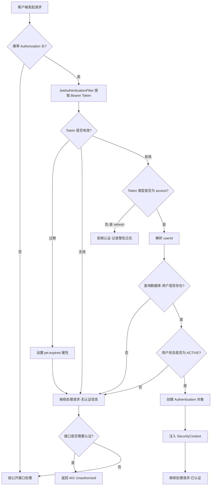
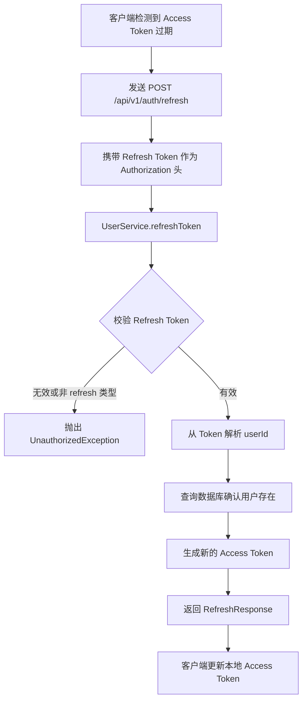
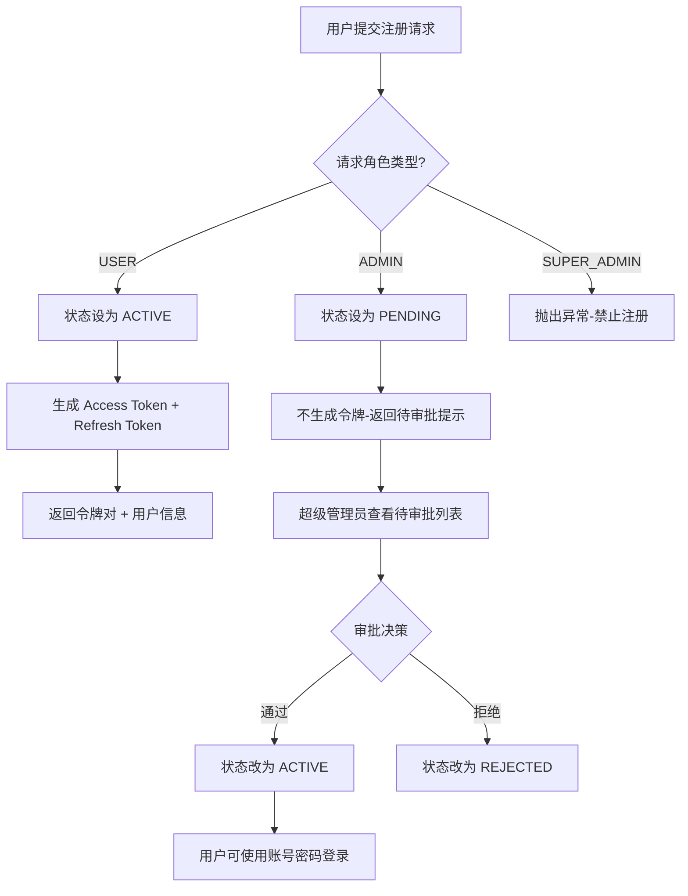

# 认证与用户模块

## 1. 模块概述

认证与用户模块是 CodingHub 平台的核心基础设施，负责用户身份认证、账号管理、头像上传以及后台用户审批等功能。该模块基于 Spring Security + JWT 实现无状态认证，采用 Access Token + Refresh Token 双令牌机制，在前端通过 Pinia 状态管理库维护登录态。

模块涵盖以下核心职责：

- **用户注册与登录**：支持普通用户（USER）直接注册登录，管理员（ADMIN）注册后需超级管理员审批
- **JWT 令牌管理**：Access Token 短期有效，Refresh Token 用于无感续期
- **用户信息管理**：个人资料查询、头像上传与删除、公开主页展示
- **后台用户管理**：待审批用户列表、用户状态管理（封禁/解禁）、用户删除
- **权限控制**：三级角色体系（USER / ADMIN / SUPER_ADMIN），基于 Spring Security 的细粒度接口鉴权

## 2. 架构总览

```mermaid
graph TD
    subgraph 前端
        A[auth.ts Store] -->|localStorage 持久化| B[Access Token / Refresh Token]
        A -->|状态管理| C[User 用户信息]
    end

    subgraph Controller 层
        D[AuthController] -->|注册/登录/刷新| E[UserService]
        F[UserController] -->|个人信息/头像| E
        F -->|我的工具| G[ToolService]
        H[AdminController] -->|审批/管理| E
        I[AvatarStaticController] -->|头像静态资源| J[UploadConfig]
    end

    subgraph Service 层
        E --> K[UserRepository]
        E --> L[JwtUtil]
        E --> M[PasswordEncoder]
        E --> J
    end

    subgraph Repository 层
        K --> N[(user 表)]
    end

    subgraph Filter 层
        O[JwtAuthenticationFilter] -->|拦截请求| L
        O -->|查询用户| K
    end

    subgraph Config 层
        P[SecurityConfig] -->|注册 Filter| O
        P -->|CORS 配置| Q[CorsConfigurationSource]
        P -->|密码编码器| M
    end

    前端 -->|HTTP 请求 + Bearer Token| Controller 层
    Filter 层 -->|注入 SecurityContext| Controller 层
```

## 3. 核心组件说明

### 3.1 Controller 层

#### AuthController

路径前缀：`/api/v1/auth`

负责用户认证相关的 REST API，包括注册、登录和令牌刷新。所有接口均为公开接口，无需认证。

| 方法 | 路径 | 说明 |
|------|------|------|
| `POST` | `/register` | 用户注册。USER 角色直接返回令牌；ADMIN 角色返回待审批状态 |
| `POST` | `/login` | 用户登录，校验通过后返回双令牌及用户信息 |
| `POST` | `/refresh` | 使用 Refresh Token 换取新的 Access Token |

#### UserController

路径前缀：`/api/v1/users`

负责当前登录用户的个人信息管理。除 `GET /{id}` 公开接口外，其余均需认证。

| 方法 | 路径 | 说明 |
|------|------|------|
| `GET` | `/me` | 获取当前登录用户信息 |
| `GET` | `/me/tools` | 分页获取当前用户发布的工具列表，支持分类、关键词筛选和排序 |
| `POST` | `/me/avatar` | 上传头像（multipart/form-data） |
| `DELETE` | `/me/avatar` | 删除头像 |
| `GET` | `/{id}` | 获取指定用户的公开资料（无需认证） |

#### AdminController

路径前缀：`/api/v1/admin`

负责后台用户管理，根据操作类型区分权限等级。

| 方法 | 路径 | 权限要求 | 说明 |
|------|------|---------|------|
| `GET` | `/pending-users` | SUPER_ADMIN | 获取待审批的管理员用户列表 |
| `POST` | `/approve/{id}` | SUPER_ADMIN | 审批通过指定用户 |
| `POST` | `/reject/{id}` | SUPER_ADMIN | 拒绝指定用户的注册申请 |
| `GET` | `/users` | ADMIN / SUPER_ADMIN | 分页查询用户列表，支持角色、状态、关键词筛选 |
| `PUT` | `/users/{id}/status` | SUPER_ADMIN | 更新用户状态（封禁/解禁） |
| `DELETE` | `/users/{id}` | SUPER_ADMIN | 删除用户（不可删除 SUPER_ADMIN） |

#### AvatarStaticController

路径前缀：`/api/v1/static/avatars`

负责头像静态资源的读取与返回。支持 jpg、png、webp、gif、jpeg 格式的自动探测，无需认证即可访问。

### 3.2 Service 层

#### UserService

`UserService` 是认证与用户模块的核心业务逻辑层，注入以下依赖：

- `UserRepository`：数据访问
- `PasswordEncoder`：BCrypt 密码加密
- `JwtUtil`：JWT 令牌生成与校验
- `UploadConfig`：文件上传配置

核心业务方法：

**认证相关：**

- `register(RegisterRequest)`：用户注册。校验用户名和昵称的唯一性；USER 角色注册后立即生成令牌对，ADMIN 角色注册后状态设为 PENDING，不返回令牌；禁止注册 SUPER_ADMIN
- `login(LoginRequest)`：用户登录。校验密码后检查账号状态（PENDING / REJECTED / DISABLED 均拒绝登录），更新最后登录时间，生成令牌对
- `refreshToken(String)`：令牌刷新。校验 Refresh Token 的有效性和类型，生成新的 Access Token

**用户信息相关：**

- `getCurrentUser(Long)`：根据用户 ID 返回完整用户信息
- `getPublicProfile(Long)`：返回用户的公开资料（不含密码、状态等敏感字段）
- `uploadAvatar(Long, MultipartFile)`：头像上传流程——校验文件格式与大小 -> 查找用户 -> 创建目录 -> 删除旧头像 -> 写入新文件 -> 更新数据库
- `deleteAvatar(Long)`：删除头像文件并清空数据库中的 avatarUrl 字段

**管理相关：**

- `getPendingUsers()`：查询状态为 PENDING 且角色为 ADMIN 的用户
- `approveUser(Long)`：将 PENDING 状态的用户设为 ACTIVE
- `rejectUser(Long)`：将 PENDING 状态的用户设为 REJECTED
- `getUsers(Role, AccountStatus, String, Pageable)`：多条件分页查询用户
- `updateUserStatus(Long, AccountStatus)`：更新用户状态，不可操作 SUPER_ADMIN
- `deleteUser(Long)`：物理删除用户，不可删除 SUPER_ADMIN

### 3.3 Repository 层

#### UserRepository

继承 `JpaRepository<User, Long>`，提供以下查询方法：

| 方法 | 说明 |
|------|------|
| `findByUsername(String)` | 根据用户名查找用户 |
| `findByNickname(String)` | 根据昵称查找用户 |
| `existsByUsername(String)` | 检查用户名是否已存在 |
| `existsByNickname(String)` | 检查昵称是否已存在 |
| `findByStatus(AccountStatus)` | 按状态筛选用户 |
| `findByRole(Role)` | 按角色筛选用户 |
| `findByStatusAndRole(AccountStatus, Role)` | 按状态和角色筛选用户 |
| `findAllFiltered(Role, AccountStatus, String, Pageable)` | 多条件分页查询（自定义 JPQL） |

`findAllFiltered` 使用自定义 JPQL 查询，支持角色、状态、关键词（用户名/昵称模糊匹配）的组合过滤，并按创建时间倒序排列。

### 3.4 Model 层

#### User 实体

映射到数据库 `user` 表（使用反引号包裹表名以避免 MySQL 保留字冲突）。

| 字段 | 类型 | 约束 | 说明 |
|------|------|------|------|
| `id` | Long | 主键，自增 | 用户 ID |
| `username` | String(100) | 非空，唯一索引 | 用户名 |
| `password` | String(255) | 非空 | BCrypt 加密后的密码 |
| `nickname` | String(50) | 唯一索引 | 昵称 |
| `avatarUrl` | String(255) | 可空 | 头像 URL 路径 |
| `role` | Role 枚举 | 非空，默认 USER | 角色 |
| `status` | AccountStatus 枚举 | 非空，默认 ACTIVE | 账号状态 |
| `createdAt` | LocalDateTime | 非空，不可更新 | 创建时间 |
| `updatedAt` | LocalDateTime | 非空 | 更新时间 |
| `lastLoginAt` | LocalDateTime | 可空 | 最后登录时间 |

实体通过 `@PrePersist` 和 `@PreUpdate` 回调自动维护 `createdAt` 和 `updatedAt` 时间戳。

#### Role 枚举

```
USER         — 普通用户
ADMIN        — 管理员（注册后需审批）
SUPER_ADMIN  — 超级管理员（不可通过注册创建）
```

#### AccountStatus 枚举

```
ACTIVE    — 正常激活
PENDING   — 待审批（ADMIN 注册后的初始状态）
REJECTED  — 注册被拒绝
DISABLED  — 已封禁
```

### 3.5 DTO 层

| DTO | 用途 | 关键字段 |
|-----|------|----------|
| `RegisterRequest` | 注册请求体 | username（4-20 字符，仅字母数字下划线）、nickname（2-10 字符，支持中文）、password（至少 6 位）、role |
| `LoginRequest` | 登录请求体 | username、password |
| `LoginResponse` | 登录/注册响应 | accessToken、refreshToken、user（内嵌 UserDTO） |
| `RefreshResponse` | 令牌刷新响应 | accessToken |
| `UserDTO` | 完整用户信息 | id、username、nickname、avatarUrl、role、status、createdAt、lastLoginAt |
| `PublicUserDTO` | 公开资料 | id、username、nickname、avatarUrl、createdAt |
| `AdminUserDTO` | 管理后台用户列表项 | id、username、nickname、role、status、createdAt、lastLoginAt |
| `PendingUserDTO` | 待审批用户列表项 | id、username、nickname、role、createdAt |
| `ApprovalResponse` | 审批操作响应 | userId、status、message |
| `UserStatusUpdateRequest` | 状态更新请求 | status（非空） |
| `AvatarUploadResponse` | 头像上传响应 | avatarUrl（含时间戳防缓存）、fileSize、uploadedAt |

### 3.6 Config 与工具类

#### SecurityConfig

Spring Security 核心配置，关键设计：

- **会话管理**：`STATELESS` 无状态模式，不创建 HttpSession
- **CSRF**：已禁用（REST API 使用 JWT 认证，无需 CSRF 保护）
- **CORS**：允许所有来源（`*`），支持 GET/POST/PUT/DELETE/OPTIONS 方法，允许携带凭证
- **密码编码**：使用 `BCryptPasswordEncoder`
- **异常处理**：自定义 `authenticationEntryPoint`，区分 Token 过期（`TOKEN_EXPIRED`）和未认证（`TOKEN_REQUIRED`）两种错误

接口权限规则：

| 权限级别 | 接口范围 |
|---------|----------|
| 公开访问 | `/api/v1/auth/**`、工具列表与详情（GET）、分类列表、头像静态资源、用户公开资料、MCP 端点 |
| 需认证 | `/api/v1/users/**`、工具写操作、评论删除、收藏操作 |
| ADMIN 及以上 | `/api/v1/admin/**`（通用管理接口） |
| 仅 SUPER_ADMIN | 审批（approve/reject）、待审批列表、用户状态变更、用户删除 |

#### JwtAuthenticationFilter

继承 `OncePerRequestFilter`，在每次请求中执行以下流程：

1. 从 `Authorization` 请求头提取 Bearer Token
2. 调用 `JwtUtil.validateToken()` 校验令牌有效性
3. 对于过期令牌，设置 `jwt.expired` 属性以便返回精确的错误码
4. 校验令牌类型必须为 `access`（拒绝 refresh 令牌用于 API 认证）
5. 从令牌中解析 `userId`，查询数据库获取用户
6. 仅当用户状态为 `ACTIVE` 时，创建 `UsernamePasswordAuthenticationToken` 并注入 `SecurityContext`
7. 用户角色转换为 Spring Security 权限格式（`ROLE_USER`、`ROLE_ADMIN`、`ROLE_SUPER_ADMIN`）

#### JwtUtil

JWT 令牌工具类，基于 JJWT 库实现。

| 方法 | 说明 |
|------|------|
| `generateAccessToken(Long, String)` | 生成 Access Token（短期有效） |
| `generateRefreshToken(Long, String)` | 生成 Refresh Token（长期有效） |
| `generateToken(Long, String, long, String)` | 通用令牌生成，Payload 包含 subject(userId)、email、type 声明 |
| `getUserIdFromToken(String)` | 从令牌中解析用户 ID |
| `parseToken(String)` | 解析并验证令牌签名 |
| `validateToken(String)` | 校验令牌是否有效 |
| `isTokenExpired(String)` | 判断令牌是否已过期 |
| `isRefreshToken(String)` | 判断令牌是否为 Refresh Token |

配置项：

- `app.jwt.secret`：HMAC 签名密钥
- `app.jwt.access-token-expiration`：Access Token 过期时间（毫秒）
- `app.jwt.refresh-token-expiration`：Refresh Token 过期时间（毫秒）

#### AvatarUtil

头像文件校验与处理的工具类，采用纯静态方法设计。

| 方法 | 说明 |
|------|------|
| `validateAndGetExtension(MultipartFile)` | 综合校验：文件非空、扩展名白名单（jpg/jpeg/png/webp/gif）、危险格式黑名单（svg/html/htm/xml/js）、MIME 类型匹配 |
| `validatePathSafe(String)` | 校验用户 ID 是否为纯数字，防止路径穿越攻击 |
| `normalizeExt(String)` | 扩展名标准化，jpeg 统一为 jpg |
| `extractExtension(String)` | 从文件名中提取扩展名 |

## 4. API 端点汇总

### 4.1 认证接口

| 方法 | 端点 | 认证 | 请求体 | 响应 |
|------|------|------|--------|------|
| POST | `/api/v1/auth/register` | 否 | `RegisterRequest` | `LoginResponse` |
| POST | `/api/v1/auth/login` | 否 | `LoginRequest` | `LoginResponse` |
| POST | `/api/v1/auth/refresh` | 否 | Authorization: Bearer {refreshToken} | `RefreshResponse` |

### 4.2 用户接口

| 方法 | 端点 | 认证 | 说明 |
|------|------|------|------|
| GET | `/api/v1/users/me` | 是 | 获取当前用户信息 |
| GET | `/api/v1/users/me/tools` | 是 | 获取当前用户的工具列表（分页） |
| POST | `/api/v1/users/me/avatar` | 是 | 上传头像 |
| DELETE | `/api/v1/users/me/avatar` | 是 | 删除头像 |
| GET | `/api/v1/users/{id}` | 否 | 获取用户公开资料 |

### 4.3 管理接口

| 方法 | 端点 | 权限 | 说明 |
|------|------|------|------|
| GET | `/api/v1/admin/pending-users` | SUPER_ADMIN | 待审批用户列表 |
| POST | `/api/v1/admin/approve/{id}` | SUPER_ADMIN | 审批通过 |
| POST | `/api/v1/admin/reject/{id}` | SUPER_ADMIN | 审批拒绝 |
| GET | `/api/v1/admin/users` | ADMIN+ | 用户列表（分页） |
| PUT | `/api/v1/admin/users/{id}/status` | SUPER_ADMIN | 更新用户状态 |
| DELETE | `/api/v1/admin/users/{id}` | SUPER_ADMIN | 删除用户 |

### 4.4 头像静态资源

| 方法 | 端点 | 认证 | 说明 |
|------|------|------|------|
| GET | `/api/v1/static/avatars/{userId}` | 否 | 获取用户头像（自动探测格式） |

## 5. JWT 认证流程

### 5.1 双令牌机制

系统采用 Access Token + Refresh Token 双令牌架构：

- **Access Token**：短期有效，类型为 `access`，用于 API 请求认证
- **Refresh Token**：长期有效，类型为 `refresh`，仅用于换取新的 Access Token

令牌 Payload 结构：

```json
{
  "sub": "用户 ID",
  "email": "用户名",
  "type": "access | refresh",
  "iat": "签发时间",
  "exp": "过期时间"
}
```

### 5.2 认证流程图



### 5.3 令牌刷新流程



### 5.4 注册审批流程



## 6. 数据模型关系

### 6.1 User 实体索引

```
idx_user_username  — username 字段唯一索引
idx_user_nickname  — nickname 字段唯一索引
```

### 6.2 角色与状态矩阵

| 角色 \ 状态 | ACTIVE | PENDING | REJECTED | DISABLED |
|------------|--------|---------|----------|----------|
| USER | 正常使用（注册即激活） | — | — | 管理员封禁 |
| ADMIN | 正常使用（审批后） | 注册后初始状态 | 审批拒绝 | 超级管理员封禁 |
| SUPER_ADMIN | 正常使用（系统预设） | — | — | 不可操作 |

### 6.3 权限访问矩阵

| 操作 | 未登录 | USER | ADMIN | SUPER_ADMIN |
|------|--------|------|-------|-------------|
| 注册/登录 | 可用 | — | — | — |
| 查看工具列表/详情 | 可用 | 可用 | 可用 | 可用 |
| 查看用户公开资料 | 可用 | 可用 | 可用 | 可用 |
| 查看个人信息 | — | 可用 | 可用 | 可用 |
| 发布/编辑工具 | — | 可用 | 可用 | 可用 |
| 上传/删除头像 | — | 可用 | 可用 | 可用 |
| 查看用户管理列表 | — | — | 可用 | 可用 |
| 审批用户 | — | — | — | 可用 |
| 封禁/解禁用户 | — | — | — | 可用 |
| 删除用户 | — | — | — | 可用 |

## 7. 前端状态管理

前端使用 Pinia 的 `useAuthStore` 管理认证状态，核心设计：

- **令牌持久化**：Access Token 和 Refresh Token 存储在 `localStorage`，页面刷新后自动恢复
- **用户信息缓存**：用户对象序列化后存入 `localStorage`，减少重复请求
- **计算属性**：
  - `isLoggedIn`：根据 Access Token 是否存在判断登录状态
  - `isAdmin`：角色为 ADMIN 或 SUPER_ADMIN 时返回 true
  - `isSuperAdmin`：角色为 SUPER_ADMIN 时返回 true
- **登出清理**：调用 `logout()` 时同时清除内存状态和 `localStorage` 中的所有认证数据
- **初始化恢复**：`initFromStorage()` 方法在应用启动时从 `localStorage` 恢复认证状态，对损坏的 JSON 数据做容错处理

## 8. 安全设计要点

1. **密码安全**：使用 BCrypt 算法加密存储，防止明文泄露
2. **令牌类型隔离**：Access Token 和 Refresh Token 通过 `type` 声明区分，Refresh Token 不能用于 API 认证
3. **状态校验**：JwtAuthenticationFilter 仅允许 ACTIVE 状态的用户通过认证，非活跃用户即使持有有效令牌也无法访问受保护资源
4. **头像安全**：
   - 扩展名白名单 + 危险格式黑名单双重校验
   - MIME 类型与扩展名匹配校验
   - 用户 ID 纯数字校验，防止路径穿越攻击
   - SVG 等可执行格式被明确拒绝
5. **SUPER_ADMIN 保护**：不可通过注册创建，不可被删除或修改状态
6. **XSS 防护**：用户输入通过 `XssSanitizer.sanitize()` 处理（全局生效）
7. **异常信息控制**：登录失败统一返回「用户名或密码错误」，不泄露用户是否存在的信息

## 9. 与其他模块的关系

| 关联模块 | 关系说明 |
|----------|----------|
| 工具市场 | `UserController.getMyTools` 委托 `ToolService` 查询用户上传的工具 |
| 统一互动 | 评论删除和收藏操作需要认证，复用 `SecurityContext` 中的 `User` |
| 微课视频 | 视频上传/管理需要登录，权限判断使用 `User.role` |
| 论坛社区 | 论坛操作需要认证，`ADMIN` 可管理帖子 |
| 基础设施 | `DataInitializer` 创建默认 `SUPER_ADMIN` 账号 |