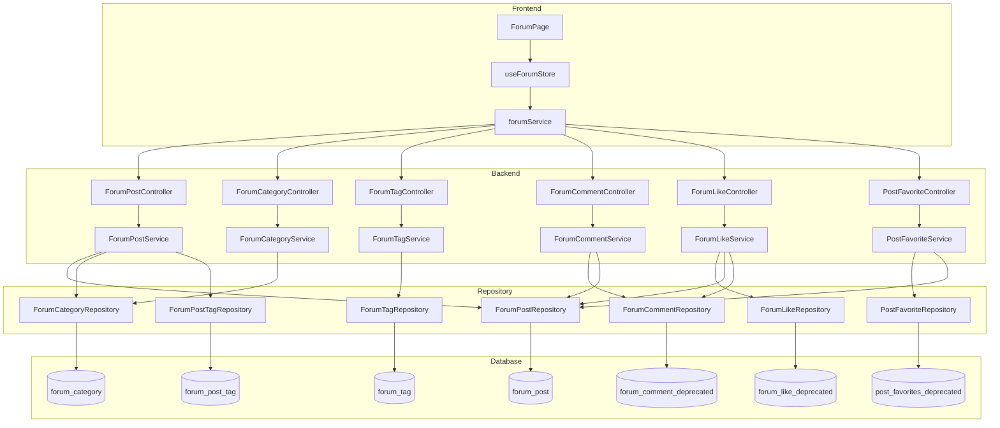
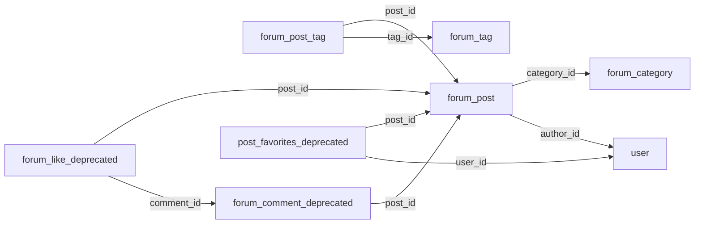
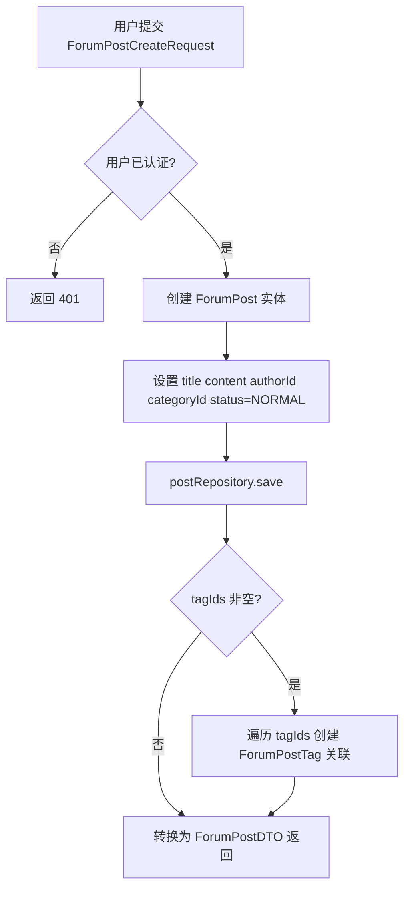
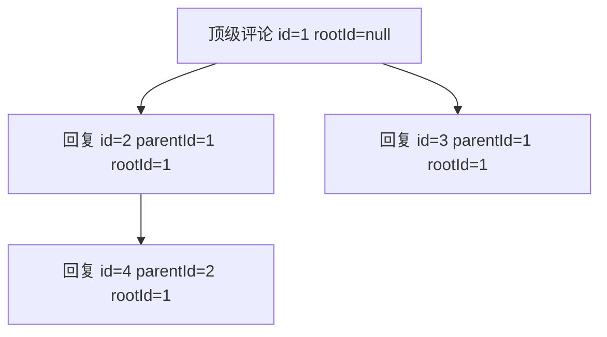
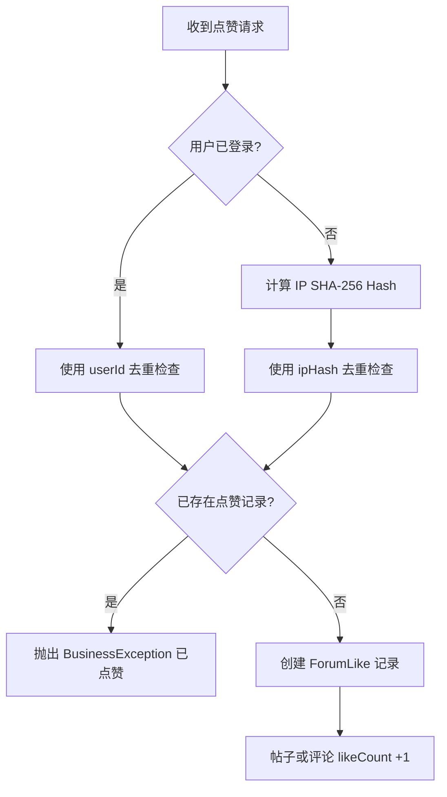

# 论坛社区模块

## 1. 模块简介

论坛社区是 CodingHub 平台的核心互动模块，为用户提供帖子发布、评论讨论、点赞互动、分类标签管理和帖子收藏等社区功能。该模块采用经典的 Spring Boot 三层架构（Controller - Service - Repository），前端使用 Vue 3 + Pinia 进行状态管理。

### 核心功能一览

| 功能 | 说明 | 状态 |
|------|------|------|
| 帖子 CRUD | 创建、查看、编辑、软删除帖子 | 活跃 |
| 评论系统 | 支持嵌套回复（parentId / rootId） | Deprecated（已迁移至统一评论） |
| 点赞机制 | 帖子/评论点赞，IP Hash 防匿名刷赞 | Deprecated（已迁移至统一点赞） |
| 分类管理 | 论坛分类列表，按 sortOrder 排序 | 活跃 |
| 标签管理 | 标签 CRUD、热门标签（Top 10） | 活跃 |
| 帖子收藏 | 用户收藏帖子、检查收藏状态 | Deprecated |
| 评分算法 | 基于浏览/点赞/评论的加权热度评分 | 活跃 |

> **注意**：评论（`ForumCommentController`）、点赞（`ForumLikeController`）、收藏（`PostFavoriteController`）相关代码已标注 `@Deprecated`，表明项目正在向[统一互动](统一互动.md)模块迁移。帖子主体 CRUD 和分类标签管理仍为活跃状态。

---

## 2. 架构总览

### 2.1 模块架构图



### 2.2 数据库表关系



---

## 3. 帖子 CRUD 流程

### 3.1 API 端点

| 方法 | 路径 | 说明 | 认证 |
|------|------|------|------|
| `GET` | `/api/forum/posts` | 分页获取帖子列表 | 否 |
| `GET` | `/api/forum/posts/my` | 获取当前用户帖子 | 是 |
| `GET` | `/api/forum/posts/{id}` | 获取帖子详情（浏览量 +1） | 否 |
| `POST` | `/api/forum/posts` | 创建帖子 | 是 |
| `PUT` | `/api/forum/posts/{id}` | 更新帖子 | 是 |
| `DELETE` | `/api/forum/posts/{id}` | 软删除帖子 | 是 |

### 3.2 列表查询与筛选

`getPostList` 支持三种查询模式，按优先级依次判断：

1. **关键词搜索**：当 `keyword` 非空时，调用 `searchByTitle(keyword, NORMAL, pageable)` 按标题模糊搜索
2. **分类筛选**：当 `categoryId` 非空时，调用 `findByCategoryIdAndStatus(categoryId, NORMAL, pageable)`
3. **默认排序**：按创建时间倒序，调用 `findByStatusOrderByCreatedAtDesc(NORMAL, pageable)`

分页参数：`page`（默认 0）、`size`（默认 10），返回 Spring Data `Page<ForumPostDTO>`。

### 3.3 创建帖子流程



请求体 `ForumPostCreateRequest` 字段：

| 字段 | 类型 | 必填 | 说明 |
|------|------|------|------|
| `title` | String | 是 | 标题，最长 200 字符 |
| `content` | String | 是 | 正文内容（TEXT 类型） |
| `categoryId` | Long | 是 | 分类 ID |
| `tagIds` | List\<Long\> | 否 | 标签 ID 列表 |

### 3.4 权限控制

编辑和删除操作遵循 `isOwner || isAdmin` 原则：

```java
boolean isOwner = post.getAuthorId().equals(user.getId());
boolean isAdmin = user.getRole() == Role.ADMIN || user.getRole() == Role.SUPER_ADMIN;
if (!isOwner && !isAdmin) {
    throw new ForbiddenException("无权操作此内容");
}
```

详见 [认证与用户](认证与用户.md) 中的角色权限说明。

### 3.5 软删除机制

删除帖子不会物理删除数据库记录，而是将 `status` 设置为 `DELETED`：

```
ForumPostStatus: NORMAL | DELETED | HIDDEN
```

所有查询均过滤 `status = NORMAL` 的帖子，已删除帖子对用户不可见。

### 3.6 数据索引

`forum_post` 表定义了三个索引以优化查询性能：

| 索引名 | 列 | 用途 |
|--------|-----|------|
| `idx_forum_post_author` | `author_id` | 加速「我的帖子」查询 |
| `idx_forum_post_category` | `category_id` | 加速分类筛选 |
| `idx_forum_post_created` | `created_at` | 加速时间排序 |

---

## 4. 评论系统

> **状态**：`@Deprecated` - 已迁移至统一评论系统，参见 [统一互动](统一互动.md)。

### 4.1 API 端点

| 方法 | 路径 | 说明 | 认证 |
|------|------|------|------|
| `GET` | `/api/forum/posts/{postId}/comments` | 获取帖子评论列表 | 否 |
| `POST` | `/api/forum/posts/{postId}/comments` | 发表评论/回复 | 可选 |
| `DELETE` | `/api/forum/comments/{id}` | 删除评论 | 是（仅作者） |

### 4.2 嵌套回复模型

评论采用 **两级嵌套** 模型，通过 `parentId` 和 `rootId` 实现：

- **顶级评论**：`parentId = null`，`rootId = null`
- **回复评论**：`parentId` 指向被回复的评论，`rootId` 指向线程根评论



创建回复时的 `rootId` 计算逻辑：

```java
reply.setRootId(parent.getRootId() != null ? parent.getRootId() : parentId);
```

### 4.3 匿名评论支持

评论系统支持匿名发表：当用户未登录时，使用 `authorName` 字段存储昵称；已登录用户则通过 `authorId` 关联用户账号。

### 4.4 评论计数同步

- **发表评论**：帖子的 `commentCount + 1`
- **删除评论**：帖子的 `commentCount = max(0, commentCount - 1)`

### 4.5 数据模型

`ForumComment` 实体映射到 `forum_comment_deprecated` 表：

| 字段 | 类型 | 说明 |
|------|------|------|
| `id` | Long | 主键，自增 |
| `postId` | Long | 所属帖子 ID（NOT NULL） |
| `authorId` | Long | 作者用户 ID（可空，匿名时为空） |
| `authorName` | String(50) | 匿名作者昵称 |
| `parentId` | Long | 父评论 ID（回复时有值） |
| `rootId` | Long | 根评论 ID（线程标识） |
| `content` | TEXT | 评论内容（NOT NULL） |
| `likeCount` | Integer | 点赞数（默认 0） |
| `createdAt` | LocalDateTime | 创建时间 |

索引：`idx_forum_comment_post`（post_id）、`idx_forum_comment_root`（root_id）。

---

## 5. 点赞机制

> **状态**：`@Deprecated` - 已迁移至统一点赞系统，参见 [统一互动](统一互动.md)。

### 5.1 API 端点

| 方法 | 路径 | 说明 | 认证 |
|------|------|------|------|
| `POST` | `/api/forum/likes` | 点赞（帖子或评论） | 可选 |
| `DELETE` | `/api/forum/likes` | 取消点赞 | 可选 |

### 5.2 IP Hash 防刷机制

为防止匿名用户刷赞，系统对未登录用户的 IP 地址进行 SHA-256 哈希处理：

```java
private String hashIp(String ip) {
    MessageDigest md = MessageDigest.getInstance("SHA-256");
    byte[] hash = md.digest(ip.getBytes());
    return HexFormat.of().formatHex(hash);  // 64 字符十六进制字符串
}
```

**防刷策略**：

| 用户类型 | 去重标识 | 存储字段 |
|----------|----------|----------|
| 已登录用户 | `userId` | `user_id` |
| 匿名用户 | SHA-256(IP) | `ip_hash`（64 字符） |

### 5.3 点赞/取消点赞流程



取消点赞时，优先按 `userId` 查找，未找到再按 `ipHash` 查找，删除记录并将计数 `-1`（下限为 0）。

### 5.4 数据模型

`ForumLike` 实体映射到 `forum_like_deprecated` 表：

| 字段 | 类型 | 说明 |
|------|------|------|
| `id` | Long | 主键 |
| `postId` | Long | 帖子 ID（点赞帖子时有值） |
| `commentId` | Long | 评论 ID（点赞评论时有值） |
| `userId` | Long | 用户 ID（已登录时） |
| `ipHash` | String(64) | IP 的 SHA-256 哈希（匿名时） |
| `createdAt` | LocalDateTime | 点赞时间 |

---

## 6. 分类与标签管理

### 6.1 论坛分类

#### API 端点

| 方法 | 路径 | 说明 | 认证 |
|------|------|------|------|
| `GET` | `/api/forum/categories` | 获取所有分类（按 sortOrder 升序） | 否 |

#### 数据模型

`ForumCategory` 实体映射到 `forum_category` 表：

| 字段 | 类型 | 说明 |
|------|------|------|
| `id` | Long | 主键 |
| `name` | String(50) | 分类名称（UNIQUE, NOT NULL） |
| `description` | String(255) | 分类描述 |
| `sortOrder` | Integer | 排序权重（默认 0，升序排列） |
| `createdAt` | LocalDateTime | 创建时间 |

分类当前为只读接口，由管理员通过数据库直接管理。

### 6.2 标签系统

#### API 端点

| 方法 | 路径 | 说明 | 认证 |
|------|------|------|------|
| `GET` | `/api/forum/tags` | 获取所有标签 | 否 |
| `GET` | `/api/forum/tags/hot` | 获取热门标签（Top 10） | 否 |
| `POST` | `/api/forum/tags` | 创建标签 | 是 |

#### 热门标签算法

`getHotTags()` 通过 `findTop10ByOrderByPostCountDesc()` 查询 `postCount` 最高的前 10 个标签。

#### 标签创建

创建标签时会检查重名：

```java
if (tagRepository.findByName(name).isPresent()) {
    throw new DuplicateResourceException("标签已存在: " + name);
}
```

#### 数据模型

`ForumTag` 实体映射到 `forum_tag` 表：

| 字段 | 类型 | 说明 |
|------|------|------|
| `id` | Long | 主键 |
| `name` | String(50) | 标签名称（UNIQUE, NOT NULL） |
| `postCount` | Integer | 关联帖子数（默认 0） |
| `isSystem` | Boolean | 是否系统标签（默认 false） |
| `createdAt` | LocalDateTime | 创建时间 |

### 6.3 帖子-标签关联

帖子与标签通过中间表 `forum_post_tag` 实现多对多关系：

```
ForumPostTag (复合主键)
+-- postId  -> forum_post.id
+-- tagId   -> forum_tag.id
```

使用 `@IdClass` 定义复合主键，在创建帖子时批量插入关联记录。

---

## 7. 帖子收藏

> **状态**：`@Deprecated` - 收藏功能正在迁移中。

### 7.1 API 端点

| 方法 | 路径 | 说明 | 认证 |
|------|------|------|------|
| `POST` | `/api/v1/post-favorites/{postId}` | 收藏帖子 | 是 |
| `DELETE` | `/api/v1/post-favorites/{postId}` | 取消收藏 | 是 |
| `GET` | `/api/v1/post-favorites` | 获取用户收藏列表 | 是 |
| `GET` | `/api/v1/post-favorites/posts` | 获取收藏的帖子详情 | 是 |
| `GET` | `/api/v1/post-favorites/check/{postId}` | 检查是否已收藏 | 是 |

### 7.2 核心逻辑

- **添加收藏**：幂等操作，已存在则直接返回现有记录
- **取消收藏**：通过 `userId + postId` 联合定位并删除
- **查询收藏帖子**：先获取收藏记录中的 `postId` 列表，再通过 `findAllById` 批量查询帖子详情

### 7.3 认证方式

收藏控制器未使用 `@AuthenticationPrincipal`，而是手动从 `Authorization` Header 中提取 JWT Token 获取用户 ID：

```java
private Long getUserId(HttpServletRequest request) {
    String authHeader = request.getHeader("Authorization");
    String token = authHeader.substring(7);
    return jwtUtil.getUserIdFromToken(token);
}
```

详见 [认证与用户](认证与用户.md) 中 JWT 认证流程。

### 7.4 数据模型

`PostFavorite` 实体映射到 `post_favorites_deprecated` 表：

| 字段 | 类型 | 说明 |
|------|------|------|
| `id` | Long | 主键 |
| `userId` | Long | 用户 ID（NOT NULL） |
| `postId` | Long | 帖子 ID（NOT NULL） |
| `createdAt` | LocalDateTime | 收藏时间 |

唯一约束：`UNIQUE(user_id, post_id)`，防止数据库层面重复收藏。

---

## 8. 评分算法

### 8.1 热度评分公式

每个帖子维护一个 `score` 字段（`BigDecimal`, precision=10, scale=2），用于衡量帖子热度：

```
score = viewCount * 1 + likeCount * 3 + commentCount * 5
```

| 指标 | 权重 | 说明 |
|------|------|------|
| 浏览量 `viewCount` | 1 | 基础热度指标 |
| 点赞数 `likeCount` | 3 | 社区认可度 |
| 评论数 `commentCount` | 5 | 深度互动权重最高 |

### 8.2 评分更新时机

评分在 **查看帖子详情** 时更新（`getPostById`）：

```java
post.setViewCount(post.getViewCount() + 1);
post.updateScore();
postRepository.save(post);
```

每次访问详情页，浏览量 +1 并重新计算评分。这意味着：
- 评分是 **读时更新** 而非定时任务
- 高频访问的帖子评分增长更快
- 评分反映的是帖子的综合活跃程度

---

## 9. 前端状态管理

### 9.1 Pinia Store 结构

`useForumStore`（定义于 `frontend/src/stores/forum.ts`）管理论坛模块的全局状态：

```typescript
// State 结构
{
  posts: ForumPost[],           // 帖子列表
  currentPost: ForumPost | null, // 当前查看的帖子
  categories: ForumCategory[],  // 分类列表
  tags: ForumTag[],             // 标签列表
  pagination: {
    page: number,               // 当前页码（从 0 开始）
    size: number,               // 每页条数（默认 10）
    totalElements: number,      // 总记录数
    totalPages: number           // 总页数
  },
  loading: boolean              // 加载状态
}
```

### 9.2 Store Actions

| Action | 说明 |
|--------|------|
| `fetchPosts(params?)` | 获取帖子列表，支持分类/标签/关键词筛选和分页 |
| `fetchPostById(id)` | 获取帖子详情并设置 `currentPost` |
| `fetchCategories()` | 加载分类列表 |
| `fetchTags()` | 加载标签列表 |
| `fetchMyPosts()` | 获取当前用户发布的帖子 |
| `deletePost(id)` | 删除帖子并从本地状态移除，返回 `{ success, errorCode? }` |

### 9.3 错误映射

`deletePost` 方法内置了 HTTP 状态码到错误码的映射：

| HTTP 状态码 | 错误码 | 含义 |
|-------------|--------|------|
| 401 | `AUTH` | 未认证 |
| 403 | `FORBIDDEN` | 无权限 |
| 404 | `NOT_FOUND` | 资源不存在 |
| 其他 | `UNKNOWN` | 未知错误 |

### 9.4 API 服务层

`forumService`（定义于 `frontend/src/services/forum.ts`）封装了所有论坛相关的 HTTP 请求：

- 使用独立的 Axios 实例 `forumApi`，`baseURL` 为 `/api/forum`，超时 60 秒
- 通过请求拦截器自动从 `useAuthStore` 获取 `accessToken` 并添加到 `Authorization` Header
- 所有方法返回 Promise，供 Store 或组件直接调用

### 9.5 TypeScript 类型定义

定义于 `frontend/src/types/forum.ts`，与后端 DTO 一一对应：

| 前端类型 | 对应后端 DTO | 关键字段 |
|----------|-------------|----------|
| `ForumPost` | `ForumPostDTO` | id, title, content, authorId, authorName, viewCount, likeCount, commentCount |
| `ForumPostCreateRequest` | `ForumPostCreateRequest` | title, content, categoryId, tagIds |
| `ForumComment` | `ForumCommentDTO` | id, postId, parentId, rootId, content, likeCount |
| `ForumCategory` | `ForumCategoryDTO` | id, name, description, sortOrder, postCount |
| `ForumTag` | `ForumTagDTO` | id, name, postCount, isSystem |
| `ForumLikeRequest` | `ForumLikeRequest` | postId, commentId（二选一） |
| `PageResponse<T>` | Spring `Page<T>` | content, totalElements, totalPages, size, number |

---

## 10. 交叉引用

- [认证与用户](认证与用户.md) - JWT 认证流程、用户角色（USER / ADMIN / SUPER_ADMIN）、`@AuthenticationPrincipal` 注入机制
- [统一互动](统一互动.md) - 评论、点赞、收藏等互动功能的统一实现（正在替代本模块中的 Deprecated 部分）