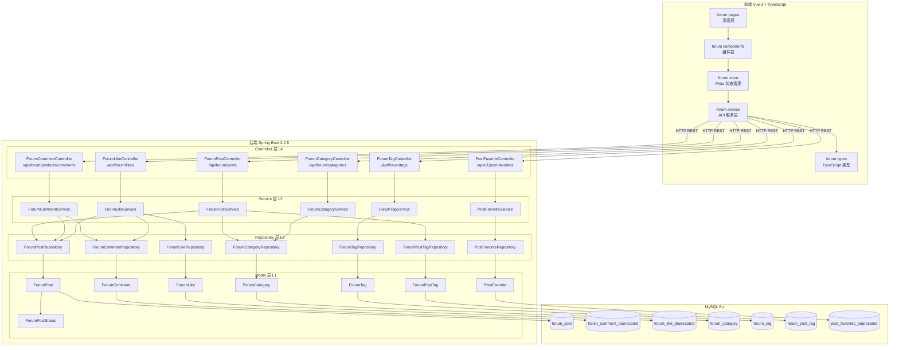
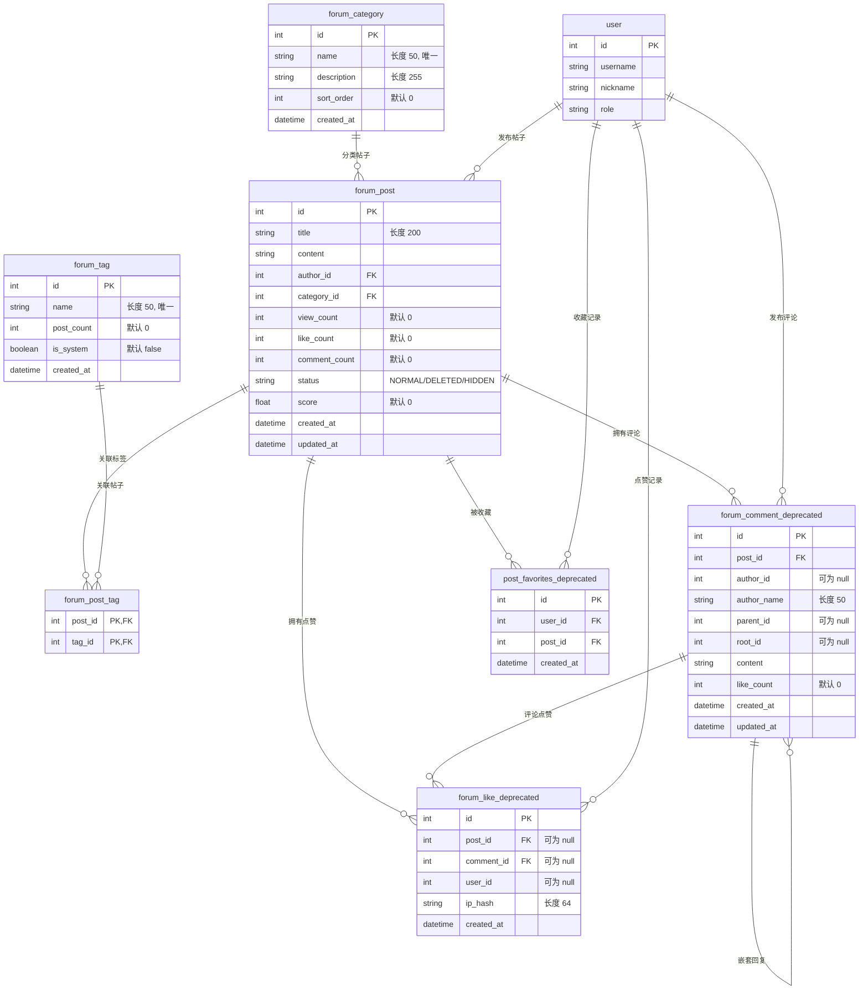
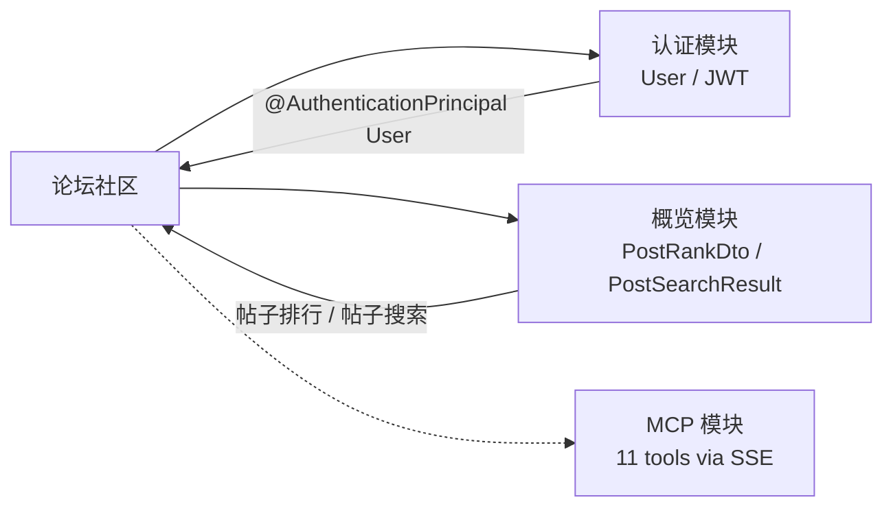

# 论坛社区模块

## 1. 模块概述

论坛社区（Forum）是 CodingHub 平台的核心互动模块，为用户提供技术交流平台。该模块包含以下核心功能：

- **帖子管理**：支持帖子的创建、编辑、删除、分页浏览和关键词搜索
- **评论系统**：支持嵌套回复的多级评论，支持匿名与登录用户评论
- **点赞系统**：支持帖子和评论的点赞/取消点赞，未登录用户通过 IP 哈希匿名点赞
- **分类管理**：按类别组织帖子，支持排序展示
- **标签系统**：支持帖子关联标签，提供热门标签排行
- **收藏功能**：用户可收藏感兴趣的帖子

> **注意**：部分子系统（评论、点赞、收藏）已标记为 `@Deprecated`，表明这些功能正在进行重构或迁移。

## 2. 架构总览



## 3. 帖子管理

### 3.1 ForumPostController

`ForumPostController` 是帖子管理的核心控制器，路径前缀为 `/api/forum/posts`，提供完整的 CRUD 操作。

| 方法 | HTTP 方法 | 路径 | 功能 | 认证要求 |
|------|-----------|------|------|----------|
| `getPostList` | GET | `/` | 获取帖子分页列表 | 无 |
| `getMyPosts` | GET | `/my` | 获取当前用户帖子 | 需要 |
| `getPostById` | GET | `/{id}` | 获取帖子详情 | 无 |
| `createPost` | POST | `/` | 创建帖子 | 需要 |
| `updatePost` | PUT | `/{id}` | 更新帖子 | 需要（owner 或 admin） |
| `deletePost` | DELETE | `/{id}` | 删除帖子（软删除） | 需要（owner 或 admin） |

### 3.2 帖子列表查询

`getPostList` 支持三种查询模式：

1. **关键词搜索**：当 `keyword` 参数非空时，使用 `LIKE %keyword%` 按标题搜索，仅返回 `NORMAL` 状态帖子
2. **分类筛选**：当 `category` 参数非空时，按分类 ID 过滤
3. **默认列表**：按创建时间倒序返回全部 `NORMAL` 状态帖子

分页参数：`page`（默认 0）、`size`（默认 10）。

### 3.3 帖子状态管理

帖子使用 `ForumPostStatus` 枚举管理生命周期状态：

| 状态 | 说明 |
|------|------|
| `NORMAL` | 正常展示 |
| `DELETED` | 软删除，不可见 |
| `HIDDEN` | 隐藏，不可见 |

删除操作采用软删除策略：将 `status` 设为 `DELETED`，不物理删除数据库记录。

### 3.4 权限控制

更新和删除操作遵循 `isOwner || isAdmin` 权限模型：

- **owner**：帖子的 `authorId` 等于当前用户 ID
- **admin**：用户角色为 `ADMIN` 或 `SUPER_ADMIN`
- 无权限时抛出 `ForbiddenException`

### 3.5 浏览量与积分

- **浏览量**：调用 `getPostById` 时自动 `viewCount + 1`
- **积分计算**：`score = viewCount × 1 + likeCount × 3 + commentCount × 5`，用于帖子排行

### 3.6 DTO 定义

**ForumPostDTO**（帖子响应）：

| 字段 | 类型 | 说明 |
|------|------|------|
| `id` | `Long` | 帖子 ID |
| `title` | `String` | 标题 |
| `content` | `String` | 内容（TEXT） |
| `authorId` | `Long` | 作者 ID |
| `authorName` | `String` | 作者用户名 |
| `authorNickname` | `String` | 作者昵称 |
| `categoryId` | `Long` | 分类 ID |
| `categoryName` | `String` | 分类名称 |
| `viewCount` | `Integer` | 浏览量 |
| `likeCount` | `Integer` | 点赞数 |
| `commentCount` | `Integer` | 评论数 |
| `createdAt` | `LocalDateTime` | 创建时间 |
| `updatedAt` | `LocalDateTime` | 更新时间 |

**ForumPostCreateRequest**（创建/更新请求）：

| 字段 | 类型 | 约束 | 说明 |
|------|------|------|------|
| `title` | `String` | `@NotBlank` | 标题 |
| `content` | `String` | `@NotBlank` | 内容 |
| `categoryId` | `Long` | `@NotNull` | 分类 ID |
| `tagIds` | `List<Long>` | 可选 | 关联标签 ID 列表 |

## 4. 评论系统

> 当前评论系统已标记为 `@Deprecated`，数据库表为 `forum_comment_deprecated`，后续可能迁移至新实现。

### 4.1 ForumCommentController

路径基于帖子资源嵌套设计，提供以下端点：

| 方法 | HTTP 方法 | 路径 | 功能 | 认证要求 |
|------|-----------|------|------|----------|
| `getCommentsByPostId` | GET | `/api/forum/posts/{postId}/comments` | 获取帖子评论列表 | 无 |
| `createComment` | POST | `/api/forum/posts/{postId}/comments` | 创建评论/回复 | 可选 |
| `deleteComment` | DELETE | `/api/forum/comments/{id}` | 删除评论 | 需要（仅作者） |

### 4.2 嵌套回复机制

评论系统支持多级嵌套回复，通过 `parentId` 和 `rootId` 两个字段实现树形结构：

- **顶级评论**：`parentId` 为 `null`，`rootId` 为 `null`
- **一级回复**：`parentId` 指向被回复的评论 ID，`rootId` 等于 `parentId`
- **多级回复**：`parentId` 指向被回复的评论 ID，`rootId` 继承自父评论的 `rootId`（若父评论无 `rootId`，则取父评论 ID）

回复创建流程：

```
用户提交回复 → 查找父评论 → 设置 parentId
                           → 设置 rootId = parent.rootId ?? parent.id
                           → 保存到数据库
```

### 4.3 匿名评论支持

评论系统同时支持登录用户和匿名用户：

- **登录用户**：自动使用 `user.getId()` 作为 `authorId`，`authorName` 设为 `null`
- **匿名用户**：`authorId` 为 `null`，使用请求体中的 `authorName` 作为显示名

### 4.4 评论计数同步

- **创建评论**：对应帖子的 `commentCount + 1`
- **删除评论**：对应帖子的 `commentCount` 减 1（最小为 0，使用 `Math.max(0, count - 1)`）

### 4.5 ForumCommentDTO

| 字段 | 类型 | 说明 |
|------|------|------|
| `id` | `Long` | 评论 ID |
| `postId` | `Long` | 所属帖子 ID |
| `authorId` | `Long` | 作者 ID（匿名时为 null） |
| `authorName` | `String` | 匿名作者名称 |
| `authorNickname` | `String` | 登录用户昵称 |
| `parentId` | `Long` | 父评论 ID |
| `rootId` | `Long` | 根评论 ID |
| `content` | `String` | 评论内容 |
| `likeCount` | `Integer` | 点赞数 |
| `createdAt` | `LocalDateTime` | 创建时间 |

## 5. 点赞系统

> 当前点赞系统已标记为 `@Deprecated`，数据库表为 `forum_like_deprecated`。

### 5.1 ForumLikeController

路径前缀为 `/api/forum/likes`，使用 `POST` 和 `DELETE` 操作同一端点：

| 方法 | HTTP 方法 | 路径 | 功能 | 认证要求 |
|------|-----------|------|------|----------|
| `like` | POST | `/` | 点赞 | 可选 |
| `unlike` | DELETE | `/` | 取消点赞 | 可选 |

### 5.2 匿名 IP 点赞机制

点赞系统的核心特性是支持未登录用户通过 IP 地址匿名点赞：

1. **登录用户**：使用 `userId` 标识，`ipHash` 为 `null`
2. **匿名用户**：`userId` 为 `null`，使用 IP 地址的 SHA-256 哈希值标识

IP 哈希算法：

```
原始 IP → SHA-256 摘要 → HexFormat 十六进制字符串（64 字符）
```

使用哈希而非明文存储 IP，保护用户隐私。

### 5.3 点赞目标

通过 `ForumLikeRequest` 区分点赞目标：

- `postId` 非空 → 对帖子点赞/取消点赞
- `commentId` 非空 → 对评论点赞
- 两者必须且只能选一个（在 DTO 构造器中校验）

### 5.4 防重复点赞

- **登录用户**：通过 `existsByUserIdAndPostId` / `existsByUserIdAndCommentId` 检查
- **匿名用户**：通过 `existsByIpHashAndPostId` / `existsByIpHashAndCommentId` 检查
- 重复点赞抛出 `BusinessException("已点赞")`

### 5.5 取消点赞

取消点赞的查找策略（以帖子为例）：

1. 先按 `userId + postId` 查找
2. 若未找到，再按 `ipHash + postId` 查找
3. 找到后物理删除记录，并更新帖子的 `likeCount`（最小为 0）

## 6. 分类与标签管理

### 6.1 分类管理（ForumCategoryController）

路径前缀为 `/api/forum/categories`，当前仅提供查询接口：

| 方法 | HTTP 方法 | 路径 | 功能 |
|------|-----------|------|------|
| `getAllCategories` | GET | `/` | 获取所有分类（按 sortOrder 升序） |

分类实体字段：

| 字段 | 类型 | 说明 |
|------|------|------|
| `id` | `Long` | 分类 ID |
| `name` | `String(50)` | 分类名称（唯一） |
| `description` | `String(255)` | 分类描述 |
| `sortOrder` | `Integer` | 排序权重（升序） |
| `createdAt` | `LocalDateTime` | 创建时间 |

### 6.2 标签管理（ForumTagController）

路径前缀为 `/api/forum/tags`，提供查询和创建功能：

| 方法 | HTTP 方法 | 路径 | 功能 |
|------|-----------|------|------|
| `getAllTags` | GET | `/` | 获取所有标签 |
| `getHotTags` | GET | `/hot` | 获取热门标签（Top 10） |
| `createTag` | POST | `/` | 创建标签 |

标签实体字段：

| 字段 | 类型 | 说明 |
|------|------|------|
| `id` | `Long` | 标签 ID |
| `name` | `String(50)` | 标签名称（唯一） |
| `postCount` | `Integer` | 关联帖子数量 |
| `isSystem` | `Boolean` | 是否系统标签 |
| `createdAt` | `LocalDateTime` | 创建时间 |

热门标签通过 `findTop10ByOrderByPostCountDesc` 查询，按 `postCount` 降序返回前 10 个。

创建标签时会检查名称唯一性，重复则抛出 `DuplicateResourceException`。

### 6.3 帖子-标签关联

帖子与标签通过中间表 `forum_post_tag` 实现多对多关系：

- 使用 `@IdClass` 复合主键（`postId` + `tagId`）
- 创建帖子时，遍历 `tagIds` 列表逐条插入关联记录
- `ForumPostTagRepository` 继承 `JpaRepository<ForumPostTag, Long>`

## 7. 帖子收藏

> 当前收藏功能已标记为 `@Deprecated`，数据库表为 `post_favorites_deprecated`。

### 7.1 PostFavoriteController

路径前缀为 `/api/v1/post-favorites`，通过 JWT token 从请求头解析用户身份：

| 方法 | HTTP 方法 | 路径 | 功能 | 认证要求 |
|------|-----------|------|------|----------|
| `addFavorite` | POST | `/{postId}` | 添加收藏 | 需要 |
| `removeFavorite` | DELETE | `/{postId}` | 取消收藏 | 需要 |
| `getUserFavorites` | GET | `/` | 获取收藏记录列表 | 需要 |
| `getUserFavoritePosts` | GET | `/posts` | 获取收藏的帖子详情 | 需要 |
| `checkFavorite` | GET | `/{postId}/check` | 检查是否已收藏 | 需要 |

收藏实体通过 `@UniqueConstraint(columnNames = {"user_id", "post_id"})` 确保用户对同一帖子只能收藏一次。

## 8. 数据模型关系



### 索引设计

| 表名 | 索引名 | 字段 | 用途 |
|------|--------|------|------|
| `forum_post` | `idx_forum_post_author` | `author_id` | 按作者查询帖子 |
| `forum_post` | `idx_forum_post_category` | `category_id` | 按分类筛选帖子 |
| `forum_post` | `idx_forum_post_created` | `created_at` | 按时间排序 |
| `forum_comment_deprecated` | `idx_forum_comment_post` | `post_id` | 按帖子查评论 |
| `forum_comment_deprecated` | `idx_forum_comment_root` | `root_id` | 按根评论查回复链 |

## 9. API 端点汇总

### 9.1 帖子接口

| 方法 | 端点 | 说明 | 请求参数 |
|------|------|------|----------|
| GET | `/api/forum/posts` | 帖子列表 | `category`, `tag`, `keyword`, `page`, `size` |
| GET | `/api/forum/posts/my` | 我的帖子 | `page`, `size` |
| GET | `/api/forum/posts/{id}` | 帖子详情 | - |
| POST | `/api/forum/posts` | 创建帖子 | Body: `ForumPostCreateRequest` |
| PUT | `/api/forum/posts/{id}` | 更新帖子 | Body: `ForumPostCreateRequest` |
| DELETE | `/api/forum/posts/{id}` | 删除帖子 | - |

### 9.2 评论接口

| 方法 | 端点 | 说明 | 请求参数 |
|------|------|------|----------|
| GET | `/api/forum/posts/{postId}/comments` | 评论列表 | - |
| POST | `/api/forum/posts/{postId}/comments` | 创建评论/回复 | Body: `ForumCommentCreateRequest` |
| DELETE | `/api/forum/comments/{id}` | 删除评论 | - |

### 9.3 点赞接口

| 方法 | 端点 | 说明 | 请求参数 |
|------|------|------|----------|
| POST | `/api/forum/likes` | 点赞 | Body: `ForumLikeRequest` |
| DELETE | `/api/forum/likes` | 取消点赞 | Body: `ForumLikeRequest` |

### 9.4 分类接口

| 方法 | 端点 | 说明 |
|------|------|------|
| GET | `/api/forum/categories` | 获取所有分类 |

### 9.5 标签接口

| 方法 | 端点 | 说明 |
|------|------|------|
| GET | `/api/forum/tags` | 获取所有标签 |
| GET | `/api/forum/tags/hot` | 获取热门标签 |
| POST | `/api/forum/tags` | 创建标签 |

### 9.6 收藏接口

| 方法 | 端点 | 说明 |
|------|------|------|
| POST | `/api/v1/post-favorites/{postId}` | 添加收藏 |
| DELETE | `/api/v1/post-favorites/{postId}` | 取消收藏 |
| GET | `/api/v1/post-favorites` | 获取收藏列表 |
| GET | `/api/v1/post-favorites/posts` | 获取收藏帖子详情 |
| GET | `/api/v1/post-favorites/{postId}/check` | 检查是否已收藏 |

## 10. 前端实现

### 10.1 TypeScript 类型定义

前端在 `frontend/src/types/forum.ts` 中定义了与后端 DTO 对应的 TypeScript 接口，包含 `ForumPost`、`ForumComment`、`ForumCategory`、`ForumTag`、`ForumLikeRequest`、`ForumPostCreateRequest`、`ForumCommentCreateRequest`，以及通用分页响应类型 `PageResponse<T>`。

前端 `ForumPost` 类型比后端 DTO 多出 `authorAvatarUrl`、`isFavorited`、`favoriteCount` 等展示相关字段。

### 10.2 API 服务层

`frontend/src/services/forum.ts` 封装了所有论坛相关的 HTTP 请求，使用 `forumApi`（基于 axios 的封装实例）统一处理请求前缀和认证 header。

### 10.3 Pinia Store

`frontend/src/stores/forum.ts` 使用 Pinia 管理论坛状态，提供以下 actions：

| Action | 说明 |
|--------|------|
| `fetchPosts` | 获取帖子列表，支持筛选和分页 |
| `fetchPostById` | 获取帖子详情 |
| `fetchCategories` | 获取分类列表 |
| `fetchTags` | 获取标签列表 |
| `fetchMyPosts` | 获取我的帖子 |
| `deletePost` | 删除帖子，返回 `{success, errorCode?}` |

Store 内部通过 `_mapErrorToCode` 将 HTTP 错误状态码映射为业务错误码：`401 → AUTH`、`403 → FORBIDDEN`、`404 → NOT_FOUND`。

## 11. 与其他模块的关系



| 关联模块 | 关系说明 |
|----------|----------|
| **认证模块** | 帖子、评论、点赞、收藏的创建和权限控制依赖 `User` 实体和 JWT 认证；使用 `@AuthenticationPrincipal User` 注入当前用户 |
| **用户模块** | `ForumPostService.toDTO` 通过 `UserRepository` 查询作者用户名和昵称 |
| **概览模块** | 使用 `PostRankDto` 提供帖子排行数据，使用 `PostSearchResult` 提供帖子搜索结果；帖子积分公式为排行算法提供数据支撑 |
| **MCP 模块** | 论坛帖子数据可通过 MCP SSE 端点暴露给外部 AI 工具调用 |
| **异常处理** | 使用全局异常体系：`ResourceNotFoundException`（资源不存在）、`ForbiddenException`（无权限）、`BusinessException`（业务异常）、`DuplicateResourceException`（重复资源） |

## 12. 技术要点与注意事项

1. **软删除策略**：帖子删除仅修改 `status` 字段，查询时自动过滤非 `NORMAL` 状态记录
2. **Deprecated 标记**：评论、点赞、收藏子系统及其数据表均已标记 `@Deprecated`，表明正在进行架构迁移
3. **N+1 查询**：`ForumPostService.toDTO` 中对每条帖子都单独查询 `categoryRepository` 和 `userRepository`，存在 N+1 性能风险，建议优化为 JOIN 查询或批量查询
4. **事务管理**：创建帖子、更新帖子、创建评论、点赞/取消点赞等写操作均使用 `@Transactional` 保证数据一致性
5. **XSS 防护**：根据项目约束，用户输入应通过 `XssSanitizer.sanitize()` 处理
6. **IP 隐私保护**：匿名点赞使用 SHA-256 哈希存储 IP，不保存明文 IP 地址
