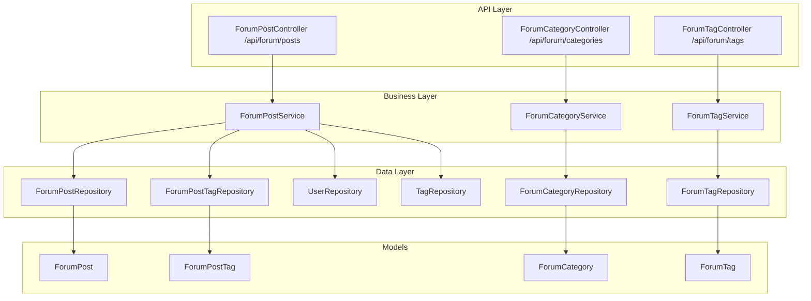
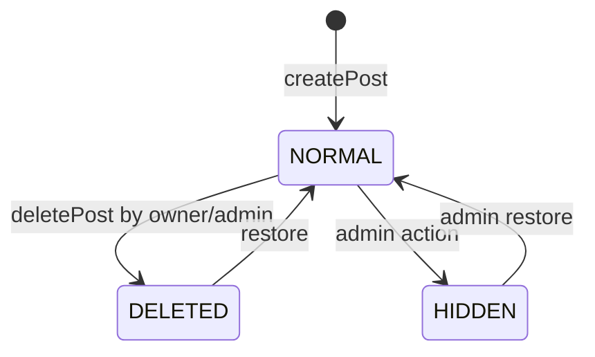
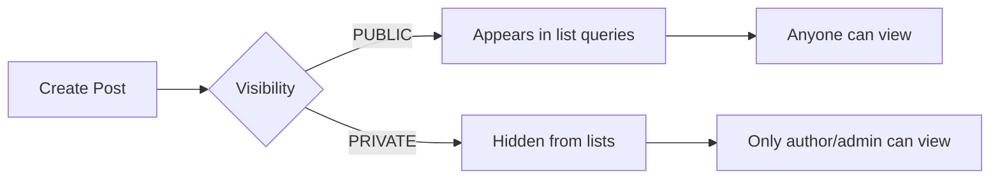

# 论坛社区模块

## 模块概述

论坛社区是 CodingHub 的知识分享和讨论平台，提供帖子发布/编辑/删除、分类浏览、标签管理、置顶、热度排行等功能。帖子支持公开/私有两种可见性设置，互动功能（点赞、评论、收藏）通过 [统一互动](统一互动.md) 模块实现。

## 架构图

## 核心组件

### ForumPost — 帖子实体

映射 `forum_post` 表的核心实体：

- `title` / `content` / `authorId` / `categoryId`
- `viewCount` / `likeCount` / `commentCount` / `score`（BigDecimal）
- `status`（NORMAL/DELETED/HIDDEN 软删除）
- `pinned`（Boolean 管理员置顶）
- `visibility`（PUBLIC/PRIVATE 可见性）

**热度分数公式**：`score = viewCount * 1 + likeCount * 3 + commentCount * 5`（与工具市场一致）

### ForumPostVisibility — 可见性枚举

- `PUBLIC`：所有用户可见，出现在列表查询中
- `PRIVATE`：仅作者和管理员可见，列表查询自动过滤

### ForumPostStatus — 状态枚举

帖子生命周期：`NORMAL`（正常）、`DELETED`（已删除）、`HIDDEN`（已隐藏）

### ForumCategory — 论坛分类

分类实体，包含 `name`、`description`、`sortOrder`，用于组织帖子。

### ForumTag / ForumPostTag — 标签系统

论坛标签通过 `ForumPostTag` 多对多关联表与帖子关联。标签维护 `usageCount` 计数器，在关联/解除关联时自动增减。

### ForumPostService — 帖子服务

核心业务逻辑：

- **列表查询**：支持分类/标签/关键词过滤，latest/hot 排序。仅返回 PUBLIC 帖子
- **详情查看**：PRIVATE 帖子仅作者/管理员可访问。自动增加浏览量和重算分数
- **CRUD**：创建时保存标签关联；更新时替换标签（旧标签减计数、新标签加计数）；删除为软删除
- **置顶**：管理员操作，影响排序
- **Hot Top5**：按分数返回前 5 个帖子 ID

## 前端集成

- **类型定义**：`frontend/src/types/forum.ts` — ForumPost、ForumComment、ForumCategory、ForumTag 等
- **API 服务**：`frontend/src/services/forum.ts` — 帖子 CRUD、评论、点赞、分类/标签查询
- **状态管理**：`frontend/src/stores/forum.ts` — Pinia Store，封装帖子列表、详情、分类、标签的响应式状态

## 帖子生命周期

## 帖子可见性流程

## 设计要点

- **软删除**：帖子使用 `ForumPostStatus.DELETED` 而非物理删除
- **可见性过滤**：PRIVATE 帖子在列表查询中自动排除
- **标签计数同步**：更新帖子标签时，旧标签 `usageCount` 递减，新标签递增
- **互动计数器**：点赞/评论变更时，直接修改帖子的 `likeCount`/`commentCount` 并重算 `score`
- **所有权检查**：修改/删除操作验证 `isOwner || isAdmin`

## 交叉引用

- [统一互动](统一互动.md) — 帖子的点赞、评论、收藏实现
- [标签系统](标签系统.md) — 统一标签系统
- [认证与用户](认证与用户.md) — 用户认证和权限
- [MCP协议](MCP协议.md) — MCP 帖子搜索

<!-- crosslinks (auto-generated) -->
## Related Modules
- Depends on: [标签系统](标签系统.md)
- Used by: [MCP协议](mcp协议.md)
