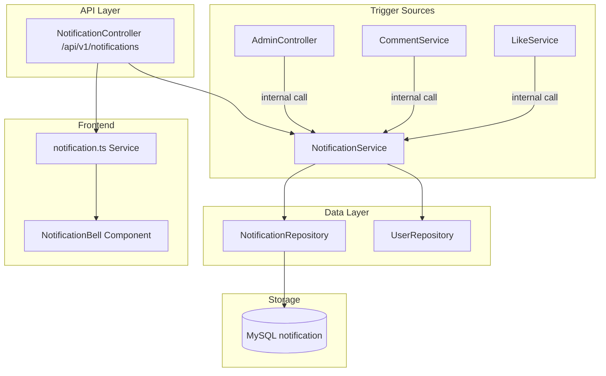
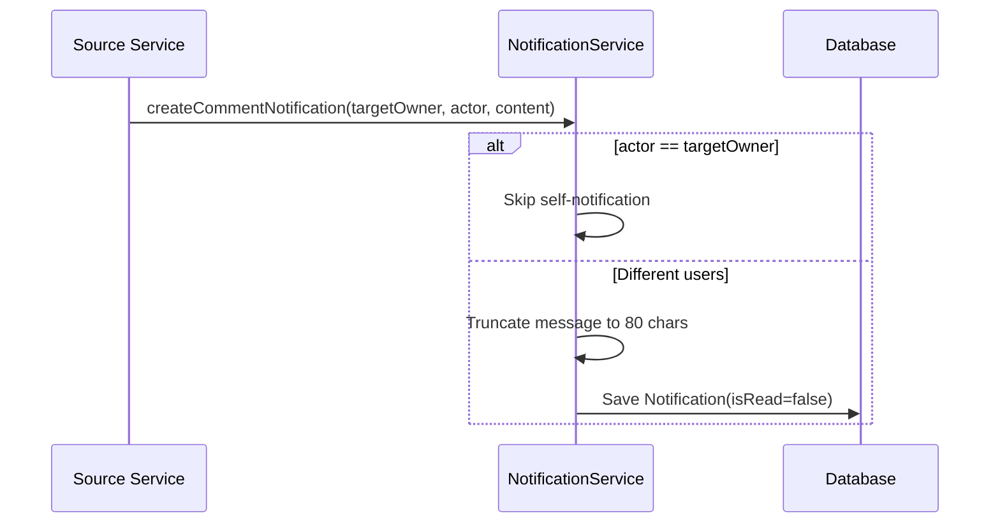

# 通知系统模块

## 模块概述

通知系统为 CodingHub 提供站内消息推送能力，当用户对内容进行点赞、评论或管理员执行审批操作时，自动向目标用户发送通知。支持未读计数、单条/全部标记已读，并通过 NotificationBell 组件在前端实时展示。

## 架构图

## 核心组件

### Notification — 通知实体

映射 `notification` 表：

- `user`（ManyToOne，接收者）
- `type`（NotificationType 枚举）
- `targetType`（TOOL/FORUM_POST/VIDEO）/ `targetId`
- `message` / `actorId` / `actorName`
- `isRead`（Boolean，默认 false）

### NotificationType — 通知类型枚举

通知触发场景：`COMMENT_REPLY`（评论回复）、`LIKE`（点赞）、`ADMIN_APPROVED`（审批通过）等。

### NotificationService — 通知服务

核心业务逻辑：

**读取侧（API 暴露）**：
- `getNotifications()` — 分页获取当前用户通知
- `getUnreadCount()` — 未读计数
- `markAsRead()` — 单条标记已读（所有权检查）
- `markAllAsRead()` — 全部标记已读

**写入侧（内部调用）**：
- `createCommentNotification()` — 评论通知（跳过自己评论自己）
- `createLikeNotification()` — 点赞通知
- `createAdminNotification()` — 审批通知

### NotificationController — 通知控制器

REST 端点 `/api/v1/notifications`：

- `GET /` — 分页通知列表
- `GET /unread-count` — 未读计数
- `PUT /{id}/read` — 单条标记已读
- `PUT /read-all` — 全部标记已读

## 前端集成

- **API 服务**：`frontend/src/services/notification.ts` — 获取通知、未读计数、标记已读
- **组件**：NotificationBell — 展示未读计数和通知列表

## 通知创建流程

## 设计要点

- **内部工厂方法**：通知创建不通过 API 暴露，而是由其他服务内部调用
- **自我通知防护**：操作者 == 目标所有者时跳过通知
- **消息截断**：评论内容截断至 80 字符作为预览
- **未读计数优化**：独立端点避免加载全量通知

## 交叉引用

- [统一互动](统一互动.md) — 触发点赞/评论通知
- [认证与用户](认证与用户.md) — 触发审批通知
- [前端基础](前端基础.md) — NotificationBell 组件

<!-- crosslinks (auto-generated) -->
## Related Modules
- Depends on: [认证与用户](认证与用户.md)
