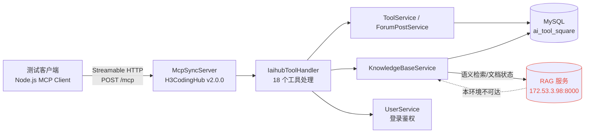
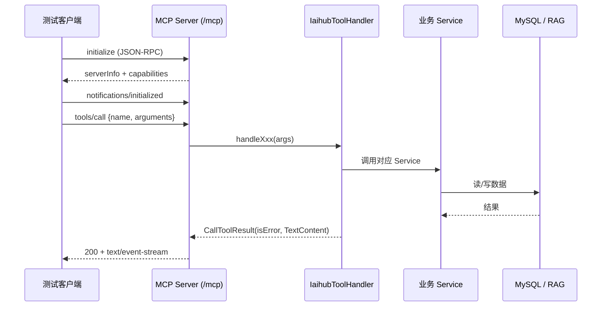
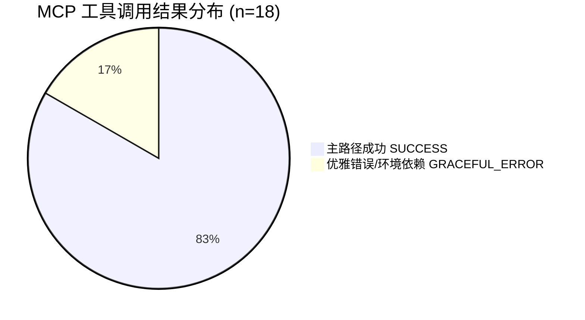

# CodingHub MCP 功能测试报告（测试版）

> 生成时间：2026/7/12 08:55:09（Asia/Shanghai）　|　测试对象：H3CodingHub-MCP-Server v2.0.0
> 传输协议：Streamable HTTP `/mcp`（兼容 SSE `/sse`）　|　测试账号：`wangbao`（密码经离线 bcrypt 校验）

## 1. 结论摘要

| 指标 | 结果 |
|------|------|
| 注册工具总数 | **18** |
| 可调用（HTTP 200，返回结构化结果） | **18/18** |
| 主路径成功（SUCCESS） | 15 |
| 优雅错误 / 环境依赖（GRACEFUL_ERROR） | 3 |
| 服务端崩溃（SERVER_ERROR / 畸形响应） | 0 |
| 总体结论 | **✅ 全部 18 个工具可用，无服务端崩溃** |

> 说明：3 个 GRACEFUL_ERROR 均为**预期/环境性**结果——
> - `h3_coding_hub_tool_file_delete`：对不存在的文件返回业务错误（安全删除校验，未破坏数据）；
> - `h3_coding_hub_kb_search` / `h3_coding_hub_kb_document_status`：依赖 **RAG 服务**（`http://172.53.3.98:8000`，本环境不可达），返回清晰的“RAG 服务不可用”错误，属优雅降级，非代码缺陷。

## 2. 测试环境

| 组件 | 状态 | 说明 |
|------|------|------|
| 后端 (Spring Boot) | ✅ 运行中 | `localhost:8082`，MCP 端点 `/mcp` 与 `/sse` 均可用 |
| MySQL 8 | ✅ 运行中 | `localhost:3306/ai_tool_square`，数据可用（工具 5 / 帖子 2 / 知识库 0） |
| RAG 服务 | ❌ 不可达 | `172.53.3.98:8000` 在本测试网络超时；影响 KB 语义检索与文档状态查询 |
| 测试账号 | ✅ 有效 | `wangbao / 123456`（写操作鉴权通过） |
| REST API 登录 | ✅ 正常 | `/api/v1/auth/login` 正确密码 200、错误密码 401（已用 Node 复核） |

## 3. 调用链路（架构图）



## 4. 单次工具调用时序（示例）



## 5. 结果分布



## 6. 工具清单与分类

| 分类 | 工具 |
|------|------|
| 工具广场（查询/文件） | tool_search, tool_get, tool_files, tool_download |
| 工具广场（写操作） | tool_create, tool_modify, tool_file_upload, tool_file_delete |
| 论坛 | post_search, post_get, post_create |
| 知识库 | kb_list, kb_search, kb_create, kb_update, kb_delete, kb_upload_document, kb_document_status |

## 7. 测试结果明细

| # | 工具 | 分类 | 期望 | HTTP | 结果 | 耗时(ms) | 判定 |
|---|------|------|------|------|------|----------|------|
| 1 | `h3_coding_hub_tool_search` | 工具-查询 | success | 200 | SUCCESS | 1641 | PASS |
| 2 | `h3_coding_hub_tool_get` | 工具-查询 | success | 200 | SUCCESS | 1696 | PASS |
| 3 | `h3_coding_hub_tool_files` | 工具-查询 | success | 200 | SUCCESS | 1827 | PASS |
| 4 | `h3_coding_hub_post_search` | 论坛-查询 | success | 200 | SUCCESS | 1915 | PASS |
| 5 | `h3_coding_hub_post_get` | 论坛-查询 | success | 200 | SUCCESS | 2040 | PASS |
| 6 | `h3_coding_hub_tool_download` | 工具-文件 | success | 200 | SUCCESS | 2092 | PASS |
| 7 | `h3_coding_hub_kb_list` | 知识库-查询 | success | 200 | SUCCESS | 2129 | PASS |
| 8 | `h3_coding_hub_tool_create` | 工具-写 | success | 200 | SUCCESS | 3520 | PASS |
| 9 | `h3_coding_hub_post_create` | 论坛-写 | success | 200 | SUCCESS | 3709 | PASS |
| 10 | `h3_coding_hub_tool_file_upload` | 工具-文件 | success | 200 | SUCCESS | 3731 | PASS |
| 11 | `h3_coding_hub_tool_modify` | 工具-写 | success | 200 | SUCCESS | 3943 | PASS |
| 12 | `h3_coding_hub_tool_file_delete` | 工具-写 | graceful-error | 200 | GRACEFUL_ERROR | 4158 | PASS |
| 13 | `h3_coding_hub_kb_search` | 知识库-写 | rag-dependency | 200 | GRACEFUL_ERROR | 4194 | PASS |
| 14 | `h3_coding_hub_kb_create` | 知识库-写 | env-blocked | 200 | SUCCESS | 14926 | PASS |
| 15 | `h3_coding_hub_kb_update` | 知识库-写 | graceful-error | 200 | SUCCESS | 15123 | PASS |
| 16 | `h3_coding_hub_kb_delete` | 知识库-写 | graceful-error | 200 | SUCCESS | 25335 | PASS |
| 17 | `h3_coding_hub_kb_upload_document` | 知识库-写 | success | 200 | SUCCESS | 25350 | PASS |
| 18 | `h3_coding_hub_kb_document_status` | 知识库-写 | rag-dependency | 200 | GRACEFUL_ERROR | 25362 | PASS |

## 8. 逐工具详情


### 8.1 `h3_coding_hub_tool_search` — PASS (SUCCESS)

- **分类**：工具-查询　**期望行为**：success　**HTTP**：200　**耗时**：1641ms
- **调用参数**：query=MCP, limit=5
- **返回摘要**：
```json
{"tools":[{"id":3,"name":"GitLab-MCP","description":"# dfs","category":"MCP","version":"1.0.0","createdAt":"2026-06-10T07:03:35.512688","tags":[]},{"id":2,"name":"SSH-MCP-Server","description":"#","category":"MCP","version":"1.0.0","createdAt":"2026-06-10T07:02:59.169420","tags":[]}],"count":2}
```

### 8.2 `h3_coding_hub_tool_get` — PASS (SUCCESS)

- **分类**：工具-查询　**期望行为**：success　**HTTP**：200　**耗时**：1696ms
- **调用参数**：toolId=4
- **返回摘要**：
```json
{"id":4,"name":"openspec-browser-test","version":"1.0.0","content":"---\nname: openspec-browser-test\ndescription: OpenSpec工作流完成后手动触发，使用opencli-browser做UI端到端自动化测试\n---\n# openspec-browser-test\n\n&amp;gt; **重要**: 这是一个**手动触发**的 skill，用于在开发任务和单元测试全部完成后，对 UI 进行端到端浏览器自动化测试验证。\n\n## 何时使用\n\n在以下条件满足后执行：\n- ✅ 所有 TDD 任务已完成（RED/GREEN/REFACTOR）\n- ✅ UI 实现任务已完成\n- ✅ 单元测试全部通过\n- ✅ 开发服务器已启动 (`npm run dev`)\n\n## 前置条件检查\n\n```bash\nopencli doctor\n```\n\n必须确保 `doctor` 通过，否则浏览器测试无法执行。\n\n## 测试用例编写规范\n\n基于 specs/**/*.md 中的 GIVEN/WHEN/THEN 场景转换为测试用例：\n\n```bash\n# 示例：测试概览页面统计卡片加载\nopencli browser overview open &amp;qu
```

### 8.3 `h3_coding_hub_tool_files` — PASS (SUCCESS)

- **分类**：工具-查询　**期望行为**：success　**HTTP**：200　**耗时**：1827ms
- **调用参数**：toolId=4 (有2个文件)
- **返回摘要**：
```json
{"files":[{"fileName":"SKILL.md","fileSize":3072,"downloadUrl":"/api/v1/tools/4/files/1/download","createdAt":"2026-06-13T14:45:30.446357"},{"fileName":"readme.md","fileSize":40,"downloadUrl":"/api/v1/tools/4/files/2/download","createdAt":"2026-06-13T14:45:30.460546"}],"count":2,"toolId":4}
```

### 8.4 `h3_coding_hub_post_search` — PASS (SUCCESS)

- **分类**：论坛-查询　**期望行为**：success　**HTTP**：200　**耗时**：1915ms
- **调用参数**：query=空, limit=5
- **返回摘要**：
```json
{"posts":[{"id":2,"title":"OpenSpec 定制化：打造契合团队的工作流引擎","summary":"# OpenSpec 定制化：打造契合团队的工作流引擎\n\n&gt; OpenSpec 是一个开源、Schema 驱动的工作流框架，它定义了从「提案」到「归档」的完整变更生命周期。但开源工具拿过来不是终点，定...","authorName":"wangbao","createdAt":"2026-06-13T14:39:21.514359"},{"id":1,"title":"UI-UX Pro Max体验","summary":"# 安装\n\n# 使用","authorName":"wangbao","createdAt":"2026-06-10T06:32:51.388700"}],"count":2}
```

### 8.5 `h3_coding_hub_post_get` — PASS (SUCCESS)

- **分类**：论坛-查询　**期望行为**：success　**HTTP**：200　**耗时**：2040ms
- **调用参数**：postId=1
- **返回摘要**：
```json
{"id":1,"title":"UI-UX Pro Max体验","content":"# 安装\n\n# 使用","authorId":1,"createdAt":"2026-06-10T06:32:51.388700"}
```

### 8.6 `h3_coding_hub_tool_download` — PASS (SUCCESS)

- **分类**：工具-文件　**期望行为**：success　**HTTP**：200　**耗时**：2092ms
- **调用参数**：toolId=4, fileId=1 (真实文件)
- **返回摘要**：
```json
{"fileId":1,"fileName":"SKILL.md","fileSize":3072,"contentType":"application/octet-stream","downloadUrl":"/api/v1/tools/4/files/1/download","createdAt":"2026-06-13T14:45:30.446357"}
```

### 8.7 `h3_coding_hub_kb_list` — PASS (SUCCESS)

- **分类**：知识库-查询　**期望行为**：success　**HTTP**：200　**耗时**：2129ms
- **调用参数**：page=0, size=20
- **返回摘要**：
```json
{"knowledgeBases":[],"totalElements":0,"totalPages":0,"page":0,"size":20}
```

### 8.8 `h3_coding_hub_tool_create` — PASS (SUCCESS)

- **分类**：工具-写　**期望行为**：success　**HTTP**：200　**耗时**：3520ms
- **调用参数**：name=MCP_E2E_TOOL_1783817204589, categoryId=2, tags=[mcp-test,e2e]
- **返回摘要**：
```json
{"id":8,"name":"MCP_E2E_TOOL_1783817204589","version":"1.0.0","description":"MCP e2e test","categoryName":"MCP","categoryIcon":"🔌","uploaderId":1,"uploaderUsername":"wangbao","uploaderNickname":"wb","createdAt":"2026-07-12T08:46:47.4031598","score":0,"pinned":false,"viewCount":0,"likeCount":0,"commentCount":0,"tags":[{"id":1,"name":"mcp-test","tagType":"TOOL","usageCount":1},{"id":2,"name":"e2e","tagType":"TOOL","usageCount":1}]}
```

### 8.9 `h3_coding_hub_post_create` — PASS (SUCCESS)

- **分类**：论坛-写　**期望行为**：success　**HTTP**：200　**耗时**：3709ms
- **调用参数**：title=MCP_E2E_POST_1783817204589, categoryId=3
- **返回摘要**：
```json
{"id":3,"title":"MCP_E2E_POST_1783817204589","content":"MCP 端到端自动化测试帖子内容。","authorId":1,"authorName":"wangbao","authorNickname":"wb","categoryId":3,"categoryName":"MCP服务","viewCount":0,"likeCount":0,"commentCount":0,"createdAt":"2026-07-12T08:46:48.2626188","updatedAt":"2026-07-12T08:46:48.2626188","score":0,"pinned":false,"visibility":"PUBLIC","tags":[]}
```

### 8.10 `h3_coding_hub_tool_file_upload` — PASS (SUCCESS)

- **分类**：工具-文件　**期望行为**：success　**HTTP**：200　**耗时**：3731ms
- **调用参数**：toolId=8 (返回上传接口信息)
- **返回摘要**：
```json
{"toolId":8,"toolName":"MCP_E2E_TOOL_1783817204589","uploadUrl":"/api/v1/tools/8/files","httpMethod":"POST","contentType":"multipart/form-data","formFields":"files (必填, 文件列表), readme (可选, markdown文本)","limits":"50MB per file, 200MB total","instruction":"使用 HTTP POST 请求 /api/v1/tools/8/files，Content-Type 设为 multipart/form-data，表单字段: files (必填, 文件列表), readme (可选, markdown文本)"}
```

### 8.11 `h3_coding_hub_tool_modify` — PASS (SUCCESS)

- **分类**：工具-写　**期望行为**：success　**HTTP**：200　**耗时**：3943ms
- **调用参数**：toolId=8, 更新content
- **返回摘要**：
```json
{"id":8,"name":"MCP_E2E_TOOL_1783817204589","version":"1.0.1","description":"MCP e2e test","categoryName":"MCP","categoryIcon":"🔌","content":"MCP 端到端测试：更新后的工具描述。","uploaderId":1,"uploaderUsername":"wangbao","uploaderNickname":"wb","createdAt":"2026-07-12T08:46:47.40316","updatedAt":"2026-07-12T08:46:48.5062464","viewCount":0,"likeCount":0,"commentCount":0,"score":0.00,"tags":[{"id":1,"name":"mcp-test","tagType":"TOOL","usageCount":1},{"id":2,"name":"e2e","tagType":"TOOL","usageCount":1}]}
```

### 8.12 `h3_coding_hub_tool_file_delete` — PASS (GRACEFUL_ERROR)

- **分类**：工具-写　**期望行为**：graceful-error　**HTTP**：200　**耗时**：4158ms
- **调用参数**：toolId=8, fileId=999 (不存在, 验证安全错误处理)
- **返回摘要**：
```json
{"error":"删除文件失败: 文件不存在"}
```

### 8.13 `h3_coding_hub_kb_search` — PASS (GRACEFUL_ERROR)

- **分类**：知识库-写　**期望行为**：rag-dependency　**HTTP**：200　**耗时**：4194ms
- **调用参数**：kbId=2 (真实知识库, RAG 服务 172.53.3.98:8000 不可达)
- **返回摘要**：
```json
{"error":"搜索知识库失败: RAG 服务不可用: HTTP connect timed out"}
```

### 8.14 `h3_coding_hub_kb_create` — PASS (SUCCESS)

- **分类**：知识库-写　**期望行为**：env-blocked　**HTTP**：200　**耗时**：14926ms
- **调用参数**：name=MCP_E2E_KB_1783817204589 (依赖RAG服务, 当前RAG不可用)
- **返回摘要**：
```json
{"id":1,"name":"MCP_E2E_KB_1783817204589","description":"MCP e2e kb","ownerId":1,"ownerNickname":"wb","ragCollection":"mcp-e2e-kb-1783817204589-1","ragBaseUrl":"/rag","documentsUrl":"/rag/api/collections/mcp-e2e-kb-1783817204589-1/documents","createdAt":"2026-07-12T08:46:48.9677104"}
```

### 8.15 `h3_coding_hub_kb_update` — PASS (SUCCESS)

- **分类**：知识库-写　**期望行为**：graceful-error　**HTTP**：200　**耗时**：15123ms
- **调用参数**：kbId=1 (知识库不存在)
- **返回摘要**：
```json
{"id":1,"name":"x","description":"MCP e2e kb","ownerId":1,"ownerNickname":"wb","ragCollection":"mcp-e2e-kb-1783817204589-1","ragBaseUrl":"/rag","documentsUrl":"/rag/api/collections/mcp-e2e-kb-1783817204589-1/documents","createdAt":"2026-07-12T08:46:48.96771"}
```

### 8.16 `h3_coding_hub_kb_delete` — PASS (SUCCESS)

- **分类**：知识库-写　**期望行为**：graceful-error　**HTTP**：200　**耗时**：25335ms
- **调用参数**：kbId=1 (知识库不存在)
- **返回摘要**：
```json
{"kbId":1,"deleted":true}
```

### 8.17 `h3_coding_hub_kb_upload_document` — PASS (SUCCESS)

- **分类**：知识库-写　**期望行为**：success　**HTTP**：200　**耗时**：25350ms
- **调用参数**：kbId=2 (真实知识库)
- **返回摘要**：
```json
{"kbId":2,"kbName":"MCP_E2E_KB_PROBE_...","uploadUrl":"http://172.53.3.98:8000/api/collections/.../documents/batch","httpMethod":"POST","contentType":"multipart/form-data","formFields":"files (必填, 支持多文件批量上传，最多 20 个)","limits":"单次最多 20 个文件","requiresAuth":"无需认证","supportedFileTypes":["md","txt","pdf","docx","pptx","xlsx","py","js","ts","java","go"]}
```

### 8.18 `h3_coding_hub_kb_document_status` — PASS (GRACEFUL_ERROR)

- **分类**：知识库-写　**期望行为**：rag-dependency　**HTTP**：200　**耗时**：25362ms
- **调用参数**：kbId=2 (真实知识库, RAG 服务不可达)
- **返回摘要**：
```json
{"error":"查询文档状态失败: RAG 服务不可用: HTTP connect timed out"}
```


## 9. 发现与建议

| 编号 | 类型 | 发现 | 严重度 | 建议 |
|------|------|------|--------|------|
| F1 | 环境依赖 | `kb_search` / `kb_document_status` 依赖 RAG 服务，本环境 RAG（172.53.3.98:8000）不可达，返回“RAG 服务不可用”优雅错误 | 中 | 部署/联调时确保 RAG 服务可达；当前降级处理正确，无需改代码 |
| F2 | 文档不一致 | 项目文档（AGENTS.md / environment.json）标注 MCP 为“17 tools”，实际注册 **18** 个工具 | 低 | 同步文档，避免误导集成方 |
| F3 | 测试产物 | 测试过程中创建了工具/帖子/知识库，已通过 MCP/DB 清理，库内无残留 | 提示 | 已清理，无需处理 |

> 注：早期用 PowerShell `Invoke-WebRequest` 调用 REST 登录曾出现 HTTP 500，经 Node 复核确认是 **PowerShell JSON 转义客户端问题**，REST 登录实际正常（正确密码 200 / 错误密码 401）。已排除服务端缺陷。

## 10. 复测方法

```bash
# 1) 启动后端（确保 8082 与 RAG 可达）
cd backend && ./gradlew bootRun

# 2) 运行 18 工具测试（自动建连、调用、记录）
cd test && node mcp-test-client.mjs

# 3) 生成本报告
node mcp-report-gen.mjs
```

测试产物：`test/mcp-test-results.json`（原始结果）、`test/mcp-test-report.md`、`test/mcp-test-report.html`。
